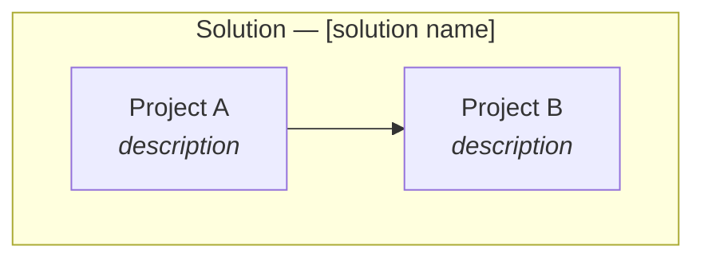
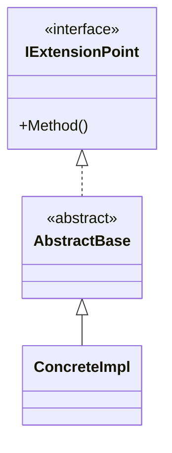
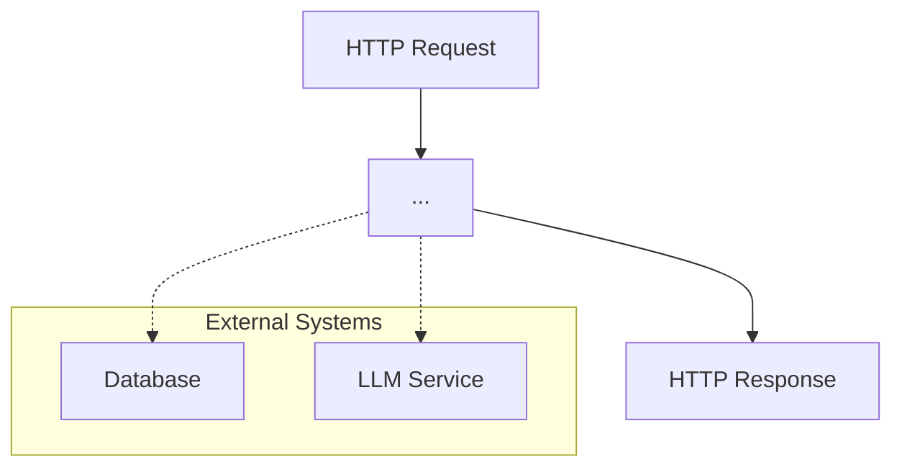
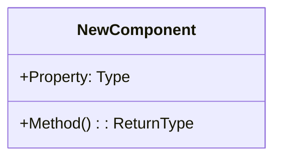
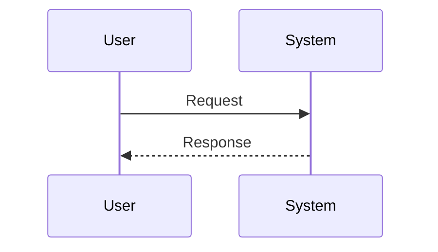

# [System Name] — Architecture Reference

**Date:** [Date]
**Repo:** `[repo-name]` ([host])
**Runtime:** [Runtime/framework description]
**Purpose:** Document the current [system] architecture and define the target architecture for [feature name].

---

## Changelog

| Version | Date | Author | Summary |
|---------|------|--------|---------|
| **v1** | **[Date]** | **[Author]** | **Initial draft — [brief description of approach]** |

---

## Table of Contents

1. [Current Architecture](#1-current-architecture)
   - [Solution Structure](#11-solution-structure)
   - [Pipeline Overview](#12-pipeline-overview)
   - [Pipeline Steps — Detail](#13-pipeline-steps--detail)
   - [Extension Architecture](#14-extension-architecture)
   - [Routing / Query Planning](#15-routing--query-planning)
   - [Data Flow](#18-data-flow)
2. [Target Architecture — [Feature Name]](#2-target-architecture--feature-name)
   - [Design Principles](#21-design-principles)
   - [New Components](#22-new-components)
   - [Modified Components](#23-modified-components)
   - [Data Population](#231-data-population-required)
   - [Pipeline Flow — [Feature] Path](#24-pipeline-flow--feature-path)
   - [Internal Flow](#25-feature-internal-flow)
   - [Class Diagram](#26-class-diagram)
   - [Sequence Diagram — Happy Path](#27-sequence-diagram--happy-path)
   - [Error / Clarification Flow](#28-error--clarification-flow)
   - [Configuration & Registration](#29-configuration--registration)
   - [Phase Boundaries](#210-phase-boundaries)
3. [Appendices](#appendix-a--data-schema)
   - [Appendix A — Data Schema](#appendix-a--data-schema)
   - [Appendix B — Open Questions & Decisions](#appendix-b--open-questions--decisions)
   - [Appendix C — Key File Locations](#appendix-c--key-file-locations)
   - [Appendix D — Query / Code Templates](#appendix-d--query--code-templates)

---

## 1. Current Architecture

### 1.1 Solution Structure

[Mermaid graph TB diagram showing project dependencies]



### 1.2 Pipeline Overview

[Mermaid flowchart of the main processing pipeline]


[Brief description of what each step does and how they communicate (shared state, payload, events, etc.)]

### 1.3 Pipeline Steps — Detail

| # | Step | Class | Purpose |
|---|------|-------|---------|
| 1 | **Step Name** | `ClassName` | [What it does] |
| 2 | **Step Name** | `ClassName` | [What it does] |

### 1.4 Extension Architecture

[Mermaid classDiagram showing the interface → abstract → concrete hierarchy]



[Table of current implementations with their types and data sources]

### 1.5 Routing / Query Planning

[Mermaid sequence diagram showing how requests are routed to the right handler]

[Key concepts: how matching works, what data structures are involved]

### 1.6 Data Flow

[End-to-end Mermaid flowchart from request to response]



---

## 2. Target Architecture — [Feature Name]

### 2.1 Design Principles

1. **[Principle]** — [explanation tracing to a requirement]
2. **[Principle]** — [explanation]

### 2.2 New Components

[Mermaid graph showing new components and their relationships to existing ones]

| Component | Project | Purpose |
|-----------|---------|---------|
| `NewComponent` | `Project.Name` | [What it does] |

**Design evolution:** [If the architecture went through iterations, document them here]

### 2.3 Modified Components

| Component | Change |
|-----------|--------|
| `ExistingComponent` | [Description of the change and why it's needed] |

### 2.3.1 Data Population (Required)

[Describe any data that must be created before the feature can function — DB records, graph nodes, config entries, embeddings, etc.]

### 2.4 Pipeline Flow — [Feature] Path

[Updated pipeline flowchart showing existing steps (✅) and new ones (🆕)]

### 2.5 [Feature] Internal Flow

[Detailed flowchart of the new feature's internal logic]

### 2.6 Class Diagram



### 2.7 Sequence Diagram — Happy Path



### 2.8 Error / Clarification Flow

[Sequence diagram for edge cases]

### 2.9 Configuration & Registration

```yaml
# Configuration example
NewComponentConfiguration:
  setting: value
```

```csharp
// DI registration pattern (adjust for your framework)
[ModuleDependency(...)]
public class NewComponent : BaseClass { }
```

### 2.10 Phase Boundaries

| Capability | Phase | Architectural Impact |
|------------|-------|---------------------|
| [MVP capability] | Phase 1 | [Impact] |
| [Future capability] | Phase 2 | [Impact] |

**MVP boundary:**

- ✅ [In scope]
- ❌ [Out of scope]

---

## Appendix A — Data Schema

[Actual schema: tables, nodes, relationships, properties]

## Appendix B — Open Questions & Decisions

### Resolved

| # | Question | Resolution |
|---|----------|------------|
| 1 | [Question from requirements] | [How it was resolved] |

### Open

| # | Question | Impact | Notes |
|---|----------|--------|-------|
| 2 | [Unresolved question] | [What it blocks] | [Who to ask, proposed approach, etc.] |

## Appendix C — Key File Locations

| Component | Path |
|-----------|------|
| `ComponentName` | `path/to/file.ext` |

## Appendix D — Query / Code Templates

```sql
-- [Description of what this query does]
SELECT ... FROM ...
```

---

*Created: [Date] — See [Changelog](#changelog) for version history.*
*Based on: [List of input sources]*
*Companion documents: [Requirements](./link) | [Product Vision Canvas](./link)*
