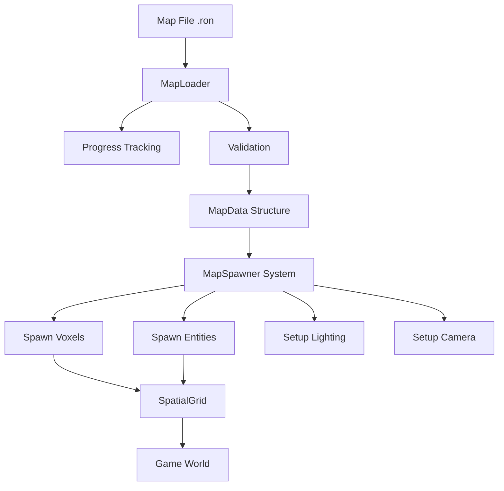

# Map Loader System Architecture

## Overview

This document outlines the design for a comprehensive map loading system for the Adrakestory game. The system supports loading maps from RON files with progress tracking, full metadata support, and extensibility for future features.

## File Format: RON (Rusty Object Notation)

### Why RON?
- **Rust-native**: Excellent integration with Rust's type system
- **Human-readable**: Easy to edit manually and debug
- **Serde support**: Seamless serialization/deserialization
- **Extensible**: Easy to add new fields without breaking existing maps

### Map File Structure

```ron
// Example: assets/maps/example_map.ron
(
    metadata: (
        name: "Example Map",
        author: "Developer",
        description: "A test map with various features",
        version: "1.0.0",
        created: "2025-01-10",
    ),
    world: (
        width: 4,
        height: 3,
        depth: 4,
        voxels: [
            // Voxel data with type and optional sub-voxel pattern
            (pos: (0, 0, 0), voxel_type: Grass, pattern: None),
            (pos: (1, 1, 1), voxel_type: Dirt, pattern: Platform),
            (pos: (2, 1, 1), voxel_type: Stone, pattern: Staircase),
            (pos: (0, 1, 0), voxel_type: Stone, pattern: Pillar),
        ],
    ),
    entities: [
        (
            entity_type: PlayerSpawn,
            position: (1.5, 0.5, 1.5),
            properties: {},
        ),
        // Future: enemies, items, triggers, etc.
    ],
    lighting: (
        ambient_intensity: 0.3,
        directional_light: Some((
            direction: (-0.5, -1.0, -0.5),
            illuminance: 10000.0,
            color: (1.0, 1.0, 1.0),
        )),
    ),
    camera: (
        position: (1.5, 8.0, 5.5),
        look_at: (1.5, 0.0, 1.5),
        rotation_offset: -1.5707963, // -PI/2
    ),
    custom_properties: {
        "background_music": "theme_1.ogg",
        "gravity": "-9.81",
        "time_limit": "300",
    },
)
```

## System Architecture



## Module Structure

```
src/systems/game/
├── map/
│   ├── mod.rs              # Public API and re-exports
│   ├── format.rs           # Map data structures (MapData, MapMetadata, etc.)
│   ├── loader.rs           # Async loading with progress tracking
│   ├── spawner.rs          # World instantiation from MapData
│   ├── validation.rs       # Map validation and error checking
│   └── error.rs            # Error types and handling
├── world_generation.rs     # Refactored to use map loader
└── ...
```

## Core Data Structures

### MapData
```rust
#[derive(Serialize, Deserialize, Clone, Debug)]
pub struct MapData {
    pub metadata: MapMetadata,
    pub world: WorldData,
    pub entities: Vec<EntityData>,
    pub lighting: LightingData,
    pub camera: CameraData,
    pub custom_properties: HashMap<String, String>,
}
```

### MapMetadata
```rust
#[derive(Serialize, Deserialize, Clone, Debug)]
pub struct MapMetadata {
    pub name: String,
    pub author: String,
    pub description: String,
    pub version: String,
    pub created: String,
}
```

### WorldData
```rust
#[derive(Serialize, Deserialize, Clone, Debug)]
pub struct WorldData {
    pub width: i32,
    pub height: i32,
    pub depth: i32,
    pub voxels: Vec<VoxelData>,
}

#[derive(Serialize, Deserialize, Clone, Debug)]
pub struct VoxelData {
    pub pos: (i32, i32, i32),
    pub voxel_type: VoxelType,
    pub pattern: Option<SubVoxelPattern>,
}

#[derive(Serialize, Deserialize, Clone, Copy, Debug, PartialEq)]
pub enum SubVoxelPattern {
    Full,        // 8x8x8 cube
    Platform,    // 8x1x8 thin platform
    Staircase,   // Progressive height increase
    Pillar,      // 2x2x2 centered column
}
```

### EntityData
```rust
#[derive(Serialize, Deserialize, Clone, Debug)]
pub struct EntityData {
    pub entity_type: EntityType,
    pub position: (f32, f32, f32),
    pub properties: HashMap<String, String>,
}

#[derive(Serialize, Deserialize, Clone, Copy, Debug, PartialEq)]
pub enum EntityType {
    PlayerSpawn,
    Enemy,
    Item,
    Trigger,
    // Extensible for future entity types
}
```

### LightingData
```rust
#[derive(Serialize, Deserialize, Clone, Debug)]
pub struct LightingData {
    pub ambient_intensity: f32,
    pub directional_light: Option<DirectionalLightData>,
}

#[derive(Serialize, Deserialize, Clone, Debug)]
pub struct DirectionalLightData {
    pub direction: (f32, f32, f32),
    pub illuminance: f32,
    pub color: (f32, f32, f32),
}
```

### CameraData
```rust
#[derive(Serialize, Deserialize, Clone, Debug)]
pub struct CameraData {
    pub position: (f32, f32, f32),
    pub look_at: (f32, f32, f32),
    pub rotation_offset: f32,
}
```

## Progress Tracking

### LoadProgress Enum
```rust
#[derive(Clone, Debug)]
pub enum LoadProgress {
    Started,
    LoadingFile(f32),      // 0-20%
    ParsingData(f32),      // 20-40%
    ValidatingMap(f32),    // 40-60%
    SpawningVoxels(f32),   // 60-90%
    SpawningEntities(f32), // 90-95%
    Finalizing(f32),       // 95-100%
    Complete,
    Error(String),
}

impl LoadProgress {
    pub fn percentage(&self) -> f32 {
        match self {
            Self::Started => 0.0,
            Self::LoadingFile(p) => p * 0.2,
            Self::ParsingData(p) => 0.2 + (p * 0.2),
            Self::ValidatingMap(p) => 0.4 + (p * 0.2),
            Self::SpawningVoxels(p) => 0.6 + (p * 0.3),
            Self::SpawningEntities(p) => 0.9 + (p * 0.05),
            Self::Finalizing(p) => 0.95 + (p * 0.05),
            Self::Complete => 1.0,
            Self::Error(_) => 0.0,
        }
    }
}
```

### MapLoadProgress Resource
```rust
#[derive(Resource, Default)]
pub struct MapLoadProgress {
    pub current: LoadProgress,
    pub events: Vec<LoadProgress>,
}
```

## MapLoader Implementation

### Core Loader
```rust
pub struct MapLoader;

impl MapLoader {
    /// Load a map from a file path
    pub fn load_from_file(path: &str) -> Result<MapData, MapLoadError> {
        // 1. Read file (emit LoadingFile progress)
        // 2. Parse RON (emit ParsingData progress)
        // 3. Validate (emit ValidatingMap progress)
        // 4. Return MapData
    }
    
    /// Load a map asynchronously with progress updates
    pub async fn load_async(
        path: &str,
        progress: &mut MapLoadProgress,
    ) -> Result<MapData, MapLoadError> {
        // Async version with progress events
    }
}
```

## MapSpawner System

### Spawning Strategy
```rust
pub fn spawn_map_system(
    mut commands: Commands,
    map_data: Res<LoadedMapData>,
    mut progress: ResMut<MapLoadProgress>,
    mut meshes: ResMut<Assets<Mesh>>,
    mut materials: ResMut<Assets<StandardMaterial>>,
    mut spatial_grid: ResMut<SpatialGrid>,
) {
    // 1. Spawn voxels with sub-voxel patterns (emit SpawningVoxels progress)
    // 2. Spawn entities (emit SpawningEntities progress)
    // 3. Setup lighting
    // 4. Setup camera
    // 5. Finalize (emit Finalizing progress)
    // 6. Mark complete (emit Complete)
}
```

### Incremental Spawning
For large maps, spawn entities over multiple frames:
```rust
#[derive(Resource)]
pub struct MapSpawnState {
    pub voxels_spawned: usize,
    pub entities_spawned: usize,
    pub total_voxels: usize,
    pub total_entities: usize,
}
```

## Error Handling

### MapLoadError
```rust
#[derive(Debug, thiserror::Error)]
pub enum MapLoadError {
    #[error("Failed to read map file: {0}")]
    FileReadError(#[from] std::io::Error),
    
    #[error("Failed to parse map data: {0}")]
    ParseError(#[from] ron::error::SpannedError),
    
    #[error("Map validation failed: {0}")]
    ValidationError(String),
    
    #[error("Invalid voxel position: ({0}, {1}, {2})")]
    InvalidVoxelPosition(i32, i32, i32),
    
    #[error("Invalid entity type: {0}")]
    InvalidEntityType(String),
}
```

## Validation Rules

1. **World Dimensions**: Must be positive integers
2. **Voxel Positions**: Must be within world bounds
3. **Entity Positions**: Should be within reasonable bounds
4. **Required Fields**: Metadata, world data must be present
5. **Version Compatibility**: Check map format version

## Integration with Existing Code

### New GameState
```rust
#[derive(States, Default, Debug, Clone, PartialEq, Eq, Hash)]
pub enum GameState {
    #[default]
    IntroAnimation,
    TitleScreen,
    LoadingMap,  // NEW
    InGame,
    Paused,
}
```

### Refactored setup_game
```rust
pub fn setup_game(
    mut commands: Commands,
    map_data: Option<Res<LoadedMapData>>,
    // ... other resources
) {
    if let Some(map) = map_data {
        // Use loaded map
        spawn_from_map_data(&mut commands, &map, ...);
    } else {
        // Fallback to default/procedural generation
        spawn_default_world(&mut commands, ...);
    }
}
```

## Dependencies

Add to `Cargo.toml`:
```toml
[dependencies]
bevy = "0.15"
serde = { version = "1.0", features = ["derive"] }
ron = "0.8"
thiserror = "1.0"
```

## Future Extensibility

### Additional File Formats
```rust
pub trait MapFormat {
    fn load(&self, path: &str) -> Result<MapData, MapLoadError>;
    fn save(&self, map: &MapData, path: &str) -> Result<(), MapLoadError>;
}

pub struct RonFormat;
pub struct JsonFormat;
pub struct BinaryFormat;
```

### Streaming/Chunked Loading
For very large maps:
```rust
pub struct ChunkedMapLoader {
    pub chunk_size: usize,
    pub loaded_chunks: HashSet<IVec3>,
}
```

### Network Loading
```rust
pub async fn load_from_url(url: &str) -> Result<MapData, MapLoadError> {
    // HTTP/HTTPS map loading
}
```

### Map Editor Integration
- Save current world state to RON file
- Live reload during development
- Validation tools
- Map conversion utilities

## Testing Strategy

1. **Unit Tests**: Test each component in isolation
2. **Integration Tests**: Test full load → spawn pipeline
3. **Example Maps**: Create diverse test cases
4. **Performance Tests**: Benchmark loading times
5. **Error Cases**: Test corrupt files, invalid data
6. **Round-trip Tests**: Save → Load → Save consistency

## Example Maps

### Minimal Map
```ron
(
    metadata: (
        name: "Minimal Test",
        author: "System",
        description: "Minimal valid map",
        version: "1.0.0",
        created: "2025-01-10",
    ),
    world: (
        width: 2,
        height: 2,
        depth: 2,
        voxels: [
            (pos: (0, 0, 0), voxel_type: Grass, pattern: None),
        ],
    ),
    entities: [
        (entity_type: PlayerSpawn, position: (0.5, 0.5, 0.5), properties: {}),
    ],
    lighting: (
        ambient_intensity: 0.3,
        directional_light: None,
    ),
    camera: (
        position: (2.0, 2.0, 2.0),
        look_at: (0.0, 0.0, 0.0),
        rotation_offset: 0.0,
    ),
    custom_properties: {},
)
```

### Complex Map
See full example in `assets/maps/example_map.ron`

## Implementation Phases

### Phase 1: Core Infrastructure
- [ ] Data structures with serde support
- [ ] Basic RON loading
- [ ] Simple validation

### Phase 2: Progress Tracking
- [ ] LoadProgress enum and events
- [ ] MapLoadProgress resource
- [ ] Progress UI integration

### Phase 3: Map Spawning
- [ ] MapSpawner system
- [ ] Voxel spawning with patterns
- [ ] Entity spawning
- [ ] Lighting and camera setup

### Phase 4: Integration
- [ ] LoadingMap game state
- [ ] Refactor world_generation.rs
- [ ] Example maps
- [ ] Documentation

### Phase 5: Polish
- [ ] Error handling and recovery
- [ ] Performance optimization
- [ ] Editor support preparation
- [ ] Additional file formats (optional)

## Conclusion

This design provides a robust, extensible map loading system that:
- Supports rich map data with metadata and custom properties
- Provides real-time progress tracking for user feedback
- Maintains backward compatibility with existing code
- Enables future map editor development
- Follows Rust and Bevy best practices