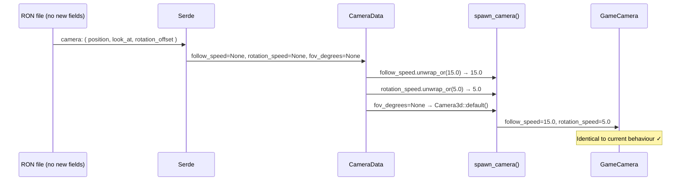
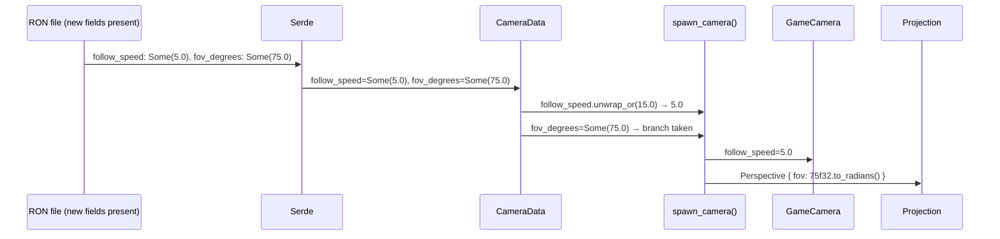

# Camera Behaviour Parameters Not Configurable — Architecture Reference

**Date:** 2026-03-31
**Repo:** `adrakestory`
**Runtime:** Rust / Bevy ECS
**Purpose:** Document the current `CameraData` → `GameCamera` pipeline that
hardcodes `follow_speed` and `rotation_speed` and exposes no FOV control, and
define the target architecture that adds three optional fields to `CameraData`
with backward-compatible `#[serde(default)]` handling.

---

## Changelog

| Version | Date | Author | Summary |
|---------|------|--------|---------|
| **v1** | **2026-03-31** | **Investigation** | **Initial draft — current camera pipeline, hardcoded values, target design, code templates** |

---

## Table of Contents

1. [Current Architecture](#1-current-architecture)
   - [CameraData Struct](#11-cameradata-struct)
   - [spawn_camera() — Hardcoded Values](#12-spawn_camera--hardcoded-values)
   - [GameCamera Component](#13-gamecamera-component)
   - [Runtime Camera Systems](#14-runtime-camera-systems)
   - [The Two Bugs](#15-the-two-bugs)
2. [Target Architecture](#2-target-architecture)
   - [Design Principles](#21-design-principles)
   - [Modified CameraData Struct](#22-modified-cameradata-struct)
   - [Modified spawn_camera()](#23-modified-spawn_camera)
   - [GameCamera Component — Unchanged](#24-gamecamera-component--unchanged)
   - [New and Modified Components](#25-new-and-modified-components)
   - [Sequence Diagram — Old Map Loading](#26-sequence-diagram--old-map-loading)
   - [Sequence Diagram — Map with Custom Camera Feel](#27-sequence-diagram--map-with-custom-camera-feel)
   - [Backward Compatibility](#28-backward-compatibility)
   - [Phase Boundaries](#29-phase-boundaries)
3. [Appendices](#appendix-a--key-file-locations)
   - [Appendix A — Key File Locations](#appendix-a--key-file-locations)
   - [Appendix B — Code Templates](#appendix-b--code-templates)
   - [Appendix C — Open Questions & Decisions](#appendix-c--open-questions--decisions)

---

## 1. Current Architecture

### 1.1 CameraData Struct

**File:** `src/systems/game/map/format/camera.rs:7–23`

```rust
#[derive(Serialize, Deserialize, Clone, Debug)]
pub struct CameraData {
    /// Camera position (x, y, z)
    pub position: (f32, f32, f32),
    /// Point the camera looks at (x, y, z)
    pub look_at: (f32, f32, f32),
    /// Additional rotation offset in radians
    pub rotation_offset: f32,
}

impl Default for CameraData {
    fn default() -> Self {
        Self {
            position: (1.5, 8.0, 5.5),
            look_at: (1.5, 0.0, 1.5),
            rotation_offset: -std::f32::consts::FRAC_PI_2,
        }
    }
}
```

The struct contains no behavioural parameters. `rotation_offset` is the only
"feel" parameter, and it affects initial orientation (a structural property),
not runtime behaviour.

### 1.2 spawn_camera() — Hardcoded Values

**File:** `src/systems/game/map/spawner/mod.rs:575–614`

```rust
fn spawn_camera(commands: &mut Commands, map: &MapData) {
    // ... transform setup from position/look_at/rotation_offset ...

    commands.spawn((
        Camera3d::default(),     // ← FOV is hardcoded here via Camera3d default
        camera_transform,
        GameCamera {
            original_rotation,
            target_rotation: original_rotation,
            rotation_speed: 5.0,    // ← hardcoded, not from map
            follow_offset,
            follow_speed: 15.0,     // ← hardcoded, not from map
            target_position: look_at_point,
        },
        DepthPrepass,
    ));
}
```

The two constants `5.0` and `15.0` are the only place in the codebase where
camera feel is configured. A designer wishing to change them must edit engine
source.

### 1.3 GameCamera Component

**File:** `src/systems/game/components.rs:45–56`

```rust
#[derive(Component)]
pub struct GameCamera {
    pub original_rotation: Quat,
    pub target_rotation: Quat,
    pub rotation_speed: f32,
    pub follow_offset: Vec3,
    pub follow_speed: f32,
    pub target_position: Vec3,
}
```

Both `rotation_speed` and `follow_speed` are `f32` fields. They are set once
at spawn and read every frame by the camera systems.

### 1.4 Runtime Camera Systems

**File:** `src/systems/game/camera.rs`

| System | Lines | Uses |
|--------|-------|------|
| `follow_player_camera` | 26–50 | `GameCamera.follow_speed` — exponential decay alpha: `1 - exp(-follow_speed * delta)` |
| `rotate_camera` | 62–97 | `GameCamera.rotation_speed` — exponential slerp alpha: `1 - exp(-rotation_speed * delta)` |

Neither system depends on `CameraData` directly. They consume the resolved `f32`
values from `GameCamera`. Changing the format layer does not affect these systems.

### 1.5 The Two Bugs

**Bug A — Hardcoded feel parameters**
(`src/systems/game/map/spawner/mod.rs:607–609`)

`rotation_speed: 5.0` and `follow_speed: 15.0` are literal constants. Level
designers have no way to express a different value in the map file. The constants
appear in a single call site, making them easy to change globally, but there is
no per-map override path.

**Bug B — No FOV control**
(`src/systems/game/map/spawner/mod.rs:602`)

`Camera3d::default()` is spawned unconditionally. `Camera3d::default()` produces
a `PerspectiveProjection` with Bevy's default vertical FOV (approximately 60°,
defined in `bevy_render`). There is no code path that reads an FOV from
`CameraData` or `MapData`. A map author who needs a different FOV must either
modify engine source or accept 60°.

**Secondary issue — rotation_offset documentation**
(`src/systems/game/map/format/camera.rs:12`, `assets/maps/default.ron:3814`)

The field comment says "Additional rotation offset in radians" with no further
guidance. In `default.ron` the value is `-1.5707964` (i.e. `-π/2`). A map author
encountering this value for the first time has no way to know that it means "90°
to the left" without reading the spawner code.

---

## 2. Target Architecture

### 2.1 Design Principles

1. **Additive only** — three optional fields are added to `CameraData`. No
   existing field is removed, renamed, or retyped. Existing map files are
   unaffected.
2. **`#[serde(default)]` for absence** — `Option<f32>` fields default to `None`
   via the standard `Option::default()` impl. No helper function is required.
3. **Resolve at spawn, not at runtime** — the `Option` is unwrapped once in
   `spawn_camera()`. `GameCamera` stores plain `f32` fields as before. Every
   camera system remains unchanged.
4. **Degrees in format, radians in code** — `fov_degrees` is human-readable
   degrees in the map file; `spawn_camera()` converts to radians via
   `.to_radians()` before passing to `PerspectiveProjection`.

### 2.2 Modified CameraData Struct

**File:** `src/systems/game/map/format/camera.rs`

```rust
#[derive(Serialize, Deserialize, Clone, Debug)]
pub struct CameraData {
    /// Camera position in world space (x, y, z).
    pub position: (f32, f32, f32),
    /// World-space point the camera initially looks at (x, y, z).
    pub look_at: (f32, f32, f32),
    /// Additional Y-axis rotation applied around `look_at` after the initial
    /// `looking_at` transform is established. Value is in radians.
    /// `-π/2` (≈ `-1.5707964`) rotates 90° left; `π/2` rotates 90° right.
    pub rotation_offset: f32,
    /// Speed at which the camera follows the player (exponential decay rate).
    /// Higher values are more responsive. Default: `15.0`.
    /// When absent from the map file, the engine default is used.
    #[serde(default)]
    pub follow_speed: Option<f32>,
    /// Speed at which the camera interpolates toward its target rotation
    /// (exponential decay rate). Default: `5.0`.
    /// When absent from the map file, the engine default is used.
    #[serde(default)]
    pub rotation_speed: Option<f32>,
    /// Vertical field of view in degrees. When absent, the engine default
    /// (~60°) is used. Recommended range: 5–150.
    #[serde(default)]
    pub fov_degrees: Option<f32>,
}
```

`Default` impl is unchanged (the new fields are `Option`, so `None` is their
natural default and requires no code change to the existing `impl Default`).

### 2.3 Modified spawn_camera()

**File:** `src/systems/game/map/spawner/mod.rs`

```rust
fn spawn_camera(commands: &mut Commands, map: &MapData) {
    let camera = &map.camera;
    let (px, py, pz) = camera.position;
    let (lx, ly, lz) = camera.look_at;

    let mut camera_transform =
        Transform::from_xyz(px, py, pz).looking_at(Vec3::new(lx, ly, lz), Vec3::Y);

    if camera.rotation_offset != 0.0 {
        camera_transform.rotate_around(
            Vec3::new(lx, ly, lz),
            Quat::from_rotation_y(camera.rotation_offset),
        );
    }

    let original_rotation = camera_transform.rotation;
    let look_at_point = Vec3::new(lx, ly, lz);
    let initial_offset = camera_transform.translation - look_at_point;
    let follow_offset = camera_transform.rotation.inverse() * initial_offset;

    // Resolve optional camera feel parameters from the map (FR-2.2.1, FR-2.2.2)
    let follow_speed = camera.follow_speed.unwrap_or(15.0);
    let rotation_speed = camera.rotation_speed.unwrap_or(5.0);

    let game_camera = GameCamera {
        original_rotation,
        target_rotation: original_rotation,
        rotation_speed,
        follow_offset,
        follow_speed,
        target_position: look_at_point,
    };

    // Conditionally set projection when FOV is specified (FR-2.2.2)
    if let Some(fov_deg) = camera.fov_degrees {
        commands.spawn((
            Camera3d::default(),
            Projection::Perspective(PerspectiveProjection {
                fov: fov_deg.to_radians(),
                ..default()
            }),
            camera_transform,
            game_camera,
            DepthPrepass,
        ));
    } else {
        commands.spawn((
            Camera3d::default(),
            camera_transform,
            game_camera,
            DepthPrepass,
        ));
    }
}
```

No other system touches these constants.

### 2.4 GameCamera Component — Unchanged

`GameCamera` in `src/systems/game/components.rs` is not modified. Fields remain
`f32`. The `follow_player_camera` and `rotate_camera` systems are not modified.

### 2.5 New and Modified Components

**New:**

None. No new types are introduced.

**Modified:**

| Component | File | Change |
|-----------|------|--------|
| `CameraData` | `src/systems/game/map/format/camera.rs` | Add three optional fields; improve `rotation_offset` doc comment |
| `spawn_camera()` | `src/systems/game/map/spawner/mod.rs` | Read new fields; conditional `Projection` spawn |
| `docs/api/map-format-spec.md` | spec | Document all five `CameraData` fields |

**Not changed:**

- `src/systems/game/components.rs` — `GameCamera` field types unchanged.
- `src/systems/game/camera.rs` — `follow_player_camera`, `rotate_camera` unchanged.
- `src/systems/game/hot_reload/reload_handler.rs` — saves/restores live
  `Transform` + `target_position`; unaffected by format change.
- All other game systems, the editor, and map validation.

### 2.6 Sequence Diagram — Old Map Loading



### 2.7 Sequence Diagram — Map with Custom Camera Feel



### 2.8 Backward Compatibility

| Scenario | Before fix | After fix | Result |
|----------|-----------|-----------|--------|
| Existing map without new fields | Hardcoded 15.0 / 5.0 / 60° | `unwrap_or` → 15.0 / 5.0; `Camera3d::default()` branch | Identical ✓ |
| Map with `follow_speed: Some(8.0)` | Parse error (unknown field) | `follow_speed = 8.0` | New capability ✓ |
| Map with `fov_degrees: Some(90.0)` | Parse error (unknown field) | 90° FOV spawned | New capability ✓ |
| Resaved existing map | No new fields written | No new fields written (all are `None`) | File unchanged ✓ |

> **Note:** Serde's default behaviour for `#[serde(default)]` fields on
> serialisation is to *always write* the field, including `None` as `None`. If
> this produces unwanted noise in resaved map files, a
> `#[serde(default, skip_serializing_if = "Option::is_none")]` attribute can be
> added. This is a cosmetic concern and can be applied in Phase 1 or deferred.

### 2.9 Phase Boundaries

| Capability | Phase | Notes |
|------------|-------|-------|
| `follow_speed` optional field | Phase 1 | Core fix |
| `rotation_speed` optional field | Phase 1 | Core fix |
| `fov_degrees` optional field | Phase 1 | Core fix |
| `spawn_camera()` reads all three | Phase 1 | Required |
| `rotation_offset` doc comment update | Phase 1 | Required |
| Spec doc update | Phase 1 | Required |
| Unit tests | Phase 1 | Required |
| Both binaries compile cleanly | Phase 1 | Required |
| Smooth intro animation on load | Phase 2 | Runtime system concern, out of scope |
| Camera mode enum (orbit / follow / rail) | Phase 2 | Future expansion |

---

## Appendix A — Key File Locations

| Component | Path | Lines |
|-----------|------|-------|
| `CameraData` struct | `src/systems/game/map/format/camera.rs` | 7–23 |
| `spawn_camera()` — full function | `src/systems/game/map/spawner/mod.rs` | 575–614 |
| `spawn_camera()` — hardcoded constants | `src/systems/game/map/spawner/mod.rs` | 607–609 |
| `GameCamera` component | `src/systems/game/components.rs` | 45–56 |
| `follow_player_camera` — uses `follow_speed` | `src/systems/game/camera.rs` | 26–50 |
| `rotate_camera` — uses `rotation_speed` | `src/systems/game/camera.rs` | 62–97 |
| Hot-reload camera restore | `src/systems/game/hot_reload/reload_handler.rs` | — |
| `default.ron` camera block | `assets/maps/default.ron` | 3810–3814 |
| Format spec — camera section | `docs/api/map-format-spec.md` | camera section |

---

## Appendix B — Code Templates

### camera.rs — modified CameraData

```rust
/// Camera configuration for the map.
#[derive(Serialize, Deserialize, Clone, Debug)]
pub struct CameraData {
    /// Camera position in world space (x, y, z).
    pub position: (f32, f32, f32),
    /// World-space point the camera initially looks at (x, y, z).
    pub look_at: (f32, f32, f32),
    /// Additional Y-axis rotation applied around `look_at` after the initial
    /// `looking_at` transform is established. Value is in radians.
    /// `-π/2` (≈ `-1.5707964`) rotates 90° to the left; `π/2` rotates 90° right.
    pub rotation_offset: f32,
    /// Speed at which the camera follows the player (exponential decay rate).
    /// Higher values produce a more responsive follow. Default: `15.0`.
    /// Omit from the map file to use the engine default.
    #[serde(default)]
    pub follow_speed: Option<f32>,
    /// Speed at which the camera interpolates toward its target rotation
    /// (exponential decay rate). Default: `5.0`.
    /// Omit from the map file to use the engine default.
    #[serde(default)]
    pub rotation_speed: Option<f32>,
    /// Vertical field of view in degrees. Default: engine default (~60°).
    /// Recommended range: 5–150. Omit to use the engine default.
    #[serde(default)]
    pub fov_degrees: Option<f32>,
}
```

### spawner/mod.rs — modified spawn_camera() body (replace inner section)

```rust
// Resolve optional camera feel parameters (FR-2.2.1, FR-2.2.2)
let follow_speed = camera.follow_speed.unwrap_or(15.0);
let rotation_speed = camera.rotation_speed.unwrap_or(5.0);

let game_camera = GameCamera {
    original_rotation,
    target_rotation: original_rotation,
    rotation_speed,
    follow_offset,
    follow_speed,
    target_position: look_at_point,
};

if let Some(fov_deg) = camera.fov_degrees {
    commands.spawn((
        Camera3d::default(),
        Projection::Perspective(PerspectiveProjection {
            fov: fov_deg.to_radians(),
            ..default()
        }),
        camera_transform,
        game_camera,
        DepthPrepass,
    ));
} else {
    commands.spawn((
        Camera3d::default(),
        camera_transform,
        game_camera,
        DepthPrepass,
    ));
}
```

### Unit tests to add (inline in camera.rs)

```rust
#[cfg(test)]
mod tests {
    use super::*;

    #[test]
    fn camera_data_defaults_produce_none_optionals() {
        let ron = r#"(
            position: (1.0, 2.0, 3.0),
            look_at: (0.0, 0.0, 0.0),
            rotation_offset: 0.0,
        )"#;
        let cd: CameraData = ron::from_str(ron).expect("parse failed");
        assert!(cd.follow_speed.is_none());
        assert!(cd.rotation_speed.is_none());
        assert!(cd.fov_degrees.is_none());
    }

    #[test]
    fn camera_data_follow_speed_round_trips() {
        let ron = r#"(
            position: (1.0, 2.0, 3.0),
            look_at: (0.0, 0.0, 0.0),
            rotation_offset: 0.0,
            follow_speed: Some(8.0),
        )"#;
        let cd: CameraData = ron::from_str(ron).expect("parse failed");
        assert_eq!(cd.follow_speed, Some(8.0));
    }

    #[test]
    fn camera_data_fov_degrees_round_trips() {
        let ron = r#"(
            position: (1.0, 2.0, 3.0),
            look_at: (0.0, 0.0, 0.0),
            rotation_offset: 0.0,
            fov_degrees: Some(90.0),
        )"#;
        let cd: CameraData = ron::from_str(ron).expect("parse failed");
        assert_eq!(cd.fov_degrees, Some(90.0));
    }
}
```

---

## Appendix C — Open Questions & Decisions

### Resolved

| # | Question | Resolution |
|---|----------|------------|
| 1 | `Option<f32>` vs newtype with custom `Default`? | `Option<f32>` with `#[serde(default)]`. `Option`'s `Default` is `None`, so no helper function needed. This is the simplest correct approach. |
| 2 | Should `GameCamera` store `Option<f32>` or resolved `f32`? | Resolved `f32`. The `Option` is unwrapped once in `spawn_camera()`. Propagating `Option` into the component would require unwrapping in every camera system every frame — unnecessary overhead and noise. |
| 3 | Degrees or radians for FOV in the format? | Degrees. Human-readable, consistent with how map authors think about camera angles. Conversion to radians happens in `spawn_camera()`. `rotation_offset` remains in radians for backward compatibility, with an improved doc comment to compensate. |
| 4 | Should the spawner use an if/else branch or always set `Projection`? | If/else: use `Camera3d::default()` (no explicit `Projection`) when `fov_degrees` is `None`, and add `Projection::Perspective(...)` only when `Some`. This preserves the current default path exactly, with zero risk of changing Bevy's default projection behaviour. |
| 5 | Should `skip_serializing_if = "Option::is_none"` be added? | Deferred to Phase 1 implementation decision. Adding it avoids `None` noise in resaved map files. Not adding it is simpler. Either choice is correct; the implementer should decide during the code review. |

---

*Created: 2026-03-31 — See [Changelog](#changelog) for version history.*
*Companion documents: [Requirements](./requirements.md) | [Ticket](../ticket.md)*
*Source: `docs/investigations/2026-03-22-1427-map-format-analysis.md` — Finding 8*
