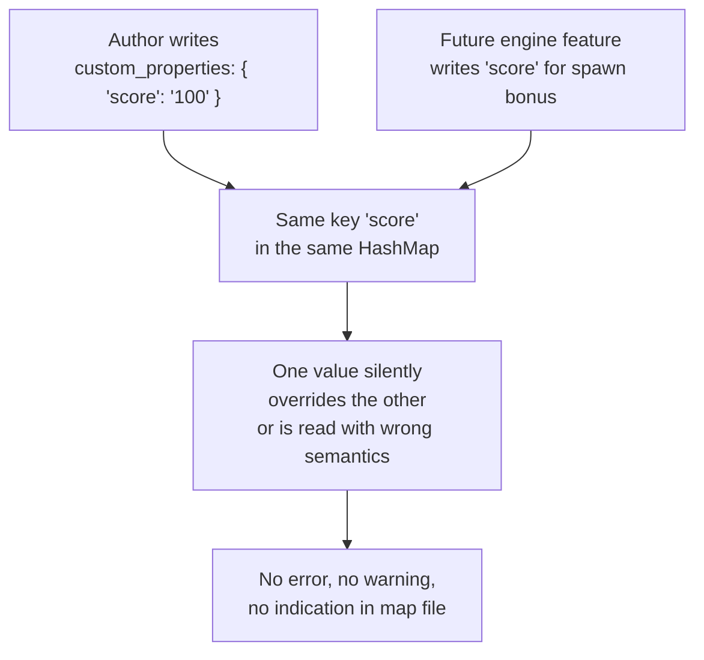
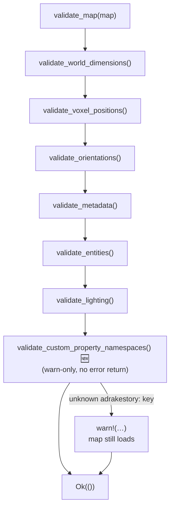
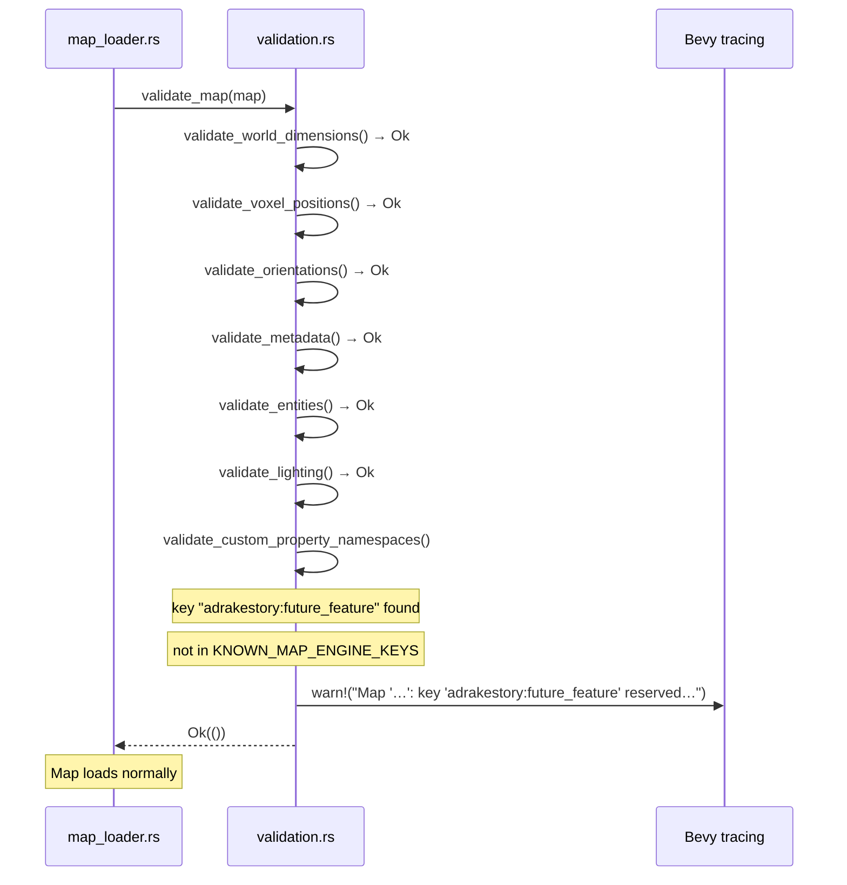
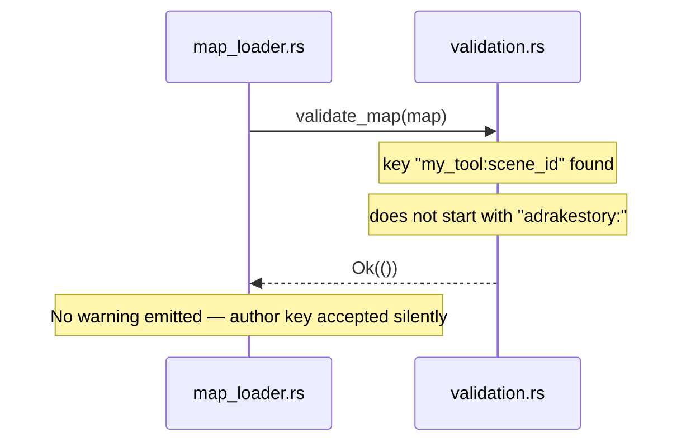

# custom_properties Namespace Convention — Architecture Reference

**Date:** 2026-03-31
**Repo:** `adrakestory`
**Runtime:** Rust / Bevy ECS
**Purpose:** Document the current unnamespaced `custom_properties` architecture
that permits silent key collisions, and define the target architecture that
establishes the `adrakestory:` prefix convention with soft validation.

---

## Changelog

| Version | Date | Author | Summary |
|---------|------|--------|---------|
| **v1** | **2026-03-31** | **Investigation** | **Initial draft — current state, collision scenario, target design, code templates** |

---

## Table of Contents

1. [Current Architecture](#1-current-architecture)
   - [The Two Property Maps](#11-the-two-property-maps)
   - [How Properties Are Used Today](#12-how-properties-are-used-today)
   - [The Collision Risk](#13-the-collision-risk)
2. [Target Architecture](#2-target-architecture)
   - [Design Principles](#21-design-principles)
   - [New Constants](#22-new-constants)
   - [New Function: validate_custom_property_namespaces()](#23-new-function-validate_custom_property_namespaces)
   - [Modified Components](#24-modified-components)
   - [Validation Flow](#25-validation-flow)
   - [Sequence Diagram — Unknown Engine Key](#26-sequence-diagram--unknown-engine-key)
   - [Sequence Diagram — Author Key](#27-sequence-diagram--author-key)
   - [Phase Boundaries](#28-phase-boundaries)
3. [Appendices](#appendix-a--key-file-locations)
   - [Appendix A — Key File Locations](#appendix-a--key-file-locations)
   - [Appendix B — Code Templates](#appendix-b--code-templates)
   - [Appendix C — Open Questions & Decisions](#appendix-c--open-questions--decisions)

---

## 1. Current Architecture

### 1.1 The Two Property Maps

Two structs in the format layer carry open-ended `HashMap<String, String>` fields:

**`MapData::custom_properties`** — `src/systems/game/map/format/mod.rs:51–52`

```rust
/// Custom properties for extensibility
#[serde(default)]
pub custom_properties: HashMap<String, String>,
```

**`EntityData::properties`** — `src/systems/game/map/format/entities.rs:14–15`

```rust
/// Custom properties for this entity
#[serde(default)]
pub properties: HashMap<String, String>,
```

Both fields use `#[serde(default)]` and deserialise from a RON map literal. Either
field can hold zero or more arbitrary string key-value pairs. Neither the type
system nor the doc-comments impose any naming convention on the keys.

### 1.2 How Properties Are Used Today

**`MapData::custom_properties`** is not read by any engine system at runtime. It
is a pure extensibility hook — present in the format for future use or for
tooling outside the engine itself.

**`EntityData::properties`** is read by the spawner at entity creation time:

- `src/systems/game/map/spawner/entities.rs` reads well-known keys
  (`"intensity"`, `"range"`, `"shadows"`, `"color"` for `LightSource`;
  `"radius"` for `Npc`) and parses them as typed values.
- `validate_entity_properties()` in `validation.rs:162–229` validates
  those same keys' string values before spawning begins.

There is no prefix convention for these spawner-read keys. They are plain
unqualified strings (`"intensity"`, not `"adrakestory:intensity"`).

### 1.3 The Collision Risk



The collision scenario has three concrete forms:

1. **Author vs. engine** — an author names a key the same as a future
   engine-defined key. The engine reads the author's value as if it were a
   config value, producing undefined runtime behaviour.
2. **Tool vs. tool** — two separate tools (e.g. a level-design tool and a
   cutscene tool) both write to `custom_properties` without coordination. They
   may inadvertently overwrite each other's keys.
3. **Cross-entity pollution** — `EntityData.properties` keys used by one entity
   type (`LightSource`) collide with keys an author adds to a different entity
   type (`Npc`) for an unrelated purpose, because both share the same flat
   `HashMap`.

All three scenarios produce no error, no warning, and no detectable signal at
map load time under the current architecture.

---

## 2. Target Architecture

### 2.1 Design Principles

1. **Convention over type enforcement** — the fix adds a string prefix convention
   rather than a type-level split. This requires no breaking change to the format
   or serde representation (FR-NFR-3.2).
2. **Warn, never reject** — an unknown `adrakestory:` key emits a `warn!()` but
   the map still loads, preserving forward-compatibility between engine versions
   (FR-2.2.1, NFR-3.1).
3. **Single source of truth for the prefix** — `ENGINE_KEY_PREFIX` is a named
   constant so a rename touches one line (FR-2.2.4).
4. **Self-contained validation** — the new function and constants live in
   `validation.rs` alongside the existing entity property checks (NFR-3.3).
5. **Cosmetic version bump** — `empty_map()` is updated to `"1.1.0"` to record
   the introduction of the convention; existing `"1.0.0"` files are unaffected
   (FR-2.4.1, FR-2.4.2).

### 2.2 New Constants

**File:** `src/systems/game/map/validation.rs` (add near the top, before
`validate_map()`)

```rust
/// Prefix reserved for engine-owned keys in `MapData::custom_properties`
/// and `EntityData::properties`.
///
/// Authors must not use this prefix. Engine subsystems that need to store
/// persistent data in either property map must add their key to
/// `KNOWN_MAP_ENGINE_KEYS` or `KNOWN_ENTITY_ENGINE_KEYS` below before
/// writing it to any map file.
const ENGINE_KEY_PREFIX: &str = "adrakestory:";

/// Engine-owned keys permitted in `MapData::custom_properties`.
///
/// Add entries here before introducing a new engine feature that writes
/// to this map. The validator will warn on unknown `adrakestory:` keys
/// to catch typos and forward-compat mismatches early.
const KNOWN_MAP_ENGINE_KEYS: &[&str] = &[
    // (none yet — convention established for future use)
];

/// Engine-owned keys permitted in `EntityData::properties`.
///
/// Same contract as `KNOWN_MAP_ENGINE_KEYS`.
const KNOWN_ENTITY_ENGINE_KEYS: &[&str] = &[
    // (none yet)
];
```

### 2.3 New Function: validate_custom_property_namespaces()

**File:** `src/systems/game/map/validation.rs`

```rust
/// Warns on `adrakestory:`-prefixed keys that are not in the known engine key
/// lists.
///
/// This is a soft check: the function logs a warning but never returns an
/// error, so maps with unrecognised engine keys still load. This preserves
/// forward-compatibility when an older engine reads a map written by a newer
/// engine that introduced new keys.
fn validate_custom_property_namespaces(map: &MapData) {
    let map_name = &map.metadata.name;

    // Check MapData::custom_properties
    for key in map.custom_properties.keys() {
        if key.starts_with(ENGINE_KEY_PREFIX)
            && !KNOWN_MAP_ENGINE_KEYS.contains(&key.as_str())
        {
            warn!(
                "Map '{}': custom_properties key '{}' uses the reserved \
                 'adrakestory:' prefix but is not a known engine key. \
                 This key will be ignored.",
                map_name, key
            );
        }
    }

    // Check EntityData::properties for each entity
    for entity in &map.entities {
        for key in entity.properties.keys() {
            if key.starts_with(ENGINE_KEY_PREFIX)
                && !KNOWN_ENTITY_ENGINE_KEYS.contains(&key.as_str())
            {
                warn!(
                    "Map '{}': entity {:?} has property key '{}' using the \
                     reserved 'adrakestory:' prefix but is not a known engine \
                     key. This key will be ignored.",
                    map_name, entity.entity_type, key
                );
            }
        }
    }
}
```

### 2.4 Modified Components

| Component | File | Change |
|-----------|------|--------|
| `validate_map()` | `src/systems/game/map/validation.rs` | Add `validate_custom_property_namespaces(map);` call after `validate_entities(map)?` |
| `MapData::custom_properties` doc-comment | `src/systems/game/map/format/mod.rs` | Document the `adrakestory:` reservation |
| `EntityData::properties` doc-comment | `src/systems/game/map/format/entities.rs` | Document the `adrakestory:` reservation |
| `MapData::empty_map()` version | `src/systems/game/map/format/mod.rs` | `"1.0.0"` → `"1.1.0"` |
| `docs/api/map-format-spec.md` | spec | Add namespace convention subsection |

**Not changed:**

- `MapData` struct fields or derives — no type-level change.
- `EntityData` struct fields or derives — no type-level change.
- Serde serialisation/deserialisation — unchanged.
- The spawner (`entities.rs`) — unchanged; the well-known entity property keys
  remain unqualified (`"intensity"`, not `"adrakestory:intensity"`). Converting
  them is out of scope (see Phase 2).
- `validate_entity_properties()` — unchanged; it validates values, not key
  namespaces.

### 2.5 Validation Flow



All existing validators return `MapResult<()>` and can short-circuit with an
`Err`. `validate_custom_property_namespaces()` returns `()` — it can only warn,
never fail. It is called after all error-returning validators so that a map that
fails validation for another reason does not produce spurious namespace warnings.

### 2.6 Sequence Diagram — Unknown Engine Key



### 2.7 Sequence Diagram — Author Key



### 2.8 Phase Boundaries

| Capability | Phase | Notes |
|------------|-------|-------|
| `ENGINE_KEY_PREFIX` constant | Phase 1 | Core of the fix |
| `KNOWN_MAP_ENGINE_KEYS` constant (empty) | Phase 1 | Placeholder for future keys |
| `KNOWN_ENTITY_ENGINE_KEYS` constant (empty) | Phase 1 | Placeholder for future keys |
| `validate_custom_property_namespaces()` | Phase 1 | Soft warning check |
| Doc-comment updates (mod.rs, entities.rs) | Phase 1 | Required for discoverability |
| `map-format-spec.md` namespace section | Phase 1 | Required |
| `empty_map()` version bump to `"1.1.0"` | Phase 1 | Cosmetic; records the convention |
| Unit tests | Phase 1 | Required |
| Qualify existing spawner keys with `adrakestory:` prefix | Phase 2 | Requires spawner + validation changes; breaking for existing maps without an alias |
| Typed `EngineProperties` accessor wrapper | Phase 2 | Worthwhile if engine key count grows significantly |

---

## Appendix A — Key File Locations

| Component | Path | Lines |
|-----------|------|-------|
| `MapData::custom_properties` field | `src/systems/game/map/format/mod.rs` | 51–52 |
| `MapData::empty_map()` version string | `src/systems/game/map/format/mod.rs` | 63 |
| `EntityData::properties` field | `src/systems/game/map/format/entities.rs` | 14–15 |
| `validate_map()` | `src/systems/game/map/validation.rs` | 7–27 |
| `validate_entities()` | `src/systems/game/map/validation.rs` | 121–155 |
| `validate_entity_properties()` | `src/systems/game/map/validation.rs` | 162–229 |
| Custom Properties section | `docs/api/map-format-spec.md` | 451–472 |

---

## Appendix B — Code Templates

### validation.rs — updated validate_map()

```rust
pub fn validate_map(map: &MapData) -> MapResult<()> {
    validate_world_dimensions(map)?;
    validate_voxel_positions(map)?;
    validate_orientations(map)?;
    validate_metadata(map)?;
    validate_entities(map)?;
    validate_lighting(map)?;
    validate_custom_property_namespaces(map); // 🆕 warn-only
    Ok(())
}
```

### format/mod.rs — updated custom_properties doc-comment

```rust
/// Custom properties for extensibility.
///
/// Keys beginning with `adrakestory:` are reserved for engine use and must
/// not be written by map authors or third-party tools. Use an unprefixed key
/// or your own prefix (e.g. `"mytool:key"`) for author-defined data.
///
/// Engine systems that write new `adrakestory:`-prefixed keys must add them
/// to `KNOWN_MAP_ENGINE_KEYS` in `validation.rs` before shipping.
#[serde(default)]
pub custom_properties: HashMap<String, String>,
```

### format/entities.rs — updated properties doc-comment

```rust
/// Custom properties for this entity.
///
/// Keys beginning with `adrakestory:` are reserved for engine use and must
/// not be written by map authors or third-party tools. Use an unprefixed key
/// or your own prefix (e.g. `"mytool:key"`) for author-defined data.
///
/// Engine systems that write new `adrakestory:`-prefixed entity keys must add
/// them to `KNOWN_ENTITY_ENGINE_KEYS` in `validation.rs` before shipping.
#[serde(default)]
pub properties: HashMap<String, String>,
```

### map-format-spec.md — namespace convention subsection

````markdown
#### Namespace Convention

Keys in `custom_properties` (and `EntityData.properties`) follow a prefix
convention to prevent collisions between engine-defined and author-defined data:

| Prefix | Owner | Rule |
|--------|-------|------|
| `adrakestory:` | Engine | Reserved. Authors must not write keys with this prefix. |
| *(none)* or any other prefix | Author / tool | Free to use. Engine will never write unprefixed keys. |

**Currently reserved engine keys:** *(none — convention established for future use)*

**Example — valid author keys:**
```ron
custom_properties: {
    "my_game:chapter": "3",
    "cutscene_tool:intro_played": "true",
    "score_multiplier": "2",
}
```

**Example — invalid (reserved prefix):**
```ron
custom_properties: {
    "adrakestory:spawn_music": "forest_theme",  // ERROR: reserved prefix
}
```

The validator will emit a warning (not an error) for unknown `adrakestory:`
keys to aid debugging. Maps with unknown engine keys still load normally.
````

### validation.rs — unit tests

```rust
#[test]
fn author_key_without_prefix_is_accepted() {
    let mut map = MapData::default_map();
    map.custom_properties
        .insert("my_tool:scene_id".to_string(), "42".to_string());
    // validate_custom_property_namespaces is warn-only; validate_map must succeed.
    assert!(validate_map(&map).is_ok());
}

#[test]
fn unknown_engine_key_does_not_cause_error() {
    let mut map = MapData::default_map();
    map.custom_properties
        .insert("adrakestory:unknown_future_key".to_string(), "value".to_string());
    // Must still return Ok — warn-only.
    assert!(validate_map(&map).is_ok());
}

#[test]
fn entity_author_key_is_accepted() {
    let mut map = MapData::default_map();
    // Add to an existing entity (PlayerSpawn) to avoid disrupting required-spawn check.
    if let Some(entity) = map.entities.iter_mut().find(|e| {
        matches!(e.entity_type, crate::systems::game::map::format::EntityType::PlayerSpawn)
    }) {
        entity.properties.insert("my_tool:tag".to_string(), "spawn_a".to_string());
    }
    assert!(validate_map(&map).is_ok());
}

#[test]
fn entity_unknown_engine_key_does_not_cause_error() {
    let mut map = MapData::default_map();
    if let Some(entity) = map.entities.iter_mut().find(|e| {
        matches!(e.entity_type, crate::systems::game::map::format::EntityType::PlayerSpawn)
    }) {
        entity
            .properties
            .insert("adrakestory:future_key".to_string(), "x".to_string());
    }
    assert!(validate_map(&map).is_ok());
}
```

---

## Appendix C — Open Questions & Decisions

### Resolved

| # | Question | Resolution |
|---|----------|------------|
| 1 | Hard error or warning for unknown engine keys? | **Warning only.** Forward-compatibility requires that an older engine can still load a map produced by a newer engine that added new engine keys. |
| 2 | What prefix string? | **`adrakestory:`** — matches the crate/binary name; the colon terminator prevents `adrakestory_custom` from accidentally matching. |
| 3 | Where should constants live? | **`validation.rs`** — co-located with the check that uses them. A separate module would scatter the logic for negligible gain. |
| 4 | Should existing spawner keys (`"intensity"`, `"range"`, etc.) be renamed to `adrakestory:intensity` etc.? | **No, not in this fix.** Renaming would require either a loader migration pass or `#[serde(alias)]`-equivalent logic for HashMap keys, which RON does not support natively. Deferred to Phase 2. |
| 5 | Minor or patch version bump? | **Minor** (`1.0.0` → `1.1.0`). Establishing a new convention is a backward-compatible addition, matching SemVer minor semantics. |

---

*Created: 2026-03-31 — See [Changelog](#changelog) for version history.*
*Companion documents: [Requirements](./requirements.md) | [Ticket](../ticket.md)*
*Source: `docs/investigations/2026-03-22-1427-map-format-analysis.md` — Finding 9*
