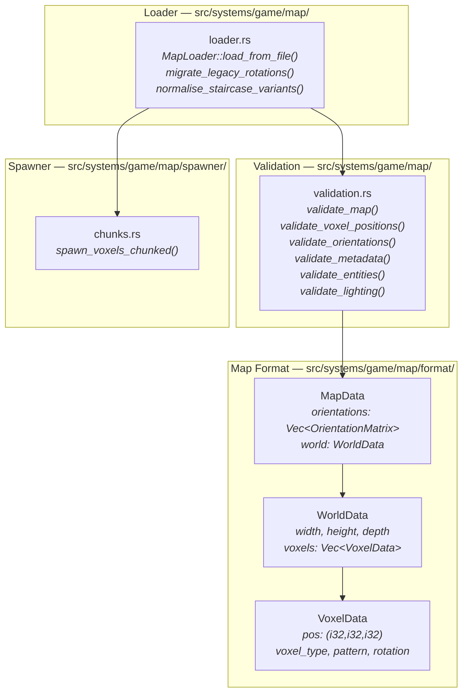
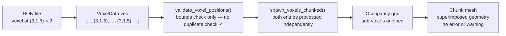
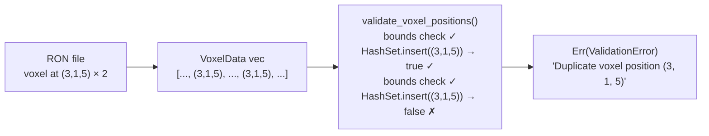
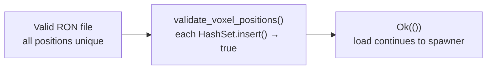
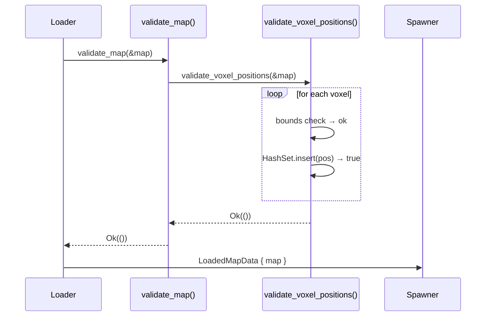
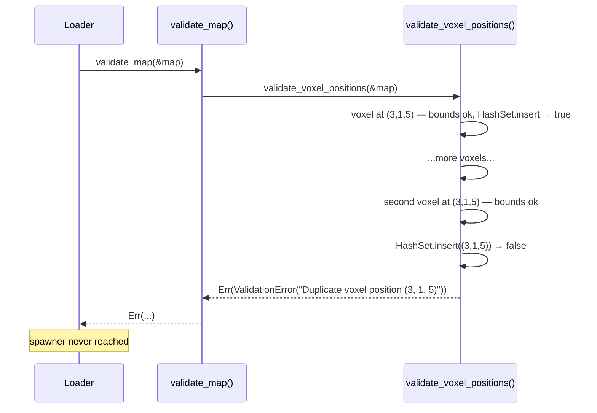

# Duplicate Voxel Position Detection — Architecture Reference

**Date:** 2026-03-31  
**Repo:** `adrakestory`  
**Runtime:** Rust / Bevy ECS  
**Purpose:** Document the current validation architecture that silently accepts duplicate voxel positions, and define the target architecture that rejects them at load time.

---

## Changelog

| Version | Date | Author | Summary |
|---------|------|--------|---------|
| **v1** | **2026-03-31** | **Investigation** | **Initial draft — current architecture, bug mechanism, single-function target fix** |

---

## Table of Contents

1. [Current Architecture](#1-current-architecture)
   - [Module Structure](#11-module-structure)
   - [Loader Pipeline](#12-loader-pipeline)
   - [validate_voxel_positions — Current Behaviour](#13-validate_voxel_positions--current-behaviour)
   - [The Bug — Duplicates Pass Silently](#14-the-bug--duplicates-pass-silently)
2. [Target Architecture](#2-target-architecture)
   - [Design Principles](#21-design-principles)
   - [validate_voxel_positions — After Fix](#22-validate_voxel_positions--after-fix)
   - [New and Modified Components](#23-new-and-modified-components)
   - [Data Flow — After Fix](#24-data-flow--after-fix)
   - [Sequence Diagram — Happy Path](#25-sequence-diagram--happy-path)
   - [Sequence Diagram — Duplicate Detected](#26-sequence-diagram--duplicate-detected)
   - [Backward Compatibility](#27-backward-compatibility)
   - [Phase Boundaries](#28-phase-boundaries)
3. [Appendices](#appendix-a--key-file-locations)
   - [Appendix A — Key File Locations](#appendix-a--key-file-locations)
   - [Appendix B — Code Template](#appendix-b--code-template)
   - [Appendix C — Open Questions & Decisions](#appendix-c--open-questions--decisions)

---

## 1. Current Architecture

### 1.1 Module Structure



### 1.2 Loader Pipeline


`validate_map()` is the last gate before the map data reaches the spawner. All
structural checks (dimensions, positions, orientations, metadata, entities,
lighting) run here. A failing check returns `MapLoadError` and aborts the load.

### 1.3 validate_voxel_positions — Current Behaviour

**File:** `src/systems/game/map/validation.rs:45–57`

```rust
fn validate_voxel_positions(map: &MapData) -> MapResult<()> {
    let world = &map.world;

    for voxel in &world.voxels {
        let (x, y, z) = voxel.pos;

        if x < 0 || x >= world.width || y < 0 || y >= world.height || z < 0 || z >= world.depth {
            return Err(MapLoadError::InvalidVoxelPosition(x, y, z));
        }
    }

    Ok(())
}
```

The function performs a single bounds check per voxel. It does not track which
positions have already been seen; duplicate positions pass silently.

### 1.4 The Bug — Duplicates Pass Silently



Both `VoxelData` entries at the same position are spawned: their sub-voxel
geometries are merged by union in the occupancy grid and both contribute faces
to the chunk mesh. In large hand-edited maps this leads to invisible mesh
corruption that is difficult to diagnose.

---

## 2. Target Architecture

### 2.1 Design Principles

1. **Single-pass, fail-fast** — the duplicate check adds a `HashSet<(i32,i32,i32)>`
   to the existing loop in `validate_voxel_positions()`. No second pass is needed
   (FR-2.1.1, NFR-3.1).
2. **Bounds before duplicates** — the existing per-voxel bounds guard executes first
   within each loop iteration, so an out-of-bounds position returns
   `InvalidVoxelPosition` before the `HashSet` is consulted (FR-2.3.1).
3. **Minimal diff** — only `validate_voxel_positions()` changes. No new error
   variants, no spawner changes, no editor changes (NFR-3.2, NFR-3.3).
4. **Actionable error message** — the `ValidationError` string includes the
   duplicate `pos` so authors can locate the offending entry in the RON file (FR-2.1.2).

### 2.2 validate_voxel_positions — After Fix

```rust
fn validate_voxel_positions(map: &MapData) -> MapResult<()> {
    let world = &map.world;
    let mut seen = std::collections::HashSet::new();

    for voxel in &world.voxels {
        let (x, y, z) = voxel.pos;

        // Bounds check first (existing behaviour, FR-2.2.1, FR-2.3.1)
        if x < 0 || x >= world.width || y < 0 || y >= world.height || z < 0 || z >= world.depth {
            return Err(MapLoadError::InvalidVoxelPosition(x, y, z));
        }

        // Duplicate check (new, FR-2.1.1)
        if !seen.insert(voxel.pos) {
            return Err(MapLoadError::ValidationError(
                format!("Duplicate voxel position {:?}", voxel.pos)
            ));
        }
    }

    Ok(())
}
```

`(i32, i32, i32)` implements `Hash` and `Eq` in the standard library, so it can
be used as a `HashSet` key directly with no helper types required.

### 2.3 New and Modified Components

**Modified:**

| Component | File | Change |
|-----------|------|--------|
| `validate_voxel_positions()` | `src/systems/game/map/validation.rs:45–57` | Add `HashSet<(i32,i32,i32)>` and duplicate check inside the existing loop |

**Not changed:**

- `MapLoadError` — `ValidationError(String)` is reused; no new variant.
- `MapData`, `WorldData`, `VoxelData` — data structures unchanged.
- `loader.rs` — pipeline unchanged; `validate_map()` is called in the same position.
- `spawn_voxels_chunked()` — spawner unchanged.
- All editor code — unchanged.

### 2.4 Data Flow — After Fix



For a valid map (no duplicates):



### 2.5 Sequence Diagram — Happy Path



### 2.6 Sequence Diagram — Duplicate Detected



### 2.7 Backward Compatibility

| Scenario | Before fix | After fix | Result |
|----------|-----------|-----------|--------|
| Valid map — all positions unique | `Ok(())` | `Ok(())` | Identical ✓ |
| Map with duplicate positions | Silent mesh corruption | `Err(ValidationError(...))` | Load fails with clear message — intentional breaking change for corrupt data ✓ |
| Out-of-bounds position | `Err(InvalidVoxelPosition(...))` | `Err(InvalidVoxelPosition(...))` | Unchanged ✓ |
| Out-of-bounds AND duplicate | `Err(InvalidVoxelPosition(...))` | `Err(InvalidVoxelPosition(...))` | Bounds error takes precedence ✓ |

> Maps that currently contain duplicate positions will fail to load after this
> fix. This is the intended outcome — such maps contain corrupt data that must
> be corrected by the author.

### 2.8 Phase Boundaries

| Capability | Phase | Notes |
|------------|-------|-------|
| `HashSet` duplicate check inside `validate_voxel_positions()` | Phase 1 | Core fix — single function change |
| Unit test `test_duplicate_voxel_position` in `validation.rs` | Phase 1 | Required |
| Both binaries compile cleanly | Phase 1 | Required |

**MVP boundary:**

- ✅ Fail-fast on first duplicate, with position in error message
- ✅ Bounds check preserved and runs before duplicate check
- ❌ Collecting all duplicate positions before returning (not needed; fail-fast is sufficient)
- ❌ Editor-side duplicate prevention (out of scope for this fix)

---

## Appendix A — Key File Locations

| Component | Path |
|-----------|------|
| `validate_voxel_positions()` (fix location) | `src/systems/game/map/validation.rs:45–57` |
| `validate_map()` | `src/systems/game/map/validation.rs:7–27` |
| `MapLoadError` | `src/systems/game/map/error.rs` |
| `VoxelData` | `src/systems/game/map/format/world.rs` |
| `WorldData` | `src/systems/game/map/format/world.rs` |
| `MapData` | `src/systems/game/map/format/mod.rs` |
| Loader pipeline | `src/systems/game/map/loader.rs` |

---

## Appendix B — Code Template

The complete modified function body (see §2.2 for context):

```rust
fn validate_voxel_positions(map: &MapData) -> MapResult<()> {
    let world = &map.world;
    let mut seen = std::collections::HashSet::new();

    for voxel in &world.voxels {
        let (x, y, z) = voxel.pos;

        if x < 0 || x >= world.width || y < 0 || y >= world.height || z < 0 || z >= world.depth {
            return Err(MapLoadError::InvalidVoxelPosition(x, y, z));
        }

        if !seen.insert(voxel.pos) {
            return Err(MapLoadError::ValidationError(
                format!("Duplicate voxel position {:?}", voxel.pos)
            ));
        }
    }

    Ok(())
}
```

The corresponding unit test to add in the existing `#[cfg(test)]` block:

```rust
#[test]
fn test_duplicate_voxel_position() {
    let mut map = MapData::default_map();
    // Push a second voxel at the same position as the first
    let duplicate = map.world.voxels[0].clone();
    map.world.voxels.push(duplicate);
    assert!(validate_map(&map).is_err());
}
```

---

## Appendix C — Open Questions & Decisions

### Resolved

| # | Question | Resolution |
|---|----------|------------|
| 1 | Fail-fast on first duplicate or collect all? | **Fail-fast.** Consistent with every other check in `validate_voxel_positions()`. |
| 2 | Bounds or duplicate check first within each iteration? | **Bounds first** (FR-2.3.1). The existing `if x < 0 \|\| ...` guard is at the top of the loop body; `HashSet::insert` follows it. |
| 3 | New `MapLoadError` variant or reuse `ValidationError`? | **Reuse `ValidationError(String)`.** The position is embedded in the string. A dedicated variant would be useful if callers needed to programmatically extract the duplicate position, but no such caller exists. |

---

*Created: 2026-03-31 — See [Changelog](#changelog) for version history.*  
*Companion documents: [Requirements](./requirements.md) | [Ticket](../ticket.md)*  
*Source: `docs/investigations/2026-03-22-1427-map-format-analysis.md` — Finding 4*
