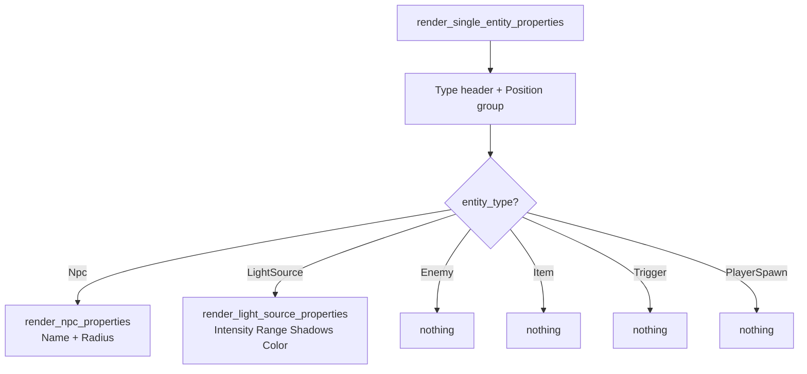
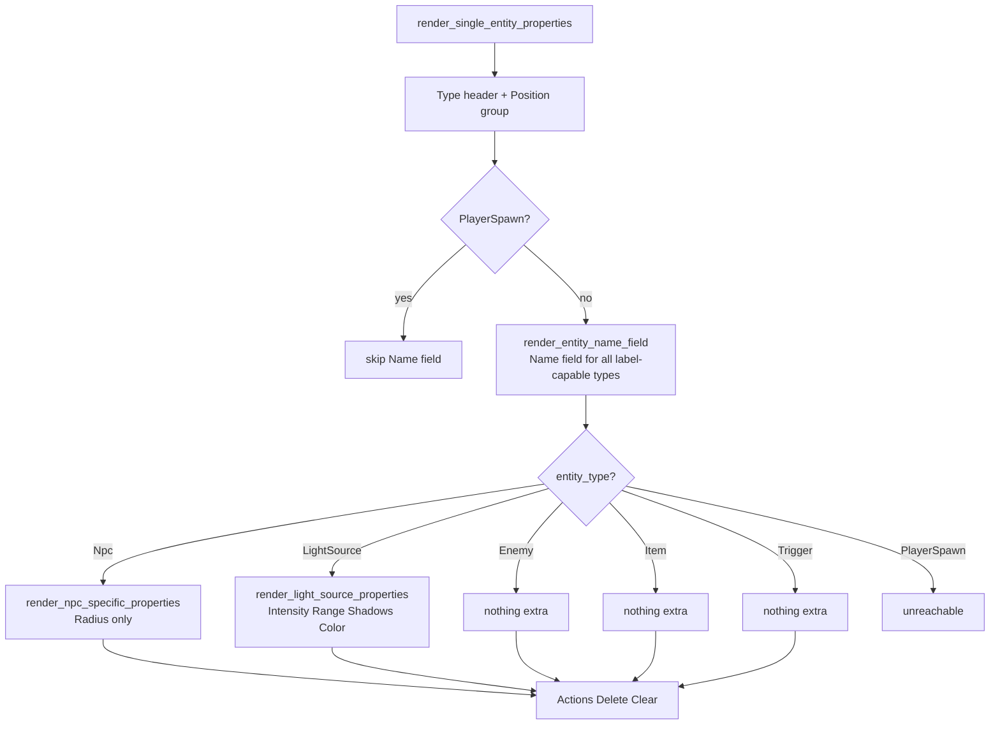

# Architecture: Entity Name Field — Properties Panel Fix

## Changelog

| Version | Date | Author | Summary |
|---------|------|--------|---------|
| **v1** | **2026-04-08** | **agent** | **Initial draft — single-file refactor of `entity_props.rs`; validated against codebase** |

---

## Table of Contents

1. [Current Architecture](#1-current-architecture)
   - 1.1 [Properties Panel Call Chain](#11-properties-panel-call-chain)
   - 1.2 [render\_single\_entity\_properties Dispatch](#12-render_single_entity_properties-dispatch)
   - 1.3 [render\_npc\_properties — Name Field Location](#13-render_npc_properties--name-field-location)
   - 1.4 [Viewport Label Coverage vs Properties Panel Coverage](#14-viewport-label-coverage-vs-properties-panel-coverage)
2. [Target Architecture](#2-target-architecture)
   - 2.1 [Design Principles](#21-design-principles)
   - 2.2 [New Components](#22-new-components)
   - 2.3 [Modified Components](#23-modified-components)
   - 2.4 [Updated Dispatch Flow](#24-updated-dispatch-flow)
   - 2.5 [render\_entity\_name\_field — Implementation Sketch](#25-render_entity_name_field--implementation-sketch)
   - 2.6 [Phase Boundaries](#26-phase-boundaries)
3. [Appendices](#3-appendices)
   - A. [Key File Locations](#a-key-file-locations)
   - B. [Open Questions](#b-open-questions)

---

## 1. Current Architecture

### 1.1 Properties Panel Call Chain

```
render_properties_panel()          mod.rs:43
  └─ render_tool_content()         mod.rs:91
       └─ [Select tool branch]
            └─ render_select_content()       selection.rs:19
                 └─ render_entity_selection_content()   selection.rs:176
                      └─ render_single_entity_properties()   entity_props.rs:10
```

### 1.2 render\_single\_entity\_properties Dispatch

```rust
// entity_props.rs:79–85
if entity_type == EntityType::Npc {
    render_npc_properties(ui, editor_state, history, index);
    //         ↑ Name field lives here
} else if entity_type == EntityType::LightSource {
    render_light_source_properties(ui, editor_state, index);
    //         ↑ No Name field
}
// Enemy, Item, Trigger: no branch — nothing rendered
```



### 1.3 render\_npc\_properties — Name Field Location

The Name field is embedded inside the NPC-specific group alongside the Radius slider (`entity_props.rs:109–167`):

```rust
fn render_npc_properties(ui, editor_state, history, index) {
    ui.group(|ui| {
        ui.label("NPC Properties");

        // ← Name field (lines 112–138)
        let current_name = ...properties.get("name")...;
        let mut name = current_name.clone();
        let response = ui.text_edit_singleline(&mut name);
        if response.lost_focus() && name != current_name {
            // push EditorAction::ModifyEntity
            // mark_modified()
        }

        // ← Radius slider (lines 141–166)
        ...
    });
}
```

### 1.4 Viewport Label Coverage vs Properties Panel Coverage

Phase 2 (commit `46ff5e3`) extended `render_entity_name_labels` in `viewport.rs` to cover all non-PlayerSpawn entity types. The Properties panel was not updated.

| Entity Type | Viewport Label? | Name Field in Properties? |
|-------------|----------------|--------------------------|
| `Npc` | ✅ | ✅ |
| `Enemy` | ✅ | ❌ **missing** |
| `Item` | ✅ | ❌ **missing** |
| `Trigger` | ✅ | ❌ **missing** |
| `LightSource` | ✅ | ❌ **missing** |
| `PlayerSpawn` | ❌ (correct) | ❌ (correct) |

---

## 2. Target Architecture

### 2.1 Design Principles

1. **Single source of truth for name editing.** The Name field logic (read → edit → commit → history) exists in exactly one place — the new `render_entity_name_field` helper. Per-type functions never duplicate it.
2. **Minimal blast radius.** The fix is confined to `entity_props.rs`. No other file requires changes.
3. **Consistent layout.** The Name field appears in the same position for all entity types: after Position, before any type-specific properties. This matches what NPC users already see.
4. **PlayerSpawn remains excluded.** The guard `entity_type != EntityType::PlayerSpawn` preserves the intended design from the original NPC-only implementation.
5. **No behaviour change for NPC.** After the refactor, an NPC entity selected in the Properties panel shows exactly the same fields in the same order. Only the code structure changes.

### 2.2 New Components

| Function | File | Purpose |
|----------|------|---------|
| `render_entity_name_field` | `entity_props.rs` | Private helper that renders the "Name:" text field and commits changes via `EditorAction::ModifyEntity` on focus-lost. Called for all non-PlayerSpawn entity types. |

### 2.3 Modified Components

| Component | Change |
|-----------|--------|
| `render_single_entity_properties` | Add a call to `render_entity_name_field` for all non-PlayerSpawn types, before the per-type dispatch block. |
| `render_npc_properties` | Remove the Name field rendering (lines 112–138). The function becomes Radius-only. Rename to `render_npc_specific_properties` for clarity (optional — see NFR-2). |

> `render_light_source_properties` is **not modified** — it remains unchanged.

### 2.4 Updated Dispatch Flow



### 2.5 render\_entity\_name\_field — Implementation Sketch

```rust
/// Renders a "Name:" text field for the entity at `index`.
///
/// Commits the change to `entity_data.properties["name"]` when the field
/// loses focus or the user presses Enter.  No-ops if the value is unchanged.
/// Creates an undoable `EditorAction::ModifyEntity` history entry on commit.
fn render_entity_name_field(
    ui: &mut egui::Ui,
    editor_state: &mut EditorState,
    history: &mut EditorHistory,
    index: usize,
) {
    ui.group(|ui| {
        ui.label("Properties");

        let current_name = editor_state.current_map.entities[index]
            .properties
            .get("name")
            .cloned()
            .unwrap_or_default();   // empty string — no NPC-specific placeholder
        let mut name = current_name.clone();

        ui.horizontal(|ui| {
            ui.label("Name:");
            let response = ui.text_edit_singleline(&mut name);
            if response.lost_focus() && name != current_name {
                let old_data = editor_state.current_map.entities[index].clone();
                editor_state.current_map.entities[index]
                    .properties
                    .insert("name".to_string(), name);
                let new_data = editor_state.current_map.entities[index].clone();
                history.push(EditorAction::ModifyEntity { index, old_data, new_data });
                editor_state.mark_modified();
            }
        });
    });
}
```

**Key differences from the existing NPC name logic:**

| Detail | Existing (NPC only) | New helper |
|--------|---------------------|------------|
| Default value | `"NPC".to_string()` | `String::new()` (empty) |
| Group label | `"NPC Properties"` | `"Properties"` |
| Radius slider | present | absent (moved to `render_npc_specific_properties`) |

Using `String::new()` as the default is intentional — the NPC placeholder `"NPC"` was a display default specific to the NPC label suppression logic in `viewport.rs:should_show_label`. The properties panel should not inject a type-name placeholder into the stored data.

### 2.6 Phase Boundaries

| Scope | In / Out |
|-------|---------|
| Name field for Npc, Enemy, Item, Trigger, LightSource | **In** |
| PlayerSpawn name field | **Out** — no viewport label, no name concept |
| Type-specific panels for Enemy / Item / Trigger | **Out** — future work |
| Inline rename in Outliner | **Out** — future work |

---

## 3. Appendices

### A. Key File Locations

| Component | File |
|-----------|------|
| Properties panel entry point | `src/editor/ui/properties/mod.rs:43` |
| Entity dispatch & name field (current) | `src/editor/ui/properties/entity_props.rs:10–100` |
| NPC name + radius (current) | `src/editor/ui/properties/entity_props.rs:103–168` |
| LightSource properties | `src/editor/ui/properties/entity_props.rs:170–295` |
| Select tool routing | `src/editor/ui/properties/selection.rs:19–60` |
| Viewport label rendering | `src/editor/ui/viewport.rs:386–455` |
| `EditorAction::ModifyEntity` | `src/editor/history.rs` |
| `EntityData.properties` | `src/systems/game/map/format/entities.rs:22` |

### B. Open Questions

None — all design decisions are resolved. See `docs/bugs/entity-name-field-missing/requirements.md`.

---

*See [Changelog](#changelog) for version history.*
*Companion documents: [ticket.md](ticket.md) · [requirements.md](requirements.md)*
*Investigation: [docs/investigations/2026-04-08-1605-entity-name-field-missing-properties-panel.md](../../investigations/2026-04-08-1605-entity-name-field-missing-properties-panel.md)*
