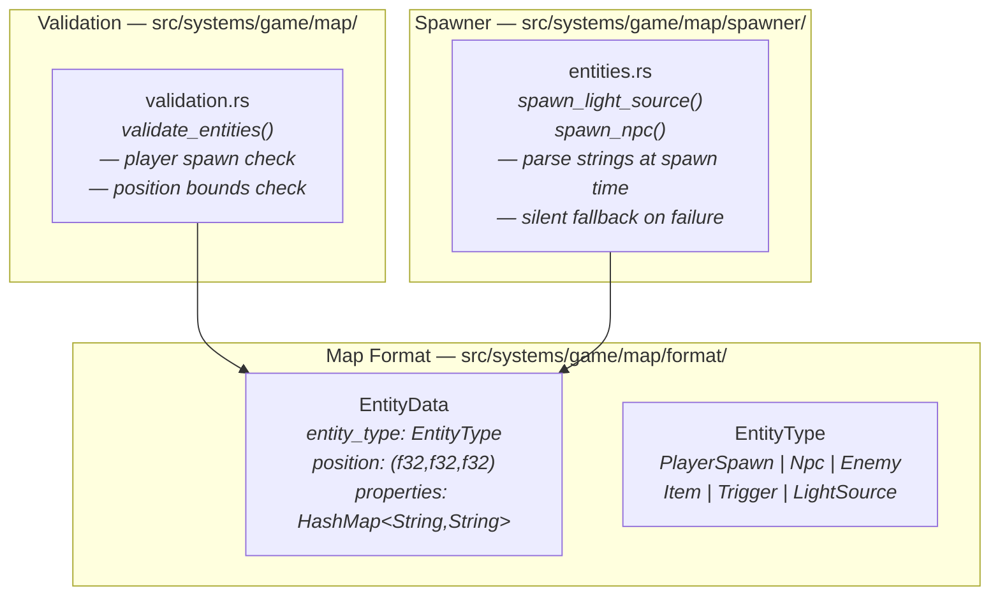
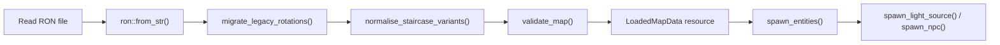
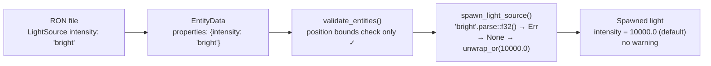
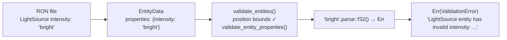
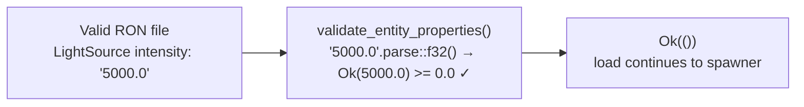
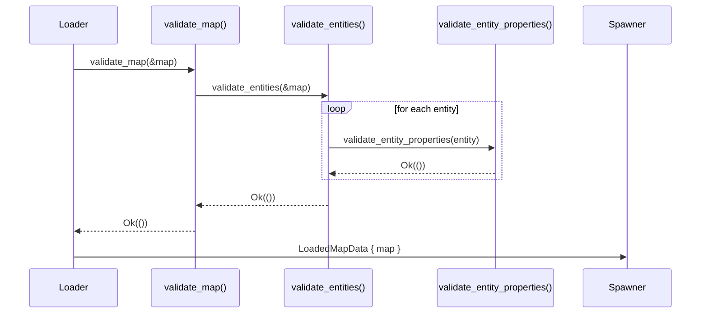
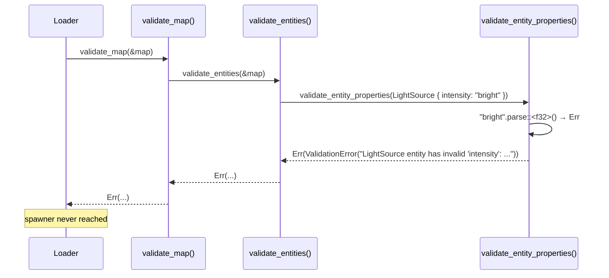

# Entity Property Validation — Architecture Reference

**Date:** 2026-03-31  
**Repo:** `adrakestory`  
**Runtime:** Rust / Bevy ECS  
**Purpose:** Document the current entity-spawning architecture that silently ignores unparseable property strings, and define the target architecture that rejects them at load time.

---

## Changelog

| Version | Date | Author | Summary |
|---------|------|--------|---------|
| **v1** | **2026-03-31** | **Investigation** | **Initial draft — current architecture, bug mechanism, validation-only target fix** |

---

## Table of Contents

1. [Current Architecture](#1-current-architecture)
   - [Module Structure](#11-module-structure)
   - [Loader Pipeline](#12-loader-pipeline)
   - [Entity Data Format — Current](#13-entity-data-format--current)
   - [Spawner Property Parsing — Current](#14-spawner-property-parsing--current)
   - [The Bug — Silent Parse Failures](#15-the-bug--silent-parse-failures)
2. [Target Architecture](#2-target-architecture)
   - [Design Principles](#21-design-principles)
   - [validate_entity_properties — New Helper](#22-validate_entity_properties--new-helper)
   - [validate_entities — After Fix](#23-validate_entities--after-fix)
   - [New and Modified Components](#24-new-and-modified-components)
   - [Data Flow — After Fix](#25-data-flow--after-fix)
   - [Sequence Diagram — Happy Path](#26-sequence-diagram--happy-path)
   - [Sequence Diagram — Invalid Property Detected](#27-sequence-diagram--invalid-property-detected)
   - [Backward Compatibility](#28-backward-compatibility)
   - [Phase Boundaries](#29-phase-boundaries)
3. [Appendices](#appendix-a--key-file-locations)
   - [Appendix A — Key File Locations](#appendix-a--key-file-locations)
   - [Appendix B — Code Template](#appendix-b--code-template)
   - [Appendix C — Open Questions & Decisions](#appendix-c--open-questions--decisions)

---

## 1. Current Architecture

### 1.1 Module Structure



### 1.2 Loader Pipeline



Property strings reach the spawner without any structural check after `ron::from_str()`.

### 1.3 Entity Data Format — Current

**File:** `src/systems/game/map/format/entities.rs:7–16`

```rust
#[derive(Serialize, Deserialize, Clone, Debug)]
pub struct EntityData {
    pub entity_type: EntityType,
    pub position: (f32, f32, f32),
    #[serde(default)]
    pub properties: HashMap<String, String>,
}
```

All entity-specific fields (intensity, range, color, radius, name) are stored as
untyped strings. There is no schema and no documented key names other than what
can be inferred from the spawner source.

### 1.4 Spawner Property Parsing — Current

**File:** `src/systems/game/map/spawner/entities.rs:189–218`

```rust
let intensity = properties
    .get("intensity")
    .and_then(|i| i.parse::<f32>().ok())
    .unwrap_or(10000.0)       // silent fallback
    .clamp(0.0, 1000000.0);

let range = properties
    .get("range")
    .and_then(|r| r.parse::<f32>().ok())
    .unwrap_or(10.0)          // silent fallback
    .clamp(0.1, 100.0);
```

The `.ok()` converts a `ParseFloatError` to `None`, which `.unwrap_or(...)` then
replaces with the default. The parse failure is discarded with no log, no error,
and no feedback to the author.

### 1.5 The Bug — Silent Parse Failures



The author's intent (`intensity: "bright"`) is silently replaced by a hardcoded
default. There is no indication that anything went wrong.

---

## 2. Target Architecture

### 2.1 Design Principles

1. **Validate at the gate** — property validation runs inside `validate_map()`,
   the last gate before the spawner. A bad property stops the load before any
   entity is spawned (FR-2.5.1).
2. **Spawner unchanged** — the spawner's `parse().ok().unwrap_or(...)` pattern
   is preserved. Validation and spawning are independent layers (NFR-3.2).
3. **Fail-fast, named error** — fail on the first invalid property, include the
   entity type and key name in the message (FR-2.4.1).
4. **Forward-compatible** — unknown keys and unknown entity types pass without
   error (FR-2.3.1, FR-2.3.2).

### 2.2 validate_entity_properties — New Helper

```rust
fn validate_entity_properties(entity: &EntityData) -> MapResult<()> {
    use super::format::EntityType;

    match entity.entity_type {
        EntityType::LightSource => {
            if let Some(v) = entity.properties.get("intensity") {
                match v.parse::<f32>() {
                    Ok(f) if f >= 0.0 => {}
                    Ok(_) => return Err(MapLoadError::ValidationError(format!(
                        "LightSource entity has invalid 'intensity': \
                         expected non-negative f32, got {:?}", v
                    ))),
                    Err(_) => return Err(MapLoadError::ValidationError(format!(
                        "LightSource entity has invalid 'intensity': \
                         expected non-negative f32, got {:?}", v
                    ))),
                }
            }
            if let Some(v) = entity.properties.get("range") {
                match v.parse::<f32>() {
                    Ok(f) if f > 0.0 => {}
                    Ok(_) => return Err(MapLoadError::ValidationError(format!(
                        "LightSource entity has invalid 'range': \
                         expected positive f32, got {:?}", v
                    ))),
                    Err(_) => return Err(MapLoadError::ValidationError(format!(
                        "LightSource entity has invalid 'range': \
                         expected positive f32, got {:?}", v
                    ))),
                }
            }
            if let Some(v) = entity.properties.get("shadows") {
                if !matches!(v.as_str(), "true" | "false" | "1" | "0") {
                    return Err(MapLoadError::ValidationError(format!(
                        "LightSource entity has invalid 'shadows': \
                         expected true/false/1/0, got {:?}", v
                    )));
                }
            }
            if let Some(v) = entity.properties.get("color") {
                let parts: Vec<f32> = v
                    .split(',')
                    .filter_map(|p| p.trim().parse().ok())
                    .collect();
                if parts.len() != 3 {
                    return Err(MapLoadError::ValidationError(format!(
                        "LightSource entity has invalid 'color': \
                         expected three comma-separated f32 values, got {:?}", v
                    )));
                }
            }
        }
        EntityType::Npc => {
            if let Some(v) = entity.properties.get("radius") {
                match v.parse::<f32>() {
                    Ok(f) if f > 0.0 => {}
                    Ok(_) => return Err(MapLoadError::ValidationError(format!(
                        "Npc entity has invalid 'radius': \
                         expected positive f32, got {:?}", v
                    ))),
                    Err(_) => return Err(MapLoadError::ValidationError(format!(
                        "Npc entity has invalid 'radius': \
                         expected positive f32, got {:?}", v
                    ))),
                }
            }
        }
        // Other entity types: no property validation (FR-2.3.2)
        _ => {}
    }
    Ok(())
}
```

### 2.3 validate_entities — After Fix

```rust
fn validate_entities(map: &MapData) -> MapResult<()> {
    // Existing: player spawn required
    let has_player_spawn = map
        .entities
        .iter()
        .any(|e| matches!(e.entity_type, super::format::EntityType::PlayerSpawn));
    if !has_player_spawn {
        return Err(MapLoadError::ValidationError(
            "Map must have at least one PlayerSpawn entity".to_string(),
        ));
    }

    // Existing: position bounds check
    let world = &map.world;
    let max_x = world.width as f32;
    let max_y = world.height as f32 * 2.0;
    let max_z = world.depth as f32;
    for entity in &map.entities {
        let (x, y, z) = entity.position;
        if x < -1.0 || x > max_x + 1.0 || y < -1.0 || y > max_y || z < -1.0 || z > max_z + 1.0 {
            return Err(MapLoadError::ValidationError(format!(
                "Entity position ({}, {}, {}) is outside reasonable bounds",
                x, y, z
            )));
        }

        // New: property validation (FR-2.5.1)
        validate_entity_properties(entity)?;
    }
    Ok(())
}
```

### 2.4 New and Modified Components

**New:**

| Component | File | Description |
|-----------|------|-------------|
| `validate_entity_properties()` | `src/systems/game/map/validation.rs` | Validates `LightSource` and `Npc` property strings |

**Modified:**

| Component | File | Change |
|-----------|------|--------|
| `validate_entities()` | `src/systems/game/map/validation.rs` | Add `validate_entity_properties(entity)?` inside the entity loop |

**Not changed:**

- `EntityData`, `EntityType` — format structs unchanged.
- `spawn_light_source()`, `spawn_npc()` — spawner logic unchanged.
- `MapLoadError` — `ValidationError(String)` is reused; no new variant.
- All editor code — unchanged.

### 2.5 Data Flow — After Fix



For a valid map:



### 2.6 Sequence Diagram — Happy Path



### 2.7 Sequence Diagram — Invalid Property Detected



### 2.8 Backward Compatibility

| Scenario | Before fix | After fix | Result |
|----------|-----------|-----------|--------|
| Valid properties | Spawner uses parsed value | `Ok(())`, spawner uses parsed value | Identical ✓ |
| Absent property key | Spawner uses default | `Ok(())`, spawner uses default | Identical ✓ |
| Unknown property key | Spawner ignores it | `Ok(())`, spawner ignores it | Identical ✓ |
| Unparseable value | Silent default | `Err(ValidationError(...))` | Load fails — intentional ✓ |
| Negative range | Spawner clamps to 0.1 | `Err(ValidationError(...))` | Load fails — intentional ✓ |

> Maps that currently rely on a silently-ignored invalid property value will fail
> to load after this fix. Such maps must be corrected by the author.

### 2.9 Phase Boundaries

| Capability | Phase | Notes |
|------------|-------|-------|
| `validate_entity_properties()` for LightSource and Npc | Phase 1 | Core fix |
| Unit tests for each invalid property type | Phase 1 | Required |
| Both binaries compile cleanly | Phase 1 | Required |
| Typed serde structs replacing `HashMap<String, String>` | Phase 2 | Out of scope |

---

## Appendix A — Key File Locations

| Component | Path |
|-----------|------|
| `validate_entities()` (fix location) | `src/systems/game/map/validation.rs:121–151` |
| `validate_map()` | `src/systems/game/map/validation.rs:7–27` |
| `EntityData` | `src/systems/game/map/format/entities.rs:7–16` |
| `EntityType` | `src/systems/game/map/format/entities.rs:18–33` |
| `spawn_light_source()` | `src/systems/game/map/spawner/entities.rs:184–247` |
| `spawn_npc()` | `src/systems/game/map/spawner/entities.rs:128–178` |
| `MapLoadError` | `src/systems/game/map/error.rs` |
| Loader pipeline | `src/systems/game/map/loader.rs` |

---

## Appendix B — Code Template

See §2.2 for `validate_entity_properties()` and §2.3 for the updated
`validate_entities()` body.

Unit tests to add in the existing `#[cfg(test)]` block of `validation.rs`:

```rust
fn make_light_source_entity(props: Vec<(&str, &str)>) -> EntityData {
    use crate::systems::game::map::format::{EntityData, EntityType};
    EntityData {
        entity_type: EntityType::LightSource,
        position: (1.5, 0.5, 1.5),
        properties: props
            .into_iter()
            .map(|(k, v)| (k.to_string(), v.to_string()))
            .collect(),
    }
}

#[test]
fn light_source_invalid_intensity_is_rejected() {
    let mut map = MapData::default_map();
    map.entities.push(make_light_source_entity(vec![("intensity", "bright")]));
    assert!(validate_map(&map).is_err());
}

#[test]
fn light_source_negative_range_is_rejected() {
    let mut map = MapData::default_map();
    map.entities.push(make_light_source_entity(vec![("range", "-5.0")]));
    assert!(validate_map(&map).is_err());
}

#[test]
fn light_source_invalid_shadows_is_rejected() {
    let mut map = MapData::default_map();
    map.entities.push(make_light_source_entity(vec![("shadows", "yes")]));
    assert!(validate_map(&map).is_err());
}

#[test]
fn light_source_invalid_color_is_rejected() {
    let mut map = MapData::default_map();
    map.entities.push(make_light_source_entity(vec![("color", "red")]));
    assert!(validate_map(&map).is_err());
}

#[test]
fn npc_invalid_radius_is_rejected() {
    use crate::systems::game::map::format::{EntityData, EntityType};
    let mut map = MapData::default_map();
    map.entities.push(EntityData {
        entity_type: EntityType::Npc,
        position: (1.0, 0.5, 1.0),
        properties: [("radius".to_string(), "big".to_string())].into(),
    });
    assert!(validate_map(&map).is_err());
}

#[test]
fn light_source_valid_properties_pass() {
    let mut map = MapData::default_map();
    map.entities.push(make_light_source_entity(vec![
        ("intensity", "5000.0"),
        ("range", "15.0"),
        ("shadows", "false"),
        ("color", "1.0, 0.9, 0.7"),
    ]));
    assert!(validate_map(&map).is_ok());
}

#[test]
fn unknown_property_key_is_accepted() {
    let mut map = MapData::default_map();
    map.entities.push(make_light_source_entity(vec![("custom_tag", "anything")]));
    assert!(validate_map(&map).is_ok());
}
```

---

## Appendix C — Open Questions & Decisions

### Resolved

| # | Question | Resolution |
|---|----------|------------|
| 1 | Validate color component range (0.0–1.0)? | **No, Phase 1 only checks parseability.** Bevy handles out-of-range values; strict range check is Phase 2. |
| 2 | Should the spawner's fallback logic be removed? | **No.** Spawner and validator are independent layers (NFR-3.2). |
| 3 | New `MapLoadError` variant or reuse `ValidationError`? | **Reuse `ValidationError(String)`.** No caller needs to programmatically distinguish property errors from other validation errors. |

---

*Created: 2026-03-31 — See [Changelog](#changelog) for version history.*  
*Companion documents: [Requirements](./requirements.md) | [Ticket](../ticket.md)*  
*Source: `docs/investigations/2026-03-22-1427-map-format-analysis.md` — Finding 5*
