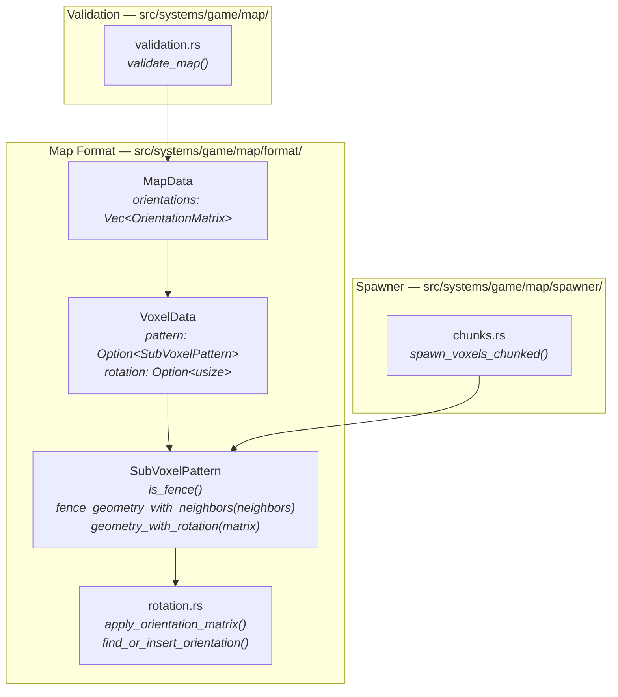
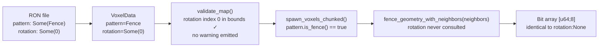
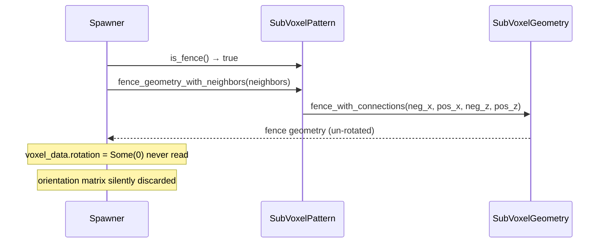
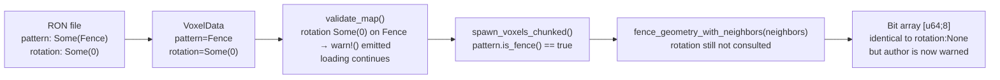
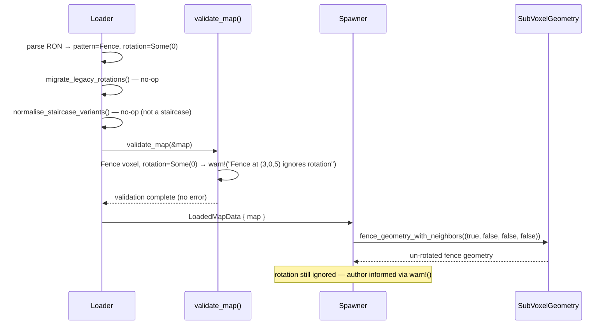
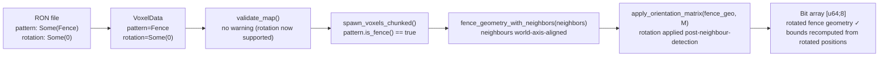

# Fence Rotation Ignored — Architecture Reference

**Date:** 2026-03-26  
**Repo:** `adrakestory`  
**Runtime:** Rust / Bevy ECS  
**Purpose:** Document the current fence spawning architecture that silently ignores `rotation`, and define the target architecture for both the minimum-viable fix (Option A — warn+document) and the full fix (Option B — apply rotation to fence geometry).

---

## Changelog

| Version | Date | Author | Summary |
|---------|------|--------|---------|
| v1 | 2026-03-26 | Investigation | Initial draft — current architecture, bug mechanism, Option A and Option B target architectures |

---

## Table of Contents

1. [Current Architecture](#1-current-architecture)
   - [Module Structure](#11-module-structure)
   - [Data Flow — Fence at Map Load](#12-data-flow--fence-at-map-load)
   - [The Fence Branch in the Spawner](#13-the-fence-branch-in-the-spawner)
   - [The Bug — rotation Never Consulted for Fences](#14-the-bug--rotation-never-consulted-for-fences)
2. [Target Architecture — Option A (Phase 1)](#2-target-architecture--option-a-phase-1)
   - [Design Principles](#21-design-principles)
   - [Warning Location in Loader Pipeline](#22-warning-location-in-loader-pipeline)
   - [Editor Save-Time Sanitisation](#23-editor-save-time-sanitisation)
   - [New and Modified Components — Option A](#24-new-and-modified-components--option-a)
   - [Data Flow — After Option A](#25-data-flow--after-option-a)
   - [Sequence Diagram — Option A](#26-sequence-diagram--option-a)
3. [Target Architecture — Option B (Phase 2)](#3-target-architecture--option-b-phase-2)
   - [Design Principles](#31-design-principles)
   - [Spawner Change — Apply Orientation After Neighbour Detection](#32-spawner-change--apply-orientation-after-neighbour-detection)
   - [Collision Bounds and SpatialGrid](#33-collision-bounds-and-spatialgrid)
   - [New and Modified Components — Option B](#34-new-and-modified-components--option-b)
   - [Data Flow — After Option B](#35-data-flow--after-option-b)
   - [Class Diagram](#36-class-diagram)
   - [Sequence Diagram — Option B](#37-sequence-diagram--option-b)
   - [Backward Compatibility](#38-backward-compatibility)
   - [Phase Boundaries](#39-phase-boundaries)
4. [Appendices](#appendix-a--key-file-locations)
   - [Appendix A — Key File Locations](#appendix-a--key-file-locations)
   - [Appendix B — Concrete Rotation Examples](#appendix-b--concrete-rotation-examples)
   - [Appendix C — Open Questions & Decisions](#appendix-c--open-questions--decisions)

---

## 1. Current Architecture

### 1.1 Module Structure



### 1.2 Data Flow — Fence at Map Load



The `rotation` field passes validation (it is a valid index) but is silently discarded at spawn time.

### 1.3 The Fence Branch in the Spawner

**File:** `src/systems/game/map/spawner/chunks.rs:104–115`

```rust
let geometry = if pattern.is_fence() {
    let neighbors = (
        fence_positions.contains(&(x - 1, y, z)), // neg_x
        fence_positions.contains(&(x + 1, y, z)), // pos_x
        fence_positions.contains(&(x, y, z - 1)), // neg_z
        fence_positions.contains(&(x, y, z + 1)), // pos_z
    );
    pattern.fence_geometry_with_neighbors(neighbors)   // ← rotation never consulted
} else {
    let orientation = voxel_data.rotation.and_then(|i| map.orientations.get(i));
    pattern.geometry_with_rotation(orientation)         // ← only non-fence path reads rotation
};
```

`fence_geometry_with_neighbors()` calls `SubVoxelGeometry::fence_with_connections()`
directly and does not accept an orientation parameter:

**File:** `src/systems/game/map/format/patterns.rs:106–114`

```rust
pub fn fence_geometry_with_neighbors(
    &self,
    neighbors: (bool, bool, bool, bool),
) -> SubVoxelGeometry {
    if !self.is_fence() {
        return self.geometry();
    }
    SubVoxelGeometry::fence_with_connections(neighbors.0, neighbors.1, neighbors.2, neighbors.3)
}
```

### 1.4 The Bug — rotation Never Consulted for Fences



The fence spawning path was written before the orientation matrix system existed.
When the matrix system was introduced (Fix 1 — `map-format-multi-axis-rotation`),
the `else` branch was updated to call `geometry_with_rotation()` but the fence
`if` branch was not.

---

## 2. Target Architecture — Option A (Phase 1)

### 2.1 Design Principles

1. **Make the no-op explicit** — `validate_map()` warns at load time so authors
   know immediately that their `rotation` field has no effect.
2. **Prevent future confusion from the editor** — the editor strips `rotation` from
   `Fence` voxels on save so the field cannot silently round-trip.
3. **No geometry or physics changes** — fence visual and collision behaviour is
   unchanged; this is purely a diagnostic and hygiene fix.
4. **Minimal diff** — Option A touches only `validation.rs`, the editor save path,
   and `map-format-spec.md`. The spawner is not modified.

### 2.2 Warning Location in Loader Pipeline

The loader pipeline currently runs:

```
parse RON → migrate_legacy_rotations() → normalise_staircase_variants() → validate_map()
```

The warning is added inside the existing `validate_map()` pass — no new pipeline
stage is needed:

```rust
// In validate_map() — validation.rs
for voxel in map.world.voxels.iter() {
    if voxel.pattern == Some(SubVoxelPattern::Fence) {
        if voxel.rotation.is_some() {
            warn!(
                "Fence voxel at {:?} has rotation: Some({:?}), \
                 but Fence ignores rotation. \
                 The rotation field has no effect on fence geometry.",
                voxel.pos,
                voxel.rotation,
            );
        }
    }
    // ... existing validation checks ...
}
```

### 2.3 Editor Save-Time Sanitisation

When the editor saves a map (in the editor save path — exact file TBD by
implementer from `src/editor/`), `rotation` is cleared for all `Fence` voxels
before the RON serialiser runs:

```rust
// Pseudocode — editor save path
for voxel in map.world.voxels.iter_mut() {
    if voxel.pattern == Some(SubVoxelPattern::Fence) {
        voxel.rotation = None;
    }
}
// then serialise to RON
```

The editor rotation tool must also be disabled or silently no-op for selected
fence voxels (FR-2.3.2).

### 2.4 New and Modified Components — Option A

**Modified:**

| Component | File | Change |
|-----------|------|--------|
| `validate_map()` | `src/systems/game/map/validation.rs` | Add `warn!()` for each `Fence` voxel where `rotation == Some(_)` |
| Editor save path | `src/editor/` (relevant save file) | Strip `rotation` from `Fence` voxels before serialising |
| Editor rotation tool | `src/editor/` (relevant tool file) | Disable or no-op rotation for selected fence voxels |
| `docs/api/map-format-spec.md` | `docs/api/map-format-spec.md` | Document `rotation` exception for `Fence`; note Phase 1 behaviour |

**Not changed:**

- `src/systems/game/map/spawner/chunks.rs` — fence branch unchanged; rotation still ignored.
- `SubVoxelPattern::fence_geometry_with_neighbors()` — unchanged.
- `SubVoxelGeometry::fence_with_connections()` — unchanged.
- `apply_orientation_matrix()` — unchanged.

### 2.5 Data Flow — After Option A



### 2.6 Sequence Diagram — Option A



---

## 3. Target Architecture — Option B (Phase 2)

### 3.1 Design Principles

1. **Rotation is fully supported for fences** — the orientation matrix is applied
   to the fence geometry after neighbour-aware generation.
2. **Neighbour detection is world-axis-aligned** — the four neighbour positions
   queried by the spawner (`x±1`, `z±1`) remain fixed in world space, regardless
   of the fence voxel's rotation matrix (FR-2.4.2).
3. **Collision bounds reflect rotated geometry** — `SubVoxel.bounds` are
   recomputed from the rotated geometry; the `SpatialGrid` receives the rotated AABB.
4. **Phase 1 warning removed** — `validate_map()` no longer warns for fence+rotation
   since it is now a valid combination.
5. **Reuse existing helpers** — `apply_orientation_matrix()` from `rotation.rs` is
   used without modification.

### 3.2 Spawner Change — Apply Orientation After Neighbour Detection

The spawner fence branch in `chunks.rs:104–115` becomes:

```rust
let geometry = if pattern.is_fence() {
    let neighbors = (
        fence_positions.contains(&(x - 1, y, z)),
        fence_positions.contains(&(x + 1, y, z)),
        fence_positions.contains(&(x, y, z - 1)),
        fence_positions.contains(&(x, y, z + 1)),
    );
    let fence_geo = pattern.fence_geometry_with_neighbors(neighbors);
    // Apply orientation matrix after neighbour-aware generation
    let orientation = voxel_data.rotation.and_then(|i| map.orientations.get(i));
    if let Some(matrix) = orientation {
        apply_orientation_matrix(fence_geo, matrix)
    } else {
        fence_geo
    }
} else {
    let orientation = voxel_data.rotation.and_then(|i| map.orientations.get(i));
    pattern.geometry_with_rotation(orientation)
};
```

The non-fence `else` branch is unchanged.

### 3.3 Collision Bounds and SpatialGrid

`SubVoxel.bounds` is a pre-computed AABB set at spawn time in
`spawn_voxels_chunked()`. For rotated fence sub-voxels, the rotated geometry
produces different sub-voxel positions. The AABB must be recomputed from the
rotated positions. No changes to `SpatialGrid` itself are required — the grid
accepts any AABB at insertion.

The spawner's sub-voxel loop (after the geometry branch) already iterates
`geometry.occupied_positions()` to set bounds. Since `geometry` now contains the
rotated positions when `rotation != None`, the bounds computed in that loop will
automatically reflect the rotation — **no additional change is needed in the
sub-voxel loop** provided the geometry variable already carries rotated geometry.

### 3.4 New and Modified Components — Option B

**Modified:**

| Component | File | Change |
|-----------|------|--------|
| `spawn_voxels_chunked()` fence branch | `src/systems/game/map/spawner/chunks.rs:104–115` | Apply `apply_orientation_matrix()` to fence geometry when `rotation != None` |
| `validate_map()` | `src/systems/game/map/validation.rs` | Remove the Phase 1 fence+rotation warning (FR-2.4.6) |
| `docs/api/map-format-spec.md` | `docs/api/map-format-spec.md` | Update to document rotation support for `Fence` (remove exception) |

**Not changed:**

- `fence_geometry_with_neighbors()` — unchanged; orientation is applied after.
- `SubVoxelGeometry::fence_with_connections()` — unchanged.
- `apply_orientation_matrix()` — reused without modification.
- `SpatialGrid` — no structural changes; rotated AABB inserted same as any AABB.

### 3.5 Data Flow — After Option B



### 3.6 Class Diagram


### 3.7 Sequence Diagram — Option B

Loading a fence voxel with a Y+90° orientation matrix:

```mermaid
sequenceDiagram
    participant Loader
    participant Spawner
    participant SubVoxelPattern
    participant SVG as SubVoxelGeometry
    participant Rotation as apply_orientation_matrix()

    Loader->>Loader: parse RON → pattern=Fence, rotation=Some(0), orientations[0]=M_y90
    Loader->>Loader: validate_map() — no warning (Phase 2)
    Loader->>Spawner: LoadedMapData { map }
    Spawner->>SubVoxelPattern: is_fence() → true
    Spawner->>SubVoxelPattern: fence_geometry_with_neighbors((true, false, false, false))
    SubVoxelPattern->>SVG: fence_with_connections(true, false, false, false)
    SVG-->>Spawner: un-rotated fence geometry [u64;8]
    Spawner->>Rotation: apply_orientation_matrix(fence_geo, M_y90)
    Rotation-->>Spawner: rotated fence geometry [u64;8]
    Spawner->>Spawner: iterate occupied_positions() → recompute bounds from rotated positions
    Note over Spawner: SpatialGrid receives rotated AABB
```

### 3.8 Backward Compatibility

| Scenario | Phase 1 | Phase 2 | Notes |
|----------|---------|---------|-------|
| `Fence, rotation: None` | Identical geometry, no warning | Identical geometry | Fully backward-compatible |
| `Fence, rotation: Some(i)` | Geometry unchanged (ignored); `warn!()` emitted | Rotated geometry applied | Visually different in Phase 2 — intentional |
| `Fence` saved from editor after Phase 1 | `rotation` stripped on save → file has `rotation: None` | Editor now preserves valid rotation | Phase 2 editor must not strip; Phase 1 stripping undone |

> **Note on backward compatibility:** The Phase 2 change is a visual breaking change
> for any existing fence voxel that carries a non-`None` rotation. Such voxels were
> previously invisible no-ops; in Phase 2 they produce rotated geometry. This is
> the intended correction. Phase 1's editor strip (FR-2.3.1) mitigates the impact
> by ensuring files saved after Phase 1 have `rotation: None` on fences, so they
> are unaffected by Phase 2.

### 3.9 Phase Boundaries

| Capability | Phase | Notes |
|------------|-------|-------|
| `warn!()` for fence + non-None rotation in `validate_map()` | Phase 1 | Diagnostic only |
| Editor strips `rotation` from fences on save | Phase 1 | Hygiene |
| Editor rotation tool disabled/no-op for fences | Phase 1 | Hygiene |
| `map-format-spec.md` documents exception | Phase 1 | Required |
| Spawner applies orientation to fence geometry | Phase 2 | Full fix |
| Collision bounds reflect rotated fence geometry | Phase 2 | Required for Phase 2 correctness |
| Phase 1 warning removed from `validate_map()` | Phase 2 | Cleanup |
| `map-format-spec.md` updated to document rotation support | Phase 2 | Required |

---

## Appendix A — Key File Locations

| Component | Path |
|-----------|------|
| Fence branch (bug location) | `src/systems/game/map/spawner/chunks.rs:104–115` |
| `SubVoxelPattern::is_fence()` | `src/systems/game/map/format/patterns.rs:97–100` |
| `SubVoxelPattern::fence_geometry_with_neighbors()` | `src/systems/game/map/format/patterns.rs:106–114` |
| `SubVoxelPattern::geometry_with_rotation()` | `src/systems/game/map/format/patterns.rs:124–135` |
| `apply_orientation_matrix()` | `src/systems/game/map/format/rotation.rs` |
| `validate_map()` | `src/systems/game/map/validation.rs` |
| Loader pipeline | `src/systems/game/map/loader.rs` |
| `MapData` | `src/systems/game/map/format/mod.rs` |
| `VoxelData` | `src/systems/game/map/format/world.rs` |
| Map format spec | `docs/api/map-format-spec.md` |

---

## Appendix B — Concrete Rotation Examples

### B.1 Fence with Y+90° rotation (Phase 2)

Input: `pattern: Some(Fence), rotation: Some(0)`, `orientations[0]` = Y+90° = `[[0,0,1],[0,1,0],[-1,0,0]]`

Neighbours: `(neg_x=true, pos_x=false, neg_z=false, pos_z=false)` — one rail extending in the -X direction.

| Step | Result |
|------|--------|
| `fence_with_connections(true, false, false, false)` | Post + rail towards -X |
| `apply_orientation_matrix(geo, M_y90)` | Post + rail towards -Z (rail rotated 90° around Y) |

The post geometry (symmetric around Y) is unchanged visually; the rail direction rotates.

### B.2 Fence with identity rotation (Phase 2, backward-compat case)

Input: `rotation: None` or identity matrix.

| Step | Result |
|------|--------|
| `fence_with_connections(...)` | Normal neighbour-connected fence |
| No orientation applied (`rotation: None`) | Identical to pre-Phase-2 output |

---

## Appendix C — Open Questions & Decisions

### Resolved

| # | Question | Resolution |
|---|----------|------------|
| 1 | Should Phase 1 be Option A (warn) or Option B (full rotation)? | **Option A for Phase 1.** Full rotation requires resolving collision bounds recomputation and the neighbour-detection axis question. |
| 2 | Should neighbour detection axes rotate with the fence in Option B? | **No — world-axis-aligned.** Rotation affects fence geometry only; connectivity queries remain in world space (FR-2.4.2). |
| 3 | Does the sub-voxel bounds loop in the spawner need modification for Phase 2? | **No, if geometry already carries rotated positions.** The existing loop computes bounds from `geometry.occupied_positions()`. Providing rotated geometry is sufficient; the loop is unchanged. |

---

*Created: 2026-03-26*  
*Companion documents: [Requirements](./requirements.md) | [Ticket](../ticket.md) | [Bug](../bug.md)*  
*Source: `docs/investigations/2026-03-22-1427-map-format-analysis.md` — Finding 3*
