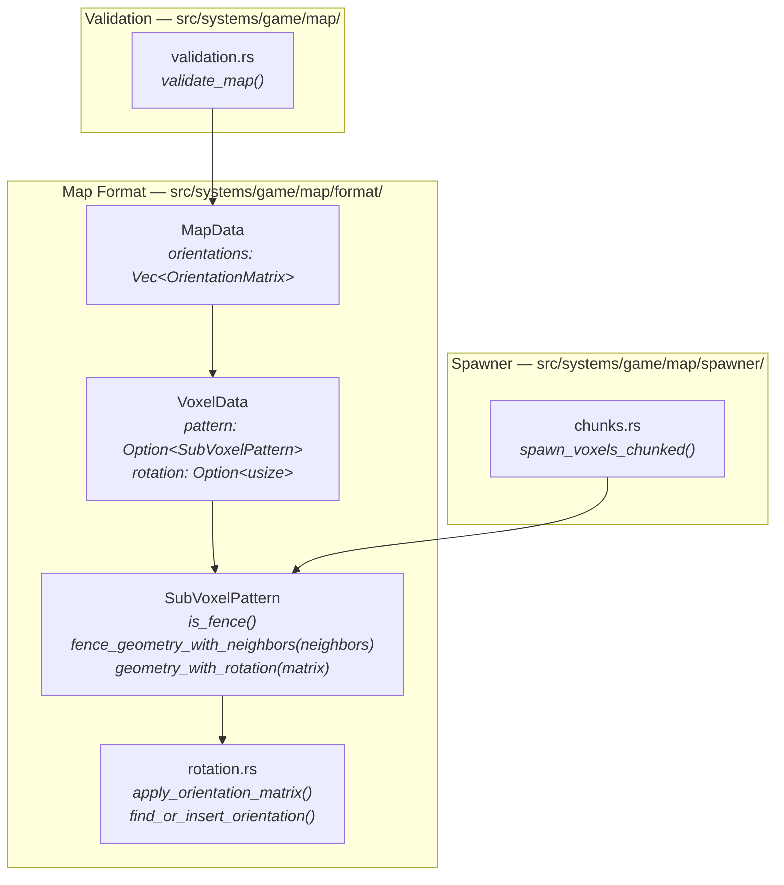
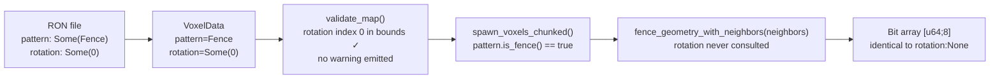
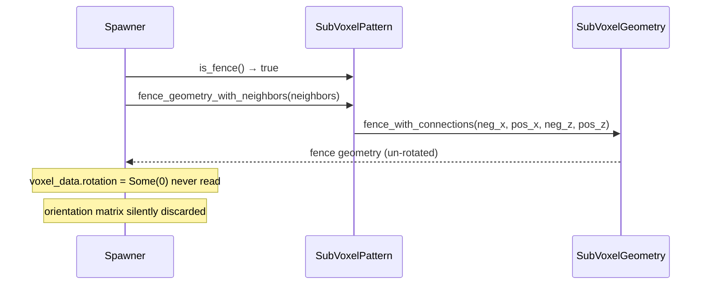
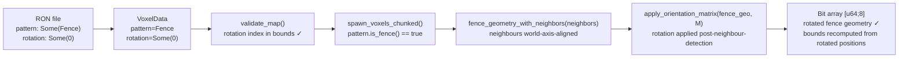
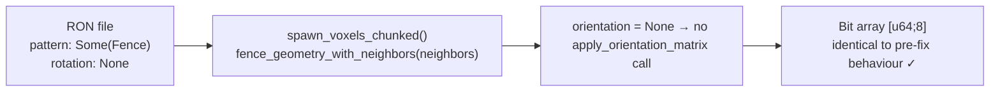
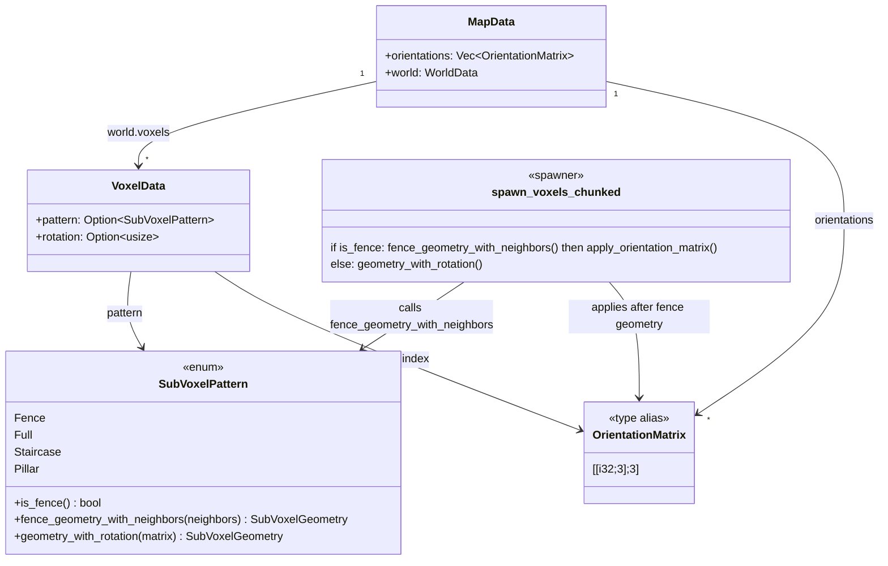

# Fence Rotation Ignored — Architecture Reference

**Date:** 2026-03-26  
**Repo:** `adrakestory`  
**Runtime:** Rust / Bevy ECS  
**Purpose:** Document the current fence spawning architecture that silently ignores `rotation`, and define the target architecture that fixes it by applying the orientation matrix to fence geometry after neighbour detection.

---

## Changelog

| Version | Date | Author | Summary |
|---------|------|--------|---------|
| v1 | 2026-03-26 | Investigation | Initial draft — current architecture, bug mechanism, Option A and Option B target architectures |
| **v2** | **2026-03-26** | **Investigation** | **Collapsed to single fix: apply orientation matrix after neighbour detection. Option A (warn-only) removed.** |

---

## Table of Contents

1. [Current Architecture](#1-current-architecture)
   - [Module Structure](#11-module-structure)
   - [Data Flow — Fence at Map Load](#12-data-flow--fence-at-map-load)
   - [The Fence Branch in the Spawner](#13-the-fence-branch-in-the-spawner)
   - [The Bug — rotation Never Consulted for Fences](#14-the-bug--rotation-never-consulted-for-fences)
2. [Target Architecture](#2-target-architecture)
   - [Design Principles](#21-design-principles)
   - [Spawner Change — Apply Orientation After Neighbour Detection](#22-spawner-change--apply-orientation-after-neighbour-detection)
   - [Collision Bounds and SpatialGrid](#23-collision-bounds-and-spatialgrid)
   - [New and Modified Components](#24-new-and-modified-components)
   - [Data Flow — After Fix](#25-data-flow--after-fix)
   - [Class Diagram](#26-class-diagram)
   - [Sequence Diagram — Happy Path](#27-sequence-diagram--happy-path)
   - [Backward Compatibility](#28-backward-compatibility)
   - [Phase Boundaries](#29-phase-boundaries)
3. [Appendices](#appendix-a--key-file-locations)
   - [Appendix A — Key File Locations](#appendix-a--key-file-locations)
   - [Appendix B — Concrete Rotation Examples](#appendix-b--concrete-rotation-examples)
   - [Appendix C — Open Questions & Decisions](#appendix-c--open-questions--decisions)

---

## 1. Current Architecture

### 1.1 Module Structure



### 1.2 Data Flow — Fence at Map Load



The `rotation` field passes validation (it is a valid index) but is silently discarded at spawn time.

### 1.3 The Fence Branch in the Spawner

**File:** `src/systems/game/map/spawner/chunks.rs:104–115`

```rust
let geometry = if pattern.is_fence() {
    let neighbors = (
        fence_positions.contains(&(x - 1, y, z)), // neg_x
        fence_positions.contains(&(x + 1, y, z)), // pos_x
        fence_positions.contains(&(x, y, z - 1)), // neg_z
        fence_positions.contains(&(x, y, z + 1)), // pos_z
    );
    pattern.fence_geometry_with_neighbors(neighbors)   // ← rotation never consulted
} else {
    let orientation = voxel_data.rotation.and_then(|i| map.orientations.get(i));
    pattern.geometry_with_rotation(orientation)         // ← only non-fence path reads rotation
};
```

`fence_geometry_with_neighbors()` calls `SubVoxelGeometry::fence_with_connections()`
directly and does not accept an orientation parameter:

**File:** `src/systems/game/map/format/patterns.rs:106–114`

```rust
pub fn fence_geometry_with_neighbors(
    &self,
    neighbors: (bool, bool, bool, bool),
) -> SubVoxelGeometry {
    if !self.is_fence() {
        return self.geometry();
    }
    SubVoxelGeometry::fence_with_connections(neighbors.0, neighbors.1, neighbors.2, neighbors.3)
}
```

### 1.4 The Bug — rotation Never Consulted for Fences



The fence spawning path was written before the orientation matrix system existed.
When Fix 1 (`map-format-multi-axis-rotation`) introduced `geometry_with_rotation()`,
only the non-fence `else` branch was updated.

---

## 2. Target Architecture

### 2.1 Design Principles

1. **Rotation is fully supported for fences** — the orientation matrix is applied
   to the fence geometry after neighbour-aware generation.
2. **Neighbour detection is world-axis-aligned** — the four neighbour positions
   queried by the spawner (`x±1`, `z±1`) remain fixed in world space, regardless
   of the fence voxel's rotation matrix (FR-2.2.1).
3. **Collision bounds reflect rotated geometry** — `SubVoxel.bounds` are derived
   from the rotated geometry; the `SpatialGrid` receives the rotated AABB. No
   change to the sub-voxel bounds loop is needed — providing rotated geometry to
   the `geometry` variable is sufficient.
4. **Minimal diff** — only the fence branch in `chunks.rs` changes. All helpers
   (`apply_orientation_matrix`, `fence_geometry_with_neighbors`,
   `fence_with_connections`) are reused without modification.

### 2.2 Spawner Change — Apply Orientation After Neighbour Detection

The fence branch in `chunks.rs:104–115` becomes:

```rust
let geometry = if pattern.is_fence() {
    let neighbors = (
        fence_positions.contains(&(x - 1, y, z)),
        fence_positions.contains(&(x + 1, y, z)),
        fence_positions.contains(&(x, y, z - 1)),
        fence_positions.contains(&(x, y, z + 1)),
    );
    let fence_geo = pattern.fence_geometry_with_neighbors(neighbors);
    // Apply orientation matrix after neighbour-aware generation
    let orientation = voxel_data.rotation.and_then(|i| map.orientations.get(i));
    if let Some(matrix) = orientation {
        apply_orientation_matrix(fence_geo, matrix)
    } else {
        fence_geo
    }
} else {
    let orientation = voxel_data.rotation.and_then(|i| map.orientations.get(i));
    pattern.geometry_with_rotation(orientation)
};
```

The non-fence `else` branch is unchanged.

### 2.3 Collision Bounds and SpatialGrid

`SubVoxel.bounds` is pre-computed at spawn time from the geometry in the existing
sub-voxel loop (`geometry.occupied_positions()`). Because the `geometry` variable
now carries rotated positions when `rotation != None`, the bounds computed in that
loop automatically reflect the rotation — **no change to the sub-voxel loop is
required**.

`SpatialGrid` requires no structural changes; the rotated AABB is inserted using
the existing API.

### 2.4 New and Modified Components

**Modified:**

| Component | File | Change |
|-----------|------|--------|
| `spawn_voxels_chunked()` fence branch | `src/systems/game/map/spawner/chunks.rs:104–115` | Call `apply_orientation_matrix()` on fence geometry when `rotation != None` |
| `docs/api/map-format-spec.md` | `docs/api/map-format-spec.md` | Document rotation support for `Fence`; describe post-neighbour-detection application |

**Not changed:**

- `SubVoxelPattern::fence_geometry_with_neighbors()` — unchanged; orientation applied after in the spawner.
- `SubVoxelGeometry::fence_with_connections()` — unchanged.
- `apply_orientation_matrix()` — reused without modification.
- `SpatialGrid` — no structural changes.
- `validate_map()` — no changes needed.

### 2.5 Data Flow — After Fix



For a fence with `rotation: None`:



### 2.6 Class Diagram



### 2.7 Sequence Diagram — Happy Path

Loading a fence voxel with a Y+90° orientation matrix:

```mermaid
sequenceDiagram
    participant Loader
    participant Spawner
    participant SubVoxelPattern
    participant SVG as SubVoxelGeometry
    participant Rotation as apply_orientation_matrix()

    Loader->>Loader: parse RON → pattern=Fence, rotation=Some(0), orientations[0]=M_y90
    Loader->>Loader: validate_map() — index in bounds ✓
    Loader->>Spawner: LoadedMapData { map }
    Spawner->>SubVoxelPattern: is_fence() → true
    Spawner->>SubVoxelPattern: fence_geometry_with_neighbors((true, false, false, false))
    SubVoxelPattern->>SVG: fence_with_connections(true, false, false, false)
    SVG-->>Spawner: un-rotated fence geometry [u64;8]
    Spawner->>Rotation: apply_orientation_matrix(fence_geo, M_y90)
    Rotation-->>Spawner: rotated fence geometry [u64;8]
    Spawner->>Spawner: iterate occupied_positions() → bounds from rotated positions
    Note over Spawner: SpatialGrid receives rotated AABB ✓
```

### 2.8 Backward Compatibility

| Scenario | Before fix | After fix | Result |
|----------|-----------|-----------|--------|
| `Fence, rotation: None` | Un-rotated neighbour-connected geometry | Identical — `orientation = None` branch skips `apply_orientation_matrix` | Identical ✓ |
| `Fence, rotation: Some(i)` | Rotation silently ignored; un-rotated geometry | Orientation matrix applied; rotated geometry | Visually different — intentional correction ✓ |

> The `rotation: Some(i)` case is a visual breaking change for any existing fence
> voxel carrying a non-`None` rotation. Such voxels were previously silent no-ops;
> after the fix they produce rotated geometry. This is the intended correction.

### 2.9 Phase Boundaries

| Capability | Phase | Notes |
|------------|-------|-------|
| Spawner applies orientation to fence geometry after neighbour detection | Phase 1 | Core fix |
| Collision bounds reflect rotated fence geometry (via existing sub-voxel loop) | Phase 1 | No extra code needed |
| `SpatialGrid` receives rotated AABB | Phase 1 | No structural change to `SpatialGrid` |
| `docs/api/map-format-spec.md` updated to document rotation support | Phase 1 | Required |
| Unit tests for rotated geometry and `rotation: None` backward compat | Phase 1 | Required |

---

## Appendix A — Key File Locations

| Component | Path |
|-----------|------|
| Fence branch (bug location) | `src/systems/game/map/spawner/chunks.rs:104–115` |
| `SubVoxelPattern::is_fence()` | `src/systems/game/map/format/patterns.rs:97–100` |
| `SubVoxelPattern::fence_geometry_with_neighbors()` | `src/systems/game/map/format/patterns.rs:106–114` |
| `SubVoxelPattern::geometry_with_rotation()` | `src/systems/game/map/format/patterns.rs:124–135` |
| `apply_orientation_matrix()` | `src/systems/game/map/format/rotation.rs` |
| `validate_map()` | `src/systems/game/map/validation.rs` |
| Loader pipeline | `src/systems/game/map/loader.rs` |
| `MapData` | `src/systems/game/map/format/mod.rs` |
| `VoxelData` | `src/systems/game/map/format/world.rs` |
| Map format spec | `docs/api/map-format-spec.md` |

---

## Appendix B — Concrete Rotation Examples

### B.1 Fence with Y+90° rotation

Input: `pattern: Some(Fence), rotation: Some(0)`, `orientations[0]` = Y+90° = `[[0,0,1],[0,1,0],[-1,0,0]]`

Neighbours: `(neg_x=true, pos_x=false, neg_z=false, pos_z=false)` — post + one rail in the -X direction.

| Step | Result |
|------|--------|
| `fence_with_connections(true, false, false, false)` | Post + rail towards -X |
| `apply_orientation_matrix(geo, M_y90)` | Post + rail towards -Z (rail rotated 90° around Y) |

The post geometry (symmetric around Y) is unchanged visually; the rail direction rotates.

### B.2 Fence with no rotation (backward-compat case)

Input: `rotation: None`.

| Step | Result |
|------|--------|
| `fence_with_connections(...)` | Normal neighbour-connected fence |
| No `apply_orientation_matrix` call | Identical to pre-fix output ✓ |

---

## Appendix C — Open Questions & Decisions

### Resolved

| # | Question | Resolution |
|---|----------|------------|
| 1 | Should neighbour detection axes rotate with the fence geometry? | **No — world-axis-aligned** (FR-2.2.1). Rotation affects fence geometry only; connectivity queries remain in world space. |
| 2 | Does the sub-voxel bounds loop in the spawner need modification? | **No.** The existing loop computes bounds from `geometry.occupied_positions()`. Providing rotated geometry to the `geometry` variable is sufficient; the loop is unchanged. |

---

*Created: 2026-03-26*  
*Companion documents: [Requirements](./requirements.md) | [Ticket](../ticket.md) | [Bug](../bug.md)*  
*Source: `docs/investigations/2026-03-22-1427-map-format-analysis.md` — Finding 3*
