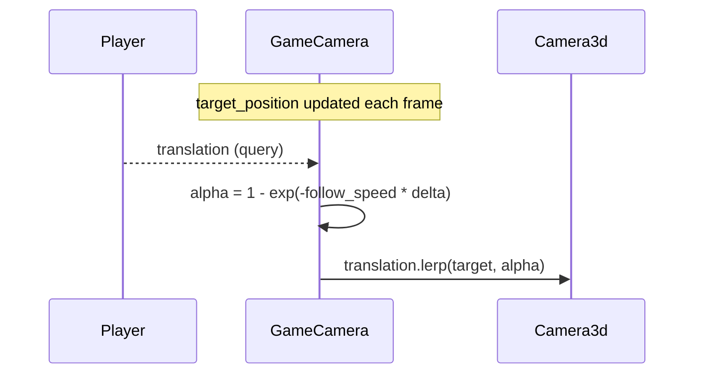

# Architecture — Camera Lerp Frame-Rate Independence Fix

**Version:** 1.0  
**Status:** Ready for implementation  
**Source:** `docs/bugs/fix-camera-lerp-visual-lag/requirements.md`

---

## 1. Problem Statement

Both camera systems in `src/systems/game/camera.rs` apply smooth interpolation using a frame-rate-dependent `t = speed * delta` factor, passed directly to `lerp` / `slerp`. Because `delta` varies with frame rate, the effective convergence time changes:

| fps | delta | t = 5.0 × delta | frames to 99% |
|-----|-------|-----------------|---------------|
| 30  | 0.033 | 0.167           | ~25 frames (~833 ms) |
| 60  | 0.017 | 0.083           | ~50 frames (~833 ms) |
| 120 | 0.008 | 0.042           | ~100 frames (~833 ms) |

> **Note:** The *wall-clock time* to converge is actually the same — the issue is that `t = speed * delta` is only an approximation valid when `t ≪ 1`. At low frame rates (30 fps, t ≈ 0.17) the approximation breaks down and the camera over-interpolates. At any frame rate with `follow_speed = 5.0`, convergence takes ~400–800 ms wall-clock, which feels "floaty".

The correct formulation uses an exponential decay that is exact at any delta size:

```
alpha = 1.0 - exp(-speed * delta)
```

With `follow_speed = 15.0` and the exponential formula:
- At 60 fps: alpha ≈ 0.221 → reaches 99% in ~17 frames (~280 ms)
- Identical convergence at any frame rate

---

## 2. Scope

| File | Change |
|------|--------|
| `src/systems/game/camera.rs` | Replace lerp factor in `follow_player_camera` and slerp factor in `rotate_camera` |
| `src/systems/game/map/spawner/mod.rs` | Change `follow_speed` spawn default from `5.0` to `15.0` |
| `src/systems/game/tests/camera_tests.rs` | New file — unit tests for the exponential decay formula |

---

## 3. Current Architecture

```
follow_player_camera()
  ├─ game_camera.target_position = player_position
  ├─ rotated_offset = camera_rotation * follow_offset
  ├─ target_pos = player_pos + rotated_offset
  └─ camera.translation = lerp(target_pos, follow_speed * delta)   ← frame-rate-dependent

rotate_camera()
  ├─ target_rotation = original_rotation (or +90° if Delete held)
  └─ new_rotation = slerp(target_rotation, rotation_speed * delta) ← frame-rate-dependent
```

---

## 4. Target Architecture

```
follow_player_camera()
  ├─ game_camera.target_position = player_position
  ├─ rotated_offset = camera_rotation * follow_offset
  ├─ target_pos = player_pos + rotated_offset
  ├─ alpha = 1.0 - (-follow_speed * delta).exp()                   ← frame-rate-independent
  └─ camera.translation = lerp(target_pos, alpha)

rotate_camera()
  ├─ target_rotation = original_rotation (or +90° if Delete held)
  ├─ alpha = 1.0 - (-rotation_speed * delta).exp()                 ← frame-rate-independent
  └─ new_rotation = slerp(target_rotation, alpha)
```

---

## 5. Sequence Diagram — Follow System (unchanged data flow)



---

## 6. Mathematical Justification

Standard `lerp(a, b, t)` with `t = k * dt` is a discrete first-order IIR filter:

```
x[n+1] = (1 - k*dt) * x[n] + k*dt * target
```

This is only exact in the limit `dt → 0`. For finite `dt`, the correct discrete-time equivalent of the continuous-time ODE `dx/dt = -k*(x - target)` is:

```
x[n+1] = x[n] + (target - x[n]) * (1 - exp(-k * dt))
```

Setting `alpha = 1 - exp(-k * dt)` substitutes exactly into `lerp(target, alpha)` and gives the same result at 30, 60, and 120 fps.

---

## 7. Appendix A — No-Change Surface

These aspects of the camera system are **not modified**:

- `GameCamera` component fields (no additions, no removals)
- The Delete-key offset rotation logic (`from_rotation_y(FRAC_PI_2)`)
- The `InputSource::KeyboardMouse` guard in `rotate_camera`
- The pivot-around-player offset math in `rotate_camera`
- `follow_offset`, `original_rotation`, `target_rotation` semantics

---

## Appendix B — Test Scenarios

| Test | Description |
|------|-------------|
| `exponential_alpha_is_frame_rate_independent` | At 30, 60, 120 fps, the wall-clock convergence time must be equal (within tolerance) using the exponential formula |
| `exponential_alpha_approaches_1_at_large_delta` | For very large `delta` (e.g. 10 s), alpha must be close to `1.0` but never exceed it |
| `exponential_alpha_approaches_0_at_tiny_delta` | For tiny `delta` (e.g. 0.0001 s), alpha must approach `0.0` |
| `linear_approximation_differs_at_low_fps` | Confirm the old formula `speed * delta` diverges from exponential at 30 fps |

---

## Appendix C — Code Templates

### C.1 — `follow_player_camera` (camera.rs, line ~43)

```rust
// Before
camera_transform.translation = camera_transform.translation.lerp(
    target_position,
    game_camera.follow_speed * time.delta_secs(),
);

// After
let alpha = 1.0 - (-game_camera.follow_speed * time.delta_secs()).exp();
camera_transform.translation = camera_transform.translation.lerp(target_position, alpha);
```

### C.2 — `rotate_camera` (camera.rs, line ~83)

```rust
// Before
let new_rotation = transform.rotation.slerp(
    game_camera.target_rotation,
    game_camera.rotation_speed * delta,
);

// After
let alpha = 1.0 - (-game_camera.rotation_speed * delta).exp();
let new_rotation = transform.rotation.slerp(game_camera.target_rotation, alpha);
```

### C.3 — Spawn default (spawner/mod.rs, line ~484)

```rust
// Before
follow_speed: 5.0,              // Medium responsiveness

// After
follow_speed: 15.0,             // Responsive third-person follow
```

---

*Created: 2026-03-15*  
*Companion: [Requirements](./requirements.md)*
