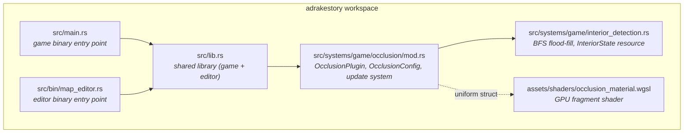
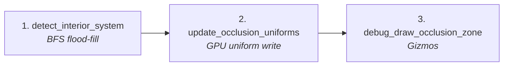
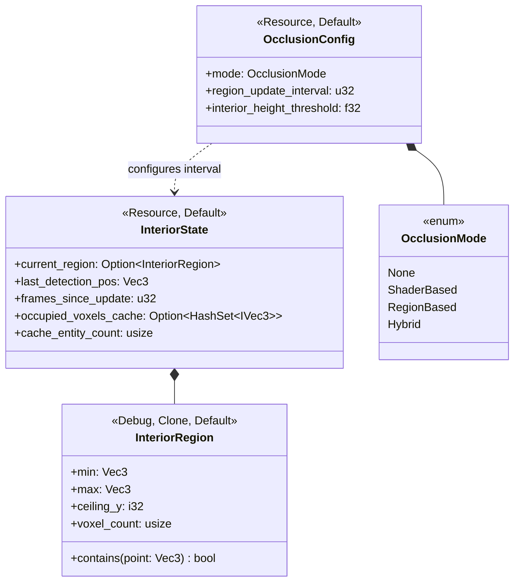
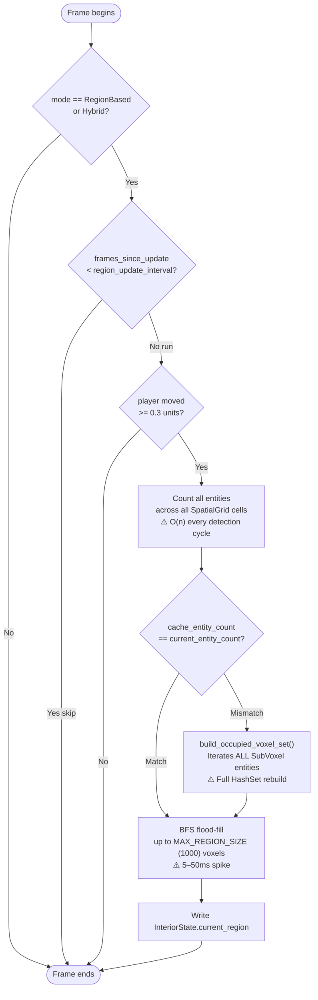
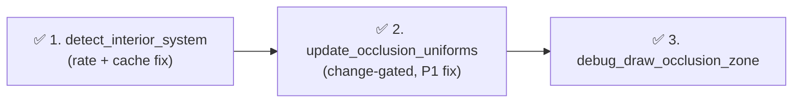
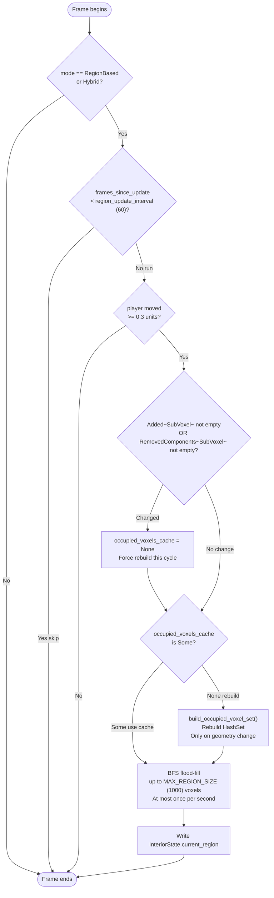
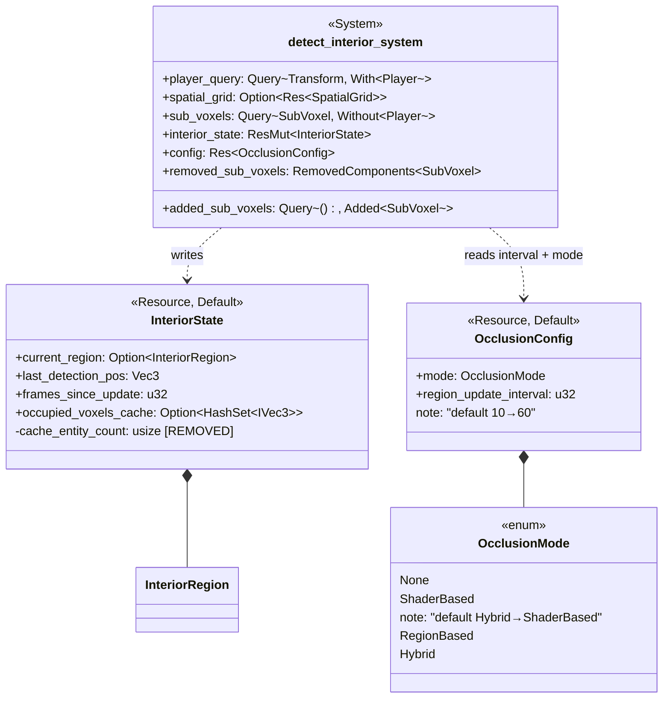
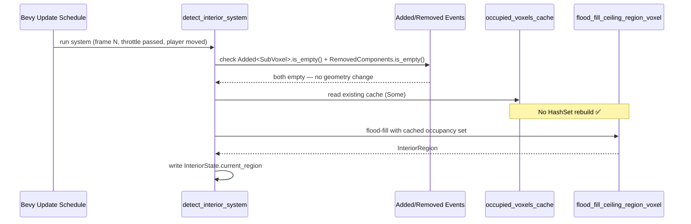
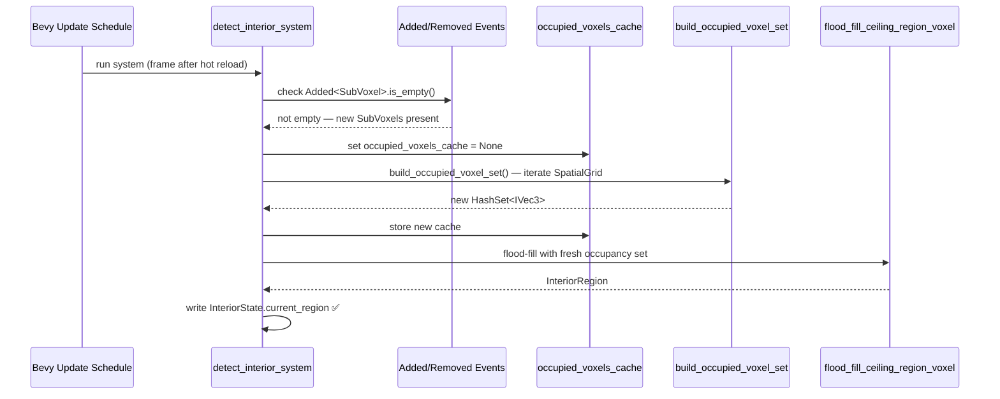

# Interior Detection System — Architecture Reference

**Date:** 2026-03-15  
**Repo:** `adrakestory` (local)  
**Runtime:** Bevy ECS (Rust), `detect_interior_system` + BFS flood-fill  
**Purpose:** Document the current interior detection architecture and define the target architecture for the fix: *Interior Detection BFS Flood-Fill Creates Periodic Frame Spikes* (P2 bug).

---

## Changelog

| Version | Date | Author | Summary |
|---------|------|--------|---------|
| **v1** | **2026-03-15** | **Copilot** | **Initial draft — current architecture analysis and target design for event-based cache invalidation + rate/default fix** |

---

## Table of Contents

1. [Current Architecture](#1-current-architecture)
   - [Solution Structure](#11-solution-structure)
   - [Occlusion Pipeline Overview](#12-occlusion-pipeline-overview)
   - [Pipeline Steps — Detail](#13-pipeline-steps--detail)
   - [Key Types](#14-key-types)
   - [Data Flow — Per-Detection Cycle](#15-data-flow--per-detection-cycle)
2. [Target Architecture — Frame Spike Fix](#2-target-architecture--frame-spike-fix)
   - [Design Principles](#21-design-principles)
   - [New Components](#22-new-components)
   - [Modified Components](#23-modified-components)
   - [Pipeline Flow](#24-pipeline-flow)
   - [Internal Flow — After Fix](#25-internal-flow--after-fix)
   - [Class Diagram](#26-class-diagram)
   - [Sequence Diagram — Static Frame (No Change)](#27-sequence-diagram--static-frame-no-change)
   - [Sequence Diagram — Map Change (Hot Reload)](#28-sequence-diagram--map-change-hot-reload)
   - [Phase Boundaries](#29-phase-boundaries)
3. [Appendices](#appendix-a--interiorstate-schema)
   - [Appendix A — `InteriorState` Schema](#appendix-a--interiorstate-schema)
   - [Appendix B — Open Questions & Decisions](#appendix-b--open-questions--decisions)
   - [Appendix C — Key File Locations](#appendix-c--key-file-locations)
   - [Appendix D — Code Template: Fixed System](#appendix-d--code-template-fixed-system)

---

## 1. Current Architecture

### 1.1 Solution Structure



The map editor does **not** use `OcclusionMaterial` or `detect_interior_system` — this system is game-binary-only.

### 1.2 Occlusion Pipeline Overview

Each frame, in the `Update` schedule, inside `OcclusionPlugin`:



These systems run chained inside `OcclusionPlugin` outside the `GameSystemSet` ordering.

### 1.3 Pipeline Steps — Detail

| # | Step | Function | Purpose |
|---|------|----------|---------|
| 1 | **Interior Detection** | `detect_interior_system` | Throttled BFS: casts ray upward, flood-fills to find ceiling region, writes `InteriorState` |
| 2 | **Uniform Update** | `update_occlusion_uniforms` | Reads player/camera transforms + `InteriorState`; writes `OcclusionUniforms` to GPU material asset (now change-gated after P1 fix) |
| 3 | **Debug Draw** | `debug_draw_occlusion_zone` | Draws gizmo overlays when F3 is active |

### 1.4 Key Types



`OcclusionMode::Hybrid` (current default) routes every frame through `detect_interior_system`.

### 1.5 Data Flow — Per-Detection Cycle

The problematic flow. Two expensive operations compound:



At 60 fps with `region_update_interval = 10`, this executes **6 times per second**. The BFS alone takes 5–50 ms per run depending on map complexity, producing visible stutter every ~167 ms.

---

## 2. Target Architecture — Frame Spike Fix

### 2.1 Design Principles

1. **Reduce BFS frequency by 6×** — raise `region_update_interval` default from `10` to `60`. At 60 fps this means one BFS per second maximum, well below perceptible stutter threshold (NFR-3.1).

2. **Eliminate the common-case BFS path** — change default `OcclusionMode` from `Hybrid` to `ShaderBased`. Most gameplay uses the GPU shader path; region-based detection is an opt-in feature for maps that explicitly need it (FR-2.2.1, NFR-3.4).

3. **Gate cache rebuilds on actual geometry changes** — replace entity-count comparison (O(n) every detection cycle) with Bevy's built-in `Added<SubVoxel>` query filter and `RemovedComponents<SubVoxel>` system parameter. Cache is rebuilt only when geometry truly changed (FR-2.3.1–FR-2.3.5, NFR-3.2).

4. **No per-frame heap allocations** — change-detection check via query filter and removed-components iterator is allocation-free; the `HashSet` rebuild only occurs on actual geometry changes (NFR-3.3).

5. **Preserve all detection logic unchanged** — `flood_fill_ceiling_region_voxel`, `find_ceiling_voxel_above`, hysteresis, and the movement gate are not modified (FR-2.4.1–FR-2.4.4).

6. **GPU surface unchanged** — `OcclusionUniforms`, its binding, and the WGSL shader are not touched (consistent with P1 fix boundary).

### 2.2 New Components

No new types or files are introduced. All changes are to existing structs and function signatures.

### 2.3 Modified Components

| Component | Change |
|-----------|--------|
| `OcclusionConfig` (in `occlusion/mod.rs`) | (1) `region_update_interval` default: `10` → `60`. (2) `mode` default: `OcclusionMode::Hybrid` → `OcclusionMode::ShaderBased`. |
| `InteriorState` (in `interior_detection.rs`) | Remove `cache_entity_count: usize` field. This field is no longer used; Bevy change-detection replaces it. |
| `detect_interior_system` (in `interior_detection.rs`) | (1) Add `added_sub_voxels: Query<(), Added<SubVoxel>>` parameter. (2) Add `mut removed_sub_voxels: RemovedComponents<SubVoxel>` parameter. (3) Replace entity-count comparison with `!added_sub_voxels.is_empty() \|\| !removed_sub_voxels.is_empty()` to decide whether to rebuild the cache. (4) Remove the `current_entity_count` local variable and `cache_entity_count` write. |

### 2.4 Pipeline Flow

The chained system order inside `OcclusionPlugin` is unchanged:



No systems are added or removed. All changes are internal to `detect_interior_system` and the default values in `OcclusionConfig`.

### 2.5 Internal Flow — After Fix



Key differences from current flow:
- O(n) entity-count scan is eliminated — replaced by O(1) Bevy event checks
- Cache rebuild only occurs when events are present (geometry change), not every detection cycle
- BFS still runs once per detection cycle when player moves, but detection is now ~1×/sec not 6×/sec

### 2.6 Class Diagram



### 2.7 Sequence Diagram — Static Frame (No Change)

Player has moved, but no `SubVoxel` entities were added or removed since last detection.



### 2.8 Sequence Diagram — Map Change (Hot Reload)

`SubVoxel` entities were despawned and respawned during hot reload.



### 2.9 Phase Boundaries

| Capability | Phase | Architectural Impact |
|------------|-------|---------------------|
| `region_update_interval` default `10` → `60` | Phase 1 | Config default change — no API change |
| Default `OcclusionMode` `Hybrid` → `ShaderBased` | Phase 1 | Config default change — no API change; `Hybrid` remains available |
| Remove `InteriorState.cache_entity_count` | Phase 1 | Field removal — `InteriorState` is a non-public resource; no external API impact |
| `Added<SubVoxel>` + `RemovedComponents<SubVoxel>` in system params | Phase 1 | Two new system parameters; Bevy injects automatically |
| Remove entity-count O(n) scan from `detect_interior_system` | Phase 1 | Behaviour-equivalent replacement; only cache invalidation trigger changes |

**Phase 1 boundary (all delivered together):**

- ✅ `region_update_interval` default raised to `60`
- ✅ `OcclusionMode` default changed to `ShaderBased`
- ✅ `cache_entity_count` removed from `InteriorState`
- ✅ `detect_interior_system` uses `Added<SubVoxel>` + `RemovedComponents<SubVoxel>` for cache invalidation
- ✅ All BFS and flood-fill logic unchanged
- ✅ All existing unit tests pass

---

## Appendix A — `InteriorState` Schema

Fields before and after fix:

| Field | Type | Before | After | Notes |
|-------|------|--------|-------|-------|
| `current_region` | `Option<InteriorRegion>` | ✅ unchanged | ✅ unchanged | |
| `last_detection_pos` | `Vec3` | ✅ unchanged | ✅ unchanged | |
| `frames_since_update` | `u32` | ✅ unchanged | ✅ unchanged | |
| `occupied_voxels_cache` | `Option<HashSet<IVec3>>` | ✅ unchanged | ✅ unchanged | `None` = needs rebuild |
| `cache_entity_count` | `usize` | present | **removed** | Replaced by Bevy events |

`InteriorRegion` fields are unchanged:

| Field | Type | Purpose |
|-------|------|---------|
| `min` | `Vec3` | AABB minimum (world coords) |
| `max` | `Vec3` | AABB maximum (world coords) |
| `ceiling_y` | `i32` | Y coordinate of detected ceiling |
| `voxel_count` | `usize` | Number of voxels in detected region |

---

## Appendix B — Open Questions & Decisions

### Resolved

| # | Question | Resolution |
|---|----------|------------|
| 1 | Should `region_update_interval` and `OcclusionMode` defaults be changed in the same PR as the cache invalidation fix? | **Yes — deliver all three together.** They address the same symptom and the combined change is small. Splitting would leave partial improvements in separate commits. |
| 2 | Can `RemovedComponents<SubVoxel>` be safely read by only `detect_interior_system`? | **Yes.** Full codebase search finds no other system reading `RemovedComponents<SubVoxel>`. If a second consumer is added later, migrate to a shared `bool` resource flag. |
| 3 | Should `Added<SubVoxel>` be used as a query filter or via a separate query? | **Query filter** on an empty `Query<(), Added<SubVoxel>>`. Calling `.is_empty()` is O(1) and does not require iterating entities. |

### Open

No open questions remain.

### Resolved (continued)

| # | Question | Resolution |
|---|----------|------------|
| 4 | Should `interior_height_threshold` default (8.0) be reviewed as part of this fix? | **Deferred.** Cosmetic tuning only, no performance impact. Addressed in a separate pass. |

---

## Appendix C — Key File Locations

| Component | Path |
|-----------|------|
| `detect_interior_system` | `src/systems/game/interior_detection.rs:71` |
| `InteriorState` | `src/systems/game/interior_detection.rs:54` |
| `InteriorRegion` | `src/systems/game/interior_detection.rs:31` |
| `build_occupied_voxel_set` | `src/systems/game/interior_detection.rs:194` |
| `flood_fill_ceiling_region_voxel` | `src/systems/game/interior_detection.rs:244` |
| `find_ceiling_voxel_above` | `src/systems/game/interior_detection.rs:216` |
| `OcclusionConfig` | `src/systems/game/occlusion/mod.rs:162` |
| `OcclusionMode` | `src/systems/game/occlusion/mod.rs:52` |
| `OcclusionPlugin` | `src/systems/game/occlusion/mod.rs:505` |

---

## Appendix D — Code Template: Fixed System

### `OcclusionConfig` default changes (`occlusion/mod.rs`)

```rust
impl Default for OcclusionConfig {
    fn default() -> Self {
        OcclusionConfig {
            enabled: true,
            mode: OcclusionMode::ShaderBased,   // 🔧 was: Hybrid
            // ...
            region_update_interval: 60,          // 🔧 was: 10
        }
    }
}
```

### `InteriorState` field removal (`interior_detection.rs`)

```rust
#[derive(Resource, Default)]
pub struct InteriorState {
    pub current_region: Option<InteriorRegion>,
    pub last_detection_pos: Vec3,
    pub frames_since_update: u32,
    pub occupied_voxels_cache: Option<HashSet<IVec3>>,
    // 🗑️ cache_entity_count: usize  — REMOVED
}
```

### `detect_interior_system` signature change

```rust
pub fn detect_interior_system(
    player_query: Query<&Transform, With<Player>>,
    spatial_grid: Option<Res<SpatialGrid>>,
    sub_voxels: Query<&SubVoxel, Without<Player>>,
    mut interior_state: ResMut<InteriorState>,
    config: Res<OcclusionConfig>,
    added_sub_voxels: Query<(), Added<SubVoxel>>,        // 🆕 new parameter
    mut removed_sub_voxels: RemovedComponents<SubVoxel>, // 🆕 new parameter
) {
```

### Cache invalidation replacement

```rust
// 🗑️ REMOVED — entity-count scan:
// let current_entity_count = spatial_grid.cells.values().map(|v| v.len()).sum();
// if occupied_voxels_cache.is_some() && cache_entity_count == current_entity_count { ... }

// 🆕 NEW — event-based invalidation:
let map_changed = !added_sub_voxels.is_empty() || !removed_sub_voxels.is_empty();
if map_changed {
    interior_state.occupied_voxels_cache = None;
}

let occupied_voxels = if let Some(ref cache) = interior_state.occupied_voxels_cache {
    cache
} else {
    let new_cache = build_occupied_voxel_set(&spatial_grid, &sub_voxels);
    interior_state.occupied_voxels_cache = Some(new_cache);
    interior_state.occupied_voxels_cache.as_ref().unwrap()
};
```

---

*Created: 2026-03-15 — See [Changelog](#changelog) for version history.*  
*Based on: `src/systems/game/interior_detection.rs`, bug report `2026-03-15-2141-p2-interior-detection-frame-spikes.md`*  
*Companion documents: [Requirements](./requirements.md)*
