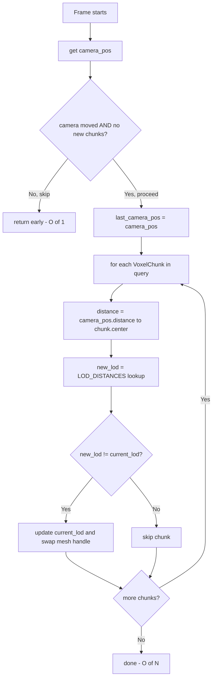

# Architecture — LOD Chunk Iteration Throttle

**Version:** 1.0  
**Status:** Ready for implementation  
**Source:** `docs/bugs/fix-lod-chunk-iteration/requirements.md`

---

## 1. Problem Statement

`update_chunk_lods()` iterates the full `Query<(&VoxelChunk, &mut ChunkLOD, &mut Mesh3d)>` every frame. On a large map with N chunks, every frame pays O(N) `distance()` calls even when the camera is completely stationary. LOD transitions span 50–200 world units, so a per-frame computation cadence is orders of magnitude higher than necessary.

---

## 2. Scope

| File | Phase | Change |
|------|-------|--------|
| `src/systems/game/map/spawner/mod.rs` | 1 | Add `LOD_MOVEMENT_THRESHOLD` constant; add `Local<Vec3>` param + distance guard to `update_chunk_lods` |
| `src/systems/game/map/spawner/mod.rs` | 2 | Add `Added<VoxelChunk>` query param; bypass distance guard when new chunks are present |
| `src/systems/game/map/spawner/mod.rs` | 3 | Add `LodConfig` resource; replace compile-time constant with configurable runtime field |
| `src/systems/game/map/spawner/mod.rs` (tests) | 1–3 | Unit tests for threshold guard, new-chunk bypass, and config default |

---

## 3. Current Architecture

```
update_chunk_lods() — runs every frame
  ├─ get camera position (O(1))
  └─ for every VoxelChunk (O(N)):
       ├─ distance = camera_pos.distance(chunk.center)
       ├─ new_lod = LOD_DISTANCES.iter().position(...)
       └─ if new_lod != current_lod → swap mesh handle
```

**Problem**: The O(N) loop runs regardless of whether the camera moved.

---

## 4. Target Architecture — Phase 1 (Distance Guard)

```
update_chunk_lods() — runs every frame
  ├─ get camera position (O(1))
  ├─ if distance(camera_pos, last_camera_pos) < LOD_MOVEMENT_THRESHOLD → return early (O(1))
  ├─ last_camera_pos = camera_pos
  └─ for every VoxelChunk (O(N)):   ← only when camera moved
       ├─ distance = camera_pos.distance(chunk.center)
       ├─ new_lod = LOD_DISTANCES.iter().position(...)
       └─ if new_lod != current_lod → swap mesh handle
```

**Result**: Stationary camera → O(1) per frame. Moving camera → O(N) same as before.

---

## 4b. Target Architecture — Phase 2 (New-Chunk Bypass)

Newly spawned chunks (e.g. after hot-reload) must receive their correct LOD immediately, even when the camera hasn't moved since spawn. Phase 2 adds an `Added<VoxelChunk>` query that bypasses the distance guard when new chunks are present:

```
update_chunk_lods()
  ├─ get camera position (O(1))
  ├─ new_chunks_present = !new_chunks_query.is_empty()
  ├─ if distance(camera_pos, last_camera_pos) < LOD_MOVEMENT_THRESHOLD
  │      AND !new_chunks_present → return early (O(1))
  ├─ last_camera_pos = camera_pos
  └─ for every VoxelChunk (O(N)):
       └─ ... existing LOD swap logic ...
```

`Added<VoxelChunk>` is a Bevy query filter that is `true` only on the frame the component was added — O(1) check with no allocation.

---

## 4c. Target Architecture — Phase 3 (Configurable Threshold)

Phase 3 replaces the compile-time `LOD_MOVEMENT_THRESHOLD` constant with a field on a new `LodConfig` resource, enabling runtime tuning without recompilation:

```rust
#[derive(Resource)]
pub struct LodConfig {
    /// Minimum camera movement (world units) to trigger LOD recalculation.
    pub movement_threshold: f32,
}

impl Default for LodConfig {
    fn default() -> Self {
        Self { movement_threshold: 0.5 }
    }
}
```

`update_chunk_lods` gains `lod_config: Res<LodConfig>` and uses `lod_config.movement_threshold` instead of the constant. The constant `LOD_MOVEMENT_THRESHOLD` is retained as the default value source.

---

## 5. Data Flow Diagram



> **Note:** "camera moved" means `distance(camera_pos, last_camera_pos) >= lod_config.movement_threshold`.
> "no new chunks" means `new_chunks.is_empty()` (Phase 2). In Phase 1, only the camera-moved check exists.

---

## 6. Component / Resource Changes

**Phase 1:** No component or resource additions. `Local<Vec3>` is Bevy's built-in per-system state — zero-initialized, stack-allocated, not visible to other systems.

**Phase 3:** Adds one new resource:

```rust
/// Configuration for the LOD update system.
#[derive(Resource)]
pub struct LodConfig {
    pub movement_threshold: f32,
}
```

Registered with `app.init_resource::<LodConfig>()`. No component changes in any phase.

---

## 7. Cold-Start Behaviour

On the first frame, `last_camera_pos = Vec3::ZERO`. The camera is spawned at a map-specific position (never the origin in practice). The distance from origin to the spawn point exceeds `LOD_MOVEMENT_THRESHOLD`, so the full pass runs naturally on frame 1 without any special handling.

---

## 8. Appendix A — No-Change Surface

These are not modified:

- `VoxelChunk` struct and `chunk_pos` / `center` fields
- `ChunkLOD` struct and `lod_meshes` / `current_lod` fields
- `LOD_LEVELS`, `LOD_DISTANCES` constants
- The mesh-swap guard `if new_lod != current_lod`
- System set registration (`GameSystemSet::Visual`)
- `chunks.rs` (mesh build / LOD mesh creation at spawn time)

---

## Appendix B — Test Scenarios

### Phase 1 — Distance guard

| Test | Description |
|------|-------------|
| `lod_threshold_constant_is_well_below_lod_distances` | `LOD_MOVEMENT_THRESHOLD` must be ≪ `LOD_DISTANCES[0]` |
| `lod_threshold_guard_skips_when_camera_stationary` | Zero movement → distance check fails → guard triggers |
| `lod_threshold_guard_runs_when_camera_moves_beyond_threshold` | > 0.5 units movement → guard does not trigger |
| `lod_threshold_exact_boundary_skips` | Exactly `LOD_MOVEMENT_THRESHOLD` distance → strict `<` skips |
| `lod_threshold_cold_start_passes_at_non_origin_position` | `last_pos = ZERO`, camera at spawn position → guard passes |

### Phase 2 — New-chunk bypass

| Test | Description |
|------|-------------|
| `lod_new_chunk_bypasses_distance_guard` | `Added<VoxelChunk>` is non-empty → full pass runs even when camera is stationary |

### Phase 3 — Config resource

| Test | Description |
|------|-------------|
| `lod_config_default_matches_constant` | `LodConfig::default().movement_threshold == LOD_MOVEMENT_THRESHOLD` |

---

## Appendix C — Code Template

### C.1 — New constant (spawner/mod.rs, near line 40)

```rust
/// Minimum camera movement (world units) required to trigger a LOD recalculation.
/// Keeps update_chunk_lods O(1) when the camera is stationary.
pub const LOD_MOVEMENT_THRESHOLD: f32 = 0.5;
```

### C.2 — Updated `update_chunk_lods` — Phase 1 (spawner/mod.rs, line ~339)

```rust
/// System that updates chunk LOD levels based on camera distance.
///
/// Runs each frame but only iterates chunks when the camera has moved more than
/// [`LOD_MOVEMENT_THRESHOLD`] world units since the last pass.
/// This keeps CPU cost O(1) when the camera is stationary.
pub fn update_chunk_lods(
    camera_query: Query<&Transform, With<Camera3d>>,
    mut chunks: Query<(&VoxelChunk, &mut ChunkLOD, &mut Mesh3d)>,
    mut last_camera_pos: Local<Vec3>,
) {
    let Ok(camera_transform) = camera_query.get_single() else {
        return;
    };
    let camera_pos = camera_transform.translation;

    // Skip if the camera hasn't moved enough to change any chunk's LOD level.
    if camera_pos.distance(*last_camera_pos) < LOD_MOVEMENT_THRESHOLD {
        return;
    }
    *last_camera_pos = camera_pos;

    for (chunk, mut lod, mut mesh) in chunks.iter_mut() {
        let distance = camera_pos.distance(chunk.center);

        let new_lod = LOD_DISTANCES
            .iter()
            .position(|&threshold| distance < threshold)
            .unwrap_or(LOD_LEVELS - 1);

        if new_lod != lod.current_lod {
            lod.current_lod = new_lod;
            mesh.0 = lod.lod_meshes[new_lod].clone();
        }
    }
}
```

### C.3 — Updated `update_chunk_lods` — Phase 2 (add new-chunk bypass)

Add `new_chunks: Query<(), Added<VoxelChunk>>` as a parameter. Modify the guard:

```rust
pub fn update_chunk_lods(
    camera_query: Query<&Transform, With<Camera3d>>,
    mut chunks: Query<(&VoxelChunk, &mut ChunkLOD, &mut Mesh3d)>,
    new_chunks: Query<(), Added<VoxelChunk>>,
    mut last_camera_pos: Local<Vec3>,
) {
    let Ok(camera_transform) = camera_query.get_single() else {
        return;
    };
    let camera_pos = camera_transform.translation;

    // Skip only when the camera is stationary AND no new chunks were just spawned.
    let camera_moved = camera_pos.distance(*last_camera_pos) >= LOD_MOVEMENT_THRESHOLD;
    let new_chunks_present = !new_chunks.is_empty();
    if !camera_moved && !new_chunks_present {
        return;
    }
    *last_camera_pos = camera_pos;

    for (chunk, mut lod, mut mesh) in chunks.iter_mut() {
        // ... same LOD swap logic ...
    }
}
```

### C.4 — `LodConfig` resource — Phase 3

```rust
/// Runtime configuration for the LOD update system.
#[derive(Resource)]
pub struct LodConfig {
    /// Minimum camera movement (world units) to trigger a LOD recalculation pass.
    pub movement_threshold: f32,
}

impl Default for LodConfig {
    fn default() -> Self {
        Self { movement_threshold: LOD_MOVEMENT_THRESHOLD }
    }
}
```

Register in `main.rs` alongside other resources:

```rust
app.init_resource::<LodConfig>();
```

In `update_chunk_lods`, replace `LOD_MOVEMENT_THRESHOLD` with `lod_config.movement_threshold` and add `lod_config: Res<LodConfig>` as a parameter.

### C.3 — Unit tests (inline mod tests in spawner/mod.rs)

Tests verify the guard logic using the pure `distance` comparison — no Bevy `World` needed.

```rust
#[test]
fn lod_threshold_constant_is_well_below_lod_distances() {
    // Sanity: threshold must be much smaller than the smallest LOD transition distance.
    assert!(LOD_MOVEMENT_THRESHOLD < LOD_DISTANCES[0] / 10.0);
}

#[test]
fn lod_threshold_guard_skips_when_camera_stationary() {
    let camera_pos = Vec3::new(10.0, 5.0, 20.0);
    let last_pos = camera_pos; // no movement
    assert!(camera_pos.distance(last_pos) < LOD_MOVEMENT_THRESHOLD);
}

#[test]
fn lod_threshold_guard_runs_when_camera_moves_beyond_threshold() {
    let last_pos = Vec3::new(10.0, 5.0, 20.0);
    let camera_pos = last_pos + Vec3::new(1.0, 0.0, 0.0); // 1.0 unit — beyond 0.5
    assert!(camera_pos.distance(last_pos) >= LOD_MOVEMENT_THRESHOLD);
}

#[test]
fn lod_threshold_exact_boundary_skips() {
    let last_pos = Vec3::ZERO;
    let camera_pos = Vec3::new(LOD_MOVEMENT_THRESHOLD, 0.0, 0.0);
    // At exactly threshold distance, guard uses strict < so should skip.
    assert!(!(camera_pos.distance(last_pos) < LOD_MOVEMENT_THRESHOLD));
}

#[test]
fn lod_threshold_cold_start_passes_at_non_origin_position() {
    let last_pos = Vec3::ZERO; // cold-start default
    let camera_pos = Vec3::new(50.0, 10.0, 30.0); // typical spawn position
    assert!(camera_pos.distance(last_pos) >= LOD_MOVEMENT_THRESHOLD);
}
```

---

*Created: 2026-03-16*  
*Companion: [Requirements](./requirements.md)*
