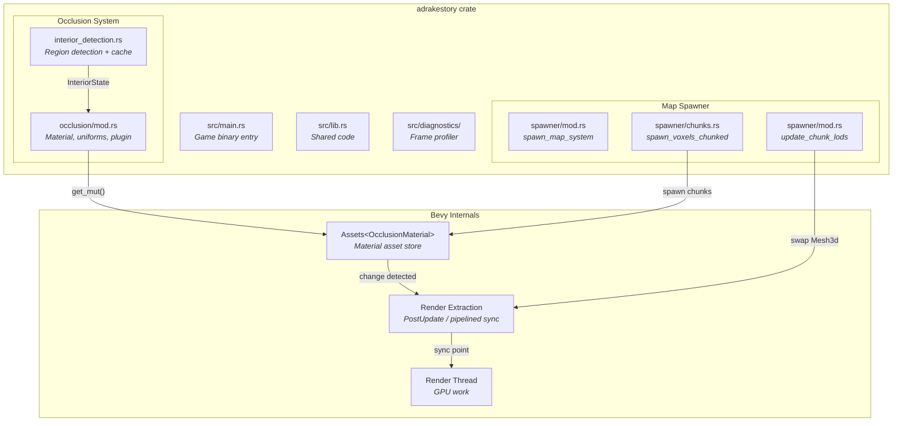
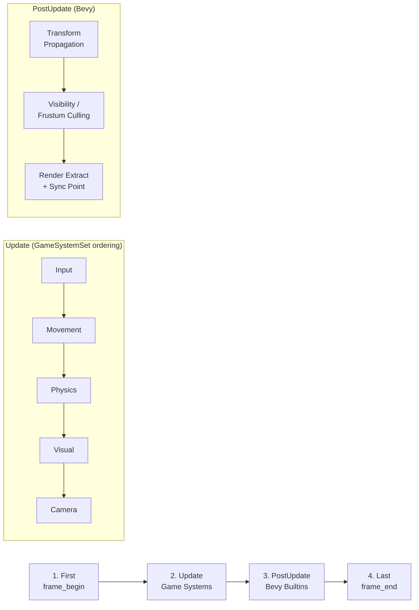
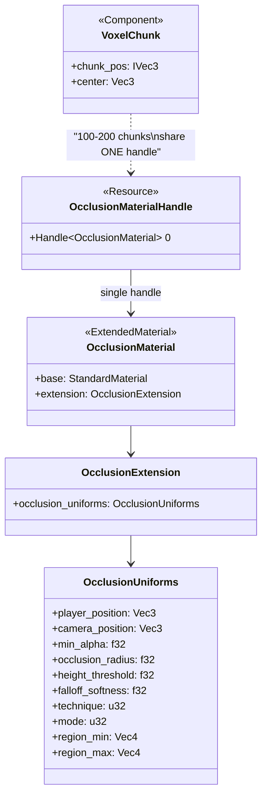
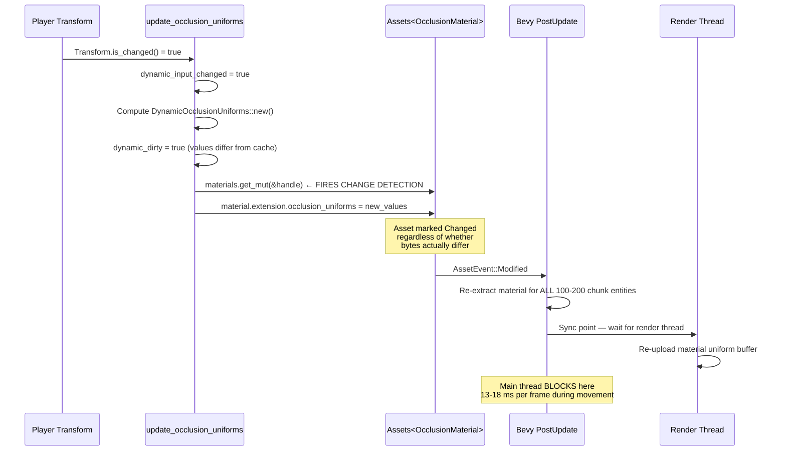
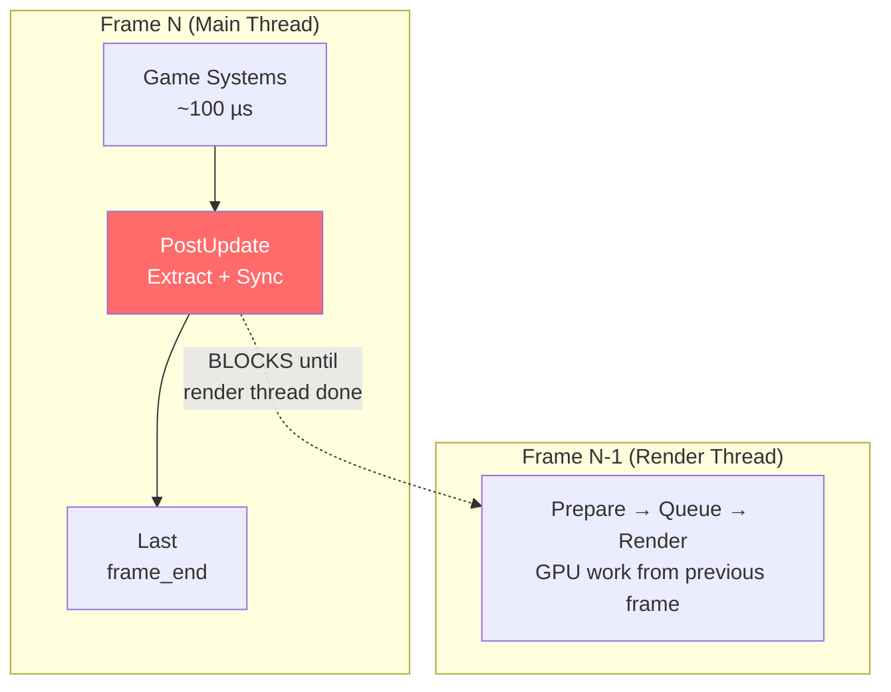
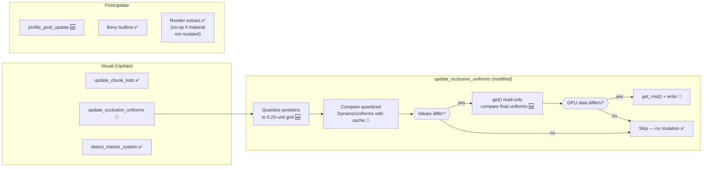
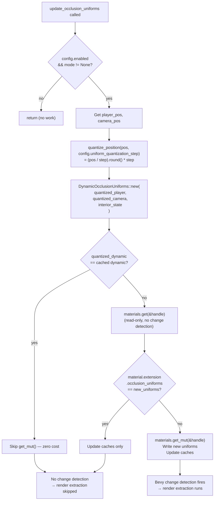
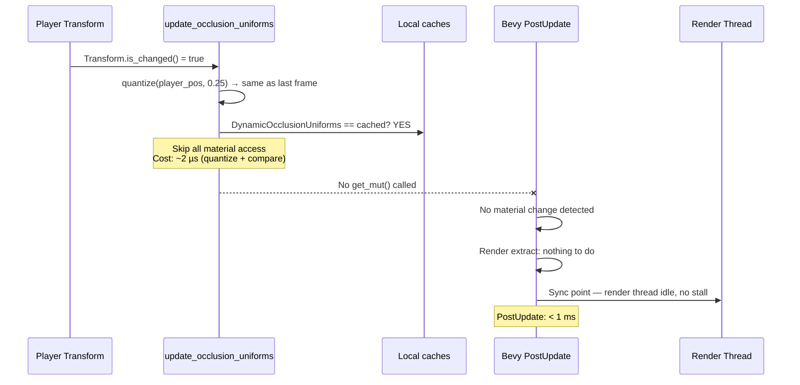
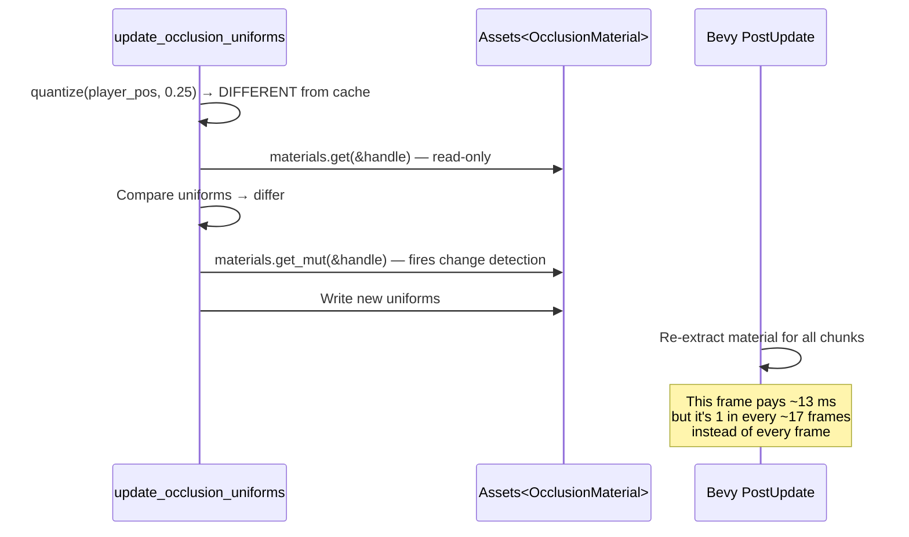
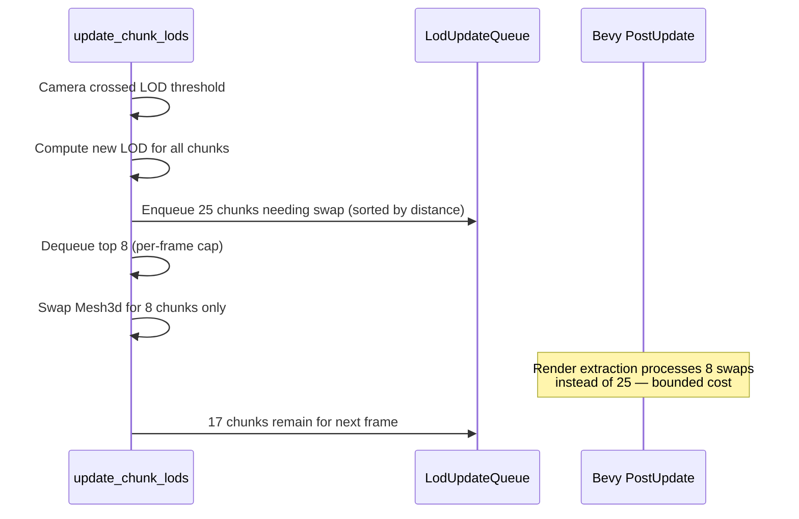

# Occlusion & Frame Pacing — Architecture Reference

**Repo:** `adrakestory`
**Runtime:** Bevy 0.18 (Rust), pipelined rendering via `DefaultPlugins`
**Purpose:** Document the current occlusion uniform update pipeline and define the target architecture for eliminating movement frame-drop spikes.

---

## Changelog

| Version | Date | Author | Summary |
|---------|------|--------|---------|
| **v1** | **2026-03-21** | **Developer** | **Initial draft — quantized uniforms + PresentMode + PostUpdate profiling** |

---

## Table of Contents

1. [Current Architecture](#1-current-architecture)
   - 1.1 [Solution Structure](#11-solution-structure)
   - 1.2 [Pipeline Overview](#12-pipeline-overview)
   - 1.3 [Pipeline Steps — Detail](#13-pipeline-steps--detail)
   - 1.4 [Material Architecture](#14-material-architecture)
   - 1.5 [Change-Detection Data Flow](#15-change-detection-data-flow)
   - 1.6 [Pipelined Rendering Sync](#16-pipelined-rendering-sync)
2. [Target Architecture — Movement Frame Drop Fix](#2-target-architecture--movement-frame-drop-fix)
   - 2.1 [Design Principles](#21-design-principles)
   - 2.2 [New Components](#22-new-components)
   - 2.3 [Modified Components](#23-modified-components)
   - 2.4 [Pipeline Flow — After Fix](#24-pipeline-flow--after-fix)
   - 2.5 [Quantization Internal Flow](#25-quantization-internal-flow)
   - 2.6 [Sequence Diagram — Movement Frame (After)](#26-sequence-diagram--movement-frame-after)
   - 2.7 [Sequence Diagram — LOD Transition (After, Phase 2)](#27-sequence-diagram--lod-transition-after-phase-2)
   - 2.8 [Configuration & Registration](#28-configuration--registration)
   - 2.9 [Phase Boundaries](#29-phase-boundaries)
3. [Appendices](#appendix-a--data-schema)
   - [Appendix A — Data Schema](#appendix-a--data-schema)
   - [Appendix B — Open Questions & Decisions](#appendix-b--open-questions--decisions)
   - [Appendix C — Key File Locations](#appendix-c--key-file-locations)
   - [Appendix D — Code Templates](#appendix-d--code-templates)

---

## 1. Current Architecture

### 1.1 Solution Structure



### 1.2 Pipeline Overview

Per-frame pipeline during `InGame` state:



The profiler measures `frame_cpu_us` as wall-clock time from step 1 (`First`) to
step 4 (`Last`). This captures all main-thread work including Bevy's PostUpdate
phase and the pipelined rendering sync point.

### 1.3 Pipeline Steps — Detail

| # | Step | System / Schedule | Purpose |
|---|------|-------------------|---------|
| 1 | Frame begin | `frame_begin` (First) | Advance frame counter, record `frame_interval_us` |
| 2a | Input | `gather_keyboard_input`, `gather_gamepad_input` | Collect player input |
| 2b | Movement | `move_player` | Apply movement + collision checks via SpatialGrid |
| 2c | Physics | `apply_gravity`, `apply_physics` | Gravity + collision response |
| 2d | Visual | `update_chunk_lods`, `update_occlusion_uniforms`, `detect_interior_system` | LOD switching, material uniforms, interior detection |
| 2e | Camera | `follow_player_camera`, `rotate_camera` | Camera follows player |
| 3a | Transform | Bevy `propagate_transforms` | Propagate Transform → GlobalTransform |
| 3b | Visibility | Bevy `check_visibility` | Frustum culling for all renderable entities |
| 3c | Render extract | Bevy render extraction + sync | Copy changed data to render world; **blocks** waiting for render thread if previous frame not done |
| 4 | Frame end | `frame_end` (Last) | Record `frame_cpu_us` |

### 1.4 Material Architecture

All voxel chunks share a single `OcclusionMaterial` instance:



**Key fact:** Every chunk entity's `MeshMaterial3d<OcclusionMaterial>` references the same `Handle`. When `Assets::get_mut()` is called on this handle, Bevy's change detection fires for the asset, and the render extraction system must re-process the material for **all** referencing entities.

### 1.5 Change-Detection Data Flow

Current flow during a movement frame:



**Problem:** This happens **every frame** the player or camera moves, because:
1. Player position changes → `dynamic_dirty = true`
2. `get_mut()` called → asset marked changed
3. All 100-200 chunks re-extracted → PostUpdate takes ~13 ms

### 1.6 Pipelined Rendering Sync



When the render thread is processing heavy work from the previous frame (e.g.,
re-uploading material data for 100-200 chunks), the main thread blocks at the
sync point. This creates a feedback loop: each frame's material mutation → render
work → next frame blocks at sync → next frame also takes long.

---

## 2. Target Architecture — Movement Frame Drop Fix

### 2.1 Design Principles

1. **Minimize `get_mut()` calls** — The shared material must only be mutated when GPU-visible uniform data actually changes by a perceptible amount. Traces to FR-3.1.1, FR-3.1.2.
2. **Zero-cost idle frames** — When the player is stationary, the uniform update system must do no material access at all. Traces to NFR-4.2.
3. **Quantize, don't throttle** — Instead of skipping frames (which would cause stale uniforms), quantize positions to a grid so that small movements produce identical uniform values. Traces to NFR-4.3.
4. **Non-blocking presentation** — Frame submission must not block on vsync, reducing coupling between render-thread latency and main-thread stalls. Traces to FR-3.3.1, FR-3.3.2.
5. **Additive instrumentation** — New profiling scopes must be contained to PostUpdate and must not change game behavior. Traces to FR-3.5.1, NFR-4.7.

### 2.2 New Components

No new Rust structs or systems are required for Phase 1. All changes are
modifications to existing components and configuration.

| Component | Type | Purpose |
|-----------|------|---------|
| `quantize_position()` | Free function in `occlusion/mod.rs` | Quantize `Vec3` to configurable grid |
| `profile_post_update` | System in `diagnostics/mod.rs` | Measure PostUpdate wall-clock time |

**Phase 2 additions:**

| Component | Type | Purpose |
|-----------|------|---------|
| `LodUpdateQueue` | Resource | Priority queue for rate-limited LOD mesh swaps |
| `IncrementalCacheBuilder` | Resource in `interior_detection.rs` | State machine for multi-frame cache rebuild |

### 2.3 Modified Components

| Component | File | Change |
|-----------|------|--------|
| `OcclusionConfig` | `occlusion/mod.rs` | Add `uniform_quantization_step: f32` field (default `0.25`) |
| `update_occlusion_uniforms` | `occlusion/mod.rs` | Quantize player/camera positions before computing `DynamicOcclusionUniforms`; use `Assets::get()` for read-only comparison before `get_mut()` |
| `DynamicOcclusionUniforms::new()` | `occlusion/mod.rs` | Accept quantized positions instead of raw positions |
| `Window` config | `main.rs` | Add `present_mode: PresentMode::AutoNoVsync` |
| `FrameProfilerPlugin` | `diagnostics/mod.rs` | Register `profile_post_update` in PostUpdate schedule |

### 2.4 Pipeline Flow — After Fix



### 2.5 Quantization Internal Flow



**Quantization effect at 0.25-unit grid:**

| Movement speed | `get_mut()` frequency | Reduction |
|----------------|----------------------|-----------|
| Walking (2 units/s) | ~8 calls/s (every ~0.125s) | ~93% reduction from every-frame |
| Running (5 units/s) | ~20 calls/s (every ~0.05s) | ~83% reduction |
| Idle | 0 calls/s | 100% reduction |

At 140 FPS, reducing from 140 `get_mut()` calls/second to 8–20 eliminates the
render extraction overhead on 85–95% of frames.

### 2.6 Sequence Diagram — Movement Frame (After)

**Typical frame during movement (quantized position unchanged):**



**Occasional frame where quantized position changes:**



### 2.7 Sequence Diagram — LOD Transition (After, Phase 2)



### 2.8 Configuration & Registration

**OcclusionConfig addition:**

```rust
// In src/systems/game/occlusion/mod.rs — OcclusionConfig struct
pub struct OcclusionConfig {
    // ... existing fields ...

    /// Quantization grid step for uniform position updates (world units).
    /// Positions are rounded to this grid before comparison. Higher values
    /// reduce material mutations but may cause visible stepping in the
    /// occlusion fade. Default: 0.25 (below perception threshold for
    /// occlusion_radius of 3-8 units).
    pub uniform_quantization_step: f32,  // NEW — default 0.25
}
```

**Window configuration:**

```rust
// In src/main.rs — Window setup
use bevy::window::{PresentMode, WindowMode};

Window {
    mode: WindowMode::BorderlessFullscreen(MonitorSelection::Current),
    present_mode: PresentMode::AutoNoVsync,  // NEW
    ..default()
}
```

**PostUpdate profiling:**

```rust
// In src/diagnostics/mod.rs — FrameProfilerPlugin::build()
#[cfg(debug_assertions)]
app.insert_resource(FrameProfiler::new())
    .add_systems(First, frame_begin)
    .add_systems(Last, frame_end)
    .add_systems(PostUpdate, profile_post_update);  // NEW

fn profile_post_update(profiler: Res<FrameProfiler>) {
    // The scope measures PostUpdate start-to-end when placed as the
    // last system. In practice, place at start of PostUpdate for
    // "time since last Update system" measurement.
    profile_scope!(Some(profiler), "post_update");
}
```

### 2.9 Phase Boundaries

| Capability | Phase | Architectural Impact |
|------------|-------|---------------------|
| Quantized uniform positions | Phase 1 | Modify `update_occlusion_uniforms` + `OcclusionConfig` |
| Read-only comparison before `get_mut()` | Phase 1 | Modify `update_occlusion_uniforms` |
| `PresentMode::AutoNoVsync` | Phase 1 | One-line change in `main.rs` |
| PostUpdate profiling scope | Phase 1 | Add system to `diagnostics/mod.rs` |
| LOD mesh-swap rate limiting | Phase 2 | New `LodUpdateQueue` resource + modify `update_chunk_lods` |
| Incremental interior cache rebuild | Phase 2 | New `IncrementalCacheBuilder` + modify `detect_interior_system` |
| Per-chunk material instances | Future | Major refactor of spawner + occlusion material system |
| Push-constant uniforms | Future | Requires custom render pipeline, bypasses `Assets` entirely |

**MVP boundary:**

- ✅ Quantized uniform positions (eliminates ~85-95% of `get_mut()` calls)
- ✅ Explicit `PresentMode` (improves Windows frame pacing)
- ✅ PostUpdate profiling (enables future investigation)
- ❌ LOD rate limiting (Phase 2 — additive improvement)
- ❌ Incremental cache rebuild (Phase 2 — affects one-time spike only)
- ❌ Per-chunk materials (Future — requires significant refactoring)

---

## Appendix A — Data Schema

**`OcclusionUniforms` GPU struct** (bound at `@group(2) @binding(100)`):

| Field | Rust Type | GPU Type | Mutated by | Notes |
|-------|-----------|----------|------------|-------|
| `player_position` | `Vec3` + `_padding1: f32` | `vec3<f32>` | `update_occlusion_uniforms` (dynamic) | **Quantization target** |
| `camera_position` | `Vec3` + `_padding2: f32` | `vec3<f32>` | `update_occlusion_uniforms` (dynamic) | **Quantization target** |
| `min_alpha` | `f32` | `f32` | Config change only (static) | |
| `occlusion_radius` | `f32` | `f32` | Config change only (static) | |
| `height_threshold` | `f32` | `f32` | Config change only (static) | |
| `falloff_softness` | `f32` | `f32` | Config change only (static) | |
| `technique` | `u32` | `u32` | Config change only (static) | |
| `mode` | `u32` | `u32` | Config change only (static) | |
| `_padding3, _padding4` | `u32` | — | Never | Alignment |
| `region_min` | `Vec4` | `vec4<f32>` | `update_occlusion_uniforms` (dynamic) | Interior AABB |
| `region_max` | `Vec4` | `vec4<f32>` | `update_occlusion_uniforms` (dynamic) | `.w` = activation flag |

**Fields affected by quantization:** `player_position`, `camera_position`.
**Fields NOT quantized:** `region_min`, `region_max` (change only on interior-state transitions, not per-frame).

---

## Appendix B — Open Questions & Decisions

### Resolved

| # | Question | Resolution |
|---|----------|------------|
| 1 | Is `OcclusionUniforms` PartialEq? | Yes — `#[derive(PartialEq)]` already present at `occlusion/mod.rs:130` |
| 2 | Is `DynamicOcclusionUniforms` PartialEq? | Yes — `#[derive(PartialEq)]` at `occlusion/mod.rs:277` |
| 3 | Does Bevy 0.18 `DefaultPlugins` include pipelined rendering? | Yes — `PipelinedRenderingPlugin` is included by default on native platforms |
| 4 | Can `region_min`/`region_max` be quantized too? | No — they change infrequently (only on interior transitions) and quantization could cause visible AABB mismatch at region boundaries |

### Open

| # | Question | Impact | Notes |
|---|----------|--------|-------|
| 5 | Optimal quantization step size | Visual quality vs. performance trade-off | Propose 0.25; needs visual validation at 0.125, 0.25, 0.5 |
| 6 | Should `PresentMode` be user-configurable? | Settings menu scope | If yes, add to `SettingsPlugin`; if no, hardcode in `main.rs` |
| 7 | LOD rate-limit cap value (Phase 2) | Performance bound accuracy | 8/frame proposed; may need to scale with map size |
| 8 | Release-build spike magnitude | Determines if fix is needed for release | Capture release profile to confirm |

---

## Appendix C — Key File Locations

| Component | Path |
|-----------|------|
| `OcclusionConfig` | `src/systems/game/occlusion/mod.rs` |
| `OcclusionUniforms` | `src/systems/game/occlusion/mod.rs:130-158` |
| `update_occlusion_uniforms` | `src/systems/game/occlusion/mod.rs:334-448` |
| `DynamicOcclusionUniforms` | `src/systems/game/occlusion/mod.rs:277-305` |
| `StaticOcclusionUniforms` | `src/systems/game/occlusion/mod.rs:242-249` |
| `OcclusionMaterialHandle` | `src/systems/game/occlusion/mod.rs:186` |
| `update_chunk_lods` | `src/systems/game/map/spawner/mod.rs:423-462` |
| `LOD_DISTANCES` | `src/systems/game/map/spawner/mod.rs:46` |
| `LodConfig` | `src/systems/game/map/spawner/mod.rs:84-96` |
| `detect_interior_system` | `src/systems/game/interior_detection.rs:76-208` |
| `build_occupied_voxel_set` | `src/systems/game/interior_detection.rs:212-238` |
| `InteriorState` | `src/systems/game/interior_detection.rs:56-68` |
| `FrameProfilerPlugin` | `src/diagnostics/mod.rs:207-216` |
| Window config | `src/main.rs:128-134` |
| `spawn_voxels_chunked` | `src/systems/game/map/spawner/chunks.rs` |
| Investigation report | `docs/investigations/2026-03-21-1048-windows-frame-drop-spikes.md` |

---

## Appendix D — Code Templates

### Quantization helper

```rust
/// Quantize a position to a grid to reduce material mutation frequency.
/// Returns the position rounded to the nearest `step` on each axis.
#[inline]
fn quantize_position(pos: Vec3, step: f32) -> Vec3 {
    if step <= 0.0 {
        return pos;
    }
    let inv = 1.0 / step;
    Vec3::new(
        (pos.x * inv).round() * step,
        (pos.y * inv).round() * step,
        (pos.z * inv).round() * step,
    )
}
```

### Modified update_occlusion_uniforms (key section)

```rust
// Quantize positions to reduce material mutation frequency
let quant_step = config.uniform_quantization_step;
let quantized_player = quantize_position(player_pos, quant_step);
let quantized_camera = quantize_position(camera_pos, quant_step);

let new_dynamic = if dynamic_input_changed {
    Some(DynamicOcclusionUniforms::new(
        quantized_player,  // ← quantized, not raw
        quantized_camera,  // ← quantized, not raw
        interior_state.as_deref(),
    ))
} else {
    None
};

// ... existing dirty checks ...

if static_dirty || dynamic_dirty {
    let new_uniforms = assemble_uniforms(&s, &d);
    // Read-only check first — does NOT trigger change detection
    if let Some(material) = materials.get(&material_handle.0) {
        if material.extension.occlusion_uniforms != new_uniforms {
            // Only call get_mut when GPU data actually differs
            if let Some(material) = materials.get_mut(&material_handle.0) {
                material.extension.occlusion_uniforms = new_uniforms;
                if static_dirty {
                    material.base.alpha_mode = match config.technique {
                        TransparencyTechnique::Dithered => AlphaMode::Mask(0.001),
                        TransparencyTechnique::AlphaBlend => AlphaMode::AlphaToCoverage,
                    };
                }
            }
        }
    }
    // Update caches regardless (so next frame's dirty check is accurate)
    if let Some(new) = new_static { *static_cache = Some(new); }
    if let Some(new) = new_dynamic { *dynamic_cache = Some(new); }
}
```

### PostUpdate profiler system

```rust
/// Runs at the start of PostUpdate to measure Bevy's built-in overhead.
fn profile_post_update(profiler: Option<Res<FrameProfiler>>) {
    profile_scope!(profiler, "post_update");
}
```

---

*Created: 2026-03-21 — See [Changelog](#changelog) for version history.*
*Based on: `docs/investigations/2026-03-21-1048-windows-frame-drop-spikes.md`*
*Companion documents: [Requirements](./requirements.md) | [Epic Ticket](../ticket.md)*
