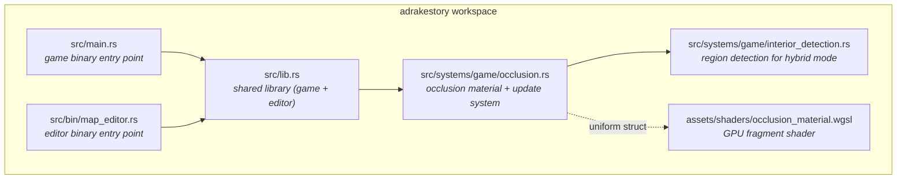
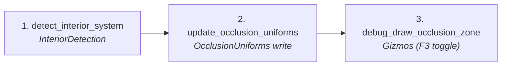
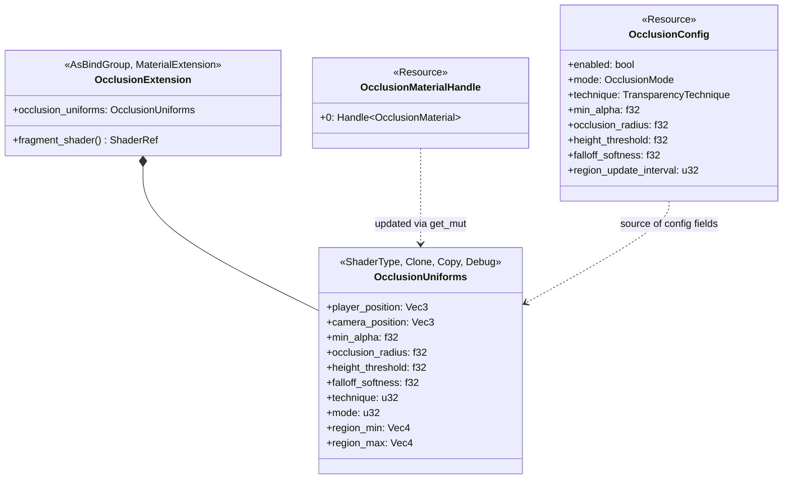
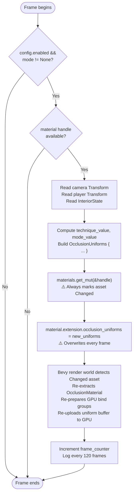
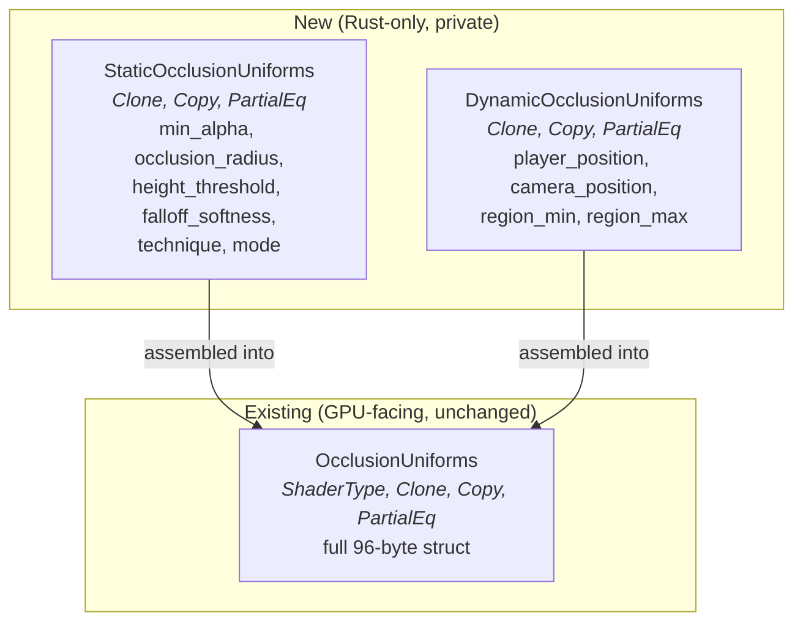
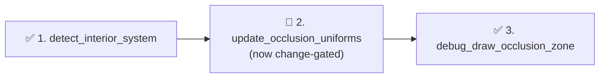
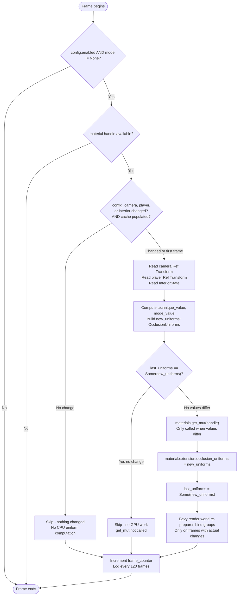
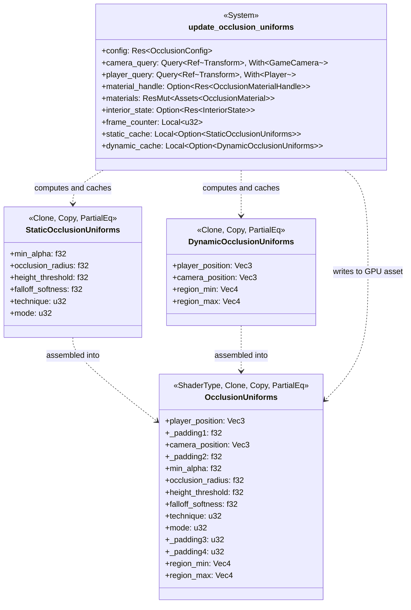
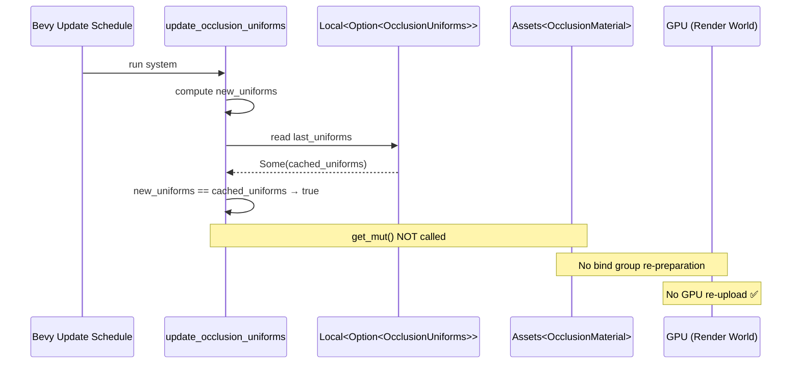
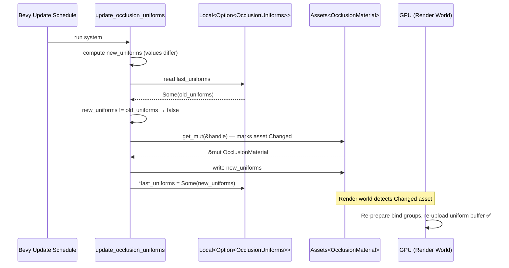

# Occlusion System — Architecture Reference

**Date:** 2026-03-15  
**Repo:** `adrakestory` (local)  
**Runtime:** Bevy ECS (Rust), `ExtendedMaterial` + custom WGSL shader  
**Purpose:** Document the current occlusion uniform update architecture and define the target architecture for the fix: *Occlusion Material GPU Re-Upload Every Frame* (P1 bug).

---

## Changelog

| Version | Date | Author | Summary |
|---------|------|--------|---------|
| **v1** | **2026-03-15** | **Copilot** | **Initial draft — current architecture analysis and target design for Local-cache change-detection fix** |

---

## Table of Contents

1. [Current Architecture](#1-current-architecture)
   - [Solution Structure](#11-solution-structure)
   - [Occlusion System Pipeline](#12-occlusion-system-pipeline)
   - [Pipeline Steps — Detail](#13-pipeline-steps--detail)
   - [Key Types](#14-key-types)
   - [Data Flow — Per-Frame Uniform Update](#15-data-flow--per-frame-uniform-update)
2. [Target Architecture — Conditional Uniform Update](#2-target-architecture--conditional-uniform-update)
   - [Design Principles](#21-design-principles)
   - [New Components](#22-new-components)
   - [Modified Components](#23-modified-components)
   - [Pipeline Flow](#24-pipeline-flow)
   - [Internal Flow — After Fix](#25-internal-flow--after-fix)
   - [Class Diagram](#26-class-diagram)
   - [Sequence Diagram — Static Frame (No Change)](#27-sequence-diagram--static-frame-no-change)
   - [Sequence Diagram — Dynamic Frame (Values Changed)](#28-sequence-diagram--dynamic-frame-values-changed)
   - [Phase Boundaries](#29-phase-boundaries)
3. [Appendices](#appendix-a--data-schema)
   - [Appendix A — `OcclusionUniforms` Schema](#appendix-a--occlusionuniforms-schema)
   - [Appendix B — Open Questions & Decisions](#appendix-b--open-questions--decisions)
   - [Appendix C — Key File Locations](#appendix-c--key-file-locations)
   - [Appendix D — Code Template: Fixed System](#appendix-d--code-template-fixed-system)

---

## 1. Current Architecture

### 1.1 Solution Structure



The map editor does **not** use `OcclusionMaterial` — this system is game-binary-only.

### 1.2 Occlusion System Pipeline

Each frame, in the `Update` schedule, the following systems run chained in order inside `OcclusionPlugin`:



These systems are registered outside the `GameSystemSet` ordering (they run in `Update` without a set label, via `OcclusionPlugin`).

### 1.3 Pipeline Steps — Detail

| # | Step | Function | Purpose |
|---|------|----------|---------|
| 1 | **Interior Detection** | `detect_interior_system` | Detects whether the player is inside an enclosed region; writes `InteriorState` resource with `current_region` bounds |
| 2 | **Uniform Update** | `update_occlusion_uniforms` | Reads player/camera transforms and config; unconditionally writes `OcclusionUniforms` to the material asset via `get_mut()` |
| 3 | **Debug Draw** | `debug_draw_occlusion_zone` | Draws gizmo overlays (ray, cylinder, region box) when F3 is active |

### 1.4 Key Types



`OcclusionMaterial` is the type alias `ExtendedMaterial<StandardMaterial, OcclusionExtension>`.

### 1.5 Data Flow — Per-Frame Uniform Update

This is the problematic flow. `get_mut()` is called unconditionally on every frame, regardless of whether any input has changed.



The GPU re-upload path (shaded steps above) executes on **every frame**, even when the player and camera have not moved and config has not changed.

---

## 2. Target Architecture — Conditional Uniform Update

### 2.1 Design Principles

1. **Gate GPU work on actual state changes** — `materials.get_mut()` must only be called when at least one sub-struct cache differs from the newly computed value. This satisfies NFR-4.4 (FR-3.1.3, FR-3.1.4).

2. **No per-frame heap allocation** — both sub-struct caches are stored in `Local<Option<...>>`, stack-resident and owned by the system. All sub-struct types are `Copy` (NFR-4.1).

3. **Preserve all existing behavior** — early-return paths, debug logging, and frame counter increment are unchanged. First-frame write is unconditional because both caches start as `None` (FR-3.5.1–FR-3.5.4).

4. **Skip CPU work on static frames too** — Bevy `is_changed()` / `Ref<Transform>` gates each sub-struct computation independently: config changes only recompute static fields; transform changes only recompute dynamic fields (FR-3.3.1, FR-3.3.2).

5. **Finer-grained dirty tracking via struct split** — `OcclusionUniforms` is decomposed into `StaticOcclusionUniforms` (config-driven) and `DynamicOcclusionUniforms` (positional). Each has its own `Local` cache, so a camera move does not compare config fields and a config change does not compare position fields (FR-3.4.1–FR-3.4.4).

6. **GPU surface unchanged** — `OcclusionUniforms`, its `#[uniform(100)]` binding, and the WGSL shader are not modified. The split is purely Rust-side (NFR-4.5).

### 2.2 New Components

Two new **private, Rust-only** helper structs are introduced. They are never exposed to the GPU or to other modules.



| Component | Purpose |
|-----------|---------|
| `StaticOcclusionUniforms` | Holds config-driven uniform fields. Cached in `Local<Option<StaticOcclusionUniforms>>`. Recomputed only when `config.is_changed()`. |
| `DynamicOcclusionUniforms` | Holds per-frame positional fields. Cached in `Local<Option<DynamicOcclusionUniforms>>`. Recomputed only when camera/player transforms or `InteriorState` change. |

### 2.3 Modified Components

| Component | Change |
|-----------|--------|
| `OcclusionUniforms` | Add `PartialEq` to `#[derive(...)]`. GPU struct and `#[uniform(100)]` binding are otherwise unchanged. |
| `update_occlusion_uniforms` | (1) Change query parameters to `Query<Ref<Transform>, With<GameCamera>>` and `Query<Ref<Transform>, With<Player>>`. (2) Add `mut static_cache: Local<Option<StaticOcclusionUniforms>>` and `mut dynamic_cache: Local<Option<DynamicOcclusionUniforms>>` parameters (replaces the single `Local<Option<OcclusionUniforms>>`). (3) Gate static field computation on `config.is_changed()`; gate dynamic field computation on transform/interior change detection. (4) Call `get_mut()` only when at least one cache differs. (5) Assemble full `OcclusionUniforms` from both sub-structs before writing. |

### 2.4 Pipeline Flow

The chained system order inside `OcclusionPlugin` is unchanged:



### 2.5 Internal Flow — After Fix



### 2.6 Class Diagram



The two new sub-structs are private to `occlusion.rs`. No other module or system interacts with them.

### 2.7 Sequence Diagram — Static Frame (No Change)

Player and camera have not moved; config is unchanged.



### 2.8 Sequence Diagram — Dynamic Frame (Values Changed)

Player moved, or camera moved, or `OcclusionConfig` was mutated.



### 2.9 Phase Boundaries

| Capability | Phase | Architectural Impact |
|------------|-------|---------------------|
| `PartialEq` on `OcclusionUniforms` | Phase 1 | Additive derive — no breaking change |
| `StaticOcclusionUniforms` + `DynamicOcclusionUniforms` private structs | Phase 1 | New private types in `occlusion.rs` — no public API change |
| Two `Local` sub-struct caches in system | Phase 1 | Replaces single `Local<Option<OcclusionUniforms>>`; Bevy injects automatically |
| Skip `get_mut()` when both caches match | Phase 1 | Core fix — eliminates unconditional GPU re-upload |
| `Ref<Transform>` queries + `is_changed()` gates per sub-struct | Phase 1 | Skips sub-struct recomputation independently; `Ref<T>` is a drop-in for `&T` |

**Phase 1 boundary (all delivered together):**

- ✅ `OcclusionUniforms` derives `PartialEq`
- ✅ `StaticOcclusionUniforms` and `DynamicOcclusionUniforms` private structs with separate `Local` caches
- ✅ `get_mut()` called only when at least one sub-struct cache differs
- ✅ Bevy `is_changed()` / `Ref<Transform>` gates sub-struct computation independently
- ✅ Sub-struct caches retained as safety fallback alongside Bevy change detection
- ✅ GPU `OcclusionUniforms` struct, binding, and WGSL shader unchanged
- ✅ All existing early-returns, logging, and frame counter preserved

---

## Appendix A — `OcclusionUniforms` Schema

All fields as defined in `src/systems/game/occlusion.rs:99–127`:

| Field | Type | GPU Alignment | Purpose |
|-------|------|--------------|---------|
| `player_position` | `Vec3` | 12 bytes | Player world XYZ |
| `_padding1` | `f32` | 4 bytes | 16-byte row alignment |
| `camera_position` | `Vec3` | 12 bytes | Camera world XYZ |
| `_padding2` | `f32` | 4 bytes | 16-byte row alignment |
| `min_alpha` | `f32` | 4 bytes | Minimum transparency for occluded voxels |
| `occlusion_radius` | `f32` | 4 bytes | Horizontal cylinder radius (world units) |
| `height_threshold` | `f32` | 4 bytes | Min height above player to apply occlusion |
| `falloff_softness` | `f32` | 4 bytes | Vertical transition smoothness |
| `technique` | `u32` | 4 bytes | 0 = Dithered, 1 = AlphaBlend |
| `mode` | `u32` | 4 bytes | 0 = None, 1 = ShaderBased, 2 = RegionBased, 3 = Hybrid |
| `_padding3` | `u32` | 4 bytes | Struct alignment |
| `_padding4` | `u32` | 4 bytes | Struct alignment |
| `region_min` | `Vec4` | 16 bytes | Interior region AABB min (w unused) |
| `region_max` | `Vec4` | 16 bytes | Interior region AABB max (w = 1.0 when active) |

Total: 96 bytes per upload.

---

## Appendix B — Open Questions & Decisions

### Resolved

| # | Question | Resolution |
|---|----------|------------|
| 1 | Should `OcclusionUniforms` derive `Eq` in addition to `PartialEq`? | **Do not derive `Eq`.** The struct contains `f32` and `Vec3`/`Vec4` fields; Rust disallows `#[derive(Eq)]` on types containing floats. Only `PartialEq` is derivable and sufficient for the cache comparison. |
| 2 | Is `get_mut()` the only call site that marks `OcclusionMaterial` as changed? | Confirmed via grep: `OcclusionMaterialHandle` is only accessed in `update_occlusion_uniforms`. No other system calls `get_mut()` on this asset. |

### Open

No open questions remain.

### Resolved (continued)

| # | Question | Resolution |
|---|----------|------------|
| 3 | Should Phase 2 Bevy change-detection gates be implemented in the same PR as Phase 1? | **Yes — implement together.** Both the sub-struct caches and the Bevy `is_changed()` / `Ref<Transform>` early-out are delivered in the same set of changes. |
| 4 | Are there other materials in the codebase that exhibit the same unconditional `get_mut()` pattern? | **No.** Full codebase search found only two `Assets<T>::get_mut()` call sites: `occlusion.rs:259` (this bug) and `editor/grid/systems.rs:70` (editor-only, correctly gated behind a camera-movement threshold). |

---

## Appendix C — Key File Locations

| Component | Path |
|-----------|------|
| `update_occlusion_uniforms` | `src/systems/game/occlusion.rs:209` |
| `OcclusionUniforms` | `src/systems/game/occlusion.rs:99` |
| `OcclusionExtension` | `src/systems/game/occlusion.rs:77` |
| `OcclusionConfig` | `src/systems/game/occlusion.rs:162` |
| `OcclusionMaterialHandle` | `src/systems/game/occlusion.rs:154` |
| `OcclusionPlugin` | `src/systems/game/occlusion.rs:413` |
| `detect_interior_system` | `src/systems/game/interior_detection.rs` |
| WGSL shader | `assets/shaders/occlusion_material.wgsl` |
| Plugin registration | `src/main.rs:133` |

---

## Appendix D — Code Template: Fixed System

```rust
// 🆕 Private Rust-only helper structs for finer-grained dirty tracking.
// Never sent to the GPU directly — assembled into OcclusionUniforms before writing.
#[derive(Clone, Copy, PartialEq)]
struct StaticOcclusionUniforms {
    min_alpha: f32,
    occlusion_radius: f32,
    height_threshold: f32,
    falloff_softness: f32,
    technique: u32,
    mode: u32,
}

#[derive(Clone, Copy, PartialEq)]
struct DynamicOcclusionUniforms {
    player_position: Vec3,
    camera_position: Vec3,
    region_min: Vec4,
    region_max: Vec4,
}

pub fn update_occlusion_uniforms(
    config: Res<OcclusionConfig>,
    camera_query: Query<Ref<Transform>, With<GameCamera>>,  // 🔧 Ref<T> for change detection
    player_query: Query<Ref<Transform>, With<Player>>,      // 🔧 Ref<T> for change detection
    material_handle: Option<Res<OcclusionMaterialHandle>>,
    mut materials: ResMut<Assets<OcclusionMaterial>>,
    interior_state: Option<Res<InteriorState>>,
    mut frame_counter: Local<u32>,
    mut static_cache: Local<Option<StaticOcclusionUniforms>>,   // 🆕 config-driven cache
    mut dynamic_cache: Local<Option<DynamicOcclusionUniforms>>, // 🆕 positional cache
) {
    if !config.enabled || config.mode == OcclusionMode::None {
        return;
    }

    let Some(material_handle) = material_handle else {
        *frame_counter += 1;
        if (*frame_counter).is_multiple_of(300) {
            info!("[Occlusion] Material handle not available yet (waiting for map to load)");
        }
        return;
    };

    let camera_ref = camera_query.get_single().ok();
    let player_ref = player_query.get_single().ok();

    // 🆕 Recompute static fields only when config changed (or first frame).
    let static_changed = config.is_changed() || static_cache.is_none();
    let new_static = if static_changed {
        let technique_value = match config.technique {
            TransparencyTechnique::Dithered => 0,
            TransparencyTechnique::AlphaBlend => 1,
        };
        let mode_value = match config.mode {
            OcclusionMode::None => 0,
            OcclusionMode::ShaderBased => 1,
            OcclusionMode::RegionBased => 2,
            OcclusionMode::Hybrid => 3,
        };
        Some(StaticOcclusionUniforms {
            min_alpha: config.min_alpha,
            occlusion_radius: config.occlusion_radius,
            height_threshold: config.height_threshold,
            falloff_softness: config.falloff_softness,
            technique: technique_value,
            mode: mode_value,
        })
    } else {
        None
    };

    // 🆕 Recompute dynamic fields only when positions/interior changed (or first frame).
    let dynamic_input_changed = camera_ref.as_ref().map(|r| r.is_changed()).unwrap_or(false)
        || player_ref.as_ref().map(|r| r.is_changed()).unwrap_or(false)
        || interior_state.as_ref().map(|s| s.is_changed()).unwrap_or(false)
        || dynamic_cache.is_none();

    let new_dynamic = if dynamic_input_changed {
        let camera_pos = camera_ref
            .map(|t| t.translation)
            .unwrap_or(Vec3::new(0.0, 10.0, 10.0));
        let player_pos = player_ref
            .map(|t| t.translation)
            .unwrap_or(Vec3::ZERO);
        let (region_min, region_max) = interior_state
            .as_ref()
            .and_then(|s| s.current_region.as_ref())
            .map(|r| (
                Vec4::new(r.min.x, r.min.y, r.min.z, 0.0),
                Vec4::new(r.max.x, r.max.y, r.max.z, 1.0),
            ))
            .unwrap_or((Vec4::ZERO, Vec4::ZERO));
        Some(DynamicOcclusionUniforms { player_position: player_pos, camera_position: camera_pos, region_min, region_max })
    } else {
        None
    };

    // Resolve effective values (new if recomputed, cached otherwise).
    let effective_static = new_static.as_ref().or(static_cache.as_ref());
    let effective_dynamic = new_dynamic.as_ref().or(dynamic_cache.as_ref());
    let (Some(s), Some(d)) = (effective_static, effective_dynamic) else {
        return; // Neither cache populated yet — shouldn't happen after first frame
    };

    // 🆕 Safety fallback: skip GPU work if neither sub-struct actually changed.
    let static_dirty = new_static.as_ref().map(|n| static_cache.as_ref() != Some(n)).unwrap_or(false);
    let dynamic_dirty = new_dynamic.as_ref().map(|n| dynamic_cache.as_ref() != Some(n)).unwrap_or(false);
    if !static_dirty && !dynamic_dirty {
        *frame_counter += 1;
        if (*frame_counter).is_multiple_of(120) {
            info!("[Occlusion] Mode: {:?}, Player: ({:.1}, {:.1}, {:.1})", config.mode, d.player_position.x, d.player_position.y, d.player_position.z);
        }
        return;
    }

    // Assemble full GPU uniform from both sub-structs and write.
    if let Some(material) = materials.get_mut(&material_handle.0) {
        material.extension.occlusion_uniforms = OcclusionUniforms {
            player_position: d.player_position,
            _padding1: 0.0,
            camera_position: d.camera_position,
            _padding2: 0.0,
            min_alpha: s.min_alpha,
            occlusion_radius: s.occlusion_radius,
            height_threshold: s.height_threshold,
            falloff_softness: s.falloff_softness,
            technique: s.technique,
            mode: s.mode,
            _padding3: 0,
            _padding4: 0,
            region_min: d.region_min,
            region_max: d.region_max,
        };
        if let Some(n) = new_static { *static_cache = Some(n); }
        if let Some(n) = new_dynamic { *dynamic_cache = Some(n); }
    } else {
        *frame_counter += 1;
        if (*frame_counter).is_multiple_of(60) {
            warn!("[Occlusion] Material asset not found in Assets<OcclusionMaterial>");
        }
        return;
    }

    *frame_counter += 1;
    if (*frame_counter).is_multiple_of(120) {
        let region_active = d.region_max.w > 0.5;
        info!(
            "[Occlusion] Mode: {:?}, Region active: {}, Player: ({:.1}, {:.1}, {:.1})",
            config.mode, region_active, d.player_position.x, d.player_position.y, d.player_position.z
        );
    }
}
```

`OcclusionUniforms` also needs `PartialEq` on its derive:

```rust
#[derive(Clone, Copy, Debug, ShaderType, PartialEq)]  // 🆕 PartialEq added
pub struct OcclusionUniforms { ... }
```

---

*Created: 2026-03-15 — See [Changelog](#changelog) for version history.*  
*Based on: `src/systems/game/occlusion.rs`, bug report `2026-03-15-2141-p1-occlusion-material-gpu-reupload-every-frame.md`*  
*Companion documents: [Requirements](./requirements.md)*
