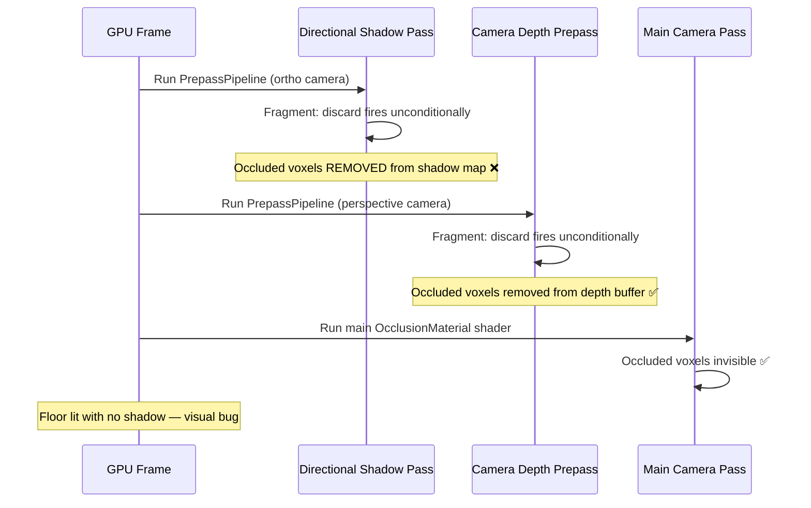
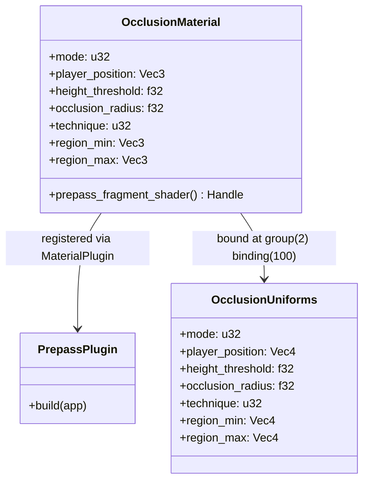
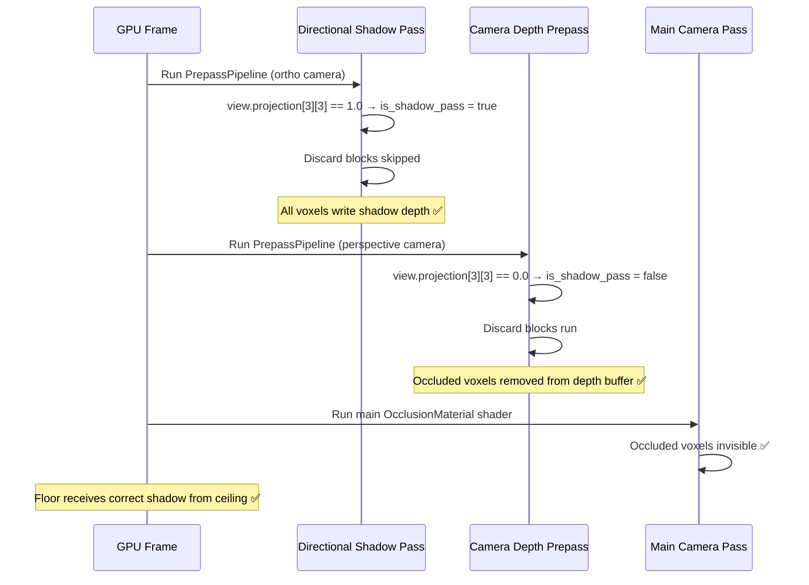

# Architecture — Occlusion Shadow Casting Fix

**Repo:** adrakestory
**Runtime:** Bevy 0.15 → 0.18
**Purpose:** Document the root cause, options considered, and the chosen implementation for restoring shadow casting from occluded voxels.

---

## Changelog

| Version | Date | Author | Summary |
|---------|------|--------|---------|
| v1 | 2026-03-21 | Developer | Initial draft — Option A (`DEPTH_CLAMP_ORTHO` guard) selected |
| v2 | 2026-03-21 | Developer | Option B (view projection check) promoted to chosen approach; Option A superseded — `DEPTH_CLAMP_ORTHO` renamed in Bevy 0.18 |

---

## Table of Contents

1. [Current Architecture](#1-current-architecture)
   - 1.1 [Solution Structure](#11-solution-structure)
   - 1.2 [Pipeline Overview](#12-pipeline-overview)
   - 1.3 [Pipeline Steps](#13-pipeline-steps)
   - 1.4 [Extension Architecture](#14-extension-architecture)
   - 1.5 [Discard Logic Routing](#15-discard-logic-routing)
   - 1.6 [Data Flow](#16-data-flow)
2. [Target Architecture](#2-target-architecture)
   - 2.1 [Summary of Change](#21-summary-of-change)
   - 2.2 [Shader Implementation](#22-shader-implementation)
   - 2.3 [Pass Behaviour After Fix](#23-pass-behaviour-after-fix)
   - 2.4 [Pipeline Flow](#24-pipeline-flow)
3. [Appendix A — Data Schema](#appendix-a--data-schema)
4. [Appendix B — Open Questions](#appendix-b--open-questions)
5. [Appendix C — Key Files](#appendix-c--key-files)
6. [Appendix D — Code Templates](#appendix-d--code-templates)

---

## 1. Current Architecture

### 1.1 Solution Structure

```mermaid
graph TD
    A[OcclusionMaterial<br/>Bevy Material] --> B[MaterialPlugin registration]
    B --> C[PrepassPipeline&lt;OcclusionMaterial&gt;]
    C --> D[occlusion_material_prepass.wgsl<br/>fragment shader]
    D --> E1[Camera depth prepass<br/>DEPTH_PREPASS]
    D --> E2[Directional shadow map<br/>DEPTH_PREPASS | DEPTH_CLAMP_ORTHO]
    D --> E3[Point/spot shadow map<br/>DEPTH_PREPASS]
    E1 --> F1[Discard fires ✅ expected]
    E2 --> F2[Discard fires ❌ BUG — removes from shadow map]
    E3 --> F3[Discard fires ⚠️ irrelevant — shadows_enabled: false]
```

### 1.2 Pipeline Overview



### 1.3 Pipeline Steps

| Step | Pass | Projection | Fragment shader | Discard expected? | Current result |
|------|------|-----------|-----------------|-------------------|----------------|
| 1 | Directional shadow map | Orthographic | `occlusion_material_prepass.wgsl` | No | Fires — BUG |
| 2 | Camera depth prepass | Perspective | `occlusion_material_prepass.wgsl` | Yes | Fires — correct |
| 3 | Main camera pass | Perspective | `occlusion_material.wgsl` | Yes | Fires — correct |

### 1.4 Extension Architecture



### 1.5 Discard Logic Routing

`occlusion_material_prepass.wgsl` contains two unconditional discard blocks:

```wgsl
// Block 1 — region-based (mode 2 or 3)
if occlusion.mode == 2u || occlusion.mode == 3u {
    if in_interior_region(world_pos) { discard; }
}

// Block 2 — height-based (mode 1 or 3, dithered)
if (occlusion.mode == 1u || occlusion.mode == 3u) && occlusion.technique == 0u {
    if world_pos.y > occlusion.player_position.y + occlusion.height_threshold {
        ...
        discard;
    }
}
```

Both blocks fire during the directional shadow map pass, removing discarded voxels from the shadow map.

### 1.6 Data Flow

```
OcclusionSystem (Rust)
  → writes OcclusionUniforms buffer (mode, player_position, height_threshold, …)
  → bound at @group(2) @binding(100) in prepass shader

Bevy PrepassPipeline
  → binds @group(0) @binding(0) view: View  (projection matrix, etc.)
  → runs occlusion_material_prepass.wgsl for every pass type

Fragment shader
  → reads world_pos from VertexOutput
  → reads occlusion uniforms → decides to discard
  → does NOT read view.projection → cannot distinguish pass type  ← BUG ROOT CAUSE
```

---

## 2. Target Architecture

### 2.1 Summary of Change

Single change to `assets/shaders/occlusion_material_prepass.wgsl`:

1. Import the `View` struct from `bevy_render::view`.
2. Add `view` uniform binding at `@group(0) @binding(0)`.
3. Compute `is_shadow_pass = view.projection[3][3] >= 0.5` (1.0 = orthographic = directional shadow pass; 0.0 = perspective = player camera).
4. Wrap both discard blocks in `if !is_shadow_pass { … }`.

**Chosen approach: Option B — view projection matrix check.**
Rationale: version-agnostic (no reliance on Bevy-internal defines), zero cost (single float compare), covers directional light shadows.

Options A, C, D were considered and rejected or deferred — see Appendix B.

### 2.2 Shader Implementation

```wgsl
#import bevy_pbr::prepass_io::VertexOutput
#import bevy_render::view::View

@group(0) @binding(0) var<uniform> view: View;
@group(2) @binding(100) var<uniform> occlusion: OcclusionUniforms;

@fragment
fn fragment(in: VertexOutput) {
    let world_pos = in.world_position.xyz;

    // projection[3][3] == 1.0 → orthographic → directional light shadow pass.
    // Directional shadow maps must include occluded voxels so the floor receives
    // shadows from ceiling geometry even when that geometry is invisible to the camera.
    //
    // projection[3][3] == 0.0 → perspective → player camera depth prepass.
    // Occluded voxels must be absent from the player's depth buffer.
    //
    // NOTE: Point and spot light shadow passes also use perspective projection, so
    // discards still fire for those. Both default to shadows_enabled: false in all
    // current maps, so this is acceptable. If that changes, use Option D
    // (NotShadowCaster per chunk) as a complement.
    let is_shadow_pass = view.projection[3][3] >= 0.5;

    if !is_shadow_pass {
        if occlusion.mode == 2u || occlusion.mode == 3u {
            let rel = world_pos - occlusion.region_min;
            let size = occlusion.region_max - occlusion.region_min;
            if all(rel >= vec3<f32>(0.0)) && all(rel <= size) { discard; }
        }

        if (occlusion.mode == 1u || occlusion.mode == 3u) && occlusion.technique == 0u {
            if world_pos.y > occlusion.player_position.y + occlusion.height_threshold {
                let xz_offset = world_pos.xz - occlusion.player_position.xz;
                let xz_dist_sq = dot(xz_offset, xz_offset);
                let xz_margin = occlusion.occlusion_radius * 1.2;
                if xz_dist_sq <= xz_margin * xz_margin { discard; }
            }
        }
    }
}
```

### 2.3 Pass Behaviour After Fix

| Pass | Projection | `is_shadow_pass` | Discard fires? | Effect |
|------|-----------|-----------------|----------------|--------|
| Camera depth prepass | Perspective | false | Yes | Occluded voxels absent — player view correct ✅ |
| Directional shadow map | Orthographic | true | No | All voxels write shadow depth — correct shadows ✅ |
| Point/spot shadow map | Perspective | false | Yes | Occluded voxels still absent — unchanged ⚠️ |

### 2.4 Pipeline Flow



---

## Appendix A — Data Schema

| Uniform | Binding | Type | Description |
|---------|---------|------|-------------|
| `view` | `@group(0) @binding(0)` | `View` (Bevy built-in) | View/projection matrices, viewport, etc. |
| `occlusion` | `@group(2) @binding(100)` | `OcclusionUniforms` | Mode, player position, thresholds, region AABB |

`OcclusionUniforms` fields used in the prepass shader:

| Field | Type | Use |
|-------|------|-----|
| `mode` | `u32` | 0=None, 1=Height, 2=Region, 3=Both |
| `player_position` | `vec4<f32>` | World position of player (y = height threshold baseline) |
| `height_threshold` | `f32` | Y offset above player to start discarding |
| `occlusion_radius` | `f32` | XZ radius of occlusion cone |
| `technique` | `u32` | 0=Discard, 1=Dither |
| `region_min` / `region_max` | `vec4<f32>` | Interior AABB for region-based discard |

---

## Appendix B — Open Questions

### Resolved

| # | Question | Decision |
|---|----------|----------|
| Q1 | Option A: Use `DEPTH_CLAMP_ORTHO` / `UNCLIPPED_DEPTH_ORTHO` define to detect shadow pass | Superseded — renamed in Bevy 0.18, semantics changed. Not version-safe. |
| Q2 | Option C: Remove all prepass discards | Rejected — loses `perf-depth-prepass` early-Z gain and restores camera visibility bug. |
| Q3 | Is the `view.projection[3][3]` check reliable across Bevy versions? | Yes — the view uniform and projection matrix layout stable since Bevy 0.11. |
| Q4 | Does the region-based discard also need guarding? | Yes — both discard blocks must be inside `if !is_shadow_pass`. |

### Open

| # | Question | Owner |
|---|----------|-------|
| Q5 | If an orthographic gameplay camera is ever added (e.g., top-down view), discards would be suppressed. Is this acceptable? | Developer |
| Q6 | Should point/spot light shadow casting from occluded voxels be tracked as a separate ticket (Option D)? | Developer |

---

## Appendix C — Key Files

| File | Role |
|------|------|
| `assets/shaders/occlusion_material_prepass.wgsl` | **Change target** — add `view` import + projection check guard |
| `assets/shaders/occlusion_material.wgsl` | Main pass shader — no change needed |
| `src/systems/game/occlusion/mod.rs` | Rust material definition — no change needed |
| `src/systems/game/map/spawner/mod.rs` | Camera spawn with `DepthPrepass` — no change needed |

---

## Appendix D — Code Templates

### Prepass shader shadow guard pattern

```wgsl
// At top of file — add alongside existing imports:
#import bevy_render::view::View

// After existing @group bindings:
@group(0) @binding(0) var<uniform> view: View;

// In fragment function, before any discard logic:
// projection[3][3]: 1.0 = orthographic (shadow pass), 0.0 = perspective (camera prepass)
let is_shadow_pass = view.projection[3][3] >= 0.5;

if !is_shadow_pass {
    // ... all discard blocks here ...
}
```

---

*Created: 2026-03-21*
*Companion: `docs/bugs/fix-occlusion-shadow-casting/bug.md` · `references/requirements.md`*
