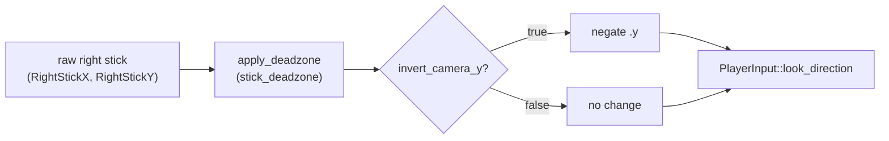
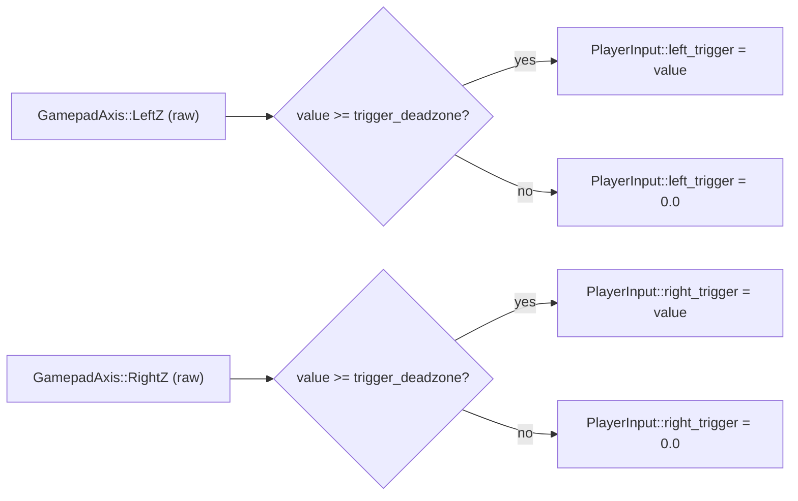

# Gamepad Settings Apply — Architecture Reference

**Date:** 2026-04-08
**Repo:** `adrakestory`
**Runtime:** Bevy 0.15 (ECS, `bevy::input::gamepad`)
**Purpose:** Document the current gamepad input architecture and define the target state for wiring `invert_camera_y` and `trigger_deadzone` from `GamepadSettings` into `gather_gamepad_input`. `camera_sensitivity` is intentionally left unwired.

---

## Changelog

| Version | Date | Author | Summary |
|---------|------|--------|---------|
| **v1** | **2026-04-08** | **Agent** | **Initial draft — confirmed via codebase read of `src/systems/game/gamepad.rs` and `src/editor/controller/input.rs`** |
| **v2** | **2026-04-08** | **Agent** | **Removed `camera_sensitivity` wiring — intentionally deferred; only `invert_camera_y` and `trigger_deadzone` are in scope. Resolved all open questions.** |

---

## Table of Contents

1. [Current Architecture](#1-current-architecture)
   - [Relevant Files](#11-relevant-files)
   - [GamepadSettings — Declared Fields](#12-gamepadsettings--declared-fields)
   - [gather_gamepad_input — What Is and Isn't Applied](#13-gather_gamepad_input--what-is-and-isnt-applied)
   - [Right-Stick Routing](#14-right-stick-routing)
   - [Trigger Handling](#15-trigger-handling)
2. [Target Architecture](#2-target-architecture)
   - [Design Principles](#21-design-principles)
   - [Modified Components](#22-modified-components)
   - [Inversion Flow](#23-inversion-flow)
   - [Trigger Deadzone Flow](#24-trigger-deadzone-flow)
   - [Code Changes — gather_gamepad_input](#25-code-changes--gather_gamepad_input)
   - [PlayerInput Extensions](#26-playerinput-extensions)
   - [Phase Boundaries](#27-phase-boundaries)
3. [Appendices](#appendix-a--open-questions--decisions)
   - [Appendix A — Open Questions & Decisions](#appendix-a--open-questions--decisions)
   - [Appendix B — Key File Locations](#appendix-b--key-file-locations)

---

## 1. Current Architecture

### 1.1 Relevant Files

| File | Purpose |
|------|---------|
| `src/systems/game/gamepad.rs` | All gamepad types and systems (`GamepadSettings`, `PlayerInput`, `gather_gamepad_input`, etc.) |
| `src/main.rs` | Inserts `GamepadSettings::default()` as a resource and registers gamepad systems |
| `src/editor/controller/input.rs` | Editor-only gamepad polling (reference for `GamepadAxis::LeftZ`/`RightZ` pattern) |

### 1.2 GamepadSettings — Declared Fields

```rust
pub struct GamepadSettings {
    pub stick_deadzone: f32,        // ✅ applied in gather_gamepad_input
    #[allow(dead_code)]
    pub trigger_deadzone: f32,      // ❌ not applied — 0.1 default
    #[allow(dead_code)]
    pub invert_camera_y: bool,      // ❌ not applied — false default
    #[allow(dead_code)]
    pub camera_sensitivity: f32,    // intentionally left unwired — 3.0 default
    pub movement_sensitivity: f32,  // ✅ applied in gather_gamepad_input
}
```

Two of five fields are being wired in this ticket (`trigger_deadzone`, `invert_camera_y`). `camera_sensitivity` remains dead code intentionally.

### 1.3 gather_gamepad_input — What Is and Isn't Applied

`gather_gamepad_input` already receives `Res<GamepadSettings>` but only reads two fields:

```rust
// Applied ✅
gamepad_movement = apply_deadzone(left_stick, settings.stick_deadzone)
                 * settings.movement_sensitivity;

// Applied ✅
gamepad_look_direction = apply_deadzone(right_stick, settings.stick_deadzone);

// NOT applied ❌ — inversion is missing here
// NOT applied ❌ — triggers are never polled
```

### 1.4 Right-Stick Routing

The right stick (`GamepadAxis::RightStickX` / `RightStickY`) feeds `PlayerInput::look_direction`, not `PlayerInput::camera_delta`. This is explicit in the code:

```rust
// Line 182-183:
// Camera delta is not used from right stick anymore
gamepad_camera = Vec2::ZERO;
```

`look_direction` drives character facing direction and, indirectly, camera tracking. `invert_camera_y` must therefore target the `look_direction` vector derived from the right stick.

### 1.5 Trigger Handling

Triggers are not polled at all in `gather_gamepad_input`. The editor uses two patterns (confirmed in `src/editor/controller/input.rs` and `src/editor/camera.rs`):

- `GamepadAxis::LeftZ` / `RightZ` — raw analog value in `[0.0, 1.0]`
- `GamepadButton::LeftTrigger2` / `RightTrigger2` — digital (pressed/just_pressed)

The digital button variants report pressed when Bevy's built-in threshold is exceeded. Applying a **custom** deadzone requires reading the axis value directly and comparing to `trigger_deadzone`.

---

## 2. Target Architecture

### 2.1 Design Principles

1. **No new systems** — all changes live inside `gather_gamepad_input`. See NFR-4.1.
2. **Triggers gate on axis, not button API** — to honour a custom deadzone, read `GamepadAxis::LeftZ`/`RightZ` and compare to `trigger_deadzone` rather than using `gamepad.pressed(GamepadButton::LeftTrigger2)`.
3. **Keyboard/mouse unaffected** — `gather_keyboard_input` has no dependency on `GamepadSettings` and must not be touched.
4. **`camera_sensitivity` stays unwired** — intentionally deferred; `#[allow(dead_code)]` remains on that field.

### 2.2 Modified Components

| Component | Change |
|-----------|--------|
| `GamepadSettings` | Remove `#[allow(dead_code)]` from `trigger_deadzone` and `invert_camera_y`. `camera_sensitivity` keeps its annotation. |
| `gather_gamepad_input` | Apply `invert_camera_y` to right-stick look vector and add trigger polling with `trigger_deadzone` gate. |
| `PlayerInput` | Add `left_trigger: f32` and `right_trigger: f32` fields (see §2.6) so trigger axis values are accessible to downstream systems. |

### 2.3 Inversion Flow

After deadzone, the right-stick vector has its Y component optionally negated before being stored in `look_direction`:



### 2.4 Trigger Deadzone Flow



Unlike sticks, trigger axes are not rescaled after the deadzone check — the raw value (or zero) is stored directly in `PlayerInput`.

### 2.5 Code Changes — gather_gamepad_input

The diff to `gather_gamepad_input` is minimal. Only the right-stick block and a new trigger block change:

```rust
// BEFORE (lines 176-183)
let right_stick = Vec2::new(
    gamepad.get(GamepadAxis::RightStickX).unwrap_or(0.0),
    gamepad.get(GamepadAxis::RightStickY).unwrap_or(0.0),
);
gamepad_look_direction = apply_deadzone(right_stick, settings.stick_deadzone);
// Camera delta is not used from right stick anymore
gamepad_camera = Vec2::ZERO;

// AFTER
let right_stick = Vec2::new(
    gamepad.get(GamepadAxis::RightStickX).unwrap_or(0.0),
    gamepad.get(GamepadAxis::RightStickY).unwrap_or(0.0),
);
let mut look = apply_deadzone(right_stick, settings.stick_deadzone);
if settings.invert_camera_y {
    look.y = -look.y;
}
gamepad_look_direction = look;
gamepad_camera = Vec2::ZERO; // unchanged — camera delta still not driven from right stick
```

Trigger block to add (after the button inputs block):

```rust
// Trigger axes — apply custom deadzone
let left_trigger_raw = gamepad.get(GamepadAxis::LeftZ).unwrap_or(0.0);
let right_trigger_raw = gamepad.get(GamepadAxis::RightZ).unwrap_or(0.0);
gamepad_left_trigger = if left_trigger_raw >= settings.trigger_deadzone { left_trigger_raw } else { 0.0 };
gamepad_right_trigger = if right_trigger_raw >= settings.trigger_deadzone { right_trigger_raw } else { 0.0 };
```

The two new local variables (`gamepad_left_trigger`, `gamepad_right_trigger`) map to the new `PlayerInput` fields in §2.6.

### 2.6 PlayerInput Extensions

Add two fields to `PlayerInput` to expose trigger values:

```rust
/// Left trigger axis value [0.0, 1.0], after trigger_deadzone is applied.
/// Zero when below deadzone.
pub left_trigger: f32,
/// Right trigger axis value [0.0, 1.0], after trigger_deadzone is applied.
/// Zero when below deadzone.
pub right_trigger: f32,
```

These default to `0.0` (consistent with `#[derive(Default)]`). `reset_player_input` already zeroes all fields via `*player_input = PlayerInput { input_source: source, ..default() }` — no change needed there.

### 2.7 Phase Boundaries

| Capability | Phase | Note |
|------------|-------|------|
| Apply `invert_camera_y` to right-stick look vector | Phase 1 | Core wire-up |
| Apply `trigger_deadzone` to `GamepadAxis::LeftZ`/`RightZ` | Phase 1 | Core wire-up |
| Add `left_trigger`/`right_trigger` to `PlayerInput` | Phase 1 | Required to expose trigger values downstream |
| `camera_sensitivity` wiring | Future | Intentionally deferred |
| Settings UI to expose these values to the player | Future | Separate ticket |
| Use `left_trigger`/`right_trigger` for game actions | Future | No game action is bound to triggers yet |

**MVP boundary:**

- ✅ Wire `invert_camera_y` and `trigger_deadzone` into `gather_gamepad_input`
- ✅ Remove `#[allow(dead_code)]` from `invert_camera_y` and `trigger_deadzone`
- ✅ Unit tests for Y-axis inversion
- ❌ `camera_sensitivity` wiring
- ❌ Settings persistence / save-load
- ❌ Settings UI
- ❌ Game actions bound to triggers

---

## Appendix A — Open Questions & Decisions

### Resolved

| # | Question | Resolution |
|---|----------|------------|
| 1 | Which `GamepadAxis` variant maps to triggers? | `GamepadAxis::LeftZ` (left trigger) and `GamepadAxis::RightZ` (right trigger) — confirmed in `src/editor/controller/input.rs`. |
| 2 | Does `invert_camera_y` target `camera_delta` or `look_direction`? | `look_direction` — the code comment at `gamepad.rs:182` confirms right-stick no longer drives `camera_delta`. |
| 3 | Should trigger deadzone use `GamepadButton::pressed` or axis threshold? | Axis threshold — `gamepad.pressed(GamepadButton::LeftTrigger2)` uses Bevy's internal threshold, not `trigger_deadzone`. To honour a custom deadzone, read `GamepadAxis::LeftZ`/`RightZ` directly. |
| 4 | Should `camera_sensitivity` be wired in this ticket? | No — intentionally deferred. `#[allow(dead_code)]` stays on that field. |

| 5 | Should trigger deadzone affect `just_pressed` detection (digital threshold) or raw axis value? | Raw axis value — read `GamepadAxis::LeftZ`/`RightZ` and gate on `value >= trigger_deadzone`. This is consistent with Q3: `GamepadButton` variants use Bevy's internal threshold and cannot honour a custom deadzone. |

### Open

_No open questions._

## Appendix B — Key File Locations

| Component | Path |
|-----------|------|
| `GamepadSettings` | `src/systems/game/gamepad.rs:21` |
| `PlayerInput` | `src/systems/game/gamepad.rs:65` |
| `gather_gamepad_input` | `src/systems/game/gamepad.rs:147` |
| `apply_deadzone` | `src/systems/game/gamepad.rs:94` |
| `reset_player_input` | `src/systems/game/gamepad.rs:334` |
| Editor trigger axis reference | `src/editor/controller/input.rs` |

---

*Created: 2026-04-08 — See [Changelog](#changelog) for version history.*
*Companion documents: [Requirements](./requirements.md) | [Ticket](./ticket.md)*
