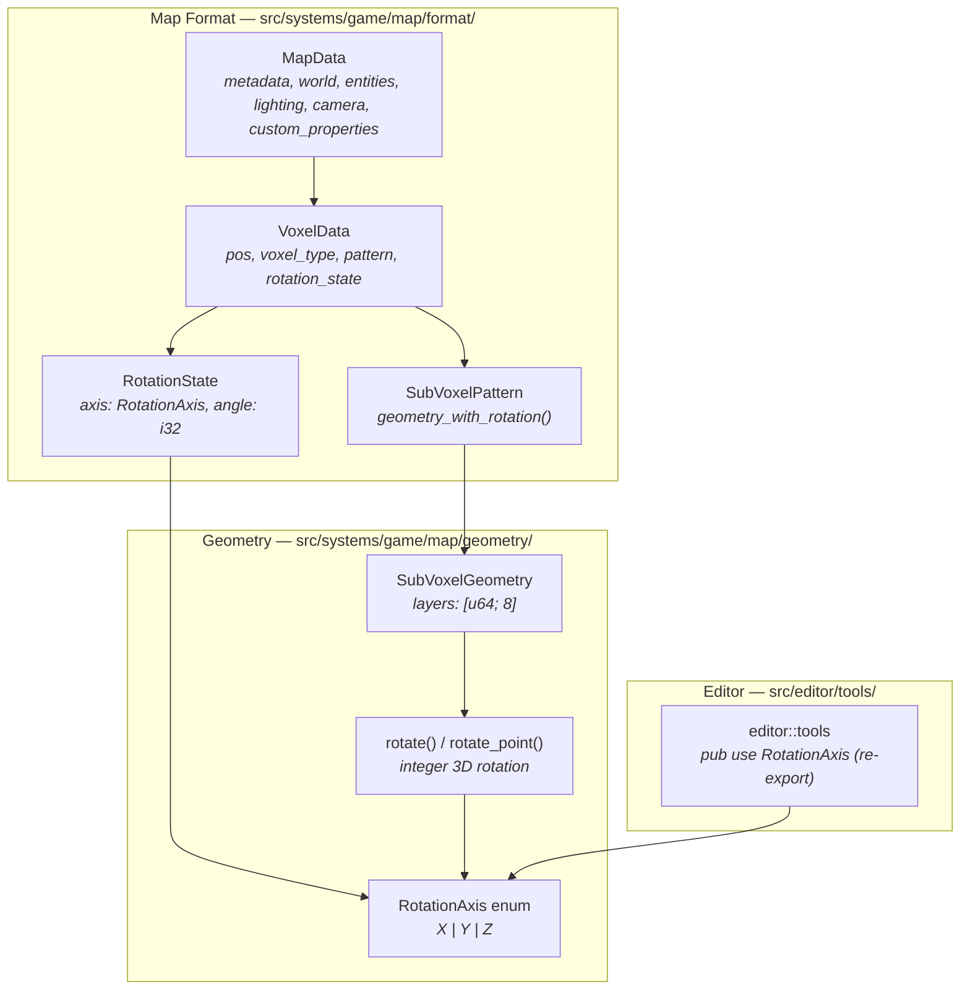
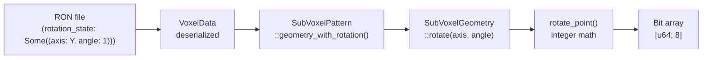
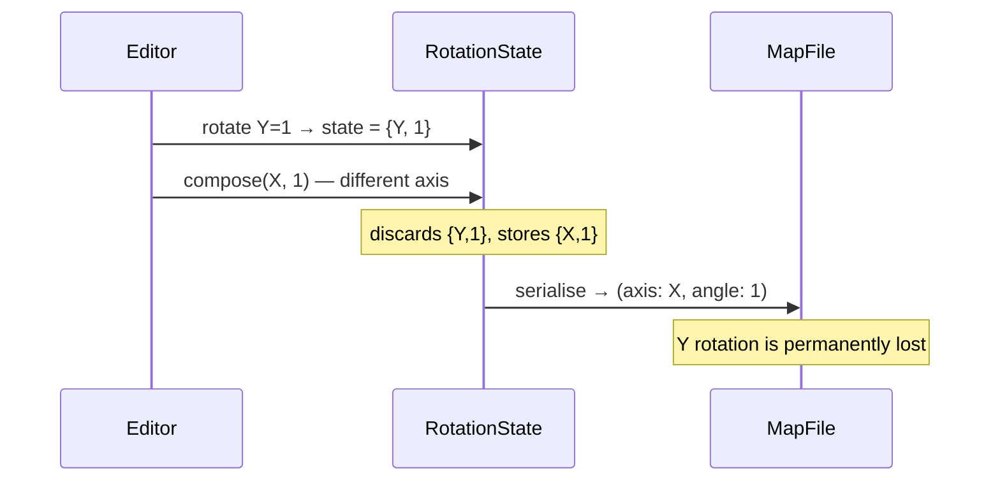
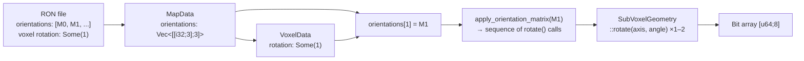
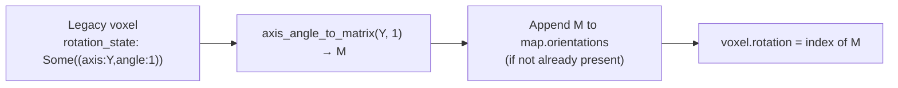
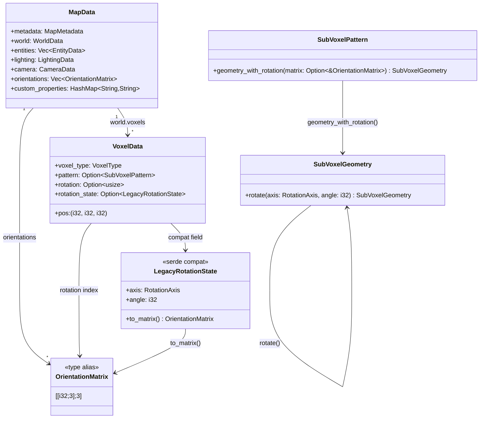
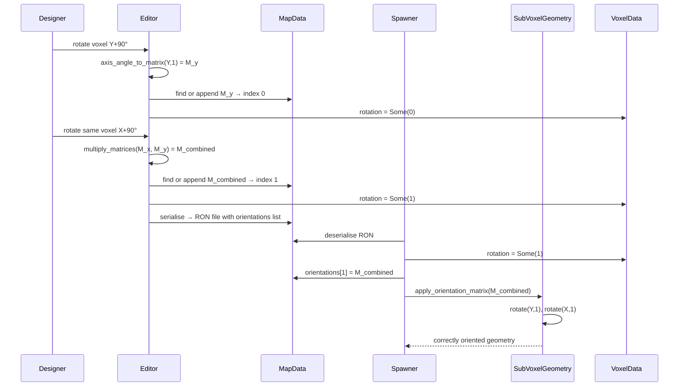

# Multi-Axis Voxel Rotation — Architecture Reference

**Date:** 2026-03-22  
**Repo:** `adrakestory`  
**Runtime:** Rust / Bevy ECS  
**Purpose:** Document the current rotation architecture and define the target architecture for fixing multi-axis rotation composition in the map format.

---

## Changelog

| Version | Date | Author | Summary |
|---------|------|--------|---------|
| v1 | 2026-03-22 | Investigation | Initial draft — analysis of current rotation model, proposed fix using 24-orientation index |
| v2 | 2026-03-22 | Investigation | Revised — orientation representation changed to top-level `orientations` list of 3×3 integer matrices; voxels reference by index. Q1 resolved. |
| **v3** | **2026-03-25** | **Investigation** | **All open questions resolved: Q4 — auto-migrate on next editor save; Q5 — `multiply_matrices()` lives in `format/rotation.rs`.** |

---

## Table of Contents

1. [Current Architecture](#1-current-architecture)
   - [Module Structure](#11-module-structure)
   - [Data Flow — Rotation at Map Load](#12-data-flow--rotation-at-map-load)
   - [RotationState — Current Design](#13-rotationstate--current-design)
   - [SubVoxelGeometry Rotation](#14-subvoxelgeometry-rotation)
   - [The Bug — compose() Data Loss](#15-the-bug--compose-data-loss)
2. [Target Architecture](#2-target-architecture)
   - [Design Principles](#21-design-principles)
   - [Orientation Representation — Map-Level Matrix Table](#22-orientation-representation--map-level-matrix-table)
   - [New and Modified Components](#23-new-and-modified-components)
   - [Data Flow — After Fix](#24-data-flow--after-fix)
   - [Class Diagram](#25-class-diagram)
   - [Sequence Diagram — Happy Path](#26-sequence-diagram--happy-path)
   - [Backward Compatibility](#27-backward-compatibility)
   - [Phase Boundaries](#28-phase-boundaries)
3. [Appendices](#appendix-a--key-file-locations)
   - [Appendix A — Key File Locations](#appendix-a--key-file-locations)
   - [Appendix B — 3×3 Integer Matrix Reference](#appendix-b--33-integer-matrix-reference)
   - [Appendix C — Open Questions & Decisions](#appendix-c--open-questions--decisions)

---

## 1. Current Architecture

### 1.1 Module Structure



### 1.2 Data Flow — Rotation at Map Load



Each voxel entry carries an optional `rotation_state`. At spawn time `geometry_with_rotation()` (`patterns.rs:109–120`) calls `SubVoxelGeometry::rotate()` with the stored axis and angle. `rotate()` iterates every occupied bit position and applies `rotate_point()`, which uses doubled-coordinate integer arithmetic centered on (3.5, 3.5, 3.5).

### 1.3 RotationState — Current Design

**File:** `src/systems/game/map/format/rotation.rs`

```rust
pub struct RotationState {
    pub axis: RotationAxis,   // X | Y | Z
    pub angle: i32,           // 0–3 (90° increments, normalised via rem_euclid(4))
}
```

`RotationState::compose(self, axis, angle)` adds angles when both share the same axis. For different axes it discards `self` and returns only the new rotation (`rotation.rs:32–36`). The code comment explicitly acknowledges this: *"A full implementation would compose the rotations properly."*

### 1.4 SubVoxelGeometry Rotation

**File:** `src/systems/game/map/geometry/rotation.rs`

`SubVoxelGeometry::rotate(axis, angle)` is correct — it iterates all set bits and applies `rotate_point()`. `rotate_point()` implements exact 90°-increment rotation matrices in integer doubled-coordinate space:

| Axis | Angle | Transform (doubled coords) |
|------|-------|--------------------------|
| Y | 1 | (cz, cy, −cx) |
| Y | 2 | (−cx, cy, −cz) |
| Y | 3 | (−cz, cy, cx) |
| X | 1 | (cx, −cz, cy) |
| X | 2 | (cx, −cy, −cz) |
| Z | 1 | (−cy, cx, cz) |
| Z | 2 | (−cx, −cy, cz) |

The geometry layer is not the source of the bug. The bug is exclusively in the `RotationState` format type.

### 1.5 The Bug — compose() Data Loss



The 24 distinct 90°-grid orientations form the rotation group of the cube (chiral octahedral symmetry, order 24). The current `RotationState` can only encode 12 distinct states (3 axes × 4 angles) and cannot represent any orientation that requires non-zero components around two axes simultaneously.

---

## 2. Target Architecture

### 2.1 Design Principles

1. **Matrix is the source of truth** — a 3×3 integer rotation matrix explicitly encodes the full orientation; no axis/angle composition is needed at runtime (FR-2.1.1, FR-2.4.3).
2. **Orientations live in the map file, not in code** — the `orientations` list is a top-level field on `MapData`; the engine carries no hardcoded orientation table (FR-2.1.1).
3. **Sparse by design** — only matrices actually used in the map are present; maps without rotated voxels have an empty list (FR-2.1.2).
4. **Integer-only arithmetic** — matrix entries are `i32`; no `f32` introduced (NFR-3.1).
5. **Backward compatibility via serde shim** — old `rotation_state: Some((axis, angle))` syntax loads transparently (FR-2.3.1).
6. **No changes to the geometry layer** — `SubVoxelGeometry::rotate()` and `rotate_point()` are correct and untouched (NFR-3.4).

### 2.2 Orientation Representation — Map-Level Matrix Table

A new top-level field `orientations` is added to `MapData`. It is a `Vec` of 3×3 integer matrices. Each matrix represents one distinct orientation used somewhere in the map.

**RON — map root (new form):**
```ron
(
    metadata: ( ... ),
    world: ( ... ),
    entities: [ ... ],
    lighting: ( ... ),
    camera: ( ... ),
    orientations: [
        [[1, 0, 0], [0, 0, -1], [0, 1, 0]],   // index 0 — X+90°
        [[0, 0, 1], [0, 1, 0], [-1, 0, 0]],   // index 1 — Y+90°
    ],
    custom_properties: {},
)
```

**RON — voxel with rotation:**
```ron
(pos: (3, 1, 2), voxel_type: Stone, pattern: Some(StaircaseX), rotation: Some(0))
```

**RON — voxel without rotation (identity, field absent):**
```ron
(pos: (0, 0, 0), voxel_type: Grass)
```

The matrix represents the linear map applied to the sub-voxel coordinate space. For a 90°-grid rotation, all entries are in {−1, 0, 1} with exactly one non-zero per row and column, and determinant = 1.

**Composition in the editor** — when the user applies a new single-axis 90° rotation `R_new` to a voxel currently at orientation matrix `M`, the editor computes `M' = R_new × M` using integer 3×3 matrix multiplication. It then looks for `M'` in the map's orientations list (equality by value); if not found, appends it. The voxel's `rotation` field is set to the resulting index.

### 2.3 New and Modified Components

**New:**

| Component | File | Purpose |
|-----------|------|---------|
| `OrientationMatrix` type alias | `src/systems/game/map/format/rotation.rs` | `type OrientationMatrix = [[i32; 3]; 3]` — the stored representation |
| `apply_orientation_matrix()` fn | `src/systems/game/map/format/rotation.rs` | Converts a matrix to the equivalent sequence of `SubVoxelGeometry::rotate()` calls |
| `axis_angle_to_matrix()` fn | `src/systems/game/map/format/rotation.rs` | Converts legacy `(RotationAxis, i32)` to a 3×3 matrix for the shim |
| `multiply_matrices()` fn | `src/systems/game/map/format/rotation.rs` | Integer 3×3 matrix multiplication for the editor composition path |

**Modified:**

| Component | File | Change |
|-----------|------|--------|
| `MapData` | `src/systems/game/map/format/mod.rs:25` | Add `#[serde(default)] pub orientations: Vec<OrientationMatrix>` field |
| `VoxelData` | `src/systems/game/map/format/world.rs:22` | Replace `rotation_state: Option<RotationState>` with `#[serde(default)] rotation: Option<usize>`. Add `#[serde(default)] rotation_state: Option<LegacyRotationState>` for backward compat. |
| `SubVoxelPattern::geometry_with_rotation()` | `src/systems/game/map/format/patterns.rs:109` | Accept `Option<&OrientationMatrix>` instead of `Option<RotationState>`; call `apply_orientation_matrix()` |
| `spawner/chunks.rs` | `src/systems/game/map/spawner/chunks.rs` | Pass `map_data.orientations.get(voxel.rotation?)` to `geometry_with_rotation()` |
| Editor rotation composition | `src/editor/tools/input/helpers.rs` | Replace `RotationState::compose()` calls with `multiply_matrices()` + deduplication into `map_data.orientations` |
| `validation.rs` | `src/systems/game/map/validation.rs` | Add: (a) validate each matrix is a valid 90°-grid rotation; (b) validate each voxel's rotation index is in-bounds |

No changes required to `SubVoxelGeometry`, `rotate_point()`, or `RotationAxis`.

### 2.4 Data Flow — After Fix



For legacy files, an additional shim pass runs before this flow:



### 2.5 Class Diagram



### 2.6 Sequence Diagram — Happy Path

Multi-axis rotation applied in the editor, saved, and loaded:



### 2.7 Backward Compatibility

Legacy voxels carry `rotation_state: Some((axis: Y, angle: 1))`. The shim field on `VoxelData` captures this during deserialisation. A post-deserialisation pass (run in the loader before validation) converts all legacy fields:

```rust
// In the map loader, after RON parse, before validate_map():
fn migrate_legacy_rotations(map: &mut MapData) {
    for voxel in &mut map.world.voxels {
        if let Some(legacy) = voxel.rotation_state.take() {
            let matrix = legacy.to_matrix();
            let index = map.orientations.iter().position(|m| m == &matrix)
                .unwrap_or_else(|| {
                    map.orientations.push(matrix);
                    map.orientations.len() - 1
                });
            voxel.rotation = Some(index);
        }
    }
}
```

After migration the voxel proceeds through the normal `rotation: Some(index)` path. The `rotation_state` field is not written on save — when the editor re-saves the file, all voxels will use the new `rotation` field.

### 2.8 Phase Boundaries

| Capability | Phase | Notes |
|------------|-------|-------|
| `orientations` field on `MapData` | Phase 1 | Core format change |
| `rotation: Option<usize>` on `VoxelData` | Phase 1 | Core format change |
| Legacy `rotation_state` migration shim | Phase 1 | Required for backward compat |
| `apply_orientation_matrix()` + `axis_angle_to_matrix()` | Phase 1 | Required for geometry |
| `multiply_matrices()` in editor | Phase 1 | Required for correct composition |
| Validation of matrix validity and index bounds | Phase 1 | Required |
| Unit tests for all paths | Phase 1 | Required |
| Editor properties panel shows orientation label | Phase 2 | UI only |
| Editor garbage-collects unused orientations on save | Phase 2 | Optimisation |

**MVP boundary:**

- ✅ All 24 orientations representable via explicit matrices in the file
- ✅ Multi-axis composition produces correct matrices
- ✅ Legacy single-axis files load unchanged via migration shim
- ✅ Invalid matrices and out-of-bounds indices rejected at validation
- ❌ No UI changes in Phase 1
- ❌ Staircase double-rotation and Fence rotation issues not addressed

---

## Appendix A — Key File Locations

| Component | Path |
|-----------|------|
| `MapData` | `src/systems/game/map/format/mod.rs:25` |
| `VoxelData` | `src/systems/game/map/format/world.rs:22` |
| `RotationState` (current, to be replaced) | `src/systems/game/map/format/rotation.rs` |
| `RotationAxis` | `src/systems/game/map/geometry/mod.rs:19` |
| `SubVoxelPattern::geometry_with_rotation()` | `src/systems/game/map/format/patterns.rs:109` |
| `SubVoxelGeometry::rotate()` | `src/systems/game/map/geometry/rotation.rs:15` |
| `rotate_point()` | `src/systems/game/map/geometry/rotation.rs:38` |
| Spawner (voxel spawn loop) | `src/systems/game/map/spawner/chunks.rs` |
| Editor rotation composition | `src/editor/tools/input/helpers.rs` |
| Geometry tests | `src/systems/game/map/geometry/tests.rs` |
| Validation | `src/systems/game/map/validation.rs` |

---

## Appendix B — 3×3 Integer Matrix Reference

Each of the 24 90°-grid orientations expressed as a 3×3 integer matrix. Row vectors represent where X, Y, Z unit vectors map to. Identity is index 0.

| Index | Matrix (row = [X_out, Y_out, Z_out]) | Equivalent to |
|-------|--------------------------------------|---------------|
| 0 | `[[1,0,0],[0,1,0],[0,0,1]]` | Identity |
| 1 | `[[0,0,1],[0,1,0],[-1,0,0]]` | Y+90° |
| 2 | `[[-1,0,0],[0,1,0],[0,0,-1]]` | Y+180° |
| 3 | `[[0,0,-1],[0,1,0],[1,0,0]]` | Y+270° |
| 4 | `[[1,0,0],[0,0,-1],[0,1,0]]` | X+90° |
| 5 | `[[0,0,1],[1,0,0],[0,1,0]]` | X+90°, Y+90° |
| 6 | `[[-1,0,0],[0,0,-1],[0,-1,0]]` | X+90°, Y+180° |
| 7 | `[[0,0,-1],[-1,0,0],[0,-1,0]]` | X+90°, Y+270° |
| 8 | `[[1,0,0],[0,-1,0],[0,0,-1]]` | X+180° |
| 9 | `[[0,0,-1],[0,-1,0],[-1,0,0]]` | X+180°, Y+90° |
| 10 | `[[-1,0,0],[0,-1,0],[0,0,1]]` | X+180°, Y+180° |
| 11 | `[[0,0,1],[0,-1,0],[1,0,0]]` | X+180°, Y+270° |
| 12 | `[[1,0,0],[0,0,1],[0,-1,0]]` | X+270° |
| 13 | `[[0,0,-1],[1,0,0],[0,-1,0]]` | X+270°, Y+90° |
| 14 | `[[-1,0,0],[0,0,1],[0,1,0]]` | X+270°, Y+180° |
| 15 | `[[0,0,1],[-1,0,0],[0,1,0]]` | X+270°, Y+270° |
| 16 | `[[0,-1,0],[1,0,0],[0,0,1]]` | Z+90° |
| 17 | `[[0,0,1],[1,0,0],[0,1,0]]` | Z+90°, Y+90° |
| 18 | `[[0,1,0],[-1,0,0],[0,0,1]]` | Z+90°, Y+180° |
| 19 | `[[0,0,-1],[-1,0,0],[0,-1,0]]` | Z+90°, Y+270° |
| 20 | `[[0,1,0],[-1,0,0],[0,0,1]]` | Z+270° |
| 21 | `[[0,0,-1],[1,0,0],[0,1,0]]` | Z+270°, Y+90° |
| 22 | `[[0,-1,0],[1,0,0],[0,0,1]]` | Z+270°, Y+180° |
| 23 | `[[0,0,1],[-1,0,0],[0,-1,0]]` | Z+270°, Y+270° |

> Note: These matrices should be verified by unit tests against direct `SubVoxelGeometry::rotate()` calls before the implementation is finalised.

---

## Appendix C — Open Questions & Decisions

### Resolved

| # | Question | Resolution |
|---|----------|------------|
| 1 | Should integer rotation math change? | No — `rotate_point()` is correct and untouched. |
| 2 | Does the fix affect the `Fence` pattern? | No — Fence bypasses `geometry_with_rotation()` and is a separate issue. |
| 3 | Index vs. sequence vs. matrix format in the RON file? | **Matrix:** a top-level `orientations: Vec<[[i32;3];3]>` list in `MapData`; voxels store `rotation: Option<usize>` index into that list. Human-readable, lossless, no hardcoded table in code. |

### Open

*All questions resolved.*

| # | Question | Resolution |
|---|----------|------------|
| 4 | Should existing maps be re-serialised to the new format on next editor save, or only on explicit "re-save"? | **Auto-migrate on next save.** The loader migrates in memory; the file is updated the next time the user saves from the editor. No explicit action required. The file is only written when the user saves, so there is no silent diff on read-only use. |
| 5 | Does `multiply_matrices()` belong in `format/rotation.rs` or in the editor module? | **`format/rotation.rs`.** This makes it available to both the editor and the loader/validator without cross-module dependency issues. |

---

*Created: 2026-03-22 — See [Changelog](#changelog) for version history.*  
*Companion documents: [Requirements](./requirements.md) | [Ticket](../ticket.md)*  
*Source: `docs/investigations/2026-03-22-1427-map-format-analysis.md` — Finding 1*
