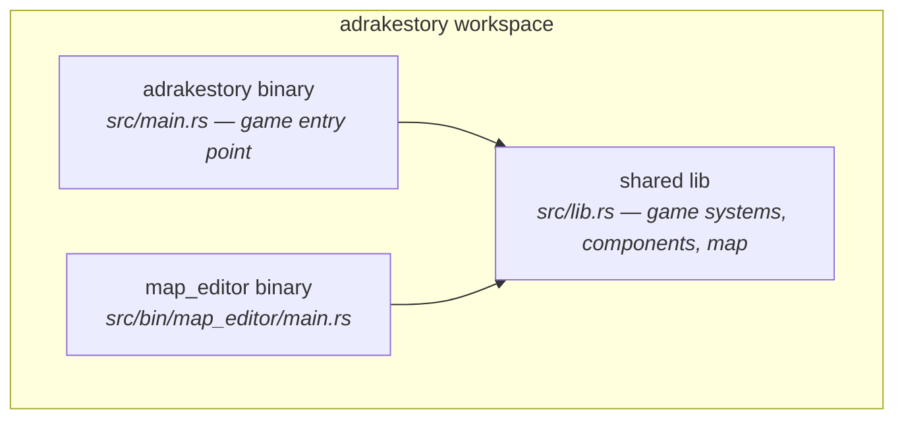
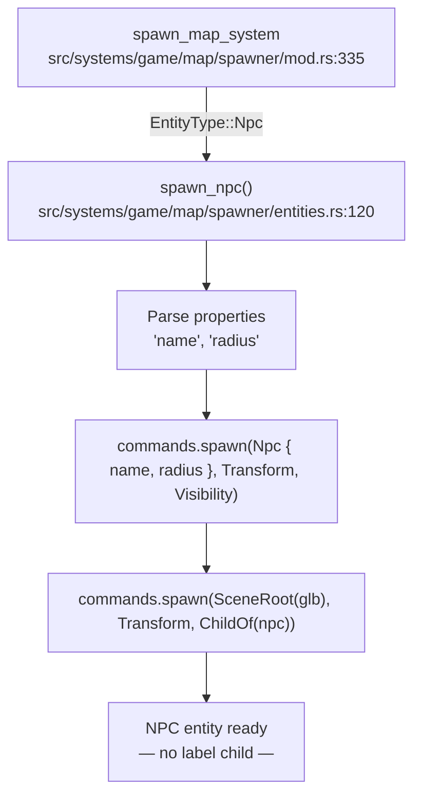
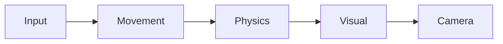
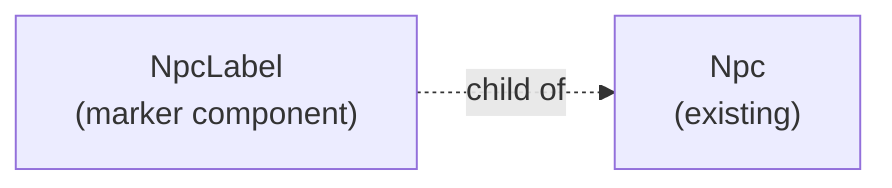
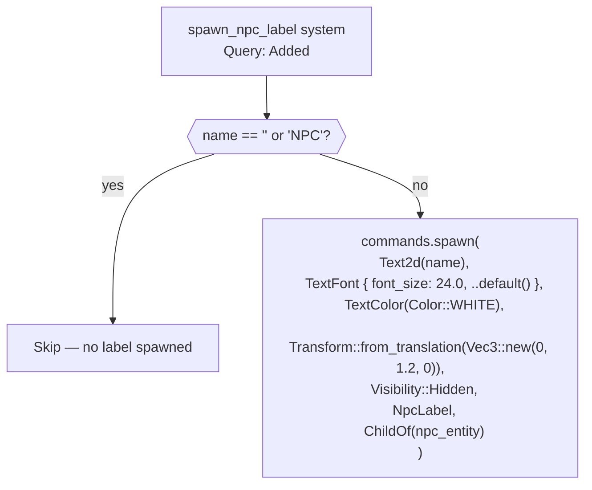
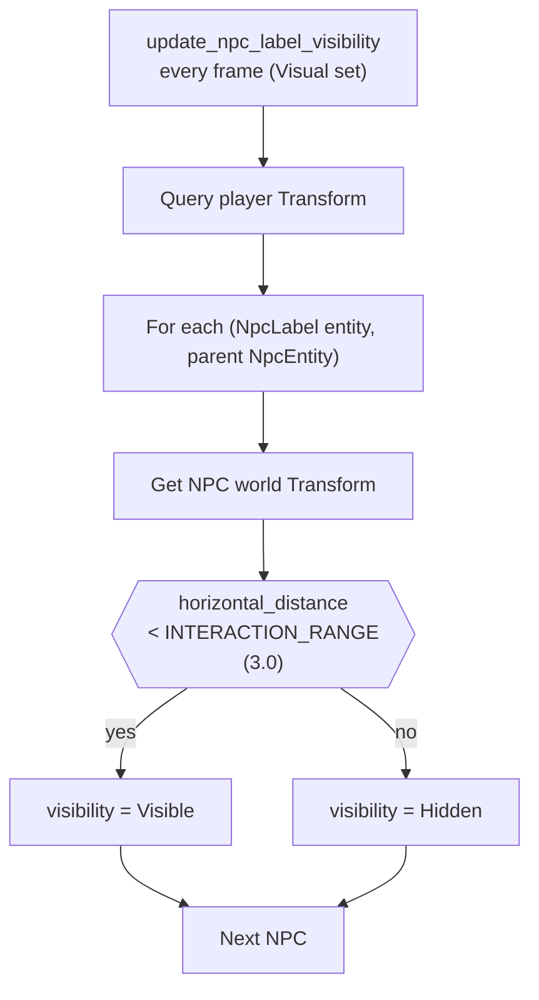
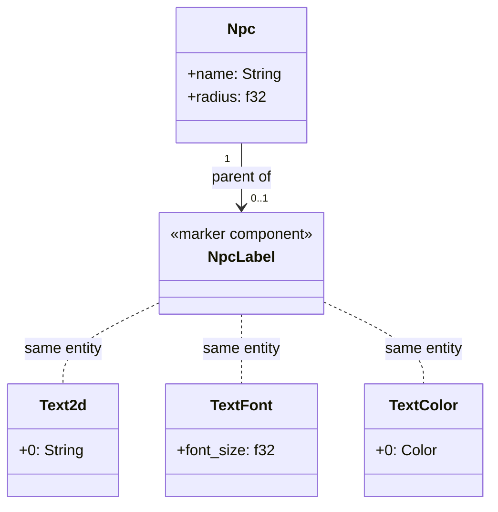
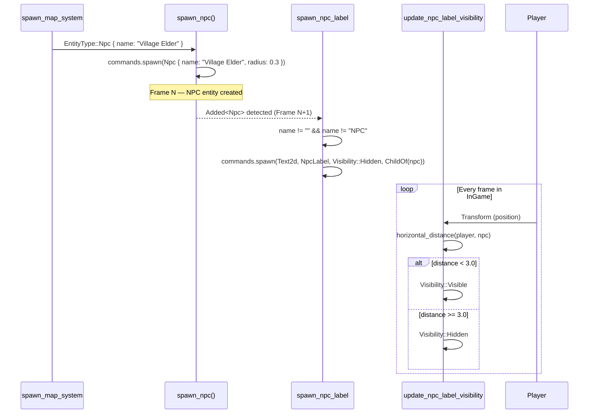
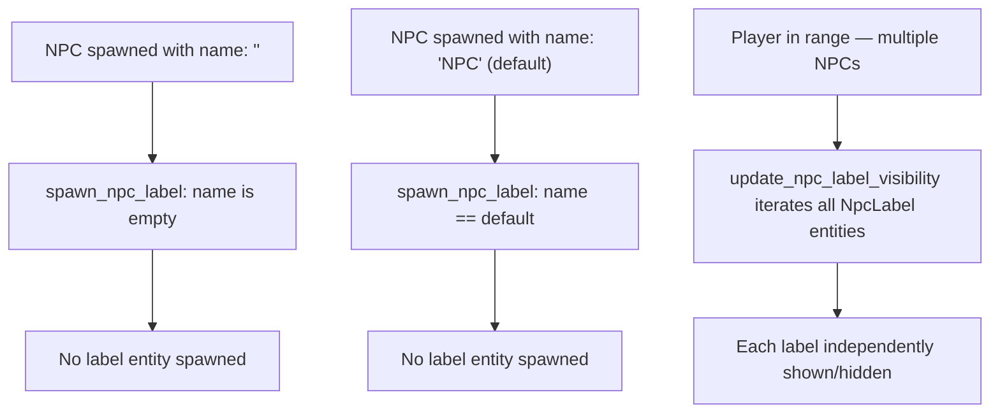

# NPC Display Names — Architecture Reference

**Date:** 2026-04-02
**Repo:** `adrakestory`
**Runtime:** Bevy 0.18 (ECS, Rust)
**Purpose:** Document current NPC architecture and define the target architecture for world-space NPC name labels.

---

## Changelog

| Version | Date | Author | Summary |
|---------|------|--------|---------|
| v1 | 2026-04-02 | OpenCode | Initial draft — codebase-validated against Bevy 0.18 source |
| **v2** | **2026-04-02** | **OpenCode** | **Resolved open questions 4/5/6: labels visible during Paused, Y offset 1.2 (to be tuned post-impl), filter is case-sensitive "NPC" only** |

---

## Table of Contents

1. [Current Architecture](#1-current-architecture)
   - [Solution Structure](#11-solution-structure)
   - [NPC Spawn Flow](#12-npc-spawn-flow)
   - [Entity Hierarchy — NPC (Current)](#13-entity-hierarchy--npc-current)
   - [Relevant Systems](#14-relevant-systems)
   - [System Set Ordering](#15-system-set-ordering)
2. [Target Architecture — NPC Display Names](#2-target-architecture--npc-display-names)
   - [Design Principles](#21-design-principles)
   - [New Components](#22-new-components)
   - [Modified Components](#23-modified-components)
   - [Entity Hierarchy — NPC (Target)](#24-entity-hierarchy--npc-target)
   - [Spawn Flow (Target)](#25-spawn-flow-target)
   - [Visibility Update Flow](#26-visibility-update-flow)
   - [Class Diagram](#27-class-diagram)
   - [Sequence Diagram — Happy Path](#28-sequence-diagram--happy-path)
   - [Edge Case Flow](#29-edge-case-flow)
   - [System Registration](#210-system-registration)
   - [Phase Boundaries](#211-phase-boundaries)
3. [Appendices](#appendix-a--data-schema)
   - [Appendix A — Data Schema](#appendix-a--data-schema)
   - [Appendix B — Open Questions & Decisions](#appendix-b--open-questions--decisions)
   - [Appendix C — Key File Locations](#appendix-c--key-file-locations)
   - [Appendix D — Code Templates](#appendix-d--code-templates)

---

## 1. Current Architecture

### 1.1 Solution Structure



The two binaries share all game code through `src/lib.rs`. NPC spawning and the new label systems live in the shared lib and are gated to `GameState::InGame`, which the editor never enters.

### 1.2 NPC Spawn Flow



`spawn_map_system` is called once during `GameState::LoadingMap` after `LoadedMapData` is available. Each `EntityType::Npc` in the map's `entities` list calls `spawn_npc`.

### 1.3 Entity Hierarchy — NPC (Current)

```
NpcEntity (root)
│  Transform (world position)
│  Visibility
│  Npc { name: String, radius: f32 }
│
└─ CharacterModelChild
      SceneRoot("characters/base_basic_pbr.glb#Scene0")
      Transform { translation: (0, -0.3, 0), scale: (0.5, 0.5, 0.5) }
      ChildOf(NpcEntity)
```

No label child exists. `Npc::name` is marked `#[allow(dead_code)]` — it is populated but never read.

### 1.4 Relevant Systems

| System | File | What It Does |
|--------|------|-------------|
| `spawn_map_system` | `src/systems/game/map/spawner/mod.rs:335` | Calls `spawn_npc` for each `EntityType::Npc` in map data |
| `apply_npc_collision` | `src/systems/game/physics.rs:190` | Pushes player away from NPCs using `Npc::radius` |
| `rotate_character_model` | `src/systems/game/visual.rs` | Rotates the character model child of both player and NPC |

No system currently reads `Npc::name`.

### 1.5 System Set Ordering



All five sets are chained inside `GameState::InGame`. The `Visual` set also runs during `GameState::Paused`. New NPC label systems belong in `Visual`.

---

## 2. Target Architecture — NPC Display Names

### 2.1 Design Principles

1. **Additive only** — No existing components, systems, or map data structures are changed. Two new systems are added; `Npc::name` gains its first reader.
2. **ECS child entity pattern** — The label is a child entity of the NPC, matching the existing `ChildOf` parenting convention used for character model children.
3. **No third-party crates** — Uses Bevy 0.18's built-in `Text2d` component for world-space text rendering (NFR-3.2).
4. **State-gated** — Both systems run in `GameState::InGame` and `GameState::Paused` (labels stay visible on the pause screen), consistent with the existing Visual-set `.run_if` condition.
5. **Default-font only** — Uses Bevy's embedded default font; no font asset file is added to `assets/` (Assumption 4 in requirements).
6. **Small NPC set, direct query** — NPC entities are not in `SpatialGrid`. Direct ECS query iteration is O(n) over the (expected small) NPC set, which is acceptable (NFR-3.1, Assumption 5).

### 2.2 New Components



| Component | File | Purpose |
|-----------|------|---------|
| `NpcLabel` | `src/systems/game/components.rs` | Zero-size marker component on the label child entity, used to query label entities in the visibility system |

| System | File | Purpose |
|--------|------|---------|
| `spawn_npc_label` | `src/systems/game/npc_labels.rs` | Runs once per NPC via `Added<Npc>` query; spawns a `Text2d` child entity if name is non-default |
| `update_npc_label_visibility` | `src/systems/game/npc_labels.rs` | Runs every frame; shows/hides each `NpcLabel` entity based on player distance |

Both systems are placed in a new focused file `src/systems/game/npc_labels.rs`, consistent with the file-size guidelines in `AGENTS.md` (single responsibility, ~200–400 lines target).

### 2.3 Modified Components

| Component | Change |
|-----------|--------|
| `Npc` in `src/systems/game/components.rs:58` | Remove `#[allow(dead_code)]` from `name` field (FR-NFR-3.4) |
| `src/main.rs` | Register `spawn_npc_label` and `update_npc_label_visibility` under `GameSystemSet::Visual` |
| `src/systems/game/mod.rs` (or equivalent) | Add `pub mod npc_labels;` to export the new module |

### 2.4 Entity Hierarchy — NPC (Target)

```
NpcEntity (root)
│  Transform (world position)
│  Visibility
│  Npc { name: String, radius: f32 }
│
├─ CharacterModelChild                       ← unchanged
│     SceneRoot("characters/base_basic_pbr.glb#Scene0")
│     Transform { translation: (0, -0.3, 0), scale: (0.5, 0.5, 0.5) }
│     ChildOf(NpcEntity)
│
└─ LabelChild                                ← NEW
      Text2d(name_string)
      TextFont { font_size: 24.0, ..default() }
      TextColor(Color::WHITE)
      Transform { translation: (0, 1.2, 0) }
      Visibility::Hidden  (default; shown by update system)
      NpcLabel             (marker)
      ChildOf(NpcEntity)
```

### 2.5 Spawn Flow (Target)



The `Added<Npc>` filter ensures the system only processes newly-spawned NPCs, not every NPC every frame.

### 2.6 Visibility Update Flow



`horizontal_distance` is computed on X and Z only (same convention as `apply_npc_collision` in `physics.rs:209`), ignoring Y to handle height differences gracefully.

### 2.7 Class Diagram



### 2.8 Sequence Diagram — Happy Path



### 2.9 Edge Case Flow



### 2.10 System Registration

Both new systems are added to `src/main.rs` in the existing `GameSystemSet::Visual` block:

```rust
// src/main.rs — inside the Visual system set registration
.add_systems(
    Update,
    (
        rotate_character_model,
        update_collision_box,
        update_flashlight_rotation,
        sync_light_sources,
        update_chunk_lods,
        update_cursor_visibility,
        apply_shadow_quality_system,
        // NEW:
        spawn_npc_label,
        update_npc_label_visibility,
    )
        .in_set(GameSystemSet::Visual)
        .run_if(in_state(GameState::InGame).or(in_state(GameState::Paused))),
)
```

The constant `INTERACTION_RANGE` is defined in `npc_labels.rs`:

```rust
const INTERACTION_RANGE: f32 = 3.0;
```

### 2.11 Phase Boundaries

| Capability | Phase | Architectural Impact |
|------------|-------|---------------------|
| `spawn_npc_label` system | Phase 1 | New file `npc_labels.rs`; `NpcLabel` marker component added to `components.rs` |
| `update_npc_label_visibility` system | Phase 1 | Reads Player and NpcLabel queries; no new resources |
| `#[allow(dead_code)]` removal from `Npc::name` | Phase 1 | One-line change in `components.rs` |
| Unit tests (spawn / no-spawn) | Phase 1 | `#[cfg(test)]` module at bottom of `npc_labels.rs` |
| Per-NPC configurable range (`"label_range"` property) | Phase 2 | Requires `spawn_npc` to parse additional map property and store on label entity |
| Custom font asset | Phase 2 | Requires `.ttf` in `assets/fonts/`, `AssetServer::load`, handle stored as resource |
| Smooth fade-in/out | Phase 2 | Replace `Visibility` toggle with alpha tween via `TextColor` |
| NPC name in screen-space dialogue HUD | Future | New UI overlay system; separate ticket |
| Map editor NPC name input | Future | Editor-only; out of scope for this ticket |

**MVP boundary:**

- ✅ World-space `Text2d` label above NPC
- ✅ Show/hide on player proximity (3.0 world units)
- ✅ Suppress label for default (`"NPC"`) or empty names
- ✅ Unit tests for spawn and no-spawn paths
- ❌ Custom fonts
- ❌ Fade animation
- ❌ Dialogue HUD
- ❌ Editor UI

---

## Appendix A — Data Schema

### `Npc` component (unchanged)

```rust
// src/systems/game/components.rs:58
#[derive(Component)]
pub struct Npc {
    pub name: String,   // populated from map properties["name"], default "NPC"
    pub radius: f32,    // populated from map properties["radius"], default 0.3
}
```

### `NpcLabel` marker component (new)

```rust
// src/systems/game/components.rs  (append)
/// Marker component for the world-space text label child of an Npc entity.
#[derive(Component)]
pub struct NpcLabel;
```

### Map data (no change)

```ron
// assets/maps/default.ron — example NPC entry (existing format)
(
    entity_type: Npc,
    position: (9.5, 1.0, 5.5),
    properties: {
        "name": "Village Elder",
    },
),
```

---

## Appendix B — Open Questions & Decisions

### Resolved

| # | Question | Resolution |
|---|----------|------------|
| 1 | Use `Text2d` (world-space) or egui overlay for labels? | `Text2d` — ticket NFR requires no third-party crates; egui is map-editor-only. |
| 2 | Should `NpcLabel` be a separate file or added to `components.rs`? | Added to `components.rs` (zero-size marker; too small for its own file). |
| 3 | Should spawn use `Added<Npc>` filter or a one-shot system? | `Added<Npc>` filter — idiomatic Bevy pattern, handles hot reload correctly. |
| 4 | Should labels remain visible during `GameState::Paused`? | Yes — Visual set already runs during Paused; no change to the `.run_if` condition needed. |
| 5 | Exact Y offset for label (currently `1.2`)? | `1.2` is the initial best-guess; will be tuned after implementation and in-game review. |
| 6 | Case-insensitive filter for default name (`"npc"`)? | Case-sensitive only — suppress `""` and exact `"NPC"`, not `"npc"` or other variants. |

### Open

No open questions.

---

## Appendix C — Key File Locations

| Component | Path |
|-----------|------|
| `Npc` component definition | `src/systems/game/components.rs:58` |
| `NpcLabel` marker (to be added) | `src/systems/game/components.rs` |
| `spawn_npc()` function | `src/systems/game/map/spawner/entities.rs:120` |
| `spawn_map_system` | `src/systems/game/map/spawner/mod.rs:335` |
| `apply_npc_collision` | `src/systems/game/physics.rs:190` |
| `GameSystemSet` enum | `src/main.rs:74` |
| Visual system set registration | `src/main.rs:254` |
| New: `npc_labels.rs` (systems + tests) | `src/systems/game/npc_labels.rs` |
| Map entity format | `src/systems/game/map/format/entities.rs` |
| Example NPC in default map | `assets/maps/default.ron:3781` |

---

## Appendix D — Code Templates

### `NpcLabel` marker component

```rust
/// Marker component on the world-space text label child of an `Npc` entity.
#[derive(Component)]
pub struct NpcLabel;
```

### `spawn_npc_label` system

```rust
const INTERACTION_RANGE: f32 = 3.0;
const LABEL_Y_OFFSET: f32 = 1.2;

pub fn spawn_npc_label(
    mut commands: Commands,
    query: Query<(Entity, &Npc), Added<Npc>>,
) {
    for (npc_entity, npc) in &query {
        if npc.name.is_empty() || npc.name == "NPC" {
            continue;
        }
        commands.spawn((
            Text2d::new(npc.name.clone()),
            TextFont {
                font_size: 24.0,
                ..default()
            },
            TextColor(Color::WHITE),
            Transform::from_translation(Vec3::new(0.0, LABEL_Y_OFFSET, 0.0)),
            Visibility::Hidden,
            NpcLabel,
            ChildOf(npc_entity),
        ));
    }
}
```

### `update_npc_label_visibility` system

```rust
pub fn update_npc_label_visibility(
    player_query: Query<&Transform, With<Player>>,
    npc_query: Query<&Transform, With<Npc>>,
    mut label_query: Query<(&mut Visibility, &ChildOf), With<NpcLabel>>,
) {
    let Ok(player_transform) = player_query.single() else {
        return;
    };
    let player_pos = player_transform.translation;

    for (mut visibility, parent) in &mut label_query {
        let Ok(npc_transform) = npc_query.get(parent.0) else {
            continue;
        };
        let npc_pos = npc_transform.translation;
        let dx = player_pos.x - npc_pos.x;
        let dz = player_pos.z - npc_pos.z;
        let horizontal_distance = (dx * dx + dz * dz).sqrt();

        *visibility = if horizontal_distance < INTERACTION_RANGE {
            Visibility::Visible
        } else {
            Visibility::Hidden
        };
    }
}
```

### Unit test skeleton

```rust
#[cfg(test)]
mod tests {
    use super::*;
    use bevy::prelude::*;

    fn setup_app() -> App {
        let mut app = App::new();
        app.add_systems(Update, spawn_npc_label);
        app
    }

    #[test]
    fn test_label_spawned_for_named_npc() {
        let mut app = setup_app();
        app.world_mut().spawn(Npc {
            name: "Village Elder".to_string(),
            radius: 0.3,
        });
        app.update();
        let label_count = app.world().query::<&NpcLabel>().iter(app.world()).count();
        assert_eq!(label_count, 1);
    }

    #[test]
    fn test_no_label_for_default_npc_name() {
        let mut app = setup_app();
        app.world_mut().spawn(Npc::default()); // name: "NPC"
        app.update();
        let label_count = app.world().query::<&NpcLabel>().iter(app.world()).count();
        assert_eq!(label_count, 0);
    }

    #[test]
    fn test_no_label_for_empty_npc_name() {
        let mut app = setup_app();
        app.world_mut().spawn(Npc { name: "".to_string(), radius: 0.3 });
        app.update();
        let label_count = app.world().query::<&NpcLabel>().iter(app.world()).count();
        assert_eq!(label_count, 0);
    }
}
```

---

*Created: 2026-04-02 — See [Changelog](#changelog) for version history.*
*Based on: `docs/bugs/npc-display-names/ticket.md`, codebase exploration of `src/systems/game/`*
*Companion documents: [Requirements](./requirements.md)*
