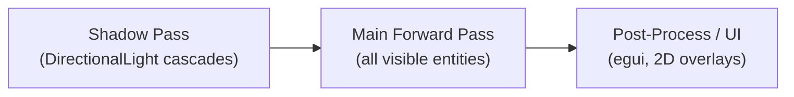
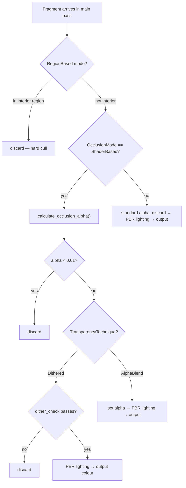
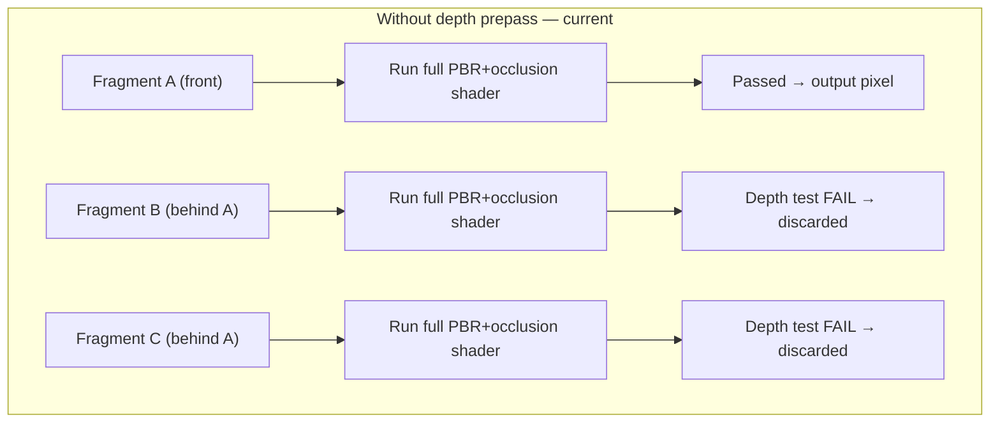
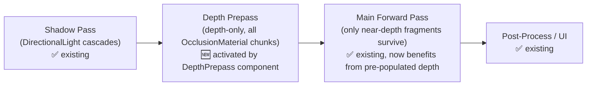
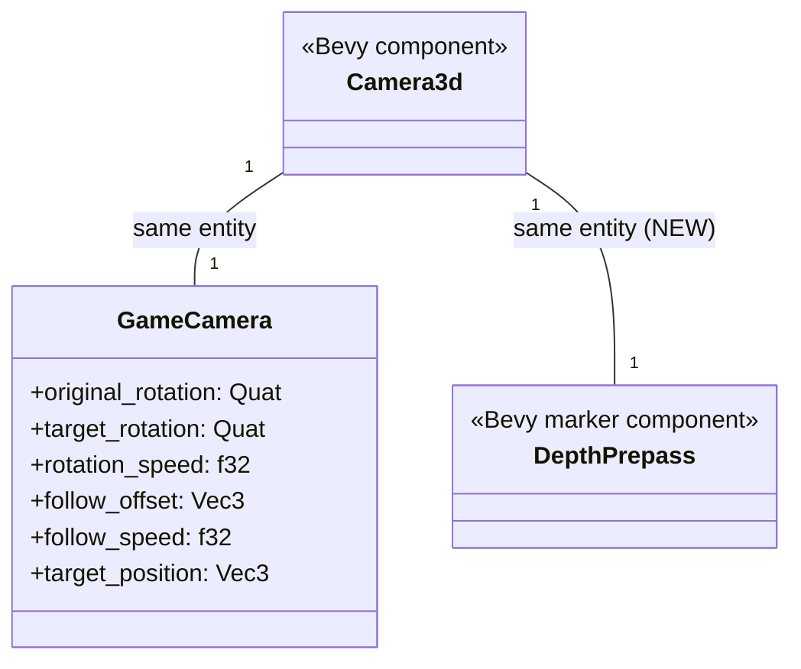
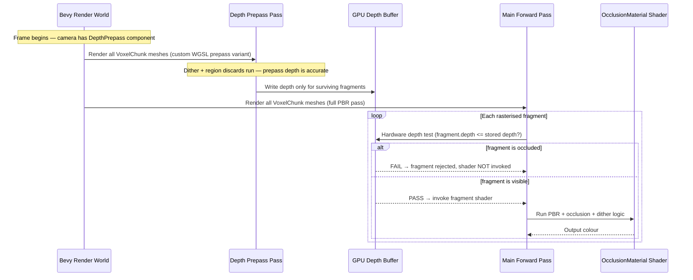

# Depth Prepass — Architecture Reference

**Date:** 2026-03-16
**Repo:** `adrakestory` (local)
**Runtime:** Bevy 0.15, Rust, macOS (Apple Silicon / TBDR GPU)
**Purpose:** Document the current GPU fragment rendering pipeline and define the target architecture for adding a depth prepass to reduce fragment overdraw on `OcclusionMaterial` chunks.

---

## Changelog

| Version | Date | Author | Summary |
|---------|------|--------|---------|
| **v1** | **2026-03-16** | **Copilot** | **Initial draft — add `DepthPrepass` to game camera spawn bundle** |

---

## Table of Contents

1. [Current Architecture](#1-current-architecture)
   - [Rendering Pipeline Overview](#11-rendering-pipeline-overview)
   - [OcclusionMaterial Fragment Shader](#12-occlusionmaterial-fragment-shader)
   - [Fragment Overdraw Problem](#13-fragment-overdraw-problem)
   - [Game Camera Spawn](#14-game-camera-spawn)
2. [Target Architecture — Depth Prepass](#2-target-architecture--depth-prepass)
   - [Design Principles](#21-design-principles)
   - [New Components](#22-new-components)
   - [Modified Components](#23-modified-components)
   - [Pipeline Flow](#24-pipeline-flow)
   - [Class Diagram](#25-class-diagram)
   - [Sequence Diagram — Happy Path](#26-sequence-diagram--happy-path)
   - [Phase Boundaries](#27-phase-boundaries)
3. [Appendices](#appendix-a--open-questions--decisions)
   - [Appendix A — Open Questions & Decisions](#appendix-a--open-questions--decisions)
   - [Appendix B — Key File Locations](#appendix-b--key-file-locations)
   - [Appendix C — Code Templates](#appendix-c--code-templates)

---

## 1. Current Architecture

### 1.1 Rendering Pipeline Overview

Bevy 0.15 uses a **forward rendering** pipeline by default. Each frame, the GPU executes passes in order:



Entities with `OcclusionMaterial` are rendered in the **Main Forward Pass** using a custom WGSL fragment shader. No depth-only prepass exists today.

### 1.2 OcclusionMaterial Fragment Shader

`OcclusionMaterial` is defined as:

```rust
pub type OcclusionMaterial = ExtendedMaterial<StandardMaterial, OcclusionExtension>;
```

`OcclusionExtension` implements `MaterialExtension` and overrides `fragment_shader()` to point at `assets/shaders/occlusion_material.wgsl`.

**Fragment shader decision tree (main forward pass):**



**Key property:** The `Dithered` path uses `AlphaMode::Opaque` in Bevy (no MSAA cost) but calls `discard` inside the fragment shader. This is the source of the overdraw problem.

### 1.3 Fragment Overdraw Problem

On modern GPUs, **hardware early-Z** discards occluded fragments *before* running the fragment shader — but only when the shader contains no `discard` instructions. The presence of `discard` in the OcclusionMaterial shader disables this optimisation for all fragments, even those in fully opaque, non-occluded regions of the map.



With **3× overdraw** (typical in a voxel scene), the expensive fragment shader runs 3× per pixel. Benchmark evidence: `profile_1773690261.csv` (shadows OFF, dense area) shows avg 18.7ms frame time vs 8.4ms in open areas — a 2.2× factor consistent with increased overdraw depth.

### 1.4 Game Camera Spawn

The 3D game camera is spawned in `spawn_camera()` (called by `spawn_map_system()` on `GameState::InGame` entry):

```rust
// src/systems/game/map/spawner/mod.rs — spawn_camera()
commands.spawn((
    Camera3d::default(),
    camera_transform,
    GameCamera { ... },
));
```

No `DepthPrepass` or prepass-related component is present today.

**Prepass-ready shader:** `occlusion_material.wgsl` already contains a `#ifdef PREPASS_PIPELINE` branch (lines 19–29) for vertex I/O and deferred output. The fragment discard logic is only active in the non-prepass path.

---

## 2. Target Architecture — Depth Prepass

### 2.1 Design Principles

1. **One-line camera change** — Insert `DepthPrepass` into the existing `spawn_camera()` spawn tuple. No new systems, no new plugins, no shader changes required for Phase 1.
2. **Zero visual change** — The depth prepass populates depth conservatively (dithered surfaces treated as opaque). The main pass discard logic is unchanged; visual output is identical.
3. **Leverage existing prepass infrastructure** — `ExtendedMaterial<StandardMaterial, OcclusionExtension>` inherits StandardMaterial's prepass pipeline registration. Adding `DepthPrepass` to the camera is sufficient to activate it.
4. **Game-camera only** — The editor binary uses `EditorCamera`, not `GameCamera`. Only the game `spawn_camera()` is modified.
5. **No deferred rendering** — This change stays within the forward pipeline. `DepthPrepass` in forward mode pre-populates depth; Bevy then uses depth-equal or depth-less-equal tests in the main pass.

### 2.2 New Components

No new components, systems, or plugins. `DepthPrepass` is a zero-sized marker component from `bevy::core_pipeline::prepass`.


### 2.3 Modified Components

| Component | Change |
|-----------|--------|
| `spawn_camera()` in `src/systems/game/map/spawner/mod.rs` | Add `DepthPrepass` to the spawn tuple alongside `Camera3d`. One line added. |
| `OcclusionExtension` in `src/systems/game/occlusion/mod.rs` | Add `prepass_fragment_shader()` override returning the same WGSL file. The existing shader already handles prepass via `#ifdef PREPASS_PIPELINE`; this wires up the connection Bevy needs. |

### 2.4 Pipeline Flow



**Effect on main forward pass:** Fragments whose depth exceeds the value already stored in the depth buffer (i.e., they are occluded by closer geometry rendered in the prepass) fail the hardware depth test **before** the fragment shader fires. The expensive PBR + occlusion shader only executes for visible fragments.

### 2.5 Class Diagram



### 2.6 Sequence Diagram — Happy Path



### 2.7 Phase Boundaries

| Capability | Phase | Note |
|------------|-------|------|
| Add `DepthPrepass` to game camera spawn | Phase 1 — MVP | One-line change |
| Override `prepass_fragment_shader()` in `OcclusionExtension` | Phase 1 — MVP | Same WGSL file — shader already has `#ifdef PREPASS_PIPELINE` |
| Verify visual correctness (correct dithering through holes, no z-fighting) | Phase 1 — MVP | Manual QA |
| Benchmark before/after with `FrameProfiler` | Phase 1 — MVP | Use existing profiler |
| Evaluate `AlphaMode::Mask` for dithered surfaces | Future | Larger shader refactor |

---

## Appendix A — Open Questions & Decisions

### Resolved

| # | Question | Resolution |
|---|----------|------------|
| 1 | Does `ExtendedMaterial<StandardMaterial, OcclusionExtension>` automatically use the custom shader for the depth prepass? | **No — `prepass_fragment_shader()` must be overridden.** Without it, Bevy falls back to StandardMaterial's default prepass shader, skipping our custom discards. The fix: add `prepass_fragment_shader()` to `OcclusionExtension` returning the same WGSL file. The shader's existing `#ifdef PREPASS_PIPELINE` branch already handles the output difference — all discards execute before it. No new shader file needed. |
| 2 | Does the dithered discard need to run in the prepass? | **Yes — critical.** Without it, dithered fragments write incorrect depth. Geometry visible through dither holes gets culled in the main pass (it fails the depth test before the shader fires), producing black holes instead of transparent blending. The fix from Q1 resolves this. |
| 3 | What is z-fighting risk with a depth prepass? | **Low.** Z-fighting is a GPU artifact where two polygons at nearly identical depths alternate which pixel wins each frame due to floating-point precision, causing flickering. VoxelChunks occupy discrete non-overlapping grid cells so inter-chunk z-fighting cannot occur. The prepass-vs-main-pass same-surface risk is mitigated by Bevy's default `LessEqual` depth compare. No depth bias needed. |
| 4 | Should the editor camera get `DepthPrepass`? | No. The editor uses `EditorCamera` and is a separate binary. Only the game's `spawn_camera()` is changed. |

### Open

| # | Question | Impact | Notes |
|---|----------|--------|-------|
| 5 | Does the depth prepass cost more GPU time than it saves on Apple TBDR GPUs? | Performance regression risk | TBDR GPUs (M-series) handle depth differently than discrete GPUs — the prepass pass overhead may be smaller than on desktop. Benchmarks will confirm net win or loss. |

---

## Appendix B — Key File Locations

| Component | Path |
|-----------|------|
| `spawn_camera()` (game camera spawn) | `src/systems/game/map/spawner/mod.rs` |
| `GameCamera` component | `src/systems/game/components.rs` |
| `OcclusionExtension` / `OcclusionMaterial` | `src/systems/game/occlusion/mod.rs` |
| WGSL fragment shader | `assets/shaders/occlusion_material.wgsl` |
| `FrameProfiler` (benchmark tool) | `src/diagnostics/mod.rs` |
| Editor camera spawn | `src/bin/map_editor/setup.rs` |

---

## Appendix C — Code Templates

### Change 1 — Camera spawn (`src/systems/game/map/spawner/mod.rs`)

```rust
use bevy::core_pipeline::prepass::DepthPrepass;

// In spawn_camera():
commands.spawn((
    Camera3d::default(),
    camera_transform,
    GameCamera { ... },
    DepthPrepass,    // 🆕 activates depth prepass for this camera
));
```

### Change 2 — Prepass shader override (`src/systems/game/occlusion/mod.rs`)

```rust
impl MaterialExtension for OcclusionExtension {
    fn fragment_shader() -> ShaderRef {
        "shaders/occlusion_material.wgsl".into()
    }
    fn deferred_fragment_shader() -> ShaderRef {
        "shaders/occlusion_material.wgsl".into()
    }
    // 🆕 use same WGSL — shader's #ifdef PREPASS_PIPELINE handles output differences.
    // dither + region discards run identically, giving accurate prepass depth.
    fn prepass_fragment_shader() -> ShaderRef {
        "shaders/occlusion_material.wgsl".into()
    }
}
```

---

*Created: 2026-03-16 — See [Changelog](#changelog) for version history.*
*Companion: [Requirements](./requirements.md)*
