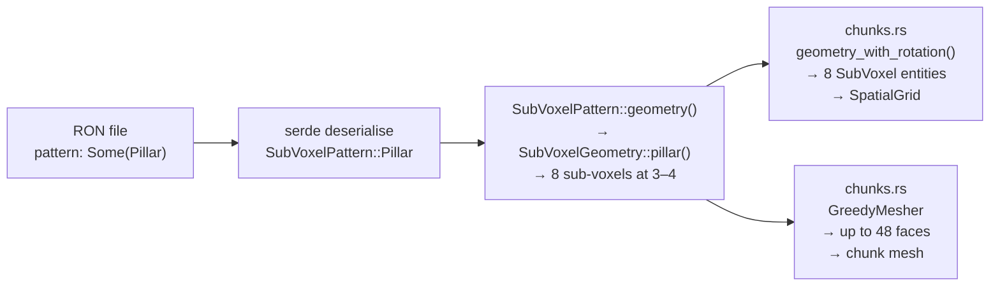
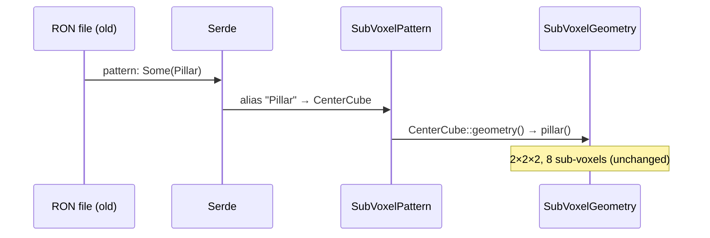
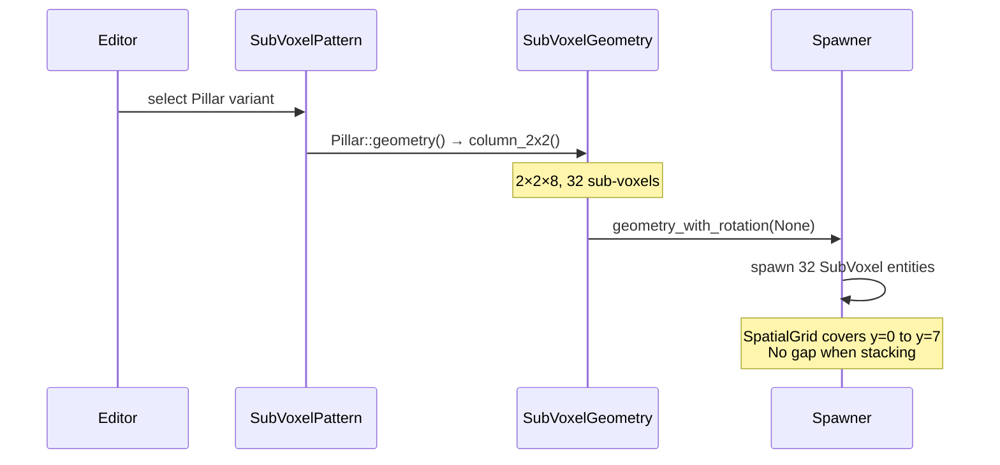

# Pillar Geometry / Name Mismatch — Architecture Reference

**Date:** 2026-03-31
**Repo:** `adrakestory`
**Runtime:** Rust / Bevy ECS
**Purpose:** Document the current `Pillar` pattern architecture that produces a
floating 2×2×2 cube rather than a column, and define the target architecture
that introduces `CenterCube` for the existing shape and repurposes `Pillar` as
a true floor-to-ceiling column.

---

## Changelog

| Version | Date | Author | Summary |
|---------|------|--------|---------|
| **v1** | **2026-03-31** | **Investigation** | **Initial draft — current geometry, all three bugs, target design, code templates** |

---

## Table of Contents

1. [Current Architecture](#1-current-architecture)
   - [Sub-Voxel Coordinate System](#11-sub-voxel-coordinate-system)
   - [Pillar Geometry — Current](#12-pillar-geometry--current)
   - [Pattern Dispatch Pipeline](#13-pattern-dispatch-pipeline)
   - [The Three Bugs](#14-the-three-bugs)
2. [Target Architecture](#2-target-architecture)
   - [Design Principles](#21-design-principles)
   - [New Geometry Factory: column_2x2()](#22-new-geometry-factory-column_2x2)
   - [Modified Enum: SubVoxelPattern](#23-modified-enum-subvoxelpattern)
   - [Modified Dispatch: geometry()](#24-modified-dispatch-geometry)
   - [Editor Preview Updates](#25-editor-preview-updates)
   - [New and Modified Components](#26-new-and-modified-components)
   - [Sequence Diagram — Old Map Loading](#27-sequence-diagram--old-map-loading)
   - [Sequence Diagram — New Pillar Placement](#28-sequence-diagram--new-pillar-placement)
   - [Backward Compatibility](#29-backward-compatibility)
   - [Phase Boundaries](#210-phase-boundaries)
3. [Appendices](#appendix-a--key-file-locations)
   - [Appendix A — Key File Locations](#appendix-a--key-file-locations)
   - [Appendix B — Code Templates](#appendix-b--code-templates)
   - [Appendix C — Open Questions & Decisions](#appendix-c--open-questions--decisions)

---

## 1. Current Architecture

### 1.1 Sub-Voxel Coordinate System

Each voxel cell contains an 8×8×8 grid of sub-voxels. Coordinates are
0-indexed (0–7). `SUB_VOXEL_SIZE = 0.125` world units per sub-voxel. The
voxel cell spans [−0.5, +0.5] on each axis relative to the voxel origin.

| Index | Centre offset | Min  | Max    |
|-------|--------------|------|--------|
| 0     | −0.4375      | −0.5 | −0.375 |
| 1     | −0.3125      | −0.375 | −0.25 |
| 2     | −0.1875      | −0.25 | −0.125 |
| 3     | −0.0625      | −0.125 | 0.0   |
| 4     | +0.0625      | 0.0  | +0.125 |
| 5     | +0.1875      | +0.125 | +0.25 |
| 6     | +0.3125      | +0.25 | +0.375 |
| 7     | +0.4375      | +0.375 | +0.5  |

Adjacent voxel cells are contiguous: sub-voxel y=7 of cell N has max = +0.5,
and sub-voxel y=0 of cell N+1 has min = −0.5 in that cell's local space (= +0.5
world). There is no gap between cells at y=7/y=0 when geometry reaches the cell
boundary.

### 1.2 Pillar Geometry — Current

**File:** `src/systems/game/map/geometry/patterns.rs:48–62`

```rust
/// Create a small 2×2×2 centered pillar.
pub fn pillar() -> Self {
    let mut geom = Self::new();
    for x in 3..5 {
        for y in 3..5 {
            for z in 3..5 {
                geom.set_occupied(x, y, z);
            }
        }
    }
    geom
}
```

- **Occupied sub-voxels:** x, y, z ∈ {3, 4} — 8 total.
- **World extent:** 0.25 × 0.25 × 0.25 centred at voxel origin.
- **Empty space per cell:** 504 of 512 sub-voxels are air — including the entire
  top half (y ∈ {5,6,7}) and bottom half (y ∈ {0,1,2}) of the cell.

When two `Pillar` voxels are stacked vertically:

```
Cell N+1:  [ air ][ air ][ air ][ air ][■■][ air ][ air ][ air ]   ← y=3,4 only
              ↑ gap ~0.875 world units with no collision geometry ↑
Cell N:    [ air ][ air ][ air ][ air ][■■][ air ][ air ][ air ]
             y=0   y=1   y=2   y=3  y=4  y=5   y=6   y=7
```

The gap between the top of cell N's geometry (y=4 max = +0.125) and the bottom
of cell N+1's geometry (y=3 min of N+1 = N+1 origin − 0.125 = N origin + 0.875)
is **0.75 world units** of unoccupied space. The player (cylinder radius 0.2,
half-height 0.4) can pass through this gap horizontally.

### 1.3 Pattern Dispatch Pipeline



**File:** `src/systems/game/map/format/patterns.rs:92`

```rust
Self::Pillar => SubVoxelGeometry::pillar(),
```

The spawner (`src/systems/game/map/spawner/chunks.rs`) has no special casing for
`Pillar`. It calls `geometry_with_rotation(orientation)` which delegates to
`geometry()` for non-fence patterns. The resulting `SubVoxelGeometry` drives
both the greedy mesh and the 8 `SubVoxel { bounds }` collision entities.

### 1.4 The Three Bugs

**Bug A — Name mismatch** (`src/systems/game/map/format/patterns.rs:51–52`)

The doc comment says "Small 2×2×2 centered column" and the variant is named
`Pillar`. Neither description nor name matches a floor-to-ceiling column.

**Bug B — Misleading editor preview** (`src/editor/ui/properties/voxel_tools.rs:143–153`)

```rust
SubVoxelPattern::Pillar => {
    // Vertical pillar in center
    for y in 0..4 {  // draws 4 cells top-to-bottom — a full-height column
        let c = if y % 2 == 0 { color } else { dark };
        let cell_rect = egui::Rect::from_min_size(
            rect.min + egui::vec2(1.5 * cell, (3 - y) as f32 * cell),
            egui::vec2(cell - 1.0, cell - 1.0),
        );
        painter.rect_filled(cell_rect, 1.0, c);
    }
}
```

This draws a 4-cell tall column. The actual geometry is 2 sub-voxels tall
(approximately 1/4 the visual height shown). Authors who rely on the preview to
understand the shape will place `Pillar` expecting a column.

**Bug C — Silent collision gaps** (interaction between geometry and spawner)

8 `SubVoxel` entities are spawned, all at the centre of the cell. The
`SpatialGrid` correctly reflects the actual 8 sub-voxels. The player cylinder
collision code in `collision.rs` queries the spatial grid; it returns no results
in the region between stacked Pillar cells. The gap is not detectable without
testing — the renderer produces a visually seamless column from the chunk mesh's
greedy merge, because each voxel face at the cell boundary happens to merge with
the adjacent cell's face in the mesh. But collision is not greedy — it is
per-sub-voxel, and the gap sub-voxels are genuine air.

---

## 2. Target Architecture

### 2.1 Design Principles

1. **Preserve old geometry via serde alias** — `CenterCube` carries the 2×2×2
   geometry with `#[serde(alias = "Pillar")]`. Existing map files round-trip
   unchanged. No loader migration pass is needed (FR-2.3.1).
2. **Repurpose the name** — `Pillar` becomes a 2×2×8 column (FR-2.2.1). New
   placements use the correct geometry. Old placements survive via alias.
3. **Fix the preview** — both previews must match the geometry they represent
   (FR-2.4.2, FR-2.4.3).
4. **No spawner changes** — the fix is entirely in the geometry layer and format
   layer. The spawner, collision system, and mesh system are unchanged.

### 2.2 New Geometry Factory: column_2x2()

**File:** `src/systems/game/map/geometry/patterns.rs` (add after `pillar()`)

```rust
/// Create a 2×2×8 floor-to-ceiling column.
///
/// The column occupies x ∈ {3,4} and z ∈ {3,4} across all 8 Y layers,
/// producing a slim column centred on the voxel's X and Z axes.
/// When stacked vertically, adjacent Pillar voxels share the y=0/y=7
/// boundary with no gap in geometry or collision.
pub fn column_2x2() -> Self {
    let mut geom = Self::new();
    for x in 3..5 {
        for y in 0..8 {
            for z in 3..5 {
                geom.set_occupied(x, y, z);
            }
        }
    }
    geom
}
```

Sub-voxel count: 2 × 8 × 2 = **32**.

At the cell boundary (y=7, max = +0.5), this geometry is contiguous with
`column_2x2()` geometry in the adjacent cell above (y=0, min = −0.5 of that
cell = +0.5 world). No gap.

### 2.3 Modified Enum: SubVoxelPattern

**File:** `src/systems/game/map/format/patterns.rs`

Replace the current `Pillar` entry with two variants:

```rust
/// Small 2×2×2 cube at the centre of the voxel cell (symmetric, no orientation).
///
/// Formerly serialised as `"Pillar"`. Maps written before this fix continue to
/// load correctly — `"Pillar"` in the RON file deserialises as `CenterCube` via
/// the serde alias. New saves write `"CenterCube"`.
#[serde(alias = "Pillar")]
CenterCube,

/// Slim 2×2×8 floor-to-ceiling column (symmetric around Y axis).
///
/// Occupies x ∈ {3,4}, z ∈ {3,4} across all 8 Y layers (32 sub-voxels).
/// Stacking Pillar voxels vertically produces a continuous column with no
/// collision gap between cells.
Pillar,
```

**Ordering note:** `CenterCube` should be placed where the old `Pillar` was
(before `Fence`) to minimise diff noise. `Pillar` can sit immediately before
`CenterCube` or after it — either is fine; the RON serialisation is by name,
not by discriminant.

### 2.4 Modified Dispatch: geometry()

**File:** `src/systems/game/map/format/patterns.rs` — `SubVoxelPattern::geometry()`

```rust
Self::CenterCube => SubVoxelGeometry::pillar(),   // unchanged 2×2×2 factory
Self::Pillar => SubVoxelGeometry::column_2x2(),   // new 2×2×8 factory
```

`geometry_with_rotation()` requires no change — both new shapes are symmetric
and the generic orientation-matrix application already handles them correctly.

### 2.5 Editor Preview Updates

**File:** `src/editor/ui/properties/voxel_tools.rs` — `draw_pattern_preview()`

Current `Pillar` arm (lines 143–153) draws a full-height column. After the fix:

```rust
SubVoxelPattern::Pillar => {
    // Full-height column: draw 4 cells spanning the full preview height
    for y in 0..4 {
        let c = if y % 2 == 0 { color } else { dark };
        painter.rect_filled(
            egui::Rect::from_min_size(
                rect.min + egui::vec2(1.5 * cell, (3 - y) as f32 * cell),
                egui::vec2(cell - 1.0, cell - 1.0),
            ),
            1.0,
            c,
        );
    }
}
SubVoxelPattern::CenterCube => {
    // Small centred square: draw a single 2×2 cell block at the centre
    painter.rect_filled(
        egui::Rect::from_min_size(
            rect.min + egui::vec2(1.0 * cell, 1.0 * cell),
            egui::vec2(2.0 * cell - 1.0, 2.0 * cell - 1.0),
        ),
        1.0,
        color,
    );
}
```

The `Pillar` preview is unchanged in appearance (it was already drawing a column,
which now correctly matches the geometry). The `CenterCube` preview draws a
single 2×2 block centred in the preview grid.

Pattern name strings requiring update:

| File | Location | Old string | New string |
|------|----------|-----------|-----------|
| `voxel_tools.rs` | dropdown item | `"│ Pillar"` | kept; add `"□ CenterCube"` |
| `voxel_tools.rs` | `get_pattern_name()` | `Pillar => "│ Pillar"` | add `CenterCube => "□ CenterCube"` |
| `tool_options.rs` | dropdown item | `"│ Pillar"` | kept; add `"□ CenterCube"` |
| `tool_options.rs` | `get_pattern_name()` | `Pillar => "Pillar"` | add `CenterCube => "CenterCube"` |
| `hotbar.rs` | name | `Pillar => " Pillar"` | kept; add `CenterCube => "□ CenterCube"` |
| `hotbar.rs` | palette | `pattern: Pillar` | add `pattern: CenterCube` entry |
| `camera.rs` | cycle array | `[…, Pillar, Fence]` | `[…, Pillar, CenterCube, Fence]` |

### 2.6 New and Modified Components

**New:**

| Component | File | Description |
|-----------|------|-------------|
| `SubVoxelGeometry::column_2x2()` | `src/systems/game/map/geometry/patterns.rs` | 2×2×8 floor-to-ceiling factory |
| `SubVoxelPattern::CenterCube` | `src/systems/game/map/format/patterns.rs` | New variant, old 2×2×2 geometry, alias `"Pillar"` |

**Modified:**

| Component | File | Change |
|-----------|------|--------|
| `SubVoxelPattern::Pillar` dispatch | `src/systems/game/map/format/patterns.rs` | `geometry()` → `column_2x2()` |
| `draw_pattern_preview()` | `src/editor/ui/properties/voxel_tools.rs` | Add `CenterCube` arm |
| Pattern dropdowns / name maps | `voxel_tools.rs`, `tool_options.rs`, `hotbar.rs`, `camera.rs` | Add `CenterCube` entries |
| Geometry tests | `src/systems/game/map/geometry/tests.rs` | Rename + add column test |
| Format dispatch tests | `src/systems/game/map/format/patterns.rs` | Rename + add column test |
| `docs/api/map-format-spec.md` | spec | Document both variants |

**Not changed:**

- `src/systems/game/map/spawner/chunks.rs` — no special Pillar casing exists;
  new column geometry flows through identically to old geometry.
- `src/systems/game/collision.rs` — unchanged.
- `src/systems/game/map/validation.rs` — unchanged.
- All game system files — unchanged.

### 2.7 Sequence Diagram — Old Map Loading



Old maps produce identical visual and collision results.

### 2.8 Sequence Diagram — New Pillar Placement



### 2.9 Backward Compatibility

| Scenario | Before fix | After fix | Result |
|----------|-----------|-----------|--------|
| `pattern: Some(Pillar)` in old file | Loads as `Pillar`, 2×2×2 geometry | Loads as `CenterCube` (alias), 2×2×2 geometry | Visual/collision identical ✓ |
| Editor save of old-loaded voxel | Writes `Pillar` | Writes `CenterCube` | Shape preserved; new token on resave ✓ |
| New `Pillar` placement | — | Writes `Pillar`, 2×2×8 geometry | Column with continuous collision ✓ |
| `pattern: Some(CenterCube)` | Error (unknown variant) | Loads as `CenterCube`, 2×2×2 geometry | New token works ✓ |

> Maps resaved after this fix will write `CenterCube` where they previously had
> `Pillar`. This is a token change only — the geometry is identical. Pre-fix
> engine versions cannot load the new token; this is acceptable since `CenterCube`
> is only written on resave, not on load.

### 2.10 Phase Boundaries

| Capability | Phase | Notes |
|------------|-------|-------|
| `column_2x2()` geometry factory | Phase 1 | Core fix |
| `CenterCube` variant with serde alias | Phase 1 | Required for backward compat |
| `Pillar` dispatch → `column_2x2()` | Phase 1 | Core fix |
| Editor dropdown + preview updates | Phase 1 | Required |
| Spec doc update | Phase 1 | Required |
| Unit tests (geometry + format) | Phase 1 | Required |
| Both binaries compile cleanly | Phase 1 | Required |

---

## Appendix A — Key File Locations

| Component | Path | Lines |
|-----------|------|-------|
| `SubVoxelGeometry::pillar()` (current) | `src/systems/game/map/geometry/patterns.rs` | 48–62 |
| `SubVoxelGeometry::column_2x2()` (new) | `src/systems/game/map/geometry/patterns.rs` | after line 62 |
| `SubVoxelPattern` enum | `src/systems/game/map/format/patterns.rs` | 10–59 |
| `SubVoxelPattern::geometry()` dispatch | `src/systems/game/map/format/patterns.rs` | 65–95 |
| `draw_pattern_preview()` — Pillar arm | `src/editor/ui/properties/voxel_tools.rs` | 143–153 |
| Pattern dropdown (properties) | `src/editor/ui/properties/voxel_tools.rs` | ~48 |
| Pattern dropdown (toolbar) | `src/editor/ui/toolbar/tool_options.rs` | ~86 |
| Hotbar palette entries | `src/editor/controller/hotbar.rs` | ~244 |
| Pattern cycle array | `src/editor/camera.rs` | ~630–638 |
| Geometry tests | `src/systems/game/map/geometry/tests.rs` | 61–67 |
| Format dispatch tests | `src/systems/game/map/format/patterns.rs` | 156–161 |
| Format spec | `docs/api/map-format-spec.md` | VoxelType / Pattern sections |

---

## Appendix B — Code Templates

### geometry/patterns.rs — new factory

```rust
/// Create a 2×2×8 floor-to-ceiling column.
///
/// The column occupies x ∈ {3,4} and z ∈ {3,4} across all 8 Y layers (32
/// sub-voxels). When stacked vertically, adjacent Pillar voxels share the
/// y boundary with no gap in geometry or collision.
pub fn column_2x2() -> Self {
    let mut geom = Self::new();
    for x in 3..5 {
        for y in 0..8 {
            for z in 3..5 {
                geom.set_occupied(x, y, z);
            }
        }
    }
    geom
}
```

### format/patterns.rs — enum additions

```rust
/// Small 2×2×2 cube at the centre of the voxel cell (symmetric, no orientation).
///
/// Formerly serialised as `"Pillar"`. Maps written before this fix continue to
/// load correctly — the serde alias maps `"Pillar"` in the RON file to this variant.
#[serde(alias = "Pillar")]
CenterCube,

/// Slim 2×2×8 floor-to-ceiling column (symmetric around Y axis).
///
/// Occupies x ∈ {3,4}, z ∈ {3,4} across all 8 Y layers (32 sub-voxels).
/// Stacking Pillar voxels vertically produces a continuous column with no
/// collision gap between cells.
Pillar,
```

### format/patterns.rs — geometry() dispatch update

```rust
Self::CenterCube => SubVoxelGeometry::pillar(),
Self::Pillar => SubVoxelGeometry::column_2x2(),
```

### Unit tests to add/update

```rust
// In src/systems/game/map/geometry/tests.rs
// Rename existing test_pillar → test_center_cube:
#[test]
fn test_center_cube() {
    let geom = SubVoxelGeometry::pillar();
    assert_eq!(geom.count_occupied(), 8);
    assert!(geom.is_occupied(3, 3, 3));
    assert!(geom.is_occupied(4, 4, 4));
    assert!(!geom.is_occupied(2, 3, 3));
}

// New test for the column:
#[test]
fn test_pillar_column() {
    let geom = SubVoxelGeometry::column_2x2();
    assert_eq!(geom.count_occupied(), 32); // 2×8×2
    // Spans full height
    assert!(geom.is_occupied(3, 0, 3));
    assert!(geom.is_occupied(3, 7, 3));
    assert!(geom.is_occupied(4, 0, 4));
    assert!(geom.is_occupied(4, 7, 4));
    // Does not overflow XZ footprint
    assert!(!geom.is_occupied(2, 4, 3));
    assert!(!geom.is_occupied(5, 4, 3));
}

// In src/systems/game/map/format/patterns.rs (tests block)
// Rename existing test:
#[test]
fn test_center_cube_pattern_has_8_positions() {
    let positions: Vec<_> = SubVoxelPattern::CenterCube.geometry().occupied_positions().collect();
    assert_eq!(positions.len(), 8);
}

// New test:
#[test]
fn test_pillar_pattern_has_32_positions() {
    let positions: Vec<_> = SubVoxelPattern::Pillar.geometry().occupied_positions().collect();
    assert_eq!(positions.len(), 32);
}

// Backward-compat serde test:
#[test]
fn old_pillar_token_deserialises_as_center_cube() {
    let ron = "Some(Pillar)";
    let pattern: Option<SubVoxelPattern> = ron::from_str(ron).expect("parse failed");
    assert_eq!(pattern, Some(SubVoxelPattern::CenterCube));
}
```

---

## Appendix C — Open Questions & Decisions

### Resolved

| # | Question | Resolution |
|---|----------|------------|
| 1 | Option (a) rename+new or option (b) change existing geometry? | **Option (a).** `CenterCube` preserves the old shape for existing maps; `Pillar` gets the column. Backward-compatible. |
| 2 | What serde mechanism for backward compat? | `#[serde(alias = "Pillar")]` on `CenterCube`. Same pattern as `Platform → PlatformXZ` and `StaircaseX → Staircase`. No migration pass required. |
| 3 | Column width — 2×2, 3×3, or other? | **2×2** (x,z ∈ {3,4}). Matches the fence post footprint; proportionate at game scale. |
| 4 | Does `geometry_with_rotation()` need special handling for the column? | **No.** Both `CenterCube` and `Pillar` are handled by the generic orientation-matrix path, same as any non-fence pattern. |
| 5 | What does the editor preview for `Pillar` look like after the fix? | The existing preview code already draws a full-height column — it happens to correctly describe the new geometry. No change needed to the Pillar preview arm. Only the `CenterCube` arm (new) needs to be added. |

---

*Created: 2026-03-31 — See [Changelog](#changelog) for version history.*
*Companion documents: [Requirements](./requirements.md) | [Ticket](../ticket.md)*
*Source: `docs/investigations/2026-03-22-1427-map-format-analysis.md` — Finding 7*
