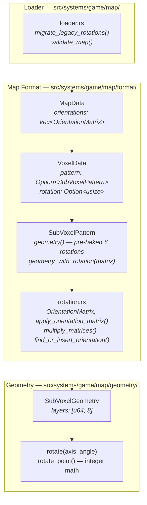
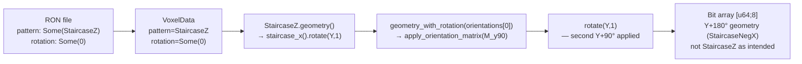
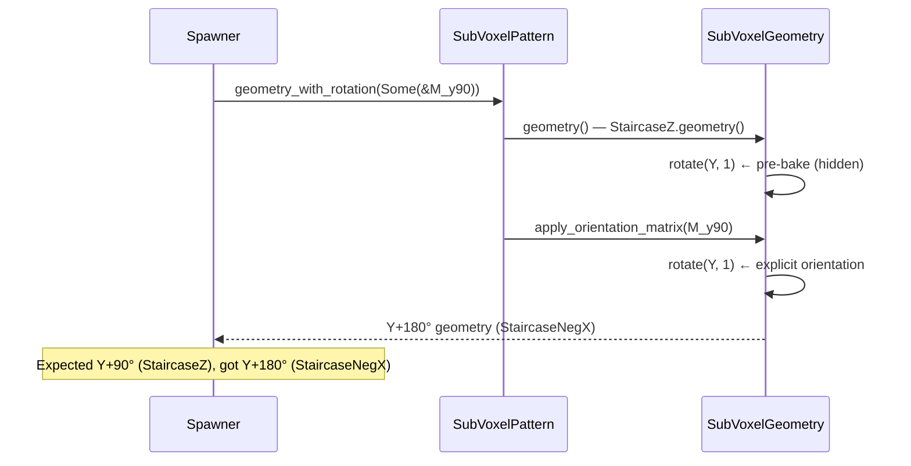
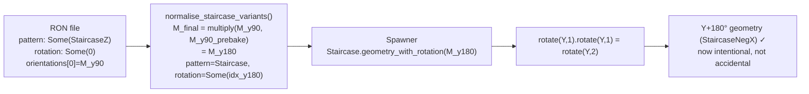
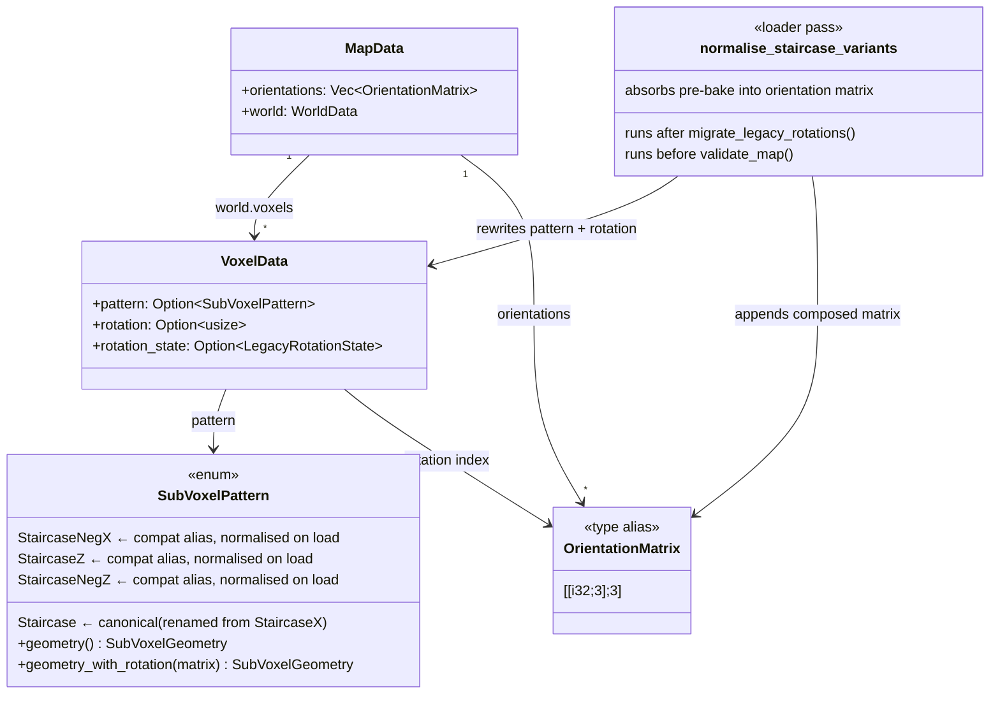
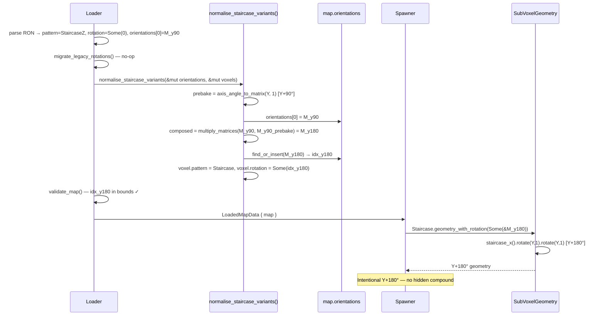

# Staircase Double-Rotation — Architecture Reference

**Date:** 2026-03-26  
**Repo:** `adrakestory`  
**Runtime:** Rust / Bevy ECS  
**Purpose:** Document the current pre-bake architecture that causes the double-rotation bug and define the target architecture that fixes it via a loader normalisation pass.

---

## Changelog

| Version | Date | Author | Summary |
|---------|------|--------|---------|
| v1 | 2026-03-26 | Investigation | Initial draft — current architecture, bug mechanism, proposed normalisation pass |
| **v2** | **2026-03-26** | **Investigation** | **Q1 resolved: single `Staircase` variant (renamed from `StaircaseX`), old names as serde aliases. Q2 resolved: editor UI removes directional variants in Phase 1.** |

---

## Table of Contents

1. [Current Architecture](#1-current-architecture)
   - [Module Structure](#11-module-structure)
   - [Data Flow — Staircase at Map Load](#12-data-flow--staircase-at-map-load)
   - [The Pre-Bake — geometry() Variants](#13-the-pre-bake--geometry-variants)
   - [geometry_with_rotation() — Orientation Layer](#14-geometry_with_rotation--orientation-layer)
   - [The Bug — Two Rotations Applied](#15-the-bug--two-rotations-applied)
2. [Target Architecture](#2-target-architecture)
   - [Design Principles](#21-design-principles)
   - [Normalisation Pass — Location in Loader Pipeline](#22-normalisation-pass--location-in-loader-pipeline)
   - [Normalisation Logic](#23-normalisation-logic)
   - [New and Modified Components](#24-new-and-modified-components)
   - [Data Flow — After Fix](#25-data-flow--after-fix)
   - [Class Diagram](#26-class-diagram)
   - [Sequence Diagram — Happy Path](#27-sequence-diagram--happy-path)
   - [Backward Compatibility](#28-backward-compatibility)
   - [Phase Boundaries](#29-phase-boundaries)
3. [Appendices](#appendix-a--key-file-locations)
   - [Appendix A — Key File Locations](#appendix-a--key-file-locations)
   - [Appendix B — Concrete Normalisation Examples](#appendix-b--concrete-normalisation-examples)
   - [Appendix C — Open Questions & Decisions](#appendix-c--open-questions--decisions)

---

## 1. Current Architecture

### 1.1 Module Structure



### 1.2 Data Flow — Staircase at Map Load



Step C is the hidden pre-bake inside `geometry()`. Step D–E is the explicit orientation matrix from the map file. The two Y+90° rotations compound to Y+180°.

### 1.3 The Pre-Bake — geometry() Variants

**File:** `src/systems/game/map/format/patterns.rs:63–75`

```rust
Self::StaircaseX => SubVoxelGeometry::staircase_x(),  // ← to be renamed Staircase
Self::StaircaseNegX => {
    // Staircase rotated 180° around Y
    SubVoxelGeometry::staircase_x().rotate(RotationAxis::Y, 2)
}
Self::StaircaseZ => {
    // Staircase rotated 90° around Y
    SubVoxelGeometry::staircase_x().rotate(RotationAxis::Y, 1)
}
Self::StaircaseNegZ => {
    // Staircase rotated 270° around Y
    SubVoxelGeometry::staircase_x().rotate(RotationAxis::Y, 3)
}
```

| Variant | Pre-bake in `geometry()` | Matrix equivalent |
|---------|--------------------------|-------------------|
| `StaircaseX` (→ `Staircase`) | none | identity |
| `StaircaseNegX` | `rotate(Y, 2)` | `axis_angle_to_matrix(Y, 2)` = `[[-1,0,0],[0,1,0],[0,0,-1]]` |
| `StaircaseZ` | `rotate(Y, 1)` | `axis_angle_to_matrix(Y, 1)` = `[[0,0,1],[0,1,0],[-1,0,0]]` |
| `StaircaseNegZ` | `rotate(Y, 3)` | `axis_angle_to_matrix(Y, 3)` = `[[0,0,-1],[0,1,0],[1,0,0]]` |

These pre-bakes were the only orientation mechanism before Fix 1. They remain intact in the codebase.

### 1.4 geometry_with_rotation() — Orientation Layer

**File:** `src/systems/game/map/format/patterns.rs:108–119`

```rust
pub fn geometry_with_rotation(
    &self,
    orientation: Option<&OrientationMatrix>,
) -> SubVoxelGeometry {
    let base_geometry = self.geometry();   // ← pre-bake applied here

    if let Some(matrix) = orientation {
        apply_orientation_matrix(base_geometry, matrix)  // ← explicit matrix applied on top
    } else {
        base_geometry
    }
}
```

`geometry()` and `apply_orientation_matrix()` are unaware of each other. There is no mechanism to prevent double application.

### 1.5 The Bug — Two Rotations Applied



The double rotation is silent: the file, the editor, and the spawner give no indication. Only the rendered result is wrong.

---

## 2. Target Architecture

### 2.1 Design Principles

1. **Pattern name = shape identity only** — `Staircase` names the base shape; orientation is expressed entirely through the `rotation` field and the `orientations` matrix list.
2. **Normalise at load, not at runtime** — the normalisation pass runs once in the loader, not per-frame or per-spawn. After normalisation, `geometry()` is always called on `Staircase` for staircase voxels; the Y-axis variants are never encountered by the spawner or any editor code.
3. **Pre-bake code is preserved** — `geometry()` for `StaircaseNegX`, `StaircaseZ`, `StaircaseNegZ` is not removed. It continues to produce correct geometry if called, but after normalisation it will not be called for loaded voxels.
4. **Backward compatibility via serde aliases + normalisation** — the three directional variant names and the old `StaircaseX` name continue to deserialise correctly via `#[serde(alias)]` attributes. The normalisation pass converts directional variants before any geometry is evaluated. `StaircaseX` maps directly to `Staircase` at the serde layer (no pre-bake, no normalisation needed).
5. **Editor exposes only `Staircase`** — the pattern picker removes directional variants. Facing direction is controlled exclusively via the Y-axis rotation tool.
6. **Reuse existing helpers** — `axis_angle_to_matrix()`, `multiply_matrices()`, and `find_or_insert_orientation()` in `rotation.rs` are all already available; no new types are required.

### 2.2 Normalisation Pass — Location in Loader Pipeline

The loader pipeline in `loader.rs:128–153` currently runs:

```
parse RON → migrate_legacy_rotations() → validate_map()
```

The normalisation pass inserts between the two existing passes:

```
parse RON → migrate_legacy_rotations() → normalise_staircase_variants() → validate_map()
```

**Why after `migrate_legacy_rotations()`:** Legacy voxels may have `rotation_state: Some((axis:Y,angle:1))` alongside a directional variant. The migration pass converts the legacy rotation to a matrix and sets `voxel.rotation`. The normalisation pass then sees the fully-converted `rotation: Option<usize>` on every voxel, avoiding the need to handle `rotation_state` in two passes.

**Why before `validate_map()`:** Validation checks that every `rotation` index is within bounds of `orientations`. Normalisation may append new orientation entries. Running normalisation before validation ensures those new entries are present when the bounds check runs.

**Call sites in loader.rs:**

| Function | Line | Action |
|----------|------|--------|
| `MapLoader::load_from_file()` | `loader.rs:144` | Add `normalise_staircase_variants(&mut map.orientations, &mut map.world.voxels);` after line 144 |
| `MapLoader::load_simple()` | `loader.rs:162` | Add the same call after line 162 |

### 2.3 Normalisation Logic

```rust
/// Normalise all staircase directional variants to Staircase.
///
/// Absorbs the hidden pre-bake rotation of StaircaseNegX / StaircaseZ / StaircaseNegZ
/// into the voxel's explicit orientation matrix.  After this pass, all staircase
/// voxels use `pattern: Some(Staircase)` and carry the full orientation in `rotation`.
///
/// Must be called after `migrate_legacy_rotations()` and before `validate_map()`.
pub fn normalise_staircase_variants(
    orientations: &mut Vec<OrientationMatrix>,
    voxels: &mut [VoxelData],
) {
    use SubVoxelPattern::{Staircase, StaircaseNegX, StaircaseNegZ, StaircaseZ};

    for voxel in voxels.iter_mut() {
        let prebake_angle = match voxel.pattern {
            Some(StaircaseNegX) => 2,
            Some(StaircaseZ)    => 1,
            Some(StaircaseNegZ) => 3,
            _                   => continue,
        };

        // Pre-bake is the inner (first-applied) rotation.
        let prebake = axis_angle_to_matrix(RotationAxis::Y, prebake_angle);

        // Compose: M_final = M_existing × M_prebake
        // If no existing rotation, M_existing = identity → M_final = M_prebake.
        let composed = match voxel.rotation {
            None => prebake,
            Some(i) => multiply_matrices(&orientations[i], &prebake),
        };

        let index = find_or_insert_orientation(orientations, composed);
        voxel.pattern = Some(Staircase);
        voxel.rotation = Some(index);
    }
}
```

**Composition order note:** `multiply_matrices(M_existing, M_prebake)` applies the pre-bake first (right operand = first applied), then the existing orientation second (left operand = applied after). This matches the call order in the old `geometry_with_rotation()`: `geometry()` runs first (pre-bake), then `apply_orientation_matrix()` runs after (existing orientation).

### 2.4 New and Modified Components

**New:**

| Component | File | Purpose |
|-----------|------|---------|
| `normalise_staircase_variants()` fn | `src/systems/game/map/format/rotation.rs` | Loader pass: converts staircase directional variants to `StaircaseX` + composed orientation |

**Modified:**

| Component | File | Change |
|-----------|------|--------|
| `MapLoader::load_from_file()` | `src/systems/game/map/loader.rs:144` | Add `normalise_staircase_variants()` call after `migrate_legacy_rotations()` |
| `MapLoader::load_simple()` | `src/systems/game/map/loader.rs:162` | Same addition |
| `SubVoxelPattern::StaircaseX` | `src/systems/game/map/format/patterns.rs:27` | Rename to `Staircase`; add `#[serde(alias = "StaircaseX")]` |
| `SubVoxelPattern::StaircaseNegX` | `src/systems/game/map/format/patterns.rs:29` | Add doc comment: backward-compat alias, normalised to `Staircase` on load, never written on save |
| `SubVoxelPattern::StaircaseZ` | `src/systems/game/map/format/patterns.rs:31` | Same |
| `SubVoxelPattern::StaircaseNegZ` | `src/systems/game/map/format/patterns.rs:33` | Same |
| Map editor pattern picker | `src/editor/` (relevant UI file) | Remove `StaircaseNegX`, `StaircaseZ`, `StaircaseNegZ` from selectable options; expose only `Staircase` |
| `docs/api/map-format-spec.md` | `docs/api/map-format-spec.md` | Document `Staircase` as canonical variant; document directional variants + `StaircaseX` as load-only aliases |

**Not changed:**

- `SubVoxelPattern::geometry()` — pre-bake code at `patterns.rs:64–75` is preserved.
- `SubVoxelPattern::geometry_with_rotation()` — no changes needed; after normalisation only `Staircase` is passed here for staircase voxels.
- `SubVoxelGeometry::rotate()` / `rotate_point()` — untouched.
- `apply_orientation_matrix()` — untouched.
- `axis_angle_to_matrix()`, `multiply_matrices()`, `find_or_insert_orientation()` — reused without modification.

### 2.5 Data Flow — After Fix

```mermaid
flowchart LR
    A["RON file\npattern: Some(StaircaseZ)\nrotation: None"]
    B["VoxelData after parse\npattern=StaircaseZ, rotation=None"]
    C["migrate_legacy_rotations()\n— no-op (no rotation_state)"]
    D["normalise_staircase_variants()\nY+90° pre-bake absorbed\npattern=Staircase, rotation=Some(idx_y90)"]
    E["validate_map()\n— idx_y90 in bounds ✓"]
    F["Spawner\nStaircase.geometry_with_rotation(orientations[idx_y90])"]
    G["apply_orientation_matrix(M_y90)\n→ rotate(Y,1) once"]
    H["Bit array [u64;8]\nY+90° geometry ✓"]

    A --> B --> C --> D --> E --> F --> G --> H
```



For a voxel with an existing non-None rotation:



### 2.6 Class Diagram



### 2.7 Sequence Diagram — Happy Path

Loading a `StaircaseZ` voxel with an existing Y+90° orientation (the double-rotation scenario from `bug.md`):



### 2.8 Backward Compatibility

| Scenario | Before fix | After fix | Result |
|----------|-----------|-----------|--------|
| `StaircaseZ, rotation: None` | Y+90° geometry (correct by luck) | normalised to `Staircase + M_y90`, spawner applies Y+90° | Identical geometry ✓ |
| `StaircaseZ, rotation: Some(i)` with M_y90 | Y+180° geometry (double rotation bug) | normalised to `Staircase + M_y180`, spawner applies Y+180° | Same (buggy) geometry, but now intentional and consistent ✓ |
| `StaircaseX, rotation: None` | StaircaseX geometry (correct) | deserialises to `Staircase` via alias; unchanged by normalisation pass | Identical ✓ |
| `Staircase, rotation: Some(i)` | Applies matrix once (correct) | unchanged by pass | Identical ✓ |

Note: The `StaircaseZ + M_y90` case produces Y+180° both before and after the fix. The fix does not change the rendered output of existing maps — it removes the surprising hidden compound and makes it explicit. Future maps authored after the fix will not encounter the double-rotation surprise because the editor only exposes `Staircase`.

### 2.9 Phase Boundaries

| Capability | Phase | Notes |
|------------|-------|-------|
| `normalise_staircase_variants()` pass in loader | Phase 1 | Core fix |
| Call sites added in `load_from_file()` and `load_simple()` | Phase 1 | Required |
| `StaircaseX` renamed to `Staircase`; old name as serde alias | Phase 1 | Required |
| Doc comments on directional variants in `patterns.rs` | Phase 1 | Required |
| `map-format-spec.md` update | Phase 1 | Required |
| Unit tests for all normalisation cases | Phase 1 | Required |
| Editor pattern picker: remove directional variants, expose only `Staircase` | Phase 1 | Required — no in-memory directional variants post-load |
| Editor properties panel shows facing direction from orientation matrix | Phase 2 | UI enhancement |
| Remove `StaircaseNegX`/`StaircaseZ`/`StaircaseNegZ` enum variants | Future | Breaking — only after all known maps migrated |

**MVP boundary:**

- ✅ All staircase directional variants normalised to `Staircase` on load
- ✅ `StaircaseX` renamed to `Staircase`; backward compat via serde alias
- ✅ Composed orientation matrix absorbs the pre-bake exactly once
- ✅ Backward compat: old map files with directional variants and `StaircaseX` load correctly
- ✅ On save, only `Staircase` is written
- ✅ Editor exposes only `Staircase` in pattern picker
- ❌ Enum variants for directional aliases not removed in Phase 1

---

## Appendix A — Key File Locations

| Component | Path |
|-----------|------|
| `SubVoxelPattern::geometry()` (pre-bake) | `src/systems/game/map/format/patterns.rs:49–79` |
| `SubVoxelPattern::geometry_with_rotation()` | `src/systems/game/map/format/patterns.rs:108–119` |
| `axis_angle_to_matrix()` | `src/systems/game/map/format/rotation.rs:48` |
| `multiply_matrices()` | `src/systems/game/map/format/rotation.rs:76` |
| `find_or_insert_orientation()` | `src/systems/game/map/format/rotation.rs:145` |
| `migrate_legacy_rotations()` | `src/systems/game/map/format/rotation.rs:213` |
| `MapLoader::load_from_file()` call site | `src/systems/game/map/loader.rs:128` |
| `migrate_legacy_rotations` call in loader | `src/systems/game/map/loader.rs:144` |
| `validate_map` call in loader | `src/systems/game/map/loader.rs:149` |
| `MapData` | `src/systems/game/map/format/mod.rs` |
| `VoxelData` | `src/systems/game/map/format/world.rs` |
| Spawner (voxel spawn loop) | `src/systems/game/map/spawner/chunks.rs` |
| Map format spec | `docs/api/map-format-spec.md` |

---

## Appendix B — Concrete Normalisation Examples

All three directional variants, with and without an existing orientation:

### B.1 StaircaseNegX (pre-bake = Y+180°)

| `rotation` before | Pre-bake matrix | Existing matrix | `multiply(existing, prebake)` | `rotation` after |
|-------------------|-----------------|-----------------|-------------------------------|------------------|
| `None` | `[[-1,0,0],[0,1,0],[0,0,-1]]` | identity | `[[-1,0,0],[0,1,0],[0,0,-1]]` = Y+180° | `Some(idx_y180)` |
| `Some(i)` → M_y90 | `[[-1,0,0],[0,1,0],[0,0,-1]]` | `[[0,0,1],[0,1,0],[-1,0,0]]` | Y+270° = `[[0,0,-1],[0,1,0],[1,0,0]]` | `Some(idx_y270)` |

### B.2 StaircaseZ (pre-bake = Y+90°)

| `rotation` before | Pre-bake matrix | Existing matrix | `multiply(existing, prebake)` | `rotation` after |
|-------------------|-----------------|-----------------|-------------------------------|------------------|
| `None` | `[[0,0,1],[0,1,0],[-1,0,0]]` | identity | `[[0,0,1],[0,1,0],[-1,0,0]]` = Y+90° | `Some(idx_y90)` |
| `Some(i)` → M_y90 | `[[0,0,1],[0,1,0],[-1,0,0]]` | `[[0,0,1],[0,1,0],[-1,0,0]]` | `[[-1,0,0],[0,1,0],[0,0,-1]]` = Y+180° | `Some(idx_y180)` |
| `Some(i)` → M_y180 | `[[0,0,1],[0,1,0],[-1,0,0]]` | `[[-1,0,0],[0,1,0],[0,0,-1]]` | Y+270° | `Some(idx_y270)` |

### B.3 StaircaseNegZ (pre-bake = Y+270°)

| `rotation` before | Pre-bake matrix | Existing matrix | `multiply(existing, prebake)` | `rotation` after |
|-------------------|-----------------|-----------------|-------------------------------|------------------|
| `None` | `[[0,0,-1],[0,1,0],[1,0,0]]` | identity | `[[0,0,-1],[0,1,0],[1,0,0]]` = Y+270° | `Some(idx_y270)` |
| `Some(i)` → M_y90 | `[[0,0,-1],[0,1,0],[1,0,0]]` | `[[0,0,1],[0,1,0],[-1,0,0]]` | identity | `None` (or `Some(idx_identity)` if desired) |

> The last row is notable: `StaircaseNegZ` with a Y+90° orientation normalises to identity (`Staircase, rotation: None`). This is geometrically correct: Y+270° followed by Y+90° = Y+360° = identity. The normalisation pass must check `composed == IDENTITY` and set `rotation = None` rather than inserting an identity entry (resolved in Appendix C Q3).

---

## Appendix C — Open Questions & Decisions

### Resolved

| # | Question | Resolution |
|---|----------|------------|
| 1 | Should directional variants be kept as full enum variants or collapsed to a single variant via serde aliases? | **Single canonical variant**, renamed `Staircase` (from `StaircaseX`). Directional variants remain as full enum variants so the normalisation pass can inspect `voxel.pattern`. Old `StaircaseX` name kept as `#[serde(alias = "StaircaseX")]` on `Staircase`. Directional variant names remain as deserialisation aliases. |
| 2 | Should the editor hide directional variants in Phase 1 or Phase 2? | **Phase 1.** Normalisation runs on load so no in-memory state ever contains a directional variant; the editor pattern picker exposes only `Staircase`. |
| 3 | When the composed matrix equals `IDENTITY` (e.g., `StaircaseNegZ + M_y90`), should normalisation set `voxel.rotation = None` or `Some(idx_identity)`? | **`None`.** The `None` = identity contract is established by FR-2.2.2 in the multi-axis-rotation requirements. The normalisation pass must check `composed == IDENTITY` and set `rotation = None` rather than inserting an identity entry. |

---

*Created: 2026-03-26*  
*Companion documents: [Requirements](./requirements.md) | [Ticket](../ticket.md) | [Bug](../bug.md)*  
*Source: `docs/investigations/2026-03-22-1427-map-format-analysis.md` — Finding 2*
