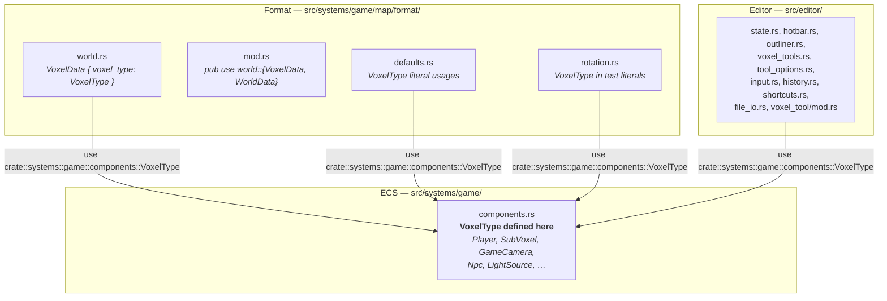
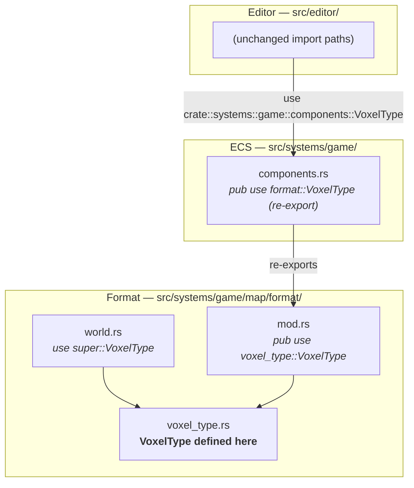

# VoxelType Module Relocation — Architecture Reference

**Date:** 2026-03-31
**Repo:** `adrakestory`
**Runtime:** Rust / Bevy ECS
**Purpose:** Document the current module placement of `VoxelType` that creates a
reverse dependency from the format module into the ECS component module, and
define the target architecture that places `VoxelType` in the format module
where it belongs.

---

## Changelog

| Version | Date | Author | Summary |
|---------|------|--------|---------|
| **v1** | **2026-03-31** | **Investigation** | **Initial draft — current architecture, coupling issue, relocation target** |

---

## Table of Contents

1. [Current Architecture](#1-current-architecture)
   - [Module Structure](#11-module-structure)
   - [VoxelType Definition — Current](#12-voxeltype-definition--current)
   - [The Coupling Problem](#13-the-coupling-problem)
   - [Consumer Import Map](#14-consumer-import-map)
2. [Target Architecture](#2-target-architecture)
   - [Design Principles](#21-design-principles)
   - [New File: voxel_type.rs](#22-new-file-voxel_typers)
   - [Modified: format/mod.rs](#23-modified-formatmodrs)
   - [Modified: components.rs](#24-modified-componentsrs)
   - [Modified: world.rs](#25-modified-worldrs)
   - [New and Modified Components](#26-new-and-modified-components)
   - [Module Dependency Diagram — After Fix](#27-module-dependency-diagram--after-fix)
   - [Backward Compatibility](#28-backward-compatibility)
   - [Phase Boundaries](#29-phase-boundaries)
3. [Appendices](#appendix-a--key-file-locations)
   - [Appendix A — Key File Locations](#appendix-a--key-file-locations)
   - [Appendix B — Code Templates](#appendix-b--code-templates)
   - [Appendix C — Open Questions & Decisions](#appendix-c--open-questions--decisions)

---

## 1. Current Architecture

### 1.1 Module Structure



The format module imports a type from the ECS component module. This is a
reverse dependency: format types should be self-contained; ECS types should
depend on format types (if at all), not the other way around.

### 1.2 VoxelType Definition — Current

**File:** `src/systems/game/components.rs:44–50`

```rust
#[derive(Clone, Copy, Debug, PartialEq, Eq, Hash, PartialOrd, Ord, Serialize, Deserialize)]
pub enum VoxelType {
    Air,
    Grass,
    Dirt,
    Stone,
}
```

`VoxelType` carries `Serialize`/`Deserialize` — format-layer concerns. It does
not derive `Component` and is never used in a `Query`, `With<>`, or any ECS
system parameter. Its placement in `components.rs` is the sole reason the format
module must import from the ECS layer.

### 1.3 The Coupling Problem


**Why this is wrong:**

1. `world.rs` is a format/serialisation file. It should not need to reach into
   the ECS layer to obtain a type.
2. A developer adding a new `VoxelType` variant must edit `components.rs` — a
   file conceptually unrelated to the format — and is likely to be confused
   about why a format change lives there.
3. `components.rs` today imports `serde` only because of `VoxelType`. After the
   move, `components.rs` needs no `serde` imports of its own (the re-export does
   not require them).
4. The format module is otherwise self-contained: every other type it uses
   (`SubVoxelPattern`, `OrientationMatrix`, `EntityType`, …) is defined within
   `src/systems/game/map/format/`. `VoxelType` is the sole exception.

### 1.4 Consumer Import Map

All eleven consumer files currently import via `components.rs`. None import
directly from `format/`. This means the re-export approach (see §2.3) makes the
move completely transparent to all consumers.

| File | Import path today | Type of usage |
|------|------------------|---------------|
| `format/world.rs` | `crate::systems::game::components::VoxelType` | Field type on `VoxelData` (production) |
| `format/defaults.rs` | `crate::systems::game::components::VoxelType` | Struct literal (production) |
| `format/rotation.rs` | `crate::systems::game::components::VoxelType` | Test literals only |
| `map/validation.rs` | `crate::systems::game::components::VoxelType` | Test literals only |
| `editor/state.rs` | `crate::systems::game::components::VoxelType` | `ToolMemory`, `EditorTool` fields |
| `editor/controller/hotbar.rs` | `crate::systems::game::components::VoxelType` | Icon mapping |
| `editor/controller/input.rs` | `crate::systems::game::components::VoxelType` | Destructuring |
| `editor/ui/properties/voxel_tools.rs` | `crate::systems::game::components::VoxelType` | `get_voxel_color()` |
| `editor/ui/toolbar/tool_options.rs` | `crate::systems::game::components::VoxelType` | Combo box options |
| `editor/ui/outliner.rs` | `crate::systems::game::components::VoxelType` | `BTreeMap` key, icon mapping |
| `editor/tools/voxel_tool/mod.rs` | `crate::systems::game::components::VoxelType` | Fully-qualified, no `use` statement |
| `editor/history.rs` | `crate::systems::game::components::VoxelType` | Test literals only |
| `editor/shortcuts.rs` | `crate::systems::game::components::VoxelType` | Test literals only |
| `editor/file_io.rs` | `crate::systems::game::components::VoxelType` | Test literals only |

---

## 2. Target Architecture

### 2.1 Design Principles

1. **Format module owns format types** — All types that appear in `VoxelData`
   or are serialised to the RON file belong in `src/systems/game/map/format/`.
   `VoxelType` is a format type; it must live there.
2. **Re-export preserves backward compatibility** — The existing `components.rs`
   path is preserved via `pub use`. Zero consumers need to change their import
   paths (FR-2.5.1).
3. **Minimal diff** — Only four files change in production code; no consumer
   file changes.
4. **Serde boundary follows the definition** — After the move, `components.rs`
   no longer needs its own `use serde::{Deserialize, Serialize}` import.

### 2.2 New File: voxel_type.rs

**Path:** `src/systems/game/map/format/voxel_type.rs`

```rust
use serde::{Deserialize, Serialize};

#[derive(Clone, Copy, Debug, PartialEq, Eq, Hash, PartialOrd, Ord, Serialize, Deserialize)]
pub enum VoxelType {
    Air,
    Grass,
    Dirt,
    Stone,
}
```

Identical to the current definition in `components.rs:44–50`, moved verbatim.

### 2.3 Modified: format/mod.rs

Add `mod voxel_type;` to the module list and `pub use voxel_type::VoxelType;` to
the re-export block.

**Before (relevant lines):**

```rust
mod world;

pub use world::{VoxelData, WorldData};
```

**After:**

```rust
mod voxel_type;
mod world;

pub use voxel_type::VoxelType;
pub use world::{VoxelData, WorldData};
```

### 2.4 Modified: components.rs

Replace the `VoxelType` definition with a re-export. The `use serde` import line
is no longer needed in this file.

**Before:**

```rust
use bevy::prelude::*;
use serde::{Deserialize, Serialize};

// ... (other components) ...

#[derive(Clone, Copy, Debug, PartialEq, Eq, Hash, PartialOrd, Ord, Serialize, Deserialize)]
pub enum VoxelType {
    Air,
    Grass,
    Dirt,
    Stone,
}
```

**After:**

```rust
use bevy::prelude::*;

// ... (other components) ...

pub use crate::systems::game::map::format::VoxelType;
```

The `use serde::{Deserialize, Serialize}` import is removed because no remaining
type in `components.rs` uses serde derives (all other types derive only
`Component` and Bevy derives).

### 2.5 Modified: world.rs

Change the cross-module import to a local intra-format import.

**Before:**

```rust
use crate::systems::game::components::VoxelType;
```

**After:**

```rust
use super::VoxelType;
```

(`super` refers to `format/mod.rs` which re-exports `VoxelType` from
`voxel_type.rs` per §2.3.)

### 2.6 New and Modified Components

**New:**

| Component | File | Description |
|-----------|------|-------------|
| `VoxelType` (definition) | `src/systems/game/map/format/voxel_type.rs` | Moved from `components.rs`; identical definition |

**Modified:**

| Component | File | Change |
|-----------|------|--------|
| `format/mod.rs` | `src/systems/game/map/format/mod.rs` | Add `mod voxel_type;` + `pub use voxel_type::VoxelType;` |
| `components.rs` | `src/systems/game/components.rs` | Replace definition with `pub use crate::systems::game::map::format::VoxelType;`; remove `use serde` import |
| `world.rs` | `src/systems/game/map/format/world.rs` | Change import from `crate::systems::game::components::VoxelType` to `super::VoxelType` |
| `map-format-spec.md` | `docs/api/map-format-spec.md` | Update `VoxelType` location note |

**Not changed:**

- All editor files (`state.rs`, `hotbar.rs`, `outliner.rs`, etc.)
- All test fixtures referencing `VoxelType` variants
- `MapLoadError` — no change
- All spawner files — no change
- Game system files (`physics.rs`, `collision.rs`, etc.) — no change

### 2.7 Module Dependency Diagram — After Fix



The reverse dependency is eliminated. The format module is now self-contained.
Consumers reach `VoxelType` via the `components.rs` re-export as before.

### 2.8 Backward Compatibility

| Scenario | Before fix | After fix | Result |
|----------|-----------|-----------|--------|
| `use crate::systems::game::components::VoxelType` | Resolves to definition in `components.rs` | Resolves via re-export to `format/voxel_type.rs` | Identical at call site ✓ |
| RON map file with `voxel_type: Grass` | Deserialises via `VoxelType::Grass` | Identical | Identical ✓ |
| Editor variant iteration (`VoxelType::iter()`) | Works | Works | Identical ✓ |
| `cargo test` with VoxelType literals | Compiles | Compiles via re-export | Identical ✓ |

### 2.9 Phase Boundaries

| Capability | Phase | Notes |
|------------|-------|-------|
| Move definition to `voxel_type.rs` | Phase 1 | Core fix |
| Re-exports from `format/mod.rs` and `components.rs` | Phase 1 | Required for backward compat |
| Fix `world.rs` cross-import | Phase 1 | Required — eliminates reverse dependency |
| `map-format-spec.md` update | Phase 1 | Required |
| Both binaries compile cleanly | Phase 1 | Required |
| Expand `VoxelType` variant set | Phase 2 | Out of scope |
| Renderer uses `voxel_type` for colour | Phase 2 | Out of scope |

---

## Appendix A — Key File Locations

| Component | Path |
|-----------|------|
| `VoxelType` definition (current) | `src/systems/game/components.rs:44–50` |
| `VoxelType` definition (target) | `src/systems/game/map/format/voxel_type.rs` (new) |
| `format/mod.rs` re-exports | `src/systems/game/map/format/mod.rs` |
| `world.rs` cross-import (to fix) | `src/systems/game/map/format/world.rs:5` |
| `defaults.rs` (consumer, unchanged) | `src/systems/game/map/format/defaults.rs` |
| `rotation.rs` tests (consumer, unchanged) | `src/systems/game/map/format/rotation.rs` |
| Editor consumers (unchanged) | `src/editor/` (various) |
| Format spec | `docs/api/map-format-spec.md` |

---

## Appendix B — Code Templates

### voxel_type.rs (complete new file)

```rust
use serde::{Deserialize, Serialize};

#[derive(Clone, Copy, Debug, PartialEq, Eq, Hash, PartialOrd, Ord, Serialize, Deserialize)]
pub enum VoxelType {
    Air,
    Grass,
    Dirt,
    Stone,
}
```

### format/mod.rs additions

```rust
mod voxel_type;
// ... existing mods ...

pub use voxel_type::VoxelType;
// ... existing pub uses ...
```

### components.rs replacement

Replace lines 2 and 44–50:

```rust
// Remove: use serde::{Deserialize, Serialize};
// Replace enum definition with:
pub use crate::systems::game::map::format::VoxelType;
```

### world.rs import change

```rust
// Before:
use crate::systems::game::components::VoxelType;
// After:
use super::VoxelType;
```

---

## Appendix C — Open Questions & Decisions

### Resolved

| # | Question | Resolution |
|---|----------|------------|
| 1 | Must consumer import paths change? | **No.** Re-export from `components.rs` preserves all existing paths. |
| 2 | Should `defaults.rs` and `rotation.rs` also update their imports? | **No change required.** Their existing `use crate::systems::game::components::VoxelType` paths remain valid via the re-export. Optionally they could be updated to `use super::VoxelType` in the same PR for consistency, but it is not required for correctness. |
| 3 | Does removing the `use serde` import from `components.rs` cause any issues? | **No.** No remaining type in `components.rs` uses `#[derive(Serialize, Deserialize)]` after `VoxelType` is removed. Clippy would flag the unused import anyway. |
| 4 | Can `voxel_tool/mod.rs` (which uses fully-qualified `VoxelType` with no `use` statement) still compile? | **Yes.** The fully-qualified path `crate::systems::game::components::VoxelType` continues to resolve via the re-export. |

---

*Created: 2026-03-31 — See [Changelog](#changelog) for version history.*
*Companion documents: [Requirements](./requirements.md) | [Ticket](../ticket.md)*
*Source: `docs/investigations/2026-03-22-1427-map-format-analysis.md` — Finding 6*
