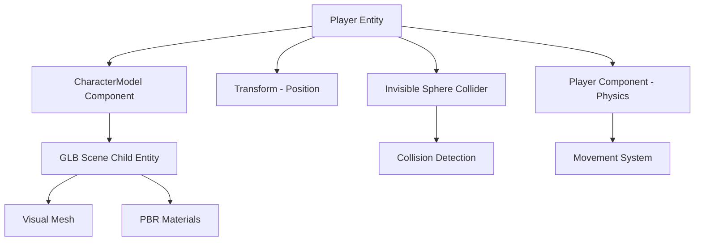

# Character Model Implementation Plan

## Overview

Replace the current character sphere with a proper 3D GLB model (`base_basic_pbr.glb`) while maintaining existing physics and collision systems.

## Current State

- **Character Representation**: Red sphere mesh (radius: 0.3)
- **Location**: [`src/systems/game/map/spawner.rs:163`](../../src/systems/game/map/spawner.rs#L163) - `spawn_player()` function
- **Components**: [`Player`](../../src/systems/game/components.rs#L5) (physics data), [`CollisionBox`](../../src/systems/game/components.rs#L13) (debug visualization)
- **Model Files Available**:
  - `assets/characters/base_basic_pbr.glb` ✓ (selected)
  - `assets/characters/base_basic_shaded.glb`

## Architecture Design



## Implementation Checklist

### Phase 1: Module Structure ✅
- [x] Create `src/systems/game/character/mod.rs`
- [x] Add `CharacterModel` component to track loaded scene
- [x] Export character module in `src/systems/game/mod.rs`

### Phase 2: Component Design ✅
- [x] Define `CharacterModel` component:
  ```rust
  #[derive(Component)]
  pub struct CharacterModel {
      pub scene_handle: Handle<Scene>,
      pub scale: f32,
      pub offset: Vec3,
  }
  ```
- [x] Keep `Player` component unchanged (physics only)
- [x] Separate visual from collision logic

### Phase 3: Player Spawning ✅
- [x] Modify `spawn_player()` in [`spawner.rs`](../../src/systems/game/map/spawner.rs#L163)
- [x] Load GLB scene using `AssetServer`:
  ```rust
  let character_scene = asset_server.load("characters/base_basic_pbr.glb");
  ```
- [x] Spawn player entity with:
  - `Player` component (physics)
  - `Transform` (position)
  - `CharacterModel` component
- [x] Spawn GLB scene as child entity using `SceneRoot`
- [x] Make sphere collider invisible (remove `Mesh3d` and `MeshMaterial3d`)
- [x] Keep collision box system unchanged

### Phase 4: Model Adjustments ✅
- [x] Add model scaling if needed (default: 1.0)
- [x] Add position offset if model origin doesn't match sphere center
- [x] Ensure model faces correct direction (align with movement)

### Phase 5: Testing & Validation 🔄
- [ ] Test character model loads and renders correctly
- [ ] Verify player movement works (WASD/arrows)
- [ ] Verify jumping works (Space)
- [ ] Verify collision detection works (walls, floors, stairs)
- [ ] Test camera follow system
- [ ] Check collision box debug visualization

### Phase 6: Error Handling 📋
- [ ] Add fallback to sphere if GLB fails to load
- [ ] Add logging for model loading status (partially done)
- [ ] Handle missing asset gracefully

## Technical Details

### Collision Strategy
- **Physics Collider**: Invisible sphere (radius: 0.3) at player position
- **Visual Model**: GLB scene as child entity, can be offset/scaled
- **Collision System**: Only checks sphere bounds (unchanged)
- **Benefits**: Simple physics, flexible visuals, easy to swap models

### GLB Loading Pattern
```rust
// In spawn_player function
let character_scene: Handle<Scene> = asset_server.load("characters/base_basic_pbr.glb");

// Spawn player entity (parent)
let player_entity = commands.spawn((
    Player { /* ... */ },
    Transform::from_translation(position),
    CharacterModel {
        scene_handle: character_scene.clone(),
        scale: 1.0,
        offset: Vec3::ZERO,
    },
)).id();

// Spawn scene as child
commands.spawn((
    SceneRoot(character_scene),
    Transform::from_scale(Vec3::splat(1.0)),
)).set_parent(player_entity);
```

### File Changes Required

1. **New Files**:
   - `src/systems/game/character/mod.rs` - Character module

2. **Modified Files**:
   - `src/systems/game/mod.rs` - Add character module export
   - `src/systems/game/components.rs` - Add CharacterModel component (or in character/mod.rs)
   - `src/systems/game/map/spawner.rs` - Update spawn_player function

3. **Unchanged Systems**:
   - `src/systems/game/player_movement.rs` - Movement logic
   - `src/systems/game/physics.rs` - Gravity and physics
   - `src/systems/game/collision.rs` - Collision detection
   - `src/systems/game/camera.rs` - Camera follow

## Benefits of This Approach

1. **Minimal Changes**: Physics and collision systems remain unchanged
2. **Maintainable**: Clear separation between physics and visuals
3. **Flexible**: Easy to swap models or add animations later
4. **Performant**: Simple sphere collision is efficient
5. **Robust**: Fallback to sphere if model fails to load

## Future Enhancements

- [ ] Add character animations (walk, jump, idle)
- [ ] Support multiple character models
- [ ] Add character customization system
- [ ] Implement model LOD (Level of Detail)
- [ ] Add character shadows and lighting

## References

- Current player spawn: [`src/systems/game/map/spawner.rs:163`](../../src/systems/game/map/spawner.rs#L163)
- Player component: [`src/systems/game/components.rs:5`](../../src/systems/game/components.rs#L5)
- Movement system: [`src/systems/game/player_movement.rs:26`](../../src/systems/game/player_movement.rs#L26)
- Bevy GLTF documentation: https://docs.rs/bevy/latest/bevy/gltf/

## Implementation Summary

### Completed Changes

1. **Updated Cargo.toml** ([`Cargo.toml`](../../Cargo.toml))
   - Enabled `bevy_gltf` feature for GLB/GLTF model loading
   - Required for Bevy 0.15 to load 3D model files

2. **Created Character Module** ([`src/systems/game/character/mod.rs`](../../src/systems/game/character/mod.rs))
   - Added `CharacterModel` component with scene handle, scale, and offset
   - Implemented helper constructors for flexible model configuration
   - Added `#[allow(dead_code)]` for future-use fields

3. **Updated Game Module** ([`src/systems/game/mod.rs`](../../src/systems/game/mod.rs))
   - Exported character module as public

4. **Modified Player Spawning** ([`src/systems/game/map/spawner.rs`](../../src/systems/game/map/spawner.rs))
   - Added `CharacterModel` and `GltfAssetLabel` imports
   - Updated `EntitySpawnContext` to include `AssetServer`
   - Updated `spawn_map_system` signature to accept `AssetServer`
   - Completely rewrote `spawn_player()` function:
     - Loads `base_basic_pbr.glb` using `GltfAssetLabel::Scene(0)` (Bevy 0.15 syntax)
     - Spawns player entity with physics components (no visible mesh)
     - Spawns GLB scene as child entity for visuals
     - Keeps invisible collision box for debugging
     - Added logging for model loading

### Code Quality
- ✅ Compiles successfully with `cargo check`
- ✅ No errors, only minor warnings about unused helper functions
- ✅ Maintains backward compatibility with existing systems
- ✅ Physics and collision systems unchanged

## Status

**Current Phase**: Implementation Complete - Ready for Testing ✅
**Next Step**: Run the game and verify character model renders correctly
**Compilation Status**: ✅ Success (cargo check passed)
**GLTF Support**: ✅ Enabled (bevy_gltf feature + GltfAssetLabel::Scene(0) syntax)

### Loading Syntax
```rust
use bevy::gltf::GltfAssetLabel;

let character_scene: Handle<Scene> = asset_server.load(
    GltfAssetLabel::Scene(0).from_asset("characters/base_basic_pbr.glb")
);
```

---

*Last Updated: 2025-10-30*
*Model Selected: base_basic_pbr.glb*
*Implementation Status: Complete - Awaiting Runtime Testing*