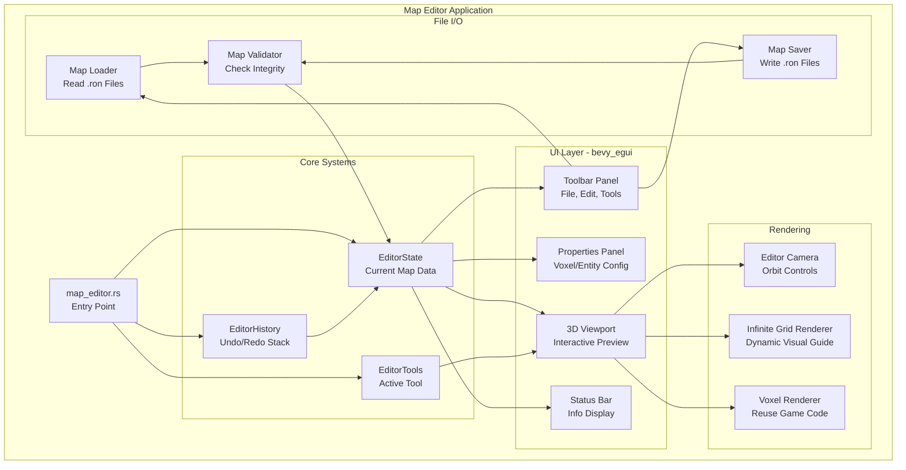
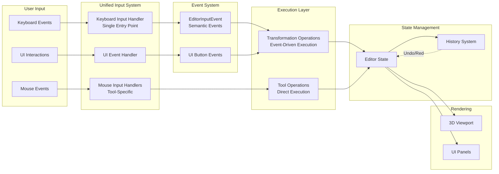
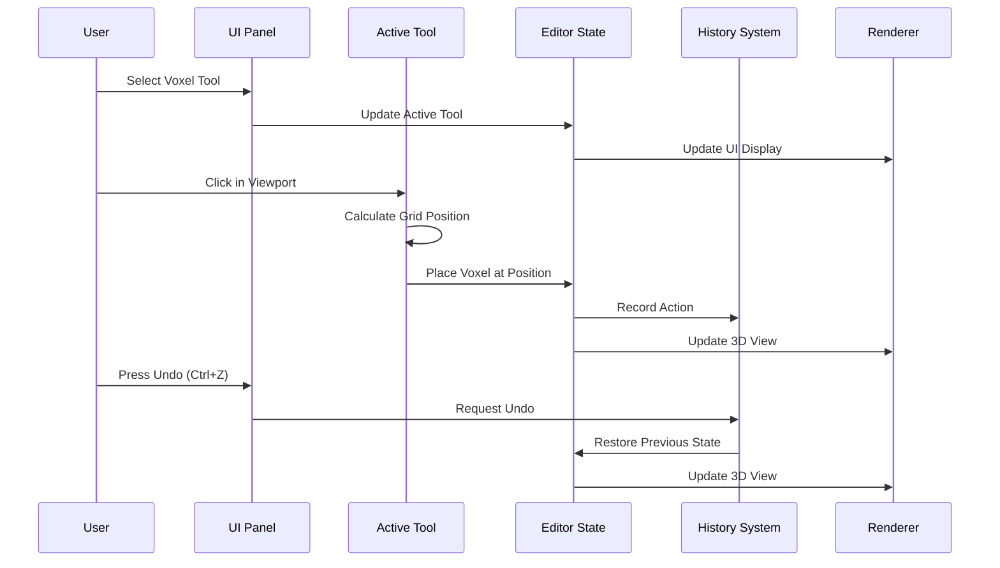
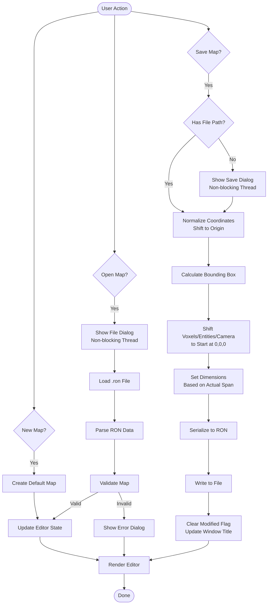
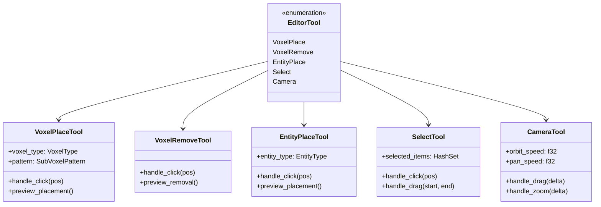
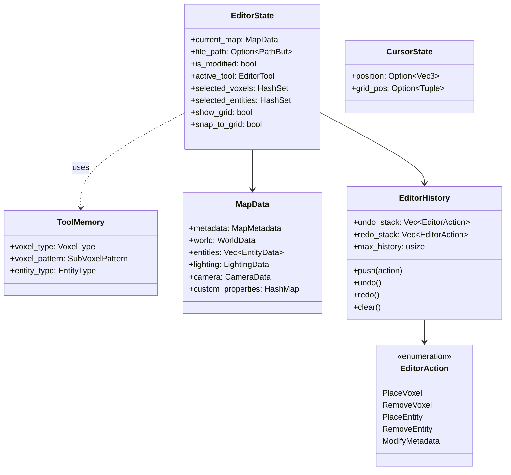
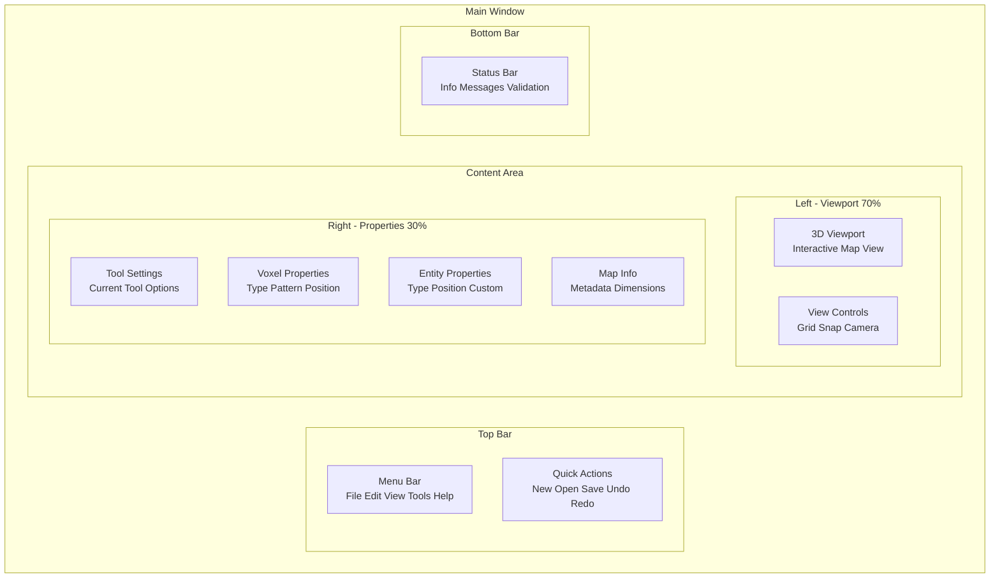
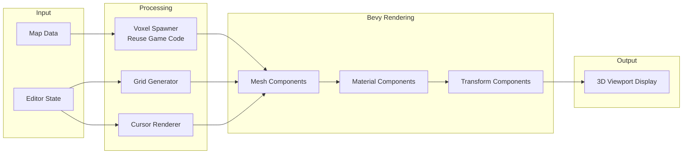
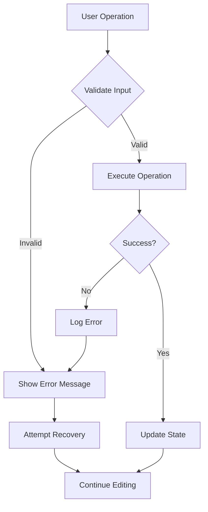

# Map Editor Architecture

## System Architecture Diagram



## Data Flow Diagram



## Component Interaction Flow



## File Operation Workflow



### Coordinate Normalization (Added November 2025)

When saving maps, the editor automatically normalizes coordinates to ensure all voxels start at (0, 0, 0):

**Process:**
1. Calculate bounding box of all voxels
2. Determine offset needed to shift minimum coordinates to origin
3. Apply offset to all voxels, entities, and camera positions
4. Set dimensions based on actual voxel span (not just maximum values)

**Benefits:**
- Prevents "Invalid voxel position" errors from negative coordinates
- Ensures saved maps always pass validation
- Maintains spatial relationships between all objects
- Backward compatible (maps already at origin are unchanged)

**Example:**
```
Before: Voxels at X: [-5, 4], Y: [0, 1], Z: [0, 3]
Offset: (5, 0, 0)
After:  Voxels at X: [0, 9], Y: [0, 1], Z: [0, 3]
Dimensions: width=10, height=2, depth=4
```

See [`file_io.rs:normalize_map_coordinates()`](../../../../src/editor/file_io.rs:176) for implementation details.

## Tool System Architecture



## State Management Structure



### ToolMemory Resource

The `ToolMemory` resource stores the last-used parameters for tools that have configurable options. When switching between tools, the current tool's parameters are saved to `ToolMemory`, and when switching back to a tool, its parameters are restored from `ToolMemory`.

**Stored Parameters:**
- `voxel_type` - Last used voxel type (Grass, Dirt, Stone) for VoxelPlace tool
- `voxel_pattern` - Last used pattern (Full, Platform, Staircase, etc.) for VoxelPlace tool
- `entity_type` - Last used entity type (PlayerSpawn, NPC, Enemy, etc.) for EntityPlace tool

**Behavior:**
- Parameters are automatically saved when switching away from a tool
- Parameters are automatically restored when switching back to a tool
- Dropdown changes in the toolbar immediately update ToolMemory
- Memory persists during the editing session (not saved to disk)

## UI Panel Layout



## Rendering Pipeline



## Key Design Patterns

### 1. Command Pattern (Undo/Redo)
Every editing action is encapsulated as a command that can be executed, undone, and redone.

### 2. State Pattern (Tools)
Different tools implement the same interface but behave differently based on the active tool state.

### 3. Observer Pattern (UI Updates)
UI panels observe the editor state and update automatically when state changes.

### 4. Strategy Pattern (Validation)
Different validation strategies can be applied based on map requirements.

### 5. Factory Pattern (Tool Creation)
Tools are created through a factory based on the selected tool type.

## Performance Considerations

### Optimization Strategies

1. **Lazy Rendering**
   - Only re-render when state changes
   - Use change detection for UI updates

2. **Infinite Grid System**
   - Camera-relative grid generation with frustum culling
   - Dynamic render distance that scales with camera zoom
   - Regenerates only when camera moves > 2 units or zoom changes
   - Aligned with voxel centers for accurate placement

3. **Chunk-Based Voxel Rendering** (Added 2025-12-08)
   - Voxels grouped into 16³ chunks with merged meshes
   - Hidden face culling removes interior faces
   - Greedy meshing merges coplanar faces
   - Explicit AABB components enable Bevy's automatic frustum culling
   - Material palette reduces GPU memory usage
   - Note: LOD disabled for editor (full detail needed when editing)

4. **Spatial Partitioning**
   - Use spatial hash for voxel lookups
   - Frustum culling for large maps via AABB components

5. **Batch Operations**
   - Group multiple edits into single history entry
   - Batch mesh updates for better performance

6. **Memory Management**
   - Limit history stack size
   - Use sparse data structures for voxels
   - Unload unused resources

## Error Handling Strategy



## Testing Strategy

### Unit Tests
- Tool behavior
- History system
- Validation logic
- File I/O operations

### Integration Tests
- UI interactions
- State management
- Rendering pipeline
- File operations

### End-to-End Tests
- Complete editing workflows
- Save/load cycles
- Undo/redo chains
- Error recovery

## Grid System Details

### Infinite Grid Architecture

The editor uses an infinite grid system that dynamically generates grid lines based on camera position:

**Key Features:**
- **Infinite Spanning**: Grid extends infinitely in all directions
- **Camera-Relative**: Only renders visible portion (configurable render distance)
- **Dynamic Render Distance**: Grid extent scales with camera zoom level
- **Voxel Alignment**: Grid lines at integer coordinates (0, 1, 2, ...) align with voxel centers
- **Dynamic Regeneration**: Updates when camera moves beyond threshold or zoom changes
- **Major Grid Lines**: Every Nth line rendered with different color/opacity
- **Frustum Culling**: Only generates grid lines visible in the camera's view frustum

**Configuration:**
```rust
InfiniteGridConfig {
    spacing: 1.0,              // Aligns with voxel positions
    render_distance: 100.0,    // Base units from camera (scales with zoom)
    major_line_interval: 10,   // Every 10th line is major
    opacity: 0.3,              // Grid transparency
    regeneration_threshold: 2.0 // Camera movement threshold
}
```

**Dynamic Render Distance:**
The grid render distance automatically scales based on camera zoom level:
- When zoomed in close: Base render distance provides sufficient coverage
- When zoomed out: Render distance expands to keep grid appearing infinite
- Formula: `dynamic_distance = base + camera_height * 2 + camera_distance * 1.5`

**Frustum Culling:**
- Grid bounds are tested against camera frustum before mesh generation
- Uses AABB intersection tests on grid sections
- Automatically handles close-up views with adaptive AABB sizing
- Falls back to distance-based bounds if frustum test fails

**Performance:**
- Regenerates only when camera moves > 2 units or zoom changes significantly
- Limits grid to visible area via frustum culling
- Uses efficient LineList topology
- Minimal CPU overhead during static camera

## Input System Architecture (Updated October 2025)

The map editor uses a **unified, event-driven input architecture**:

### System Count Reduction

| Component | Before | After | Change |
|-----------|--------|-------|--------|
| Input Handler Systems | 7 | 1 | **-86%** |
| Transformation Systems | 8 | 1 | **-88%** |
| Rendering Systems | 3 | 3 | 0% |
| **Total Systems** | **18** | **5** | **-72%** |

### Key Components

1. **Unified Keyboard Handler** ([`handle_keyboard_input()`](../../../../src/editor/tools/input.rs:105))
   - Single entry point for all keyboard input
   - Context-aware key mapping based on mode
   - One UI focus check instead of 7+

2. **Transformation Operations** ([`handle_transformation_operations()`](../../../../src/editor/tools/input.rs:234))
   - Event-driven execution
   - Handles both keyboard and UI button events
   - Separated from input reading

3. **Event System** ([`EditorInputEvent`](../../../../src/editor/tools/input.rs:15))
   - Semantic events (StartMove, RotateDelta, etc.)
   - Decouples input reading from execution
   - Enables better testing and maintainability

### Benefits

- **Single Responsibility**: Input reading separated from execution
- **DRY Principle**: One UI focus check instead of 7+
- **Maintainability**: All shortcuts in one place
- **Testability**: Can test input mapping separately
- **Performance**: Fewer systems to run each frame

See [Input Refactoring Summary](archive/input-refactoring-summary.md) for complete details.

## Change Detection & Performance (Added October 2025)

### Cursor State Separation

To prevent change detection pollution, cursor state was separated from `EditorState`:

**Problem**: Cursor updates every frame triggered `EditorState.is_changed()`, causing unnecessary lighting updates.

**Solution**: Created dedicated `CursorState` resource ([`cursor.rs`](../../../../src/editor/cursor.rs))
```rust
#[derive(Resource, Default)]
pub struct CursorState {
    pub position: Option<Vec3>,
    pub grid_pos: Option<(i32, i32, i32)>,
}
```

**Impact**: 99.9% reduction in lighting updates (from 60/sec to 2-3 total during startup)

### Event-Based Map Changes

Lighting updates now use `MapDataChangedEvent` instead of change detection:

```rust
fn update_lighting_on_map_change(
    mut map_changed_events: EventReader<MapDataChangedEvent>,
    // ... other params
) {
    if map_changed_events.read().next().is_none() {
        return;  // No map changes, skip update
    }
    // ... update lighting
}
```

**Benefits**:
- Explicit about when map data changes
- No false positives from UI interactions
- Better performance and debuggability

See [Lighting Performance Optimization](archive/lighting-performance-optimization.md) for complete analysis and implementation details.

---

**Document Version**: 2.3.0
**Last Updated**: 2025-12-08
**Status**: Updated for voxel rendering optimizations (Tiers 1-5) and grid frustum culling