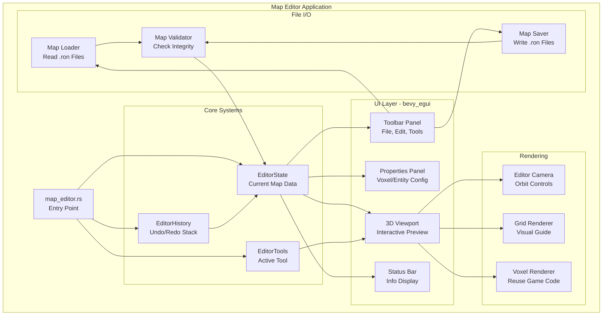
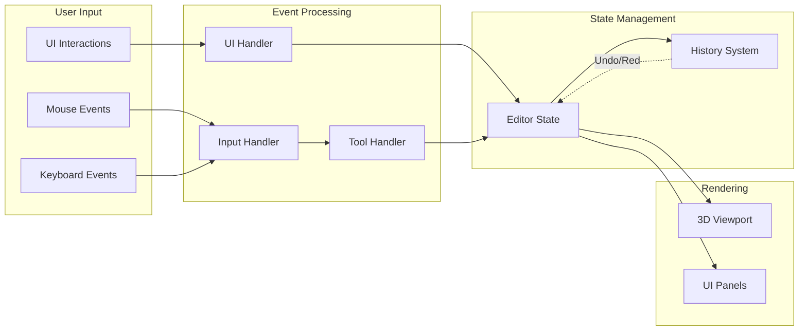
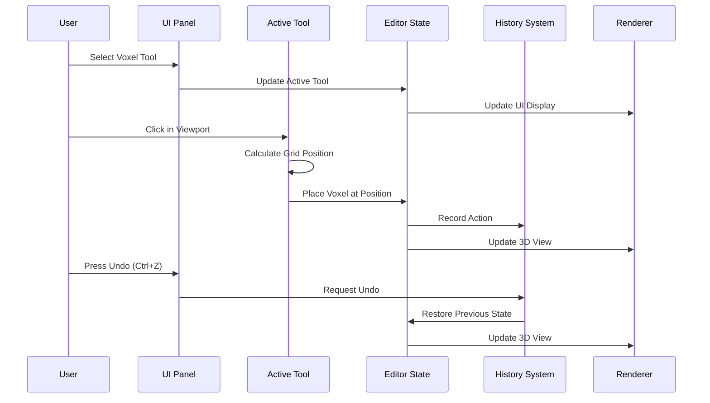
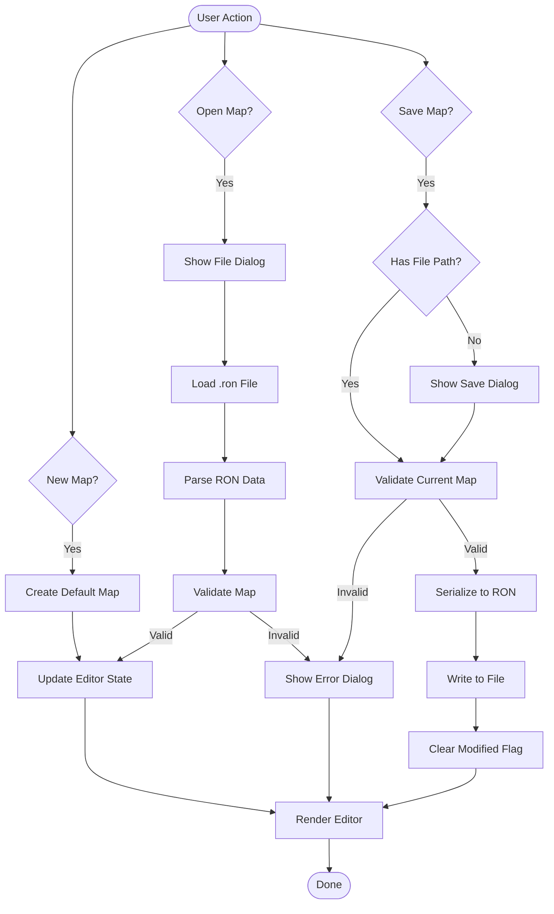
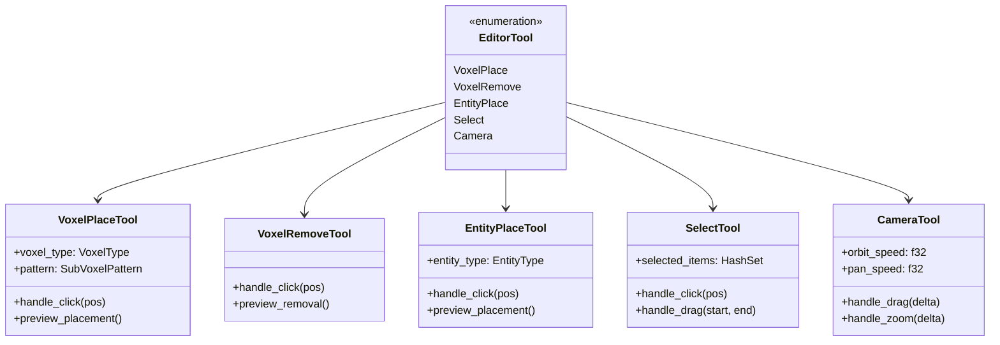
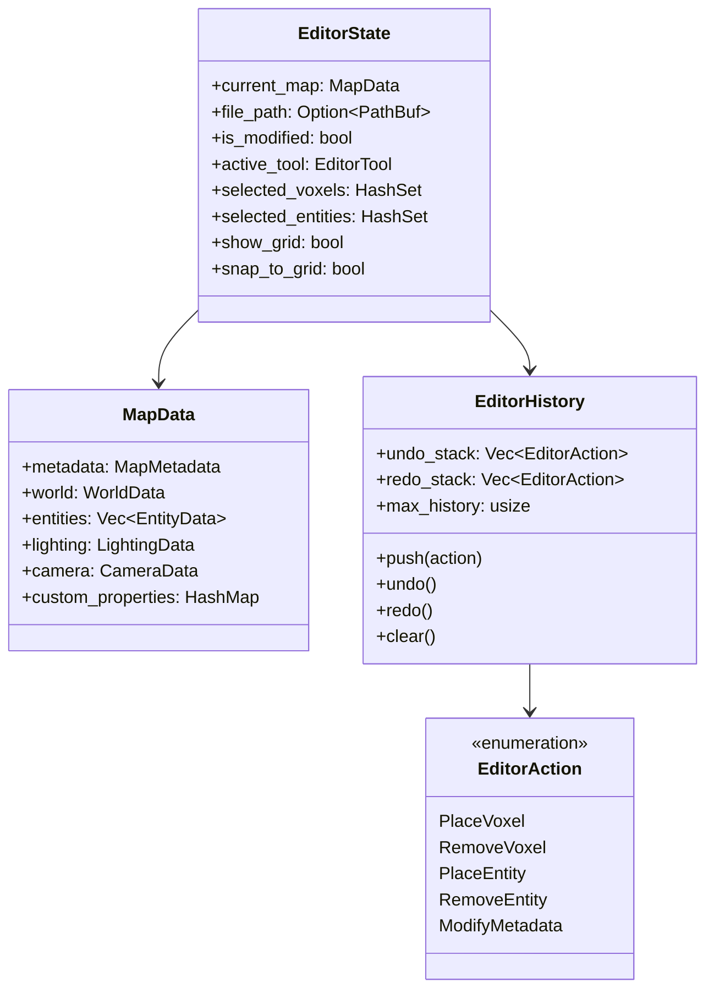
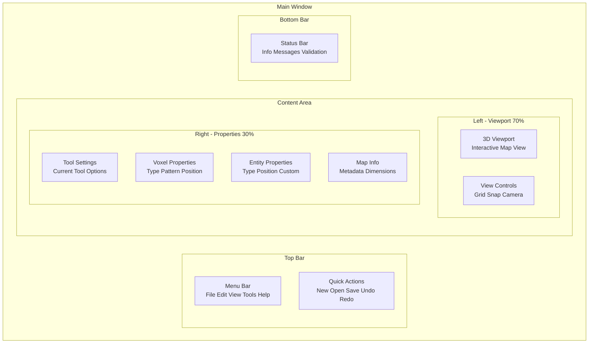
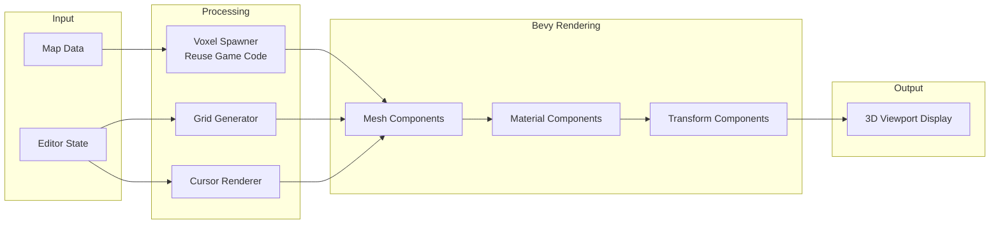
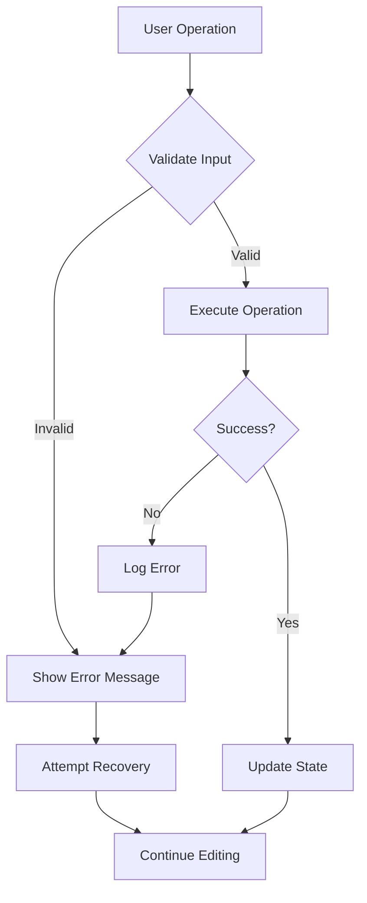

# Map Editor Architecture

## System Architecture Diagram

## Data Flow Diagram

## Component Interaction Flow

## File Operation Workflow

## Tool System Architecture

## State Management Structure

## UI Panel Layout

## Rendering Pipeline

## Key Design Patterns

### 1. Command Pattern (Undo/Redo)
Every editing action is encapsulated as a command that can be executed, undone, and redone.

### 2. State Pattern (Tools)
Different tools implement the same interface but behave differently based on the active tool state.

### 3. Observer Pattern (UI Updates)
UI panels observe the editor state and update automatically when state changes.

### 4. Strategy Pattern (Validation)
Different validation strategies can be applied based on map requirements.

### 5. Factory Pattern (Tool Creation)
Tools are created through a factory based on the selected tool type.

## Performance Considerations

### Optimization Strategies

1. **Lazy Rendering**
   - Only re-render when state changes
   - Use change detection for UI updates

2. **Spatial Partitioning**
   - Use spatial hash for voxel lookups
   - Frustum culling for large maps

3. **Batch Operations**
   - Group multiple edits into single history entry
   - Batch mesh updates for better performance

4. **Memory Management**
   - Limit history stack size
   - Use sparse data structures for voxels
   - Unload unused resources

## Error Handling Strategy

## Testing Strategy

### Unit Tests
- Tool behavior
- History system
- Validation logic
- File I/O operations

### Integration Tests
- UI interactions
- State management
- Rendering pipeline
- File operations

### End-to-End Tests
- Complete editing workflows
- Save/load cycles
- Undo/redo chains
- Error recovery

---

**Document Version**: 1.0.0  
**Last Updated**: 2025-01-10  
**Status**: Design Phase