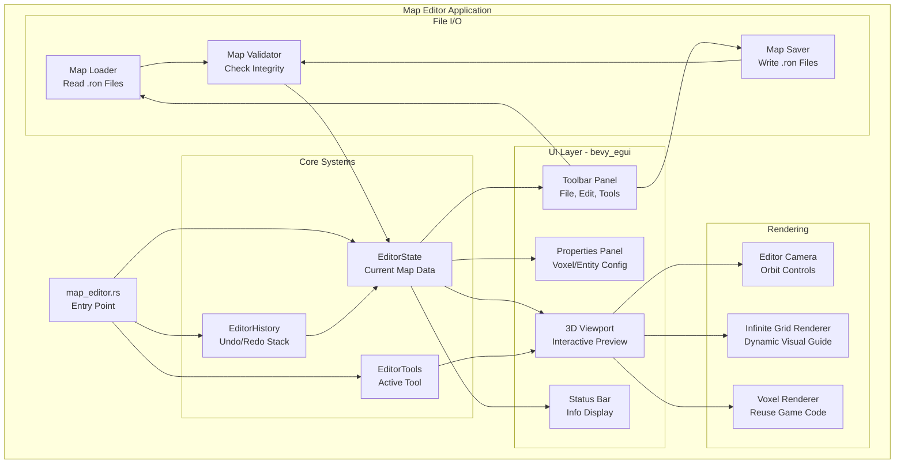
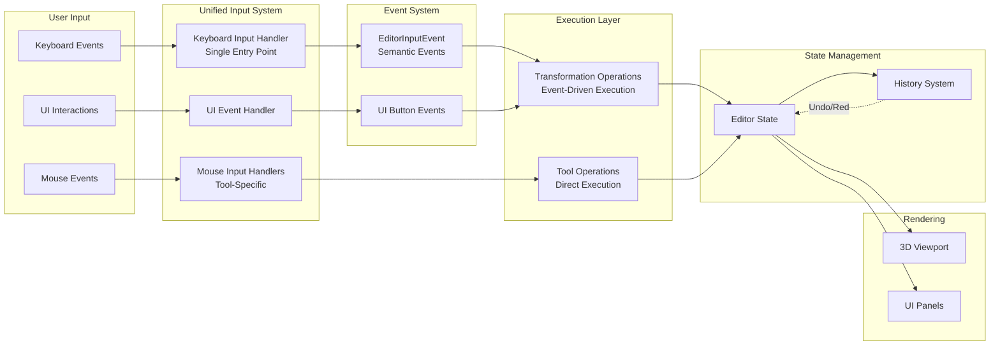
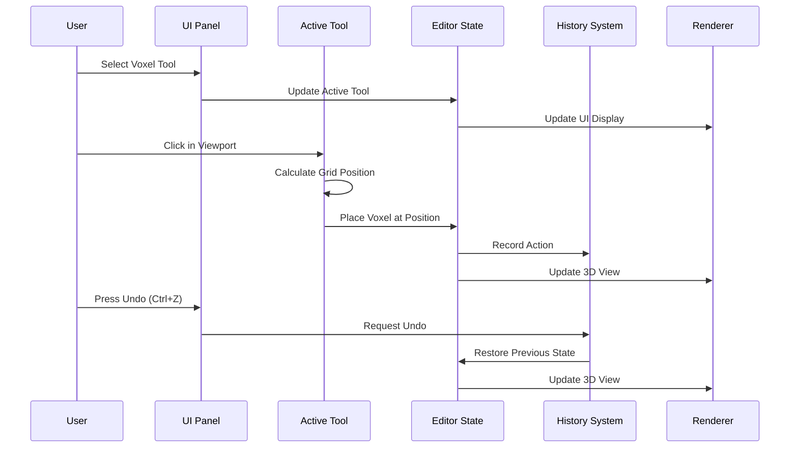
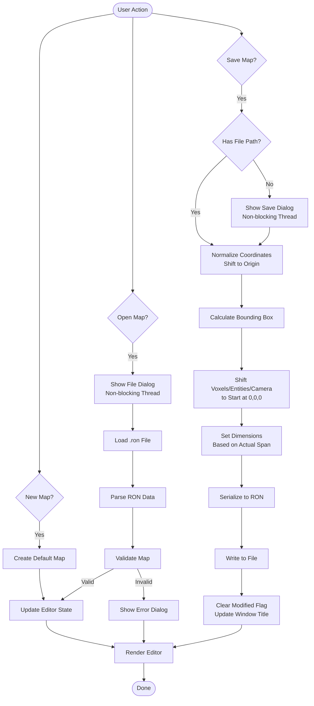
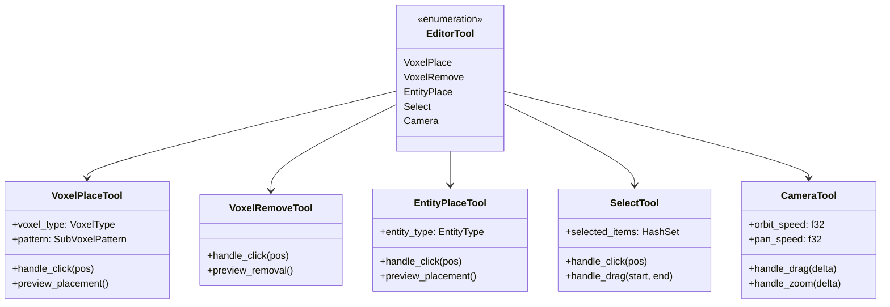
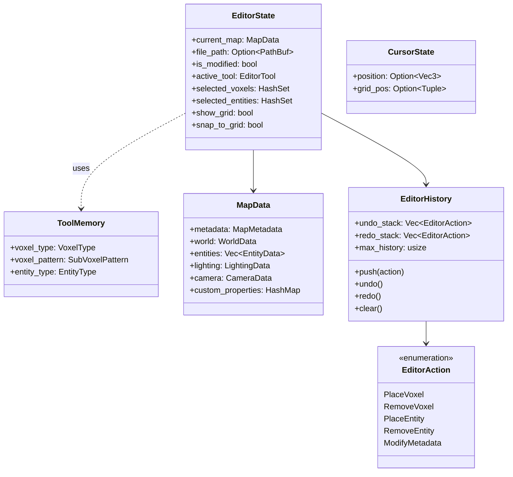
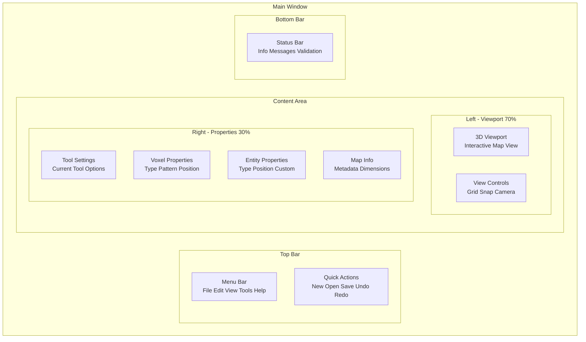
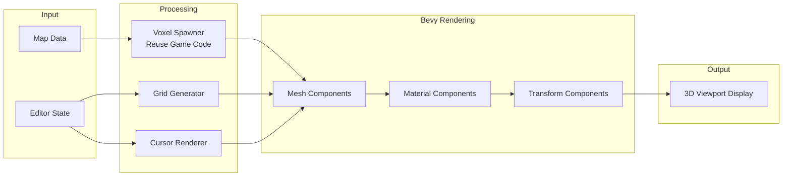
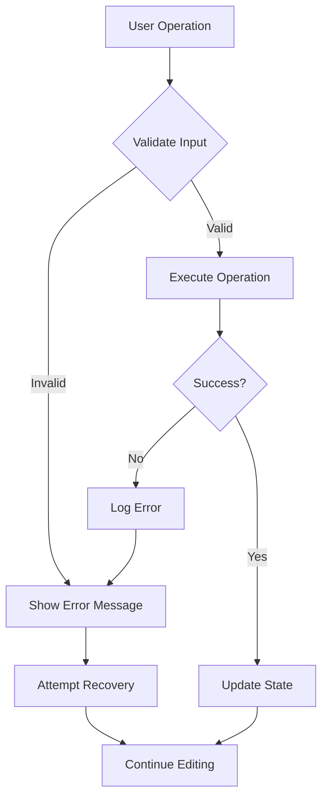

# Map Editor Architecture

## System Architecture Diagram


```mermaid
graph TB
    subgraph "Map Editor Application"
        Entry[map_editor.rs<br/>Entry Point]
        
        subgraph "Core Systems"
            State[EditorState<br/>Current Map Data]
            History[EditorHistory<br/>Undo/Redo Stack]
            Tools[EditorTools<br/>Active Tool]
        end
        
        subgraph "UI Layer - bevy_egui"
            Toolbar[Toolbar Panel<br/>File, Edit, Tools]
            Props[Properties Panel<br/>Voxel/Entity Config]
            Viewport[3D Viewport<br/>Interactive Preview]
            Status[Status Bar<br/>Info Display]
        end
        
        subgraph "Rendering"
            Camera[Editor Camera<br/>Orbit Controls]
            Grid[Infinite Grid Renderer<br/>Dynamic Visual Guide]
            VoxelRender[Voxel Renderer<br/>Reuse Game Code]
        end
        
        subgraph "File I/O"
            Loader[Map Loader<br/>Read .ron Files]
            Saver[Map Saver<br/>Write .ron Files]
            Validator[Map Validator<br/>Check Integrity]
        end
    end
    
    Entry --> State
    Entry --> History
    Entry --> Tools
    
    State --> Toolbar
    State --> Props
    State --> Viewport
    State --> Status
    
    Tools --> Viewport
    History --> State
    
    Viewport --> Camera
    Viewport --> Grid
    Viewport --> VoxelRender
    
    Toolbar --> Loader
    Toolbar --> Saver
    Saver --> Validator
    Loader --> Validator
    
    Validator --> State
```

## Data Flow Diagram


```mermaid
flowchart LR
    subgraph "User Input"
        Mouse[Mouse Events]
        Keyboard[Keyboard Events]
        UI[UI Interactions]
    end
    
    subgraph "Unified Input System"
        KeyboardHandler[Keyboard Input Handler<br/>Single Entry Point]
        MouseHandlers[Mouse Input Handlers<br/>Tool-Specific]
        UIHandler[UI Event Handler]
    end
    
    subgraph "Event System"
        InputEvents[EditorInputEvent<br/>Semantic Events]
        UIEvents[UI Button Events]
    end
    
    subgraph "Execution Layer"
        TransformOps[Transformation Operations<br/>Event-Driven Execution]
        ToolOps[Tool Operations<br/>Direct Execution]
    end
    
    subgraph "State Management"
        EditorState[Editor State]
        History[History System]
    end
    
    subgraph "Rendering"
        Viewport[3D Viewport]
        UIRender[UI Panels]
    end
    
    Keyboard --> KeyboardHandler
    Mouse --> MouseHandlers
    UI --> UIHandler
    
    KeyboardHandler --> InputEvents
    UIHandler --> UIEvents
    
    InputEvents --> TransformOps
    UIEvents --> TransformOps
    MouseHandlers --> ToolOps
    
    TransformOps --> EditorState
    ToolOps --> EditorState
    
    EditorState --> History
    EditorState --> Viewport
    EditorState --> UIRender
    
    History -.Undo/Redo.-> EditorState
```

## Component Interaction Flow


```mermaid
sequenceDiagram
    participant User
    participant UI as UI Panel
    participant Tool as Active Tool
    participant State as Editor State
    participant History as History System
    participant Render as Renderer
    
    User->>UI: Select Voxel Tool
    UI->>State: Update Active Tool
    State->>Render: Update UI Display
    
    User->>Tool: Click in Viewport
    Tool->>Tool: Calculate Grid Position
    Tool->>State: Place Voxel at Position
    State->>History: Record Action
    State->>Render: Update 3D View
    
    User->>UI: Press Undo (Ctrl+Z)
    UI->>History: Request Undo
    History->>State: Restore Previous State
    State->>Render: Update 3D View
```

## File Operation Workflow


```mermaid
flowchart TD
    Start([User Action])
    
    Start --> New{New Map?}
    Start --> Open{Open Map?}
    Start --> Save{Save Map?}
    
    New -->|Yes| CreateDefault[Create Default Map]
    CreateDefault --> UpdateState[Update Editor State]
    
    Open -->|Yes| ShowDialog[Show File Dialog<br/>Non-blocking Thread]
    ShowDialog --> LoadFile[Load .ron File]
    LoadFile --> Parse[Parse RON Data]
    Parse --> Validate[Validate Map]
    Validate -->|Valid| UpdateState
    Validate -->|Invalid| ShowError[Show Error Dialog]
    
    Save -->|Yes| HasPath{Has File Path?}
    HasPath -->|No| ShowSaveDialog[Show Save Dialog<br/>Non-blocking Thread]
    HasPath -->|Yes| Normalize[Normalize Coordinates<br/>Shift to Origin]
    ShowSaveDialog --> Normalize
    Normalize --> CalcBounds[Calculate Bounding Box]
    CalcBounds --> ShiftCoords[Shift Voxels/Entities/Camera<br/>to Start at 0,0,0]
    ShiftCoords --> SetDimensions[Set Dimensions<br/>Based on Actual Span]
    SetDimensions --> SerializeMap[Serialize to RON]
    SerializeMap --> WriteFile[Write to File]
    WriteFile --> ClearDirty[Clear Modified Flag<br/>Update Window Title]
    
    UpdateState --> Render[Render Editor]
    ShowError --> Render
    ClearDirty --> Render
    Render --> End([Done])
```

### Coordinate Normalization (Added November 2025)

When saving maps, the editor automatically normalizes coordinates to ensure all voxels start at (0, 0, 0):

**Process:**
1. Calculate bounding box of all voxels
2. Determine offset needed to shift minimum coordinates to origin
3. Apply offset to all voxels, entities, and camera positions
4. Set dimensions based on actual voxel span (not just maximum values)

**Benefits:**
- Prevents "Invalid voxel position" errors from negative coordinates
- Ensures saved maps always pass validation
- Maintains spatial relationships between all objects
- Backward compatible (maps already at origin are unchanged)

**Example:**
```
Before: Voxels at X: [-5, 4], Y: [0, 1], Z: [0, 3]
Offset: (5, 0, 0)
After:  Voxels at X: [0, 9], Y: [0, 1], Z: [0, 3]
Dimensions: width=10, height=2, depth=4
```

See [`file_io.rs:normalize_map_coordinates()`](../../../../src/editor/file_io.rs:176) for implementation details.

## Tool System Architecture


```mermaid
classDiagram
    class EditorTool {
        <<enumeration>>
        VoxelPlace
        VoxelRemove
        EntityPlace
        Select
        Camera
    }
    
    class VoxelPlaceTool {
        +voxel_type: VoxelType
        +pattern: SubVoxelPattern
        +handle_click(pos)
        +preview_placement()
    }
    
    class VoxelRemoveTool {
        +handle_click(pos)
        +preview_removal()
    }
    
    class EntityPlaceTool {
        +entity_type: EntityType
        +handle_click(pos)
        +preview_placement()
    }
    
    class SelectTool {
        +selected_items: HashSet
        +handle_click(pos)
        +handle_drag(start, end)
    }
    
    class CameraTool {
        +orbit_speed: f32
        +pan_speed: f32
        +handle_drag(delta)
        +handle_zoom(delta)
    }
    
    EditorTool --> VoxelPlaceTool
    EditorTool --> VoxelRemoveTool
    EditorTool --> EntityPlaceTool
    EditorTool --> SelectTool
    EditorTool --> CameraTool
```

## State Management Structure


```mermaid
classDiagram
    class EditorState {
        +current_map: MapData
        +file_path: Option~PathBuf~
        +is_modified: bool
        +active_tool: EditorTool
        +selected_voxels: HashSet
        +selected_entities: HashSet
        +show_grid: bool
        +snap_to_grid: bool
    }
    
    class ToolMemory {
        +voxel_type: VoxelType
        +voxel_pattern: SubVoxelPattern
        +entity_type: EntityType
    }
    
    class CursorState {
        +position: Option~Vec3~
        +grid_pos: Option~Tuple~
    }
    
    class MapData {
        +metadata: MapMetadata
        +world: WorldData
        +entities: Vec~EntityData~
        +lighting: LightingData
        +camera: CameraData
        +custom_properties: HashMap
    }
    
    class EditorHistory {
        +undo_stack: Vec~EditorAction~
        +redo_stack: Vec~EditorAction~
        +max_history: usize
        +push(action)
        +undo()
        +redo()
        +clear()
    }
    
    class EditorAction {
        <<enumeration>>
        PlaceVoxel
        RemoveVoxel
        PlaceEntity
        RemoveEntity
        ModifyMetadata
    }
    
    EditorState --> MapData
    EditorState --> EditorHistory
    EditorState ..> ToolMemory : uses
    EditorHistory --> EditorAction
```

### ToolMemory Resource

The `ToolMemory` resource stores the last-used parameters for tools that have configurable options. When switching between tools, the current tool's parameters are saved to `ToolMemory`, and when switching back to a tool, its parameters are restored from `ToolMemory`.

**Stored Parameters:**
- `voxel_type` - Last used voxel type (Grass, Dirt, Stone) for VoxelPlace tool
- `voxel_pattern` - Last used pattern (Full, Platform, Staircase, etc.) for VoxelPlace tool
- `entity_type` - Last used entity type (PlayerSpawn, NPC, Enemy, etc.) for EntityPlace tool

**Behavior:**
- Parameters are automatically saved when switching away from a tool
- Parameters are automatically restored when switching back to a tool
- Dropdown changes in the toolbar immediately update ToolMemory
- Memory persists during the editing session (not saved to disk)

## UI Panel Layout


```mermaid
graph TB
    subgraph "Main Window"
        subgraph "Top Bar"
            Menu[Menu Bar<br/>File Edit View Tools Help]
            Toolbar[Quick Actions<br/>New Open Save Undo Redo]
        end
        
        subgraph "Content Area"
            subgraph "Left - Viewport 70%"
                Viewport[3D Viewport<br/>Interactive Map View]
                ViewControls[View Controls<br/>Grid Snap Camera]
            end
            
            subgraph "Right - Properties 30%"
                ToolPanel[Tool Settings<br/>Current Tool Options]
                VoxelPanel[Voxel Properties<br/>Type Pattern Position]
                EntityPanel[Entity Properties<br/>Type Position Custom]
                MapPanel[Map Info<br/>Metadata Dimensions]
            end
        end
        
        subgraph "Bottom Bar"
            Status[Status Bar<br/>Info Messages Validation]
        end
    end
```

## Rendering Pipeline


```mermaid
flowchart LR
    subgraph "Input"
        MapData[Map Data]
        EditorState[Editor State]
    end
    
    subgraph "Processing"
        VoxelSpawner[Voxel Spawner<br/>Reuse Game Code]
        GridGenerator[Grid Generator]
        CursorRenderer[Cursor Renderer]
    end
    
    subgraph "Bevy Rendering"
        Meshes[Mesh Components]
        Materials[Material Components]
        Transforms[Transform Components]
    end
    
    subgraph "Output"
        Screen[3D Viewport Display]
    end
    
    MapData --> VoxelSpawner
    EditorState --> GridGenerator
    EditorState --> CursorRenderer
    
    VoxelSpawner --> Meshes
    GridGenerator --> Meshes
    CursorRenderer --> Meshes
    
    Meshes --> Materials
    Materials --> Transforms
    Transforms --> Screen
```

## Key Design Patterns

### 1. Command Pattern (Undo/Redo)
Every editing action is encapsulated as a command that can be executed, undone, and redone.

### 2. State Pattern (Tools)
Different tools implement the same interface but behave differently based on the active tool state.

### 3. Observer Pattern (UI Updates)
UI panels observe the editor state and update automatically when state changes.

### 4. Strategy Pattern (Validation)
Different validation strategies can be applied based on map requirements.

### 5. Factory Pattern (Tool Creation)
Tools are created through a factory based on the selected tool type.

## Performance Considerations

### Optimization Strategies

1. **Lazy Rendering**
   - Only re-render when state changes
   - Use change detection for UI updates

2. **Infinite Grid System**
   - Camera-relative grid generation with frustum culling
   - Dynamic render distance that scales with camera zoom
   - Regenerates only when camera moves > 2 units or zoom changes
   - Aligned with voxel centers for accurate placement

3. **Chunk-Based Voxel Rendering** (Added 2025-12-08)
   - Voxels grouped into 16³ chunks with merged meshes
   - Hidden face culling removes interior faces
   - Greedy meshing merges coplanar faces
   - Explicit AABB components enable Bevy's automatic frustum culling
   - Material palette reduces GPU memory usage
   - Note: LOD disabled for editor (full detail needed when editing)

4. **Spatial Partitioning**
   - Use spatial hash for voxel lookups
   - Frustum culling for large maps via AABB components

5. **Batch Operations**
   - Group multiple edits into single history entry
   - Batch mesh updates for better performance

6. **Memory Management**
   - Limit history stack size
   - Use sparse data structures for voxels
   - Unload unused resources

## Error Handling Strategy


```mermaid
flowchart TD
    Operation[User Operation]
    
    Operation --> Validate{Validate Input}
    Validate -->|Invalid| ShowError[Show Error Message]
    Validate -->|Valid| Execute[Execute Operation]
    
    Execute --> Success{Success?}
    Success -->|No| LogError[Log Error]
    Success -->|Yes| UpdateState[Update State]
    
    LogError --> ShowError
    ShowError --> Recover[Attempt Recovery]
    Recover --> Continue[Continue Editing]
    
    UpdateState --> Continue
```

## Testing Strategy

### Unit Tests
- Tool behavior
- History system
- Validation logic
- File I/O operations

### Integration Tests
- UI interactions
- State management
- Rendering pipeline
- File operations

### End-to-End Tests
- Complete editing workflows
- Save/load cycles
- Undo/redo chains
- Error recovery

## Grid System Details

### Infinite Grid Architecture

The editor uses an infinite grid system that dynamically generates grid lines based on camera position:

**Key Features:**
- **Infinite Spanning**: Grid extends infinitely in all directions
- **Camera-Relative**: Only renders visible portion (configurable render distance)
- **Dynamic Render Distance**: Grid extent scales with camera zoom level
- **Voxel Alignment**: Grid lines at integer coordinates (0, 1, 2, ...) align with voxel centers
- **Dynamic Regeneration**: Updates when camera moves beyond threshold or zoom changes
- **Major Grid Lines**: Every Nth line rendered with different color/opacity
- **Frustum Culling**: Only generates grid lines visible in the camera's view frustum

**Configuration:**
```rust
InfiniteGridConfig {
    spacing: 1.0,              // Aligns with voxel positions
    render_distance: 100.0,    // Base units from camera (scales with zoom)
    major_line_interval: 10,   // Every 10th line is major
    opacity: 0.3,              // Grid transparency
    regeneration_threshold: 2.0 // Camera movement threshold
}
```

**Dynamic Render Distance:**
The grid render distance automatically scales based on camera zoom level:
- When zoomed in close: Base render distance provides sufficient coverage
- When zoomed out: Render distance expands to keep grid appearing infinite
- Formula: `dynamic_distance = base + camera_height * 2 + camera_distance * 1.5`

**Frustum Culling:**
- Grid bounds are tested against camera frustum before mesh generation
- Uses AABB intersection tests on grid sections
- Automatically handles close-up views with adaptive AABB sizing
- Falls back to distance-based bounds if frustum test fails

**Performance:**
- Regenerates only when camera moves > 2 units or zoom changes significantly
- Limits grid to visible area via frustum culling
- Uses efficient LineList topology
- Minimal CPU overhead during static camera

## Input System Architecture (Updated October 2025)

The map editor uses a **unified, event-driven input architecture**:

### System Count Reduction

| Component | Before | After | Change |
|-----------|--------|-------|--------|
| Input Handler Systems | 7 | 1 | **-86%** |
| Transformation Systems | 8 | 1 | **-88%** |
| Rendering Systems | 3 | 3 | 0% |
| **Total Systems** | **18** | **5** | **-72%** |

### Key Components

1. **Unified Keyboard Handler** ([`handle_keyboard_input()`](../../../../src/editor/tools/input/keyboard.rs))
   - Single entry point for all keyboard input
   - Context-aware key mapping based on mode
   - One UI focus check instead of 7+

2. **Transformation Operations** ([`handle_transformation_operations()`](../../../../src/editor/tools/input/operations.rs))
   - Event-driven execution
   - Handles both keyboard and UI button events
   - Separated from input reading

3. **Event System** ([`EditorInputEvent`](../../../../src/editor/tools/input/events.rs))
   - Semantic events (StartMove, RotateDelta, etc.)
   - Decouples input reading from execution
   - Enables better testing and maintainability

### Benefits

- **Single Responsibility**: Input reading separated from execution
- **DRY Principle**: One UI focus check instead of 7+
- **Maintainability**: All shortcuts in one place
- **Testability**: Can test input mapping separately
- **Performance**: Fewer systems to run each frame

See [Input Refactoring Summary](archive/input-refactoring-summary.md) for complete details.

## Change Detection & Performance (Added October 2025)

### Cursor State Separation

To prevent change detection pollution, cursor state was separated from `EditorState`:

**Problem**: Cursor updates every frame triggered `EditorState.is_changed()`, causing unnecessary lighting updates.

**Solution**: Created dedicated `CursorState` resource ([`cursor/state.rs`](../../../../src/editor/cursor/state.rs))
```rust
#[derive(Resource, Default)]
pub struct CursorState {
    pub position: Option<Vec3>,
    pub grid_pos: Option<(i32, i32, i32)>,
}
```

**Impact**: 99.9% reduction in lighting updates (from 60/sec to 2-3 total during startup)

### Event-Based Map Changes

Lighting updates now use `MapDataChangedEvent` instead of change detection:

```rust
fn update_lighting_on_map_change(
    mut map_changed_events: EventReader<MapDataChangedEvent>,
    // ... other params
) {
    if map_changed_events.read().next().is_none() {
        return;  // No map changes, skip update
    }
    // ... update lighting
}
```

**Benefits**:
- Explicit about when map data changes
- No false positives from UI interactions
- Better performance and debuggability

See [Lighting Performance Optimization](archive/lighting-performance-optimization.md) for complete analysis and implementation details.

## Viewport Overlay System (Added April 2026)

The editor renders floating labels over 3D entities using egui `Area` widgets projected from world space. This pattern is used for NPC name labels in `src/editor/ui/viewport.rs`.

### World-to-Screen Projection

Labels are positioned by projecting each entity's world position into viewport (screen) coordinates:

```rust
fn render_npc_name_labels(
    camera_query: Single<(&Camera, &GlobalTransform), With<Camera3d>>,
    npc_query: Query<(&GlobalTransform, &EditorEntityMarker)>,
    mut contexts: EguiContexts,
    editor_state: Res<EditorState>,
) {
    let Ok(ctx) = contexts.ctx_mut() else { return; };
    let (camera_comp, camera_transform) = camera_query.into_inner();

    for (npc_transform, marker) in npc_query.iter() {
        let world_pos = npc_transform.translation() + Vec3::Y * LABEL_Y_OFFSET;
        let Ok(screen_pos) = camera_comp.world_to_viewport(camera_transform, world_pos) else {
            continue; // NPC is behind the camera or outside the viewport
        };
        // ... render label at screen_pos
    }
}
```

Key points:
- `camera_comp.world_to_viewport()` returns `Result` — always skip on `Err` (entity behind camera).
- `Single<(&Camera, &GlobalTransform), With<Camera3d>>` is the correct query for the sole editor camera.
- Use `.into_inner()` to destructure a `Single<(A, B)>`.

### Floating egui Labels with `Area`

Use `egui::Area` with a fixed screen position and `Align2::CENTER_BOTTOM` pivot for labels that "sit above" an entity:

```rust
egui::Area::new(egui::Id::new(("npc_label", entity)))
    .fixed_pos(egui::pos2(screen_pos.x, screen_pos.y))
    .pivot(egui::Align2::CENTER_BOTTOM)
    .interactable(false)
    .show(ctx, |ui| {
        ui.label(
            egui::RichText::new(&name)
                .size(LABEL_FONT_SIZE)
                .color(egui::Color32::WHITE)
                .family(egui::FontFamily::Name(FIRA_MONO_FAMILY.into())),
        );
    });
```

- Each `Area` needs a unique `Id`. Combining a string tag with the Bevy `Entity` avoids collisions.
- `interactable(false)` prevents the label from consuming mouse events intended for the viewport.

### Font Matching: Bevy Default vs egui Default

Bevy's in-game `TextFont` resolves to **FiraMono** (monospaced). egui's built-in default is the **Hack** font (proportional). To make editor labels visually consistent with in-game labels, load FiraMono into egui at startup.

**Loading Bevy's default font into egui:**

```rust
use bevy::text::DEFAULT_FONT_DATA; // &'static [u8], public in bevy_text 0.18.1

pub fn setup_egui_fonts(mut contexts: EguiContexts, mut done: Local<bool>) {
    if *done { return; }
    let Ok(ctx) = contexts.ctx_mut() else { return; };

    let mut fonts = egui::FontDefinitions::default();
    fonts.font_data.insert(
        FIRA_MONO_FAMILY.to_owned(),
        std::sync::Arc::new(egui::FontData::from_static(DEFAULT_FONT_DATA)),
    );
    fonts.families.insert(
        egui::FontFamily::Name(FIRA_MONO_FAMILY.into()),
        vec![FIRA_MONO_FAMILY.to_owned()],
    );
    ctx.set_fonts(fonts);
    *done = true;
}
```

- `FontDefinitions::font_data` is `BTreeMap<String, Arc<FontData>>` in epaint 0.33 (bevy_egui 0.39.1 / egui 0.33.3).
- Register this system in `Update` (not `Startup`) — see Coding Guardrail 11.
- `FIRA_MONO_FAMILY` is a `pub const &str` exported from `src/editor/ui/viewport.rs` and re-exported from `src/editor/ui/mod.rs` so `setup.rs` can import it without a circular dependency.

### System Registration Order

```rust
// src/bin/map_editor/main.rs
app.add_systems(Update, (
    setup_egui_fonts,                              // one-time font init (Local<bool> guarded)
    render_ui,
    render_npc_name_labels.after(render_ui),       // overlay drawn after main UI pass
));
```

Labels must be drawn **after** the main `render_ui` pass so they appear on top of egui panels.

---

## Properties Panel — Entity Name Field (Added April 2026)

The Properties panel renders a "Name:" text field for every entity type that can display a viewport label. The implementation lives in `src/editor/ui/properties/entity_props.rs`.

### Which types show the Name field

All entity types **except `PlayerSpawn`** receive the Name field. `PlayerSpawn` has no viewport label concept and is excluded explicitly.

```
render_single_entity_properties()
    ├── [all types] Position group
    ├── [non-PlayerSpawn] render_entity_name_field()   ← shared Name field
    ├── [Npc only]        render_npc_specific_properties()   ← Radius slider
    └── [LightSource only] render_light_source_properties()  ← Intensity/Range/etc.
```

### Write-through + snapshot pattern

egui text fields do not maintain their own persistent buffer — the `&mut String` passed to `text_edit_singleline` is modified in-place for the current frame only. Rebuilding the local string from stored state each frame causes typed characters to disappear (see Coding Guardrail 12).

The entity name field uses the **write-through + snapshot** pattern:

| Event | Action |
|-------|--------|
| `gained_focus()` | Clone the current `EntityData` into egui temp storage keyed by entity index. This is the pre-edit snapshot used for undo. |
| `changed()` | Write the updated name string to the map immediately (`properties.insert("name", ...)` + `mark_modified()`). The next frame reads the correct value. |
| `lost_focus()` | Retrieve and remove the snapshot from temp storage. If the name actually changed, push one `EditorAction::ModifyEntity` undo entry covering the whole session. |

This produces **one undo entry per edit session**, not one per keystroke. Pressing Ctrl+Z after naming an entity reverts the entire typed name in a single step.

### Temp storage key

The snapshot is keyed by `egui::Id::new("entity_name_snapshot").with(index)` where `index` is the entity's position in `current_map.entities`. The ID is stable while the same entity is selected and is cleaned up on `lost_focus()`.

### Default name

Entities default to an empty name (`properties` map has no `"name"` key). `unwrap_or_default()` is used — not `unwrap_or("NPC")`. An empty name means no label is rendered in the viewport.

---

## Outliner Inline Rename (Added April 2026)

Entity rows in the Outliner support inline rename via double-click, the context menu "Rename" item, or the F2 keyboard shortcut. The implementation lives entirely in `src/editor/ui/outliner.rs`.

### State

`OutlinerState` carries two additional fields added for this feature:

```rust
pub renaming_index: Option<usize>
pub scroll_to_rename: bool
```

`renaming_index` is `None` when idle; `Some(index)` while an entity row is being renamed. Only one entity can be in rename mode at a time.

`scroll_to_rename` is a one-shot flag: when `true`, the rename row calls `response.scroll_to_me(None)` on the first frame it is rendered, then resets itself to `false`. It is set by context-menu and F2 activation (not double-click, which already has the row in view).

### How it works

1. **Entry — double-click** — `response.double_clicked()` on a non-`PlayerSpawn` `selectable_label` saves an `EntityData` clone to egui temp storage under key `"outliner_rename_cancel_snapshot".with(index)` and sets `renaming_index = Some(index)`.
2. **Entry — context menu** — The "Rename" button (visible for non-`PlayerSpawn` rows only) saves the cancel snapshot, sets `renaming_index = Some(index)`, and sets `scroll_to_rename = true`. The row is scrolled into view on the next frame.
3. **Entry — F2** — Checked once before the entity loop. Guard: `renaming_index.is_none()` and exactly one non-`PlayerSpawn` entity is selected. Saves the cancel snapshot, sets `renaming_index`, and sets `scroll_to_rename = true`.
4. **Rendering** — The row is replaced by `ui.horizontal { ui.label(icon); TextEdit::singleline().frame(false).desired_width(INFINITY) }`. The borderless input fills the row and keeps the entity type icon visible, so row height does not change.
5. **Focus** — `request_focus()` is called on the first frame the input appears, tracked by a `bool` in egui temp storage under `"outliner_rename_snapshot".with(index)`.
6. **Scroll** — If `scroll_to_rename` is `true` when the rename row is rendered, `response.scroll_to_me(None)` is called and the flag is cleared.
7. **Write-through** — Every `response.changed()` writes the updated name directly to `entity_data.properties["name"]` and calls `mark_modified()` (Coding Guardrail 12).
8. **Commit** — `response.lost_focus()` first removes the `"name"` key if it is empty (rather than storing `""`), then compares old and new names and pushes one `EditorAction::ModifyEntity` entry if they differ. `renaming_index` is cleared. The key removal runs before `new_data` is cloned so the history entry captures the key-absent state and undo/redo round-trips correctly.
9. **Cancel** — Escape restores the cancel snapshot name, clears both temp-storage keys, clears `renaming_index`. No history entry is pushed.
10. **Deleted-entity guard** — At the top of each render, if `renaming_index >= entity count`, both temp-storage keys are cleaned up and `renaming_index` is reset to `None`.

### Snapshot key design

Two distinct egui temp-storage keys are used per entity index:

| Key | Type | Purpose |
|-----|------|---------|
| `"outliner_rename_snapshot".with(index)` | `bool` | First-frame focus flag |
| `"outliner_rename_cancel_snapshot".with(index)` | `EntityData` | Pre-rename snapshot for cancel and commit comparison |

Both are distinct from the Properties panel key `"entity_name_snapshot"` (see §above) to prevent collision when both panels are open simultaneously.

### `render_outliner_panel` signature change

`history: &mut EditorHistory` was added as a parameter (threaded through from `render_ui` in `ui_system.rs`). The call site in `ui_system.rs` passes `&mut read_resources.history`.

---

**Document Version**: 2.8.0
**Last Updated**: 2026-04-08
**Status**: Updated Outliner Inline Rename section with Phase 2 details (context menu, F2, scroll_to_rename, empty-name cleanup)