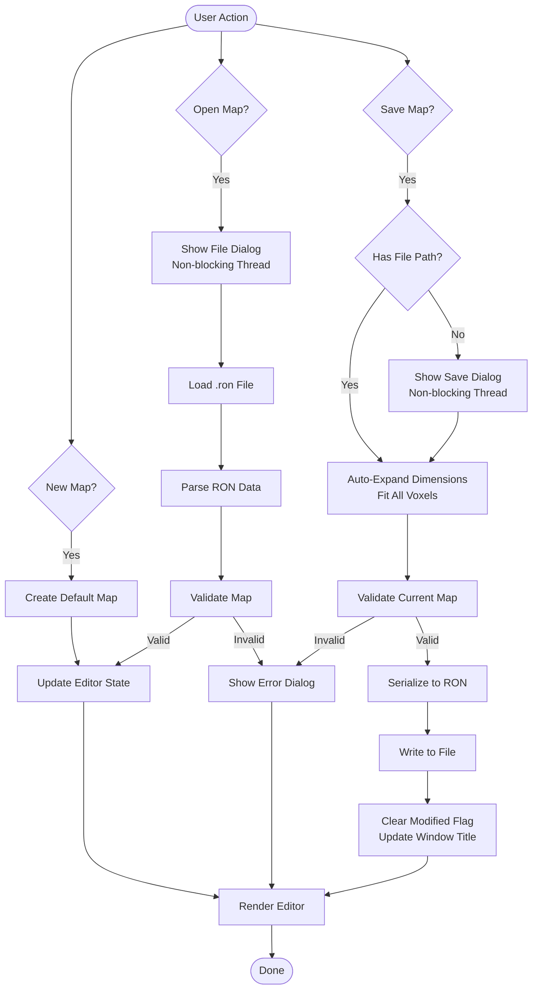

# Map Editor Architecture

## System Architecture Diagram


## Data Flow Diagram


## Component Interaction Flow


## File Operation Workflow



## Tool System Architecture


## State Management Structure


## UI Panel Layout


## Rendering Pipeline


## Key Design Patterns

### 1. Command Pattern (Undo/Redo)
Every editing action is encapsulated as a command that can be executed, undone, and redone.

### 2. State Pattern (Tools)
Different tools implement the same interface but behave differently based on the active tool state.

### 3. Observer Pattern (UI Updates)
UI panels observe the editor state and update automatically when state changes.

### 4. Strategy Pattern (Validation)
Different validation strategies can be applied based on map requirements.

### 5. Factory Pattern (Tool Creation)
Tools are created through a factory based on the selected tool type.

## Performance Considerations

### Optimization Strategies

1. **Lazy Rendering**
   - Only re-render when state changes
   - Use change detection for UI updates

2. **Infinite Grid System**
   - Camera-relative grid generation
   - Only renders visible grid sections (±50 units from camera)
   - Regenerates only when camera moves > 2 units
   - Aligned with voxel centers for accurate placement

3. **Spatial Partitioning**
   - Use spatial hash for voxel lookups
   - Frustum culling for large maps

4. **Batch Operations**
   - Group multiple edits into single history entry
   - Batch mesh updates for better performance

5. **Memory Management**
   - Limit history stack size
   - Use sparse data structures for voxels
   - Unload unused resources

## Error Handling Strategy


## Testing Strategy

### Unit Tests
- Tool behavior
- History system
- Validation logic
- File I/O operations

### Integration Tests
- UI interactions
- State management
- Rendering pipeline
- File operations

### End-to-End Tests
- Complete editing workflows
- Save/load cycles
- Undo/redo chains
- Error recovery

## Grid System Details

### Infinite Grid Architecture

The editor uses an infinite grid system that dynamically generates grid lines based on camera position:

**Key Features:**
- **Infinite Spanning**: Grid extends infinitely in all directions
- **Camera-Relative**: Only renders visible portion (configurable render distance)
- **Voxel Alignment**: Grid lines at integer coordinates (0, 1, 2, ...) align with voxel centers
- **Dynamic Regeneration**: Updates when camera moves beyond threshold
- **Major Grid Lines**: Every Nth line rendered with different color/opacity

**Configuration:**
```rust
InfiniteGridConfig {
    spacing: 1.0,              // Aligns with voxel positions
    render_distance: 50.0,     // Units from camera
    major_line_interval: 10,   // Every 10th line is major
    opacity: 0.3,              // Grid transparency
    regeneration_threshold: 2.0 // Camera movement threshold
}
```

**Performance:**
- Regenerates only when camera moves > 2 units
- Limits grid to visible area (typically 100x100 lines)
- Uses efficient LineList topology
- Minimal CPU overhead during static camera

## Input System Architecture (Updated October 2025)

The map editor uses a **unified, event-driven input architecture**:

### System Count Reduction

| Component | Before | After | Change |
|-----------|--------|-------|--------|
| Input Handler Systems | 7 | 1 | **-86%** |
| Transformation Systems | 8 | 1 | **-88%** |
| Rendering Systems | 3 | 3 | 0% |
| **Total Systems** | **18** | **5** | **-72%** |

### Key Components

1. **Unified Keyboard Handler** ([`handle_keyboard_input()`](../../../../src/editor/tools/input.rs:105))
   - Single entry point for all keyboard input
   - Context-aware key mapping based on mode
   - One UI focus check instead of 7+

2. **Transformation Operations** ([`handle_transformation_operations()`](../../../../src/editor/tools/input.rs:234))
   - Event-driven execution
   - Handles both keyboard and UI button events
   - Separated from input reading

3. **Event System** ([`EditorInputEvent`](../../../../src/editor/tools/input.rs:15))
   - Semantic events (StartMove, RotateDelta, etc.)
   - Decouples input reading from execution
   - Enables better testing and maintainability

### Benefits

- **Single Responsibility**: Input reading separated from execution
- **DRY Principle**: One UI focus check instead of 7+
- **Maintainability**: All shortcuts in one place
- **Testability**: Can test input mapping separately
- **Performance**: Fewer systems to run each frame

See [Input Refactoring Summary](archive/input-refactoring-summary.md) for complete details.

---

**Document Version**: 2.1.0
**Last Updated**: 2025-10-23
**Status**: Updated for save functionality with auto-expand