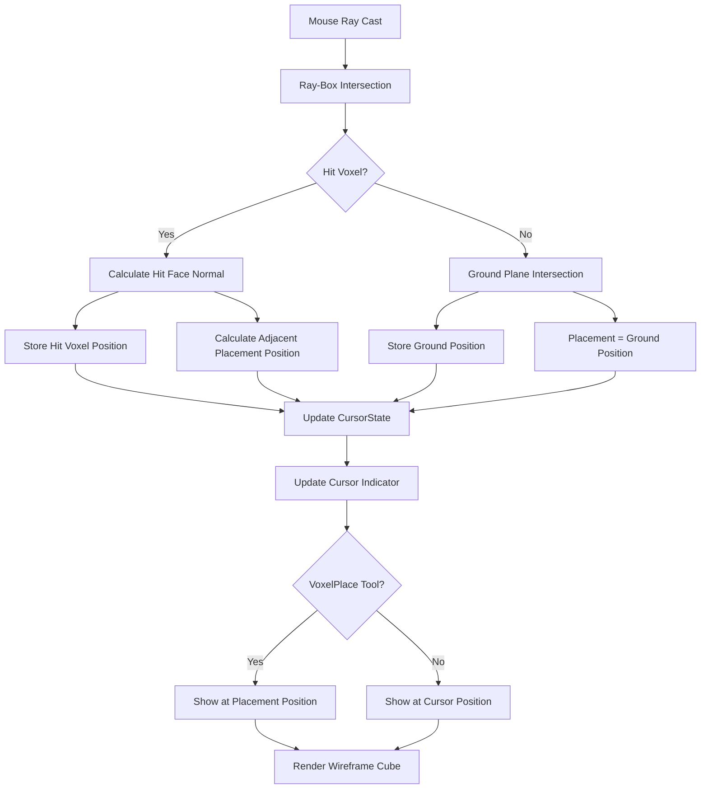

# Face-Aware Voxel Placement

## Overview
This document describes the architecture and implementation plan for face-aware voxel placement in the map editor. The goal is to modify the cursor system so that when hovering over an existing voxel, the placement box appears **adjacent** to the voxel on the face being pointed at, rather than centered on the voxel itself. This enables intuitive placement of new voxels next to existing ones.

## Current System Analysis

### Current Behavior
- [`cursor.rs:108-131`](../../../../../src/editor/cursor.rs) uses `find_closest_voxel_intersection()` to detect voxel hits
- [`cursor.rs:163-211`](../../../../../src/editor/cursor.rs) `ray_box_intersection()` returns only distance, not face information
- [`cursor.rs:110-117`](../../../../../src/editor/cursor.rs) Cursor position is set to the **center** of the intersected voxel
- [`grid.rs:315-329`](../../../../../src/editor/grid.rs) `update_cursor_indicator()` displays the wireframe cube at cursor position

### Key Issue
The ray-box intersection doesn't track which face was hit, so we can't determine placement direction.

## Proposed Solution Architecture

### 1. Enhanced Ray-Box Intersection with Face Detection

**Location:** [`cursor.rs:163-211`](../../../../../src/editor/cursor.rs)

**Changes:**
- Modify `ray_box_intersection()` to return `Option<RayHitInfo>` instead of `Option<f32>`
- New struct to capture hit information:

```rust
struct RayHitInfo {
    distance: f32,
    hit_point: Vec3,
    face_normal: Vec3,  // Unit vector pointing away from hit face
}
```

**Face Detection Logic:**
- Track which axis (X, Y, Z) had the closest intersection (tmin)
- Determine if ray hit min or max face on that axis
- Calculate face normal based on hit face:
  - `-X face`: normal = `Vec3::NEG_X`
  - `+X face`: normal = `Vec3::X`
  - `-Y face`: normal = `Vec3::NEG_Y`
  - `+Y face`: normal = `Vec3::Y`
  - `-Z face`: normal = `Vec3::NEG_Z`
  - `+Z face`: normal = `Vec3::Z`

**Implementation Details:**

```rust
fn ray_box_intersection(ray: &Ray3d, box_center: Vec3, box_size: Vec3) -> Option<RayHitInfo> {
    let box_min = box_center - box_size * 0.5;
    let box_max = box_center + box_size * 0.5;
    
    let ray_origin = ray.origin;
    let ray_dir = ray.direction.normalize();
    
    let mut tmin = f32::NEG_INFINITY;
    let mut tmax = f32::INFINITY;
    let mut hit_axis = 0; // 0=X, 1=Y, 2=Z
    let mut hit_min_face = true; // true if hit min face, false if hit max face
    
    // X axis
    if ray_dir.x.abs() > 0.0001 {
        let tx1 = (box_min.x - ray_origin.x) / ray_dir.x;
        let tx2 = (box_max.x - ray_origin.x) / ray_dir.x;
        let tx_min = tx1.min(tx2);
        let tx_max = tx1.max(tx2);
        
        if tx_min > tmin {
            tmin = tx_min;
            hit_axis = 0;
            hit_min_face = tx1 < tx2;
        }
        tmax = tmax.min(tx_max);
    } else if ray_origin.x < box_min.x || ray_origin.x > box_max.x {
        return None;
    }
    
    // Y axis (similar logic)
    // Z axis (similar logic)
    
    if tmax >= tmin && tmax >= 0.0 {
        let distance = if tmin >= 0.0 { tmin } else { tmax };
        let hit_point = ray_origin + ray_dir * distance;
        
        // Calculate face normal based on hit axis and face
        let face_normal = match (hit_axis, hit_min_face) {
            (0, true) => Vec3::NEG_X,
            (0, false) => Vec3::X,
            (1, true) => Vec3::NEG_Y,
            (1, false) => Vec3::Y,
            (2, true) => Vec3::NEG_Z,
            (2, false) => Vec3::Z,
            _ => Vec3::Y, // fallback
        };
        
        Some(RayHitInfo {
            distance,
            hit_point,
            face_normal,
        })
    } else {
        None
    }
}
```

### 2. Extended Cursor State

**Location:** [`cursor.rs:10-26`](../../../../../src/editor/cursor.rs)

**Changes:**
Add fields to `CursorState`:

```rust
#[derive(Resource, Default)]
pub struct CursorState {
    /// Current cursor position in world space (voxel being pointed at)
    pub position: Option<Vec3>,
    
    /// Current cursor grid position (voxel being pointed at)
    pub grid_pos: Option<(i32, i32, i32)>,
    
    /// Face normal of the hit surface
    pub hit_face_normal: Option<Vec3>,
    
    /// Position where a new voxel would be placed (adjacent to hit face)
    pub placement_pos: Option<Vec3>,
    
    /// Grid position where a new voxel would be placed
    pub placement_grid_pos: Option<(i32, i32, i32)>,
}
```

**Rationale:**
- `hit_face_normal`: Direction to offset from hit voxel
- `placement_pos`/`placement_grid_pos`: Where new voxel would be placed
- Keeps original `position`/`grid_pos` for the voxel being pointed at

### 3. Updated Cursor Position Calculation

**Location:** [`cursor.rs:65-131`](../../../../../src/editor/cursor.rs)

**Changes to `update_cursor_position()`:**

```rust
pub fn update_cursor_position(
    mut cursor_state: ResMut<CursorState>,
    editor_state: Res<EditorState>,
    camera_query: Query<(&Camera, &GlobalTransform), With<EditorCamera>>,
    window_query: Query<&Window, With<PrimaryWindow>>,
    keyboard_mode: Res<KeyboardEditMode>,
    mut contexts: EguiContexts,
) {
    // ... existing checks ...
    
    // Find the closest voxel that the ray intersects (with face info)
    let closest_voxel_hit = find_closest_voxel_intersection_with_face(&editor_state, &ray);
    
    if let Some((voxel_pos, hit_info)) = closest_voxel_hit {
        // Set cursor to the intersected voxel
        cursor_state.grid_pos = Some(voxel_pos);
        cursor_state.position = Some(Vec3::new(
            voxel_pos.0 as f32,
            voxel_pos.1 as f32,
            voxel_pos.2 as f32,
        ));
        cursor_state.hit_face_normal = Some(hit_info.face_normal);
        
        // Calculate adjacent placement position
        let offset = hit_info.face_normal;
        let placement_grid = (
            voxel_pos.0 + offset.x as i32,
            voxel_pos.1 + offset.y as i32,
            voxel_pos.2 + offset.z as i32,
        );
        cursor_state.placement_grid_pos = Some(placement_grid);
        cursor_state.placement_pos = Some(Vec3::new(
            placement_grid.0 as f32,
            placement_grid.1 as f32,
            placement_grid.2 as f32,
        ));
    } else {
        // No voxel intersection, fall back to ground plane
        if let Some(ground_pos) = intersect_ground_plane(&ray) {
            cursor_state.position = Some(ground_pos);
            let grid_x = ground_pos.x.round() as i32;
            let grid_y = 0;
            let grid_z = ground_pos.z.round() as i32;
            cursor_state.grid_pos = Some((grid_x, grid_y, grid_z));
            cursor_state.hit_face_normal = Some(Vec3::Y); // Upward
            // For ground plane, placement = cursor position
            cursor_state.placement_pos = cursor_state.position;
            cursor_state.placement_grid_pos = cursor_state.grid_pos;
        } else {
            cursor_state.position = None;
            cursor_state.grid_pos = None;
            cursor_state.hit_face_normal = None;
            cursor_state.placement_pos = None;
            cursor_state.placement_grid_pos = None;
        }
    }
}
```

**New Helper Function:**

```rust
fn find_closest_voxel_intersection_with_face(
    editor_state: &EditorState,
    ray: &Ray3d,
) -> Option<((i32, i32, i32), RayHitInfo)> {
    let mut closest_distance = f32::MAX;
    let mut closest_result = None;
    
    for voxel_data in &editor_state.current_map.world.voxels {
        let voxel_pos = voxel_data.pos;
        
        if let Some(hit_info) = ray_box_intersection(
            ray,
            Vec3::new(voxel_pos.0 as f32, voxel_pos.1 as f32, voxel_pos.2 as f32),
            Vec3::splat(1.0),
        ) {
            if hit_info.distance < closest_distance {
                closest_distance = hit_info.distance;
                closest_result = Some((voxel_pos, hit_info));
            }
        }
    }
    
    closest_result
}
```

### 4. Cursor Indicator Visualization

**Location:** [`grid.rs:315-329`](../../../../../src/editor/grid.rs)

**Changes to `update_cursor_indicator()`:**

```rust
pub fn update_cursor_indicator(
    cursor_state: Res<CursorState>,
    editor_state: Res<EditorState>,
    mut cursor_query: Query<&mut Transform, With<CursorIndicator>>,
) {
    for mut transform in cursor_query.iter_mut() {
        // For VoxelPlace tool, show placement position (adjacent to hit face)
        if matches!(editor_state.active_tool, EditorTool::VoxelPlace { .. }) {
            if let Some(placement_pos) = cursor_state.placement_pos {
                transform.translation = placement_pos;
                transform.scale = Vec3::splat(1.0);
                continue;
            }
        }
        
        // For other tools (Select, Remove, etc.), show original cursor position
        if let Some(grid_pos) = cursor_state.grid_pos {
            transform.translation = Vec3::new(
                grid_pos.0 as f32,
                grid_pos.1 as f32,
                grid_pos.2 as f32,
            );
            transform.scale = Vec3::splat(1.0);
        } else {
            // Hide cursor
            transform.scale = Vec3::splat(0.0);
        }
    }
}
```

### 5. Voxel Placement Logic Update

**Location:** [`voxel_tool.rs:11-79`](../../../../../src/editor/tools/voxel_tool.rs)

**Changes to `handle_voxel_placement()`:**

```rust
pub fn handle_voxel_placement(
    cursor_state: Res<CursorState>,
    mut editor_state: ResMut<EditorState>,
    mut history: ResMut<EditorHistory>,
    mouse_button: Res<ButtonInput<MouseButton>>,
    mut contexts: EguiContexts,
) {
    // ... existing tool check and UI check ...
    
    // Use placement_grid_pos instead of grid_pos
    let Some(grid_pos) = cursor_state.placement_grid_pos else {
        return;
    };
    
    // Check if voxel already exists at this position
    let voxel_exists = editor_state
        .current_map
        .world
        .voxels
        .iter()
        .any(|v| v.pos == grid_pos);
    
    if voxel_exists {
        info!("Voxel already exists at {:?}", grid_pos);
        return;
    }
    
    // ... rest of placement logic remains the same ...
}
```

### 6. Keyboard Cursor Movement Update

**Location:** [`cursor.rs:234-318`](../../../../../src/editor/cursor.rs)

**Changes to `handle_keyboard_cursor_movement()`:**

```rust
// After updating cursor position
if moved {
    cursor_state.grid_pos = Some(new_pos);
    cursor_state.position = Some(Vec3::new(
        new_pos.0 as f32,
        new_pos.1 as f32,
        new_pos.2 as f32,
    ));
    
    // For keyboard movement, assume placement on top (+Y direction)
    cursor_state.hit_face_normal = Some(Vec3::Y);
    let placement_grid = (new_pos.0, new_pos.1 + 1, new_pos.2);
    cursor_state.placement_grid_pos = Some(placement_grid);
    cursor_state.placement_pos = Some(Vec3::new(
        placement_grid.0 as f32,
        placement_grid.1 as f32,
        placement_grid.2 as f32,
    ));
    
    info!("Cursor moved to grid position: {:?}", new_pos);
}
```

## Implementation Flow



## Edge Cases

### Empty Space (Ground Plane)
- When no voxel is hit, fall back to ground plane intersection
- Set `placement_pos` = `grid_pos` (no offset needed)
- Set `hit_face_normal` = `Vec3::Y` (upward)

### Keyboard Cursor Movement
- When moving cursor via keyboard, assume placement on top (+Y direction)
- Update both `grid_pos` and `placement_grid_pos`
- Set `hit_face_normal` = `Vec3::Y`

### Corner/Edge Hits
- When ray hits exactly at voxel edge, face detection uses the axis with smallest tmin
- This provides consistent behavior even at boundaries

### Tool Switching
- VoxelPlace tool shows placement position (adjacent)
- Select/Remove tools show original cursor position (centered on voxel)
- Camera tool doesn't show cursor indicator

## Testing Strategy

### 1. Basic Face Detection
- [ ] Hover over voxel from top → placement box appears above
- [ ] Hover over voxel from bottom → placement box appears below
- [ ] Hover over voxel from left → placement box appears to the left
- [ ] Hover over voxel from right → placement box appears to the right
- [ ] Hover over voxel from front → placement box appears in front
- [ ] Hover over voxel from back → placement box appears behind

### 2. Tool Switching
- [ ] VoxelPlace tool shows placement position
- [ ] Select tool shows original voxel position
- [ ] VoxelRemove tool shows original voxel position
- [ ] Camera tool hides cursor indicator

### 3. Edge Cases
- [ ] Empty space (ground plane) placement works correctly
- [ ] Keyboard cursor movement updates placement position
- [ ] Rapid camera angle changes don't cause flickering
- [ ] Corner/edge hits are handled consistently

### 4. Placement Accuracy
- [ ] Click to place voxel → appears at indicated position
- [ ] Build a vertical wall → voxels stack correctly
- [ ] Build a horizontal floor → voxels align correctly
- [ ] Build a tower → voxels stack upward correctly

## Benefits

✅ **Intuitive Building:** Users can see exactly where the next voxel will be placed  
✅ **Accurate Placement:** No more guessing which side of a voxel to click  
✅ **Better UX:** Visual feedback matches actual placement behavior  
✅ **Maintains Compatibility:** Other tools (Select, Remove) still work as before  
✅ **Consistent Behavior:** Works with both mouse and keyboard input

## Potential Challenges

⚠️ **Corner/Edge Cases:** When ray hits exactly at voxel edge, face detection might be ambiguous (mitigated by using smallest tmin)  
⚠️ **Performance:** Additional calculations per frame (minimal impact expected - single ray cast per frame)  
⚠️ **Keyboard Mode:** Default placement direction is upward (+Y), which may not always be desired

## Files to Modify

1. [`src/editor/cursor.rs`](../../../../../src/editor/cursor.rs) - Core ray casting and cursor logic
2. [`src/editor/grid.rs`](../../../../../src/editor/grid.rs) - Cursor indicator rendering
3. [`src/editor/tools/voxel_tool.rs`](../../../../../src/editor/tools/voxel_tool.rs) - Placement logic

## Implementation Checklist

- [ ] Enhance ray-box intersection to detect which face was hit
- [ ] Update CursorState to store the hit face normal/direction
- [ ] Modify cursor position calculation to place box adjacent to hit face
- [ ] Update cursor indicator rendering to show placement position
- [ ] Handle edge cases (empty space, ground plane intersection)
- [ ] Test placement behavior with different camera angles
- [ ] Update voxel placement logic to use adjacent position

## References

- [Map Editor Architecture](architecture.md)
- [Input Handling](input-handling.md)
- [Implementation Status](implementation-status.md)