# Occlusion Rendering Pipeline

Shows how each frame renders voxel chunks with occlusion transparency so the
player remains visible when walking inside buildings.

## Frame Pipeline

```mermaid
flowchart TD
    A([Frame Start]) --> B

    subgraph CPU ["CPU — Occlusion Update System"]
        B[Player & camera positions\ncollected from ECS]
        B --> C{Interior detection\nmode active?\nmode = RegionBased / Hybrid}
        C -- Yes --> D[detect_interior_system\nFlood-fill ceiling voxels\nabove player every N frames]
        D --> E[InteriorState::current_region\nOption of min/max AABB]
        C -- No --> E2[region_max.w = 0\nregion inactive]
        E --> F
        E2 --> F
        F[Assemble OcclusionUniforms:\nplayer_pos, camera_pos,\nmode, technique, region bounds]
        F --> G[Upload uniform buffer\nto GPU via ExtendedMaterial]
    end

    G --> H

    subgraph PREPASS ["GPU — Depth Prepass\n(DepthPrepass component on camera)"]
        H[Vertex shader:\nTransform voxel chunk vertices\nWrite world_position]
        H --> I{technique == Dithered\nAND mode != None?}
        I -- Yes --> J{world_pos.y >\nplayer_y + height_threshold\nAND within XZ radius?}
        J -- Yes --> K([discard\nDon't write depth])
        J -- No --> L([Write depth\nFragment kept])
        I -- No --> L

        H --> M{mode == RegionBased\nOR Hybrid\nAND region active?}
        M -- in_interior_region → true --> K
        M -- outside region / inactive --> L
    end

    L --> N

    subgraph MAINPASS ["GPU — Main Forward Pass\n(AlphaMask3d render phase)"]
        N[Early-Z test vs prepass depth\nFragments above player → fail GreaterEqual\n→ skipped entirely]
        N --> O{Survive depth test?}
        O -- No → culled --> P([Fragment discarded\nby hardware])
        O -- Yes --> Q

        Q[pbr_input_from_standard_material\nSample shadow maps, lighting]
        Q --> R{mode == RegionBased\nOR Hybrid\nAND in_interior_region?}
        R -- Yes --> S([discard])
        R -- No --> T

        T{mode == ShaderBased\nOR Hybrid?}
        T -- Yes --> U[calculate_occlusion_alpha\nHeight + XZ ray distance\nsmooth falloff]
        U --> V{technique?}
        V -- Dithered --> W{dither_check\nBayer 4×4 matrix}
        W -- alpha ≤ threshold --> S
        W -- alpha > threshold --> X
        V -- AlphaBlend --> Y[Set base_color.a\nATC/blending]
        Y --> X
        T -- No / None --> X

        X[apply_pbr_lighting\nDirectional + point lights\nShadows]
        X --> Z[main_pass_post_lighting_processing\nFog, tonemapping]
        Z --> AA([Write to color buffer])
    end

    AA --> AB([Frame output])
```

## Occlusion Modes

| Mode | CPU side | Prepass | Main pass |
|------|----------|---------|-----------|
| **None** | No uniforms updated | No discard | Full PBR, no occlusion |
| **ShaderBased** | Player + camera position only | Height + XZ discard | Ray-distance alpha + dither/blend |
| **RegionBased** | Interior flood-fill AABB | In-region discard | In-region discard |
| **Hybrid** *(default)* | Both | Both checks | Both checks |

## Transparency Techniques

| Technique | AlphaMode | Prepass | Main pass | Notes |
|-----------|-----------|---------|-----------|-------|
| **Dithered** *(default)* | `Mask(0.001)` | Binary height discard | Bayer 4×4 ordered dither | No MSAA cost; `MAY_DISCARD` enables prepass fragment shader |
| **AlphaBlend** | `AlphaToCoverage` | No discard | Sets `base_color.a`; hardware MSAA blends | Smooth edges; slight MSAA cost |

## Shader Files

| File | Pipeline stage | Purpose |
|------|---------------|---------|
| `assets/shaders/occlusion_material_prepass.wgsl` | Depth prepass fragment | Binary keep/discard; writes depth for below-player voxels only |
| `assets/shaders/occlusion_material.wgsl` | Main pass fragment | Full PBR + dither/blend occlusion logic |

## Key Design Decisions

- **Depth prepass uses binary discard, not dither.** Dithered discard in the prepass would write depth for ~50 % of above-player fragments, blocking the player in a checker pattern. The prepass discards everything above `player_y + height_threshold` within XZ radius.
- **`AlphaMode::Mask(0.001)` instead of `Opaque`.** `Opaque` doesn't set `MeshPipelineKey::MAY_DISCARD`, so Bevy skips the fragment stage in the depth prepass entirely — the custom prepass shader would never run.
- **Main pass re-writes depth for over-discarded fragments.** Voxels at the edge of the XZ zone that the prepass discarded conservatively will pass the `GreaterEqual` test against the cleared far-plane depth (0.0 in reverse-Z) and write their own depth correctly.
