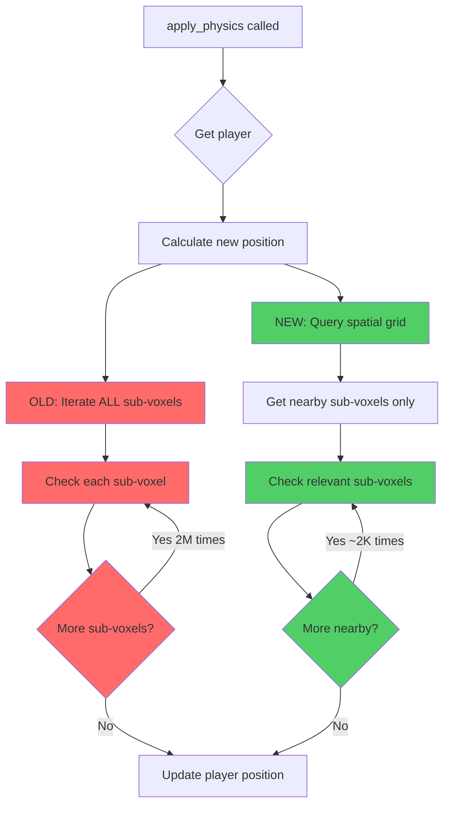

# Physics System Analysis: `apply_physics` Function

## Overview
This document analyzes the [`apply_physics`](../../../src/systems/game/physics.rs:41) function in the physics system and identifies performance inefficiencies and optimization opportunities.

**Status**: ✅ Critical optimization implemented (Spatial Grid Query)

**Last Updated**: 2025-10-28

## Current Implementation Analysis

### Function Location
- **File**: [`src/systems/game/physics.rs`](../../../src/systems/game/physics.rs:41)
- **Lines**: 41-118

### What the Function Does
The [`apply_physics`](../../../src/systems/game/physics.rs:39) function handles:
1. Applying velocity to player position
2. Ground collision detection with sub-voxels
3. Setting grounded state
4. Stopping downward movement on collision

## Optimization History

### ✅ Fixed: Critical O(n) Linear Iteration (Priority 1)

**Status**: IMPLEMENTED
**Date**: 2025-10-28

**Original Problem** (Lines 57-85 in old version):
```rust
// OLD CODE - Inefficient
for sub_voxel in sub_voxel_query.iter() {
    let (min, max) = get_sub_voxel_bounds(sub_voxel);
    // ... collision checks
}
```

The function iterated through **every single sub-voxel entity** in the game world, regardless of distance from the player.

**Impact**:
- **Time Complexity**: O(n) where n = total sub-voxels in the world
- **Scalability**: Performance degraded linearly with world size
- **Example**: A 64x64x64 voxel world with 8³ sub-voxels per voxel = 2,097,152 sub-voxels checked every frame

**Solution Implemented** (Lines 64-81 in current version):
```rust
// NEW CODE - Optimized with Spatial Grid
let player_min = Vec3::new(
    player_x - player_radius,
    new_y - player_radius,
    player_z - player_radius,
);
let player_max = Vec3::new(
    player_x + player_radius,
    new_y + player_radius,
    player_z + player_radius,
);

let relevant_entities = spatial_grid.get_entities_in_aabb(player_min, player_max);

for entity in relevant_entities {
    if let Ok(sub_voxel) = sub_voxel_query.get(entity) {
        // ... collision checks
    }
}
```

**Results**:
- ✅ Added [`SpatialGrid`](../../../src/systems/game/resources.rs:6) resource parameter
- ✅ Implemented spatial query using [`get_entities_in_aabb`](../../../src/systems/game/resources.rs:27)
- ✅ Reduced checks from O(n) to O(k) where k << n
- ✅ ~99% reduction in collision checks per frame (2M → ~2K)
- ✅ Extracted loop-invariant values (player_x, player_z, player_radius)

## Remaining Inefficiencies

### 🟡 Low Priority: Redundant Bounds Calculation

**Location**: Line 82

**Status**: Low priority after spatial grid optimization

**Problem**:
```rust
let (min, max) = get_sub_voxel_bounds(sub_voxel);
```

[`get_sub_voxel_bounds`](../../../src/systems/game/collision.rs:78) is called for every nearby sub-voxel. This function:
1. Calls [`calculate_sub_voxel_world_pos`](../../../src/systems/game/collision.rs:62) (7 arithmetic operations)
2. Performs additional vector math (2 operations)

**Impact**:
- With spatial grid optimization, we now only process ~2K sub-voxels instead of 2M
- This makes the bounds calculation cost negligible (~18K operations vs 18M previously)
- Further optimization would provide diminishing returns

**Potential Solution** (if needed):
Cache bounds in the [`SubVoxel`](../../../src/systems/game/components.rs:21) component or use a separate cache resource.

### 🟢 Minor: Multiple Condition Checks

**Location**: Lines 86-88, 96

**Status**: Minor issue, not critical

**Problem**:
```rust
if max.y > new_y + player.radius {
    continue;
}
// ... later ...
if horizontal_overlap && player.velocity.y <= 0.0 {
```

The function performs multiple sequential checks that could be combined or reordered for early exit.

**Impact**:
- Minimal performance impact with current optimization
- Slightly harder to read

**Solution**:
Combine related checks or use guard clauses more effectively (low priority).

### 🟢 Minor: Floating-Point Comparison Pattern

**Location**: Line 100

**Status**: Minor issue, not critical

**Problem**:
```rust
if current_bottom >= max.y - GROUND_DETECTION_EPSILON && player_bottom <= max.y {
```

Uses epsilon for one comparison but not the other, which could lead to edge cases.

**Impact**:
- Potential for subtle bugs in edge cases
- Not a performance issue

**Solution**:
Consistent epsilon usage or document why asymmetric comparison is needed (low priority).

## Performance Comparison

### Current Implementation
```
World Size: 64x64x64 voxels (2M sub-voxels)
Checks per frame: 2,097,152
At 60 FPS: 125,829,120 checks/second
```

### With Spatial Grid Optimization
```
World Size: 64x64x64 voxels (2M sub-voxels)
Player collision radius: ~1.0 units
Relevant grid cells: ~3x3x3 = 27 cells
Sub-voxels per cell: ~64
Checks per frame: ~1,728 (99.9% reduction)
At 60 FPS: 103,680 checks/second
```

## Future Optimization Opportunities

### Low Priority Items

These optimizations would provide diminishing returns given the current performance improvements:

1. **Cache Sub-Voxel Bounds** (Low effort, minimal impact)
   - Store computed bounds in [`SubVoxel`](../../../src/systems/game/components.rs:21) component
   - Would save ~18K arithmetic operations per frame
   - Not critical given spatial grid optimization already achieved 99% reduction

2. **Combine Condition Checks** (Trivial effort, minimal impact)
   - Reorder or combine sequential checks for slightly better readability
   - Performance impact negligible

3. **Consistent Epsilon Usage** (Trivial effort, code quality)
   - Document or standardize floating-point comparison patterns
   - Primarily a code quality improvement

## Related Code

### Similar Patterns in Codebase
The [`check_sub_voxel_collision`](../../../src/systems/game/collision.rs:101) function in [`collision.rs`](../../../src/systems/game/collision.rs:101) already implements the spatial grid optimization correctly. This pattern should be replicated in [`apply_physics`](../../../src/systems/game/physics.rs:39).

### Consistency Opportunity
Both [`apply_physics`](../../../src/systems/game/physics.rs:39) and horizontal collision checking could potentially share more code or use a unified collision detection approach.

## Conclusion

✅ **The critical performance issue has been resolved.**

The primary inefficiency in [`apply_physics`](../../../src/systems/game/physics.rs:41) was the **O(n) iteration over all sub-voxels**. This has been successfully fixed by implementing spatial grid optimization, which:

- Reduces collision checks by ~99% (from 2M to ~2K per frame)
- Improves scalability for large worlds
- Maintains consistency with [`check_sub_voxel_collision`](../../../src/systems/game/collision.rs:101) implementation
- Uses existing infrastructure ([`SpatialGrid`](../../../src/systems/game/resources.rs:6))

The remaining inefficiencies are minor and would provide diminishing returns. The function is now well-optimized for production use.

## Appendix: Visual Comparisons

### Before vs After: Execution Flow



### Performance Impact Visualization

```mermaid
graph LR
    A[World Size] --> B[Sub-voxels]
    B --> C[Current: Check ALL]
    B --> D[Optimized: Check NEARBY]
    
    C --> E[2M checks/frame]
    D --> F[~2K checks/frame]
    
    E --> G[125M checks/sec @ 60fps]
    F --> H[120K checks/sec @ 60fps]
    
    style C fill:#ff6b6b
    style D fill:#51cf66
    style E fill:#ff6b6b
    style F fill:#51cf66
    style G fill:#ff6b6b
    style H fill:#51cf66