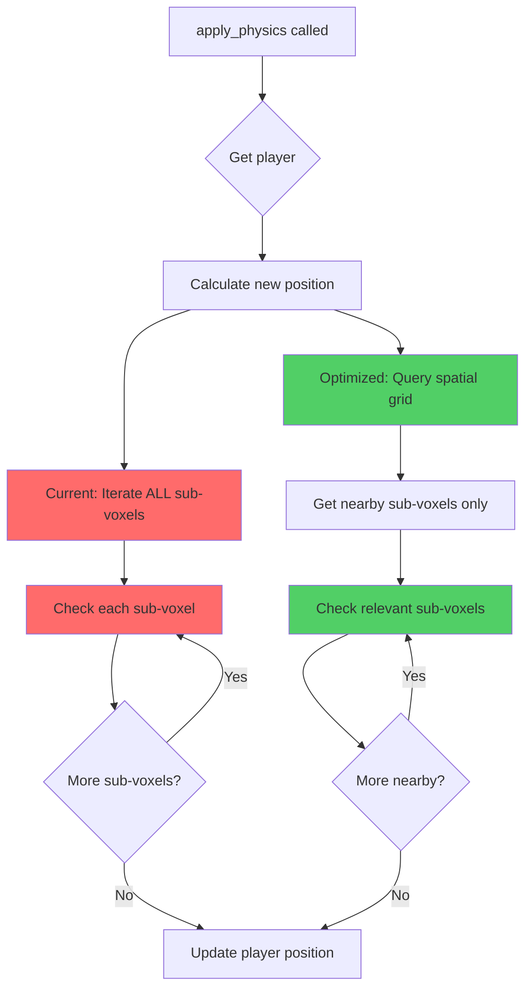

# Physics System Analysis: `apply_physics` Function

## Overview
This document analyzes the [`apply_physics`](../../../src/systems/game/physics.rs:39) function in the physics system and identifies performance inefficiencies and optimization opportunities.

## Current Implementation Analysis

### Function Location
- **File**: [`src/systems/game/physics.rs`](../../../src/systems/game/physics.rs:39)
- **Lines**: 39-96

### What the Function Does
The [`apply_physics`](../../../src/systems/game/physics.rs:39) function handles:
1. Applying velocity to player position
2. Ground collision detection with sub-voxels
3. Setting grounded state
4. Stopping downward movement on collision

## Identified Inefficiencies

### 🔴 Critical: O(n) Linear Iteration Over All Sub-Voxels

**Location**: Lines 57-85

**Problem**:
```rust
for sub_voxel in sub_voxel_query.iter() {
    let (min, max) = get_sub_voxel_bounds(sub_voxel);
    // ... collision checks
}
```

The function iterates through **every single sub-voxel entity** in the game world, regardless of distance from the player. This is extremely inefficient as the number of sub-voxels grows.

**Impact**:
- **Time Complexity**: O(n) where n = total sub-voxels in the world
- **Scalability**: Performance degrades linearly with world size
- **Example**: A 64x64x64 voxel world with 8³ sub-voxels per voxel = 2,097,152 sub-voxels checked every frame

**Solution Available**:
The codebase already has a [`SpatialGrid`](../../../src/systems/game/resources.rs:6) resource that provides spatial partitioning for efficient queries. The [`check_sub_voxel_collision`](../../../src/systems/game/collision.rs:101) function in [`collision.rs`](../../../src/systems/game/collision.rs:101) demonstrates proper usage:

```rust
let relevant_sub_voxel_entities = spatial_grid.get_entities_in_aabb(player_min, player_max);
```

This reduces checks from O(n) to O(k) where k = sub-voxels near the player (typically < 100).

---

### 🟡 Moderate: Redundant Bounds Calculation

**Location**: Line 58

**Problem**:
```rust
let (min, max) = get_sub_voxel_bounds(sub_voxel);
```

[`get_sub_voxel_bounds`](../../../src/systems/game/collision.rs:78) is called for every sub-voxel, even those that will be immediately filtered out. This function:
1. Calls [`calculate_sub_voxel_world_pos`](../../../src/systems/game/collision.rs:62) (7 arithmetic operations)
2. Performs additional vector math (2 operations)

**Impact**:
- Wasted computation on sub-voxels that fail early checks
- 9 arithmetic operations × n sub-voxels per frame

**Solution**:
With spatial grid optimization, this becomes less critical since we only process nearby sub-voxels. However, bounds could be cached in the [`SubVoxel`](../../../src/systems/game/components.rs:21) component or computed lazily.

---

### 🟡 Moderate: Repeated Player Position Access

**Location**: Lines 67-68

**Problem**:
```rust
let player_x = transform.translation.x;
let player_z = transform.translation.z;
```

Player position components are extracted inside the loop, but they're constant for the entire iteration.

**Impact**:
- Minor: Modern compilers likely optimize this
- Code clarity: Makes it less obvious these are loop-invariant

**Solution**:
Extract before the loop (lines 49-51 already do this for Y, should do for X/Z too).

---

### 🟢 Minor: Multiple Condition Checks

**Location**: Lines 62-64, 76

**Problem**:
```rust
if max.y > new_y + player.radius {
    continue;
}
// ... later ...
if horizontal_overlap && player.velocity.y <= 0.0 {
```

The function performs multiple sequential checks that could be combined or reordered for early exit.

**Impact**:
- Minimal performance impact
- Slightly harder to read

**Solution**:
Combine related checks or use guard clauses more effectively.

---

### 🟢 Minor: Floating-Point Comparison Pattern

**Location**: Line 80

**Problem**:
```rust
if current_bottom >= max.y - GROUND_DETECTION_EPSILON && player_bottom <= max.y {
```

Uses epsilon for one comparison but not the other, which could lead to edge cases.

**Impact**:
- Potential for subtle bugs in edge cases
- Not a performance issue

**Solution**:
Consistent epsilon usage or document why asymmetric comparison is needed.

---

## Performance Comparison

### Current Implementation
```
World Size: 64x64x64 voxels (2M sub-voxels)
Checks per frame: 2,097,152
At 60 FPS: 125,829,120 checks/second
```

### With Spatial Grid Optimization
```
World Size: 64x64x64 voxels (2M sub-voxels)
Player collision radius: ~1.0 units
Relevant grid cells: ~3x3x3 = 27 cells
Sub-voxels per cell: ~64
Checks per frame: ~1,728 (99.9% reduction)
At 60 FPS: 103,680 checks/second
```

## Optimization Recommendations

### Priority 1: Implement Spatial Grid Query
**Effort**: Low (infrastructure exists)  
**Impact**: High (99%+ reduction in checks)

Add [`SpatialGrid`](../../../src/systems/game/resources.rs:6) resource to function signature and use [`get_entities_in_aabb`](../../../src/systems/game/resources.rs:27):

```rust
pub fn apply_physics(
    time: Res<Time>,
    spatial_grid: Res<SpatialGrid>,  // Add this
    sub_voxel_query: Query<&SubVoxel, Without<Player>>,
    mut player_query: Query<(&mut Player, &mut Transform)>,
) {
    // ... existing code ...
    
    // Replace: for sub_voxel in sub_voxel_query.iter()
    let player_min = Vec3::new(
        transform.translation.x - player.radius,
        new_y - player.radius,
        transform.translation.z - player.radius,
    );
    let player_max = Vec3::new(
        transform.translation.x + player.radius,
        new_y + player.radius,
        transform.translation.z + player.radius,
    );
    
    let relevant_entities = spatial_grid.get_entities_in_aabb(player_min, player_max);
    for entity in relevant_entities {
        if let Ok(sub_voxel) = sub_voxel_query.get(entity) {
            // ... existing collision logic ...
        }
    }
}
```

### Priority 2: Extract Loop-Invariant Values
**Effort**: Trivial  
**Impact**: Low (compiler likely optimizes anyway)

```rust
let player_x = transform.translation.x;
let player_z = transform.translation.z;
let player_radius = player.radius;

// Use these throughout the loop
```

### Priority 3: Consider Caching Sub-Voxel Bounds
**Effort**: Medium  
**Impact**: Low-Medium (depends on world size)

Store computed bounds in [`SubVoxel`](../../../src/systems/game/components.rs:21) component or use a separate cache resource.

## Related Code

### Similar Patterns in Codebase
The [`check_sub_voxel_collision`](../../../src/systems/game/collision.rs:101) function in [`collision.rs`](../../../src/systems/game/collision.rs:101) already implements the spatial grid optimization correctly. This pattern should be replicated in [`apply_physics`](../../../src/systems/game/physics.rs:39).

### Consistency Opportunity
Both [`apply_physics`](../../../src/systems/game/physics.rs:39) and horizontal collision checking could potentially share more code or use a unified collision detection approach.

## Conclusion

The primary inefficiency in [`apply_physics`](../../../src/systems/game/physics.rs:39) is the **O(n) iteration over all sub-voxels** instead of using the available spatial partitioning system. This is a critical performance issue that will severely impact scalability as world size increases.

The fix is straightforward since the infrastructure ([`SpatialGrid`](../../../src/systems/game/resources.rs:6)) already exists and is used correctly elsewhere in the codebase. Implementing this optimization should be the top priority.

## Mermaid Diagram: Current vs Optimized Flow



## Performance Impact Visualization

```mermaid
graph LR
    A[World Size] --> B[Sub-voxels]
    B --> C[Current: Check ALL]
    B --> D[Optimized: Check NEARBY]
    
    C --> E[2M checks/frame]
    D --> F[~2K checks/frame]
    
    E --> G[125M checks/sec @ 60fps]
    F --> H[120K checks/sec @ 60fps]
    
    style C fill:#ff6b6b
    style D fill:#51cf66
    style E fill:#ff6b6b
    style F fill:#51cf66
    style G fill:#ff6b6b
    style H fill:#51cf66