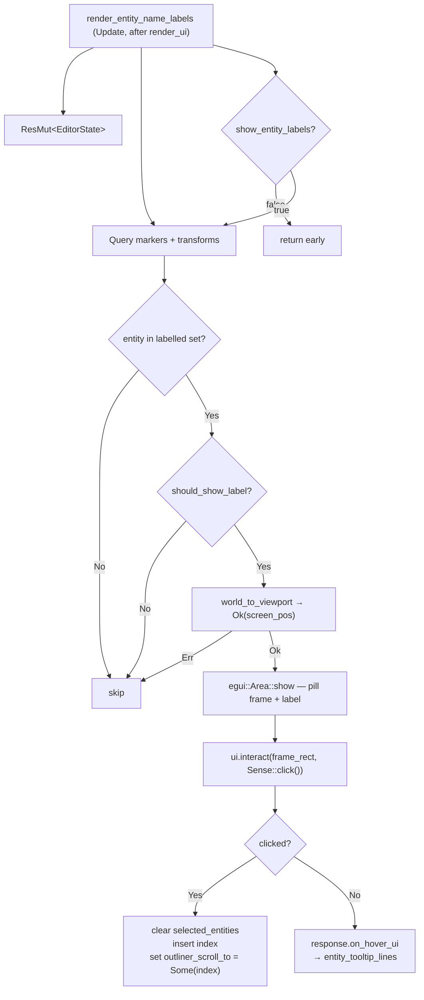

# Architecture — Editor Entity Labels Phase 3

**Feature:** Editor Entity Labels Phase 3
**Date:** 2026-04-08
**Status:** Draft

---

## Changelog

| Version | Date | Author | Summary |
|---------|------|--------|---------|
| **v1** | **2026-04-08** | — | **Initial draft — hover tooltip and click-through selection via egui response capture and EditorState scroll-to field** |

---

## Table of Contents

1. [Current Architecture](#1-current-architecture)
2. [Target Architecture](#2-target-architecture)
3. [Appendices](#appendices)

---

## 1. Current Architecture

### 1.1 Relevant Files

| File | Purpose |
|------|---------|
| `src/editor/ui/viewport.rs` | `render_entity_name_labels` system — projects entity positions to screen, draws `egui::Area` pills; Area response is currently **discarded** |
| `src/editor/state.rs` | `EditorState` resource — no tooltip or scroll-to fields; `selected_entities: HashSet<usize>` is the selection store |
| `src/editor/ui/outliner.rs` | `render_entities_section` — renders entity rows as `ui.selectable_label`; **no scroll-to-selection mechanism exists** |
| `src/editor/ui/properties/entity_props.rs` | Reads `selected_entities.iter().next()` to show the selected entity's properties |
| `src/editor/renderer.rs` | `EditorEntityMarker { entity_index: usize }` — component on each entity sphere |
| `src/systems/game/map/format/entities.rs` | `EntityData { entity_type, position: (f32,f32,f32), properties: HashMap<String,String> }` |
| `src/bin/map_editor/main.rs` | System registration: `render_entity_name_labels.after(render_ui)` |

### 1.2 Phase 2 Label System — Current Flow

```mermaid
flowchart TD
    A["render_entity_name_labels (Update, after render_ui)"]
    B["Res&lt;EditorState&gt; — read-only"]
    C["Query all EditorEntityMarker + GlobalTransform"]
    D{show_entity_labels?}
    E{entity_type ∈ labelled set?}
    F{should_show_label(name, default)?}
    G["world_to_viewport → Ok(screen_pos)"]
    H["egui::Area::show() → response DISCARDED"]
    I["egui::Frame pill + colored ui.label()"]
    J[return early]
    K[skip]

    A --> B
    A --> D
    D -->|false| J
    D -->|true| C
    C --> E
    E -->|No| K
    E -->|Yes| F
    F -->|No| K
    F -->|Yes| G
    G -->|Err| K
    G -->|Ok| H
    H --> I
```

### 1.3 Current `EditorState` (relevant fields)

```rust
// src/editor/state.rs:33
pub struct EditorState {
    pub current_map: MapData,
    pub selected_entities: HashSet<usize>,  // line 50
    pub show_grid: bool,
    pub grid_opacity: f32,
    pub snap_to_grid: bool,
    pub show_entity_labels: bool,           // added Phase 2
    // …no outliner_scroll_to field
}
```

### 1.4 Current Outliner Entity Row Rendering (outliner.rs:282–298)

```rust
let is_selected = editor_state.selected_entities.contains(&index);
let response = ui.selectable_label(is_selected, label_text);
if response.clicked() {
    editor_state.selected_entities.clear();
    editor_state.selected_entities.insert(index);
    // ← no scroll_to_me call here or anywhere
}
```

The outliner wraps all content in a single `egui::ScrollArea::vertical()` (line 92). There is no mechanism to scroll the outliner to a selected entity from outside the outliner — selecting via the 3D viewport Select tool or any other path does not scroll the outliner.

### 1.5 Why Area Responses Are Currently Discarded

Every `egui::Area::show()` call in `viewport.rs` ignores its return value. The areas are pure draw-only overlays. By default, `egui::Area` uses `Sense::hover()` — it can detect hover but its inner content does not process clicks unless an inner widget explicitly allocates a click-sensing response. No inner widget in the current label code does so.

---

## 2. Target Architecture

### 2.1 Design Principles

1. **Minimal footprint** — add one field to `EditorState` (`outliner_scroll_to`), change one system parameter (`Res` → `ResMut`), extract one pure helper (`entity_tooltip_lines`), and modify one function in the outliner. No new systems, resources, or crates.
2. **Deferred scroll via state field** — because `render_entity_name_labels` runs after `render_ui` (which includes the outliner), the scroll request cannot be fulfilled in the same frame it is issued. A one-field `Option<usize>` on `EditorState` bridges the one-frame gap cleanly.
3. **Pure tooltip helper** — tooltip content is extracted from the egui closure into a `fn entity_tooltip_lines(...) -> Vec<String>` so it can be unit-tested without Bevy world setup.
4. **egui-native interaction** — click sensing via `ui.interact()` and tooltip via `Response::on_hover_ui()` use built-in egui patterns; no custom input polling or Bevy cursor events are needed.
5. **No tool switching** — label clicks update selection state only; the active `EditorTool` is not changed, consistent with the expectation that overlays are independent of the active tool.

### 2.2 New / Modified Components

| Component | File | Change |
|-----------|------|--------|
| `EditorState` | `src/editor/state.rs` | Add `pub outliner_scroll_to: Option<usize>` field, default `None` |
| `render_entity_name_labels` | `src/editor/ui/viewport.rs` | Change `Res<EditorState>` → `ResMut<EditorState>`; capture `Area::show()` inner response; click → mutate selection + scroll-to; hover → `on_hover_ui` |
| `entity_tooltip_lines` | `src/editor/ui/viewport.rs` | New pure helper function; extracts tooltip lines for any `EntityData` |
| `render_entities_section` | `src/editor/ui/outliner.rs` | Consume `outliner_scroll_to` — call `response.scroll_to_me(None)` then set field to `None` |

### 2.3 `EditorState` Change

```rust
// src/editor/state.rs — add to EditorState struct
/// Index of the entity the outliner should scroll to on the next frame.
/// Set by `render_entity_name_labels` on a label click; consumed (set to None)
/// by `render_entities_section` in the outliner on the following frame.
pub outliner_scroll_to: Option<usize>,
```

```rust
// src/editor/state.rs — add to EditorState::default()
outliner_scroll_to: None,
```

### 2.4 Interaction Capture Inside the Label Area

The current code inside each `egui::Area`:

```rust
// Current (Phase 2)
egui::Area::new(egui::Id::new(("entity_label", index)))
    .show(ctx, |ui| {
        egui::Frame::new()
            .fill(...)
            .show(ui, |ui| {
                ui.label(egui::RichText::new(name)...);
            });
    });
```

Phase 3 change — capture the frame rect and create an explicit click-sensing response:

```rust
// Target (Phase 3)
let area_resp = egui::Area::new(egui::Id::new(("entity_label", index)))
    .show(ctx, |ui| {
        let frame_resp = egui::Frame::new()
            .fill(egui::Color32::from_rgba_unmultiplied(30, 30, 30, 180))
            .inner_margin(egui::Margin::symmetric(6, 4))
            .corner_radius(4.0)
            .show(ui, |ui| {
                ui.label(egui::RichText::new(name)...);
            });

        // Create an explicit click+hover response over the pill rect.
        // Sense::click() implies hover, so both hovered() and clicked() work.
        ui.interact(
            frame_resp.response.rect,
            egui::Id::new(("entity_label_interact", index)),
            egui::Sense::click(),
        )
    });

let interact_resp = area_resp.inner;
```

### 2.5 Click Handler

```rust
if interact_resp.clicked() {
    editor_state.selected_entities.clear();
    editor_state.selected_entities.insert(index);
    editor_state.outliner_scroll_to = Some(index);
}
```

### 2.6 Hover Tooltip

```rust
interact_resp.on_hover_ui(|ui| {
    for line in entity_tooltip_lines(entity_data, index) {
        ui.label(line);
    }
});
```

`Response::on_hover_ui` uses egui's built-in tooltip delay and cursor-following positioning. No custom Area management is needed.

### 2.7 `entity_tooltip_lines` Helper

```rust
/// Returns the lines to display in the hover tooltip for an entity label.
///
/// Lines are in order: name, type, position, index, then type-specific
/// properties (only keys that are present in `entity_data.properties`).
fn entity_tooltip_lines(entity_data: &EntityData, entity_index: usize) -> Vec<String> {
    let name = entity_data
        .properties
        .get("name")
        .map(String::as_str)
        .unwrap_or("");

    let mut lines = vec![
        format!("Name: {}", name),
        format!("Type: {:?}", entity_data.entity_type),
        format!(
            "Position: ({:.2}, {:.2}, {:.2})",
            entity_data.position.0, entity_data.position.1, entity_data.position.2
        ),
        format!("Index: {}", entity_index),
    ];

    match entity_data.entity_type {
        EntityType::Npc => {
            if let Some(radius) = entity_data.properties.get("radius") {
                lines.push(format!("Radius: {}", radius));
            }
        }
        EntityType::LightSource => {
            for key in &["intensity", "range", "color", "shadows"] {
                if let Some(val) = entity_data.properties.get(*key) {
                    lines.push(format!("{}: {}", key, val));
                }
            }
        }
        _ => {}
    }

    lines
}
```

### 2.8 Outliner Scroll-to-Selection

Inside `render_entities_section` in `src/editor/ui/outliner.rs`, after the existing selected-entity row rendering:

```rust
// Current (Phase 2)
let is_selected = editor_state.selected_entities.contains(&index);
let response = ui.selectable_label(is_selected, label_text);
if response.clicked() {
    editor_state.selected_entities.clear();
    editor_state.selected_entities.insert(index);
}

// Phase 3 addition — consume the scroll-to request if it targets this row
if editor_state.outliner_scroll_to == Some(index) {
    response.scroll_to_me(None);
    editor_state.outliner_scroll_to = None;
}
```

The `scroll_to_me(None)` call instructs the enclosing `egui::ScrollArea` to bring the response's rect into view. The `None` alignment parameter lets egui choose the minimal scroll needed.

### 2.9 Full System Flow — Target



```mermaid
flowchart TD
    subgraph "Outliner (next frame, inside render_ui)"
        O1["render_entities_section"]
        O2["selectable_label per entity row"]
        O3{outliner_scroll_to == Some(index)?}
        O4["response.scroll_to_me(None)\noutliner_scroll_to = None"]
        O5[continue]
    end

    O1 --> O2 --> O3
    O3 -->|Yes| O4
    O3 -->|No| O5
```

### 2.10 One-Frame Sequencing

| Frame | `render_ui` (includes outliner) | `render_entity_name_labels` |
|-------|-----------------------------------|-----------------------------|
| N | `outliner_scroll_to` is `None` — no scroll | Designer clicks label → `selected_entities = {idx}`, `outliner_scroll_to = Some(idx)` |
| N+1 | Outliner sees `outliner_scroll_to = Some(idx)` → `scroll_to_me` → `outliner_scroll_to = None` | No click |

The one-frame gap is imperceptible to users (≈16 ms at 60 fps).

### 2.11 Phase Boundaries

| Scope | In Phase 3 | Not in Phase 3 |
|-------|-----------|----------------|
| Hover tooltip (common fields) | ✅ | — |
| Hover tooltip (type-specific props) | ✅ Npc radius, LightSource light props | — |
| Click-through selection | ✅ | — |
| Outliner scroll-to-selection | ✅ (label-click path only) | Scroll on Select-tool click (separate future work) |
| Active tool change on label click | ❌ | Not planned |
| Shift+click multi-select | ❌ | Future |
| Drag label to move entity | ❌ | Future |
| Configurable font size | ❌ | Discarded |
| Game binary changes | ❌ | Out of scope |

---

## Appendices

### A. Key File Locations

| Component | File | Lines |
|-----------|------|-------|
| `EditorState` struct | `src/editor/state.rs` | 33–79 |
| `render_entity_name_labels` (Phase 2) | `src/editor/ui/viewport.rs` | ~387–453 |
| `should_show_label` helper | `src/editor/ui/viewport.rs` | ~369–375 |
| `FIRA_MONO_FAMILY`, `LABEL_Y_OFFSET`, `LABEL_FONT_SIZE` | `src/editor/ui/viewport.rs` | 13–16 |
| Outliner `render_entities_section` | `src/editor/ui/outliner.rs` | ~264–350 |
| Outliner `ScrollArea::vertical()` | `src/editor/ui/outliner.rs` | ~92 |
| Properties panel selection read | `src/editor/ui/properties/entity_props.rs` | 15 |
| `EditorEntityMarker` | `src/editor/renderer.rs` | 41–44 |
| `EntityData` struct | `src/systems/game/map/format/entities.rs` | 7–23 |
| System registration | `src/bin/map_editor/main.rs` | ~198–201 |

### B. Open Questions & Decisions

#### Resolved

| # | Question | Resolution |
|---|----------|------------|
| 1 | Should Shift+click on a label add to the selection? | Out of scope for Phase 3. Single-click replaces all selections, consistent with the outliner and Select tool. Multi-select is a future phase item. |
| 2 | Should clicking a label switch the active tool to Select? | No — label clicks are tool-agnostic overlay interactions. Switching tools would be disruptive. |
| 3 | How should the scroll-to request cross the system boundary (label system writes after outliner reads)? | `EditorState::outliner_scroll_to: Option<usize>` — set in frame N by label system, consumed in frame N+1 by outliner. One-frame delay is imperceptible. |
| 4 | Does the outliner currently have scroll-to-selection? | No — confirmed by codebase search. Phase 3 introduces `Response::scroll_to_me` on the outliner row for the first time, scoped to label-click-driven selections only. |
| 5 | Is `Sense::click()` sufficient for both hover and click detection? | Yes — in egui, `Sense::click()` includes hover sense. `response.hovered()` and `response.clicked()` both work on a response created with `Sense::click()`. |

#### Open

No open questions.

---

*Created: 2026-04-08*
*Companion: `docs/features/editor-entity-labels-phase3/requirements.md`*
*Phase 2 reference: `docs/features/editor-entity-labels-phase2/`*
