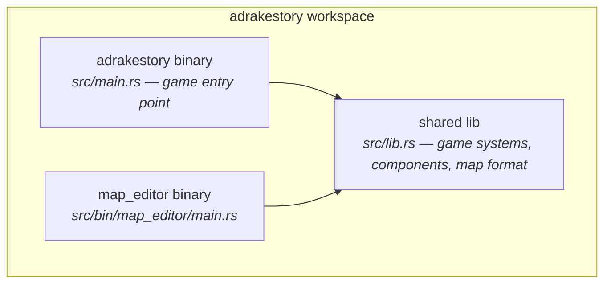
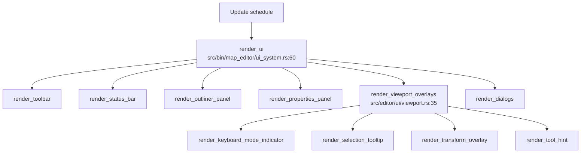
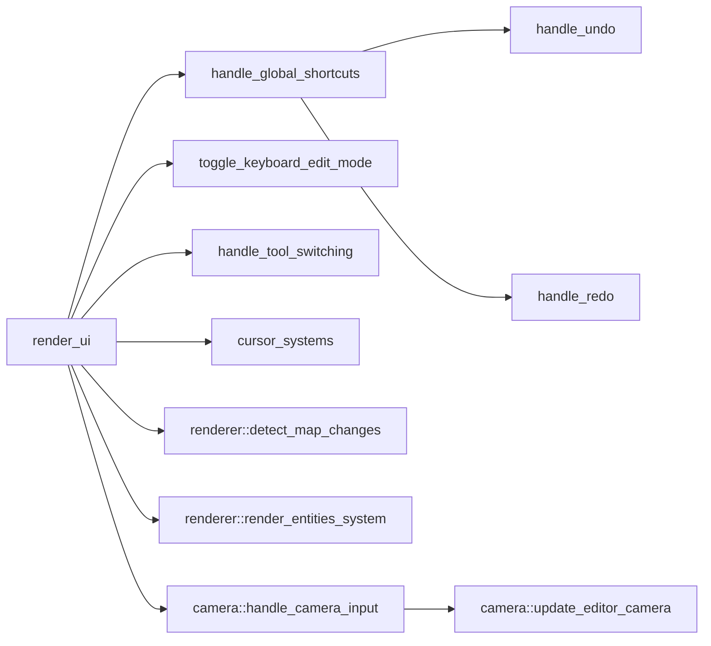
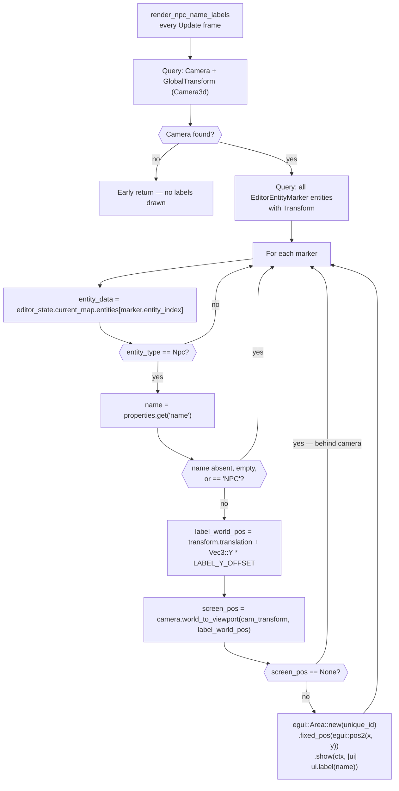
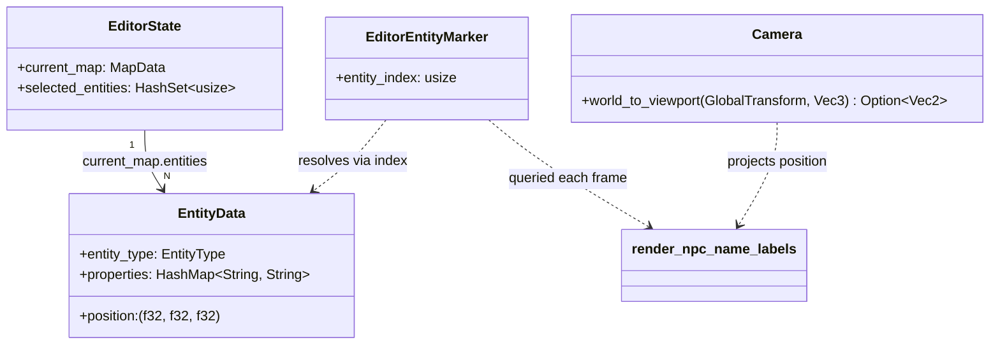
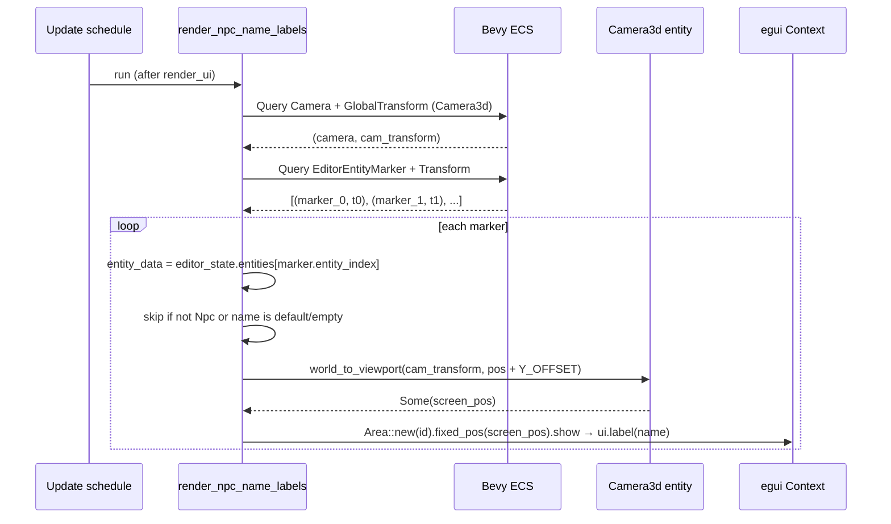
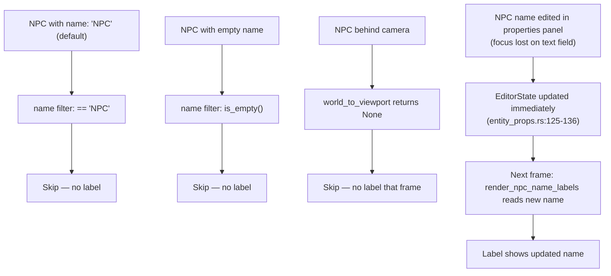

# Editor NPC Name Labels — Architecture Reference

**Date:** 2026-04-08
**Repo:** `adrakestory`
**Runtime:** Bevy 0.18 / bevy_egui (ECS, Rust)
**Purpose:** Document the current editor viewport architecture and define the target architecture for world-space NPC name label overlays.

---

## Changelog

| Version | Date | Author | Summary |
|---------|------|--------|---------|
| **v1** | **2026-04-08** | **OpenCode** | **Initial draft — codebase-validated against `src/editor/` source** |

---

## Table of Contents

1. [Current Architecture](#1-current-architecture)
   - [Solution Structure](#11-solution-structure)
   - [Editor Viewport Rendering Flow](#12-editor-viewport-rendering-flow)
   - [Entity Marker System](#13-entity-marker-system)
   - [Viewport Overlay System](#14-viewport-overlay-system)
   - [UI System Execution Order](#15-ui-system-execution-order)
2. [Target Architecture — NPC Name Labels](#2-target-architecture--npc-name-labels)
   - [Design Principles](#21-design-principles)
   - [New Components](#22-new-components)
   - [Modified Components](#23-modified-components)
   - [Label Projection Flow](#24-label-projection-flow)
   - [Class Diagram](#25-class-diagram)
   - [Sequence Diagram — Happy Path](#26-sequence-diagram--happy-path)
   - [Edge Case Flow](#27-edge-case-flow)
   - [System Registration](#28-system-registration)
   - [Phase Boundaries](#29-phase-boundaries)
3. [Appendices](#appendix-a--data-schema)
   - [Appendix A — Data Schema](#appendix-a--data-schema)
   - [Appendix B — Open Questions & Decisions](#appendix-b--open-questions--decisions)
   - [Appendix C — Key File Locations](#appendix-c--key-file-locations)
   - [Appendix D — Code Template](#appendix-d--code-template)

---

## 1. Current Architecture

### 1.1 Solution Structure



The editor binary imports all game code through `src/lib.rs` but does not run `GameState::InGame` systems. The editor operates entirely on `MapData` in memory (`EditorState::current_map`) and represents entities as coloured sphere meshes — it never calls `spawn_npc()` or creates `Npc` components.

### 1.2 Editor Viewport Rendering Flow

The editor frame has two distinct rendering passes:

1. **3D Bevy pass** — Standard Bevy rendering pipeline draws all mesh entities (voxel chunks, entity sphere markers, grid).
2. **egui pass** — `render_ui` (called via `bevy_egui`) draws all panels and overlays on top of the 3D scene.



All egui draw calls must occur within the same `render_ui` system call (or in a system that runs after it within the same frame) because `bevy_egui` flushes the egui command buffer once per frame.

### 1.3 Entity Marker System

NPC entities (and all other entity types) are represented in the editor as coloured sphere meshes. These are ECS entities with no game components — they carry only rendering and identification data.

**`EditorEntityMarker`** (`src/editor/renderer.rs:41–44`):
```rust
#[derive(Component)]
pub struct EditorEntityMarker {
    pub entity_index: usize,   // index into EditorState::current_map.entities
}
```

**`render_entities_system`** (`src/editor/renderer.rs:335–418`):
- Triggers on `RenderMapEvent` (fired when entity count changes) or `UpdateSelectionHighlights`.
- Despawns all existing `EditorEntityMarker` entities.
- Re-spawns one sphere mesh per `EntityData` in `current_map.entities`.
- NPC spheres: blue (`Color::srgba(0.0, 0.5, 1.0, 0.8)`), radius `0.35`, `AlphaMode::Blend`, `unlit: true`.
- Each marker is positioned at `entity_data.position` rounded to the nearest integer grid coordinate.

The sphere mesh entity has a `Transform` with `.translation` set to the NPC world position. No text or label entity is attached.

### 1.4 Viewport Overlay System

**`render_viewport_overlays`** (`src/editor/ui/viewport.rs:35–91`) is a pure function called from inside `render_ui`. It draws four egui overlays using `egui::Area`:

| Overlay | Position | Condition |
|---------|----------|-----------|
| `render_keyboard_mode_indicator` | Top-right of viewport | `KeyboardEditMode::enabled` is true |
| `render_selection_tooltip` | Bottom-right of viewport | `EditorTool::Select` active with a non-empty selection |
| `render_transform_overlay` | Centre-bottom of viewport | `TransformMode != None` |
| `render_tool_hint` | Bottom-left of viewport | Always |

Each overlay uses `egui::Area::new(id).fixed_pos(screen_pos).show(ctx, ...)` — a pattern the new NPC label system follows directly.

The function signature:
```rust
pub fn render_viewport_overlays(
    ctx: &egui::Context,
    editor_state: &EditorState,
    cursor_state: &CursorState,
    keyboard_mode: &KeyboardEditMode,
    active_transform: &ActiveTransform,
)
```

It does not receive camera data or ECS queries — it works entirely with pre-computed state passed in by `render_ui`.

### 1.5 UI System Execution Order



Systems that must observe egui input state are registered `.after(render_ui)`. The new label system follows the same pattern.

---

## 2. Target Architecture — NPC Name Labels

### 2.1 Design Principles

1. **New system, new function** — The label logic is a standalone Bevy system (`render_npc_name_labels`) added to `src/editor/ui/viewport.rs`. It does not modify `render_viewport_overlays` or any existing overlay function.
2. **egui-only rendering** — Labels are drawn as `egui::Area` elements, matching the existing overlay pattern. No new mesh entities, no `Text2d` components, no ECS child entities.
3. **World-to-screen projection per frame** — Each frame the system projects NPC world positions to screen space via `Camera::world_to_viewport`. No caching of screen coordinates.
4. **Read `EditorState` live** — Labels are always sourced from `EditorState::current_map.entities` so they reflect name edits immediately after the properties panel commits them.
5. **Additive only** — No existing systems, components, or resources are modified. One new function and one new `add_systems` registration are the complete change surface.
6. **No new crates** — Uses `bevy_egui` and `bevy::prelude` only (NFR-3.1).

### 2.2 New Components

No new ECS components are introduced. The system reads existing data:

| Existing item | Used for |
|---------------|----------|
| `EditorEntityMarker::entity_index` | Resolves entity type and name from `EditorState` |
| `Transform` (on `EditorEntityMarker` entity) | World position for projection |
| `Camera` + `GlobalTransform` (on `Camera3d` entity) | `world_to_viewport` projection |
| `EditorState::current_map.entities[index].properties["name"]` | Label text |

New code introduced:

| Item | File | Purpose |
|------|------|---------|
| `render_npc_name_labels` system | `src/editor/ui/viewport.rs` | Projects NPC positions and draws egui labels |
| `pub use viewport::render_npc_name_labels` | `src/editor/ui/mod.rs` | Re-export for use in `main.rs` |

### 2.3 Modified Components

| File | Change |
|------|--------|
| `src/editor/ui/viewport.rs` | Add `render_npc_name_labels` function (new system) |
| `src/editor/ui/mod.rs` | Add `pub use viewport::render_npc_name_labels;` |
| `src/bin/map_editor/main.rs` | Register `render_npc_name_labels` with `.after(render_ui)` |

### 2.4 Label Projection Flow



`LABEL_Y_OFFSET` is defined as a constant `0.8` (NPC sphere radius `0.35` + clearance) in `viewport.rs`. The value will be tuned during manual verification per Assumption 5 in requirements.

### 2.5 Class Diagram



### 2.6 Sequence Diagram — Happy Path



### 2.7 Edge Case Flow



### 2.8 System Registration

The new system is added to `src/bin/map_editor/main.rs`:

```rust
// src/bin/map_editor/main.rs — after the existing .add_systems(Update, renderer::render_entities_system) line
.add_systems(
    Update,
    ui::render_npc_name_labels.after(ui_system::render_ui),
)
```

The `.after(render_ui)` constraint matches the pattern used by all other systems that interact with the egui context (`handle_global_shortcuts`, `handle_tool_switching`, etc.).

The constant and filter are defined at the top of the function in `viewport.rs`:

```rust
const LABEL_Y_OFFSET: f32 = 0.8;
const DEFAULT_NPC_NAME: &str = "NPC";
```

### 2.9 Phase Boundaries

| Capability | Phase | Architectural Impact |
|------------|-------|---------------------|
| `render_npc_name_labels` system | Phase 1 | New function in `viewport.rs`; one re-export; one `add_systems` call |
| Skip absent / empty / `"NPC"` names | Phase 1 | Inline filter in the new function |
| Always-on labels (no toggle) | Phase 1 | No state or resource needed |
| Show/hide toggle in toolbar or View menu | Phase 2 | New `bool` field in `EditorState` or `EditorUIState`; toolbar button |
| Labels for Enemy, Item entities | Phase 2 | Extend entity type filter in `render_npc_name_labels` |
| Label style (background pill, colour) | Phase 2 | `egui::Frame` wrapper around `ui.label()` |
| Hover tooltip with full NPC properties | Future | `response.hovered()` check; no new system needed |
| Click label → select NPC in outliner | Future | Requires `MessageWriter<UpdateSelectionHighlights>` in system params |

**MVP boundary:**
- ✅ egui label above each NPC sphere with non-default name
- ✅ Skip absent / empty / `"NPC"` names
- ✅ Skip NPCs behind the camera (world_to_viewport returns None)
- ✅ Labels update when name is edited in properties panel
- ❌ Toggle on/off
- ❌ Visual styling (background, colour)
- ❌ Other entity type labels

---

## Appendix A — Data Schema

### `EditorEntityMarker` (existing, unchanged)

```rust
// src/editor/renderer.rs:41–44
#[derive(Component)]
pub struct EditorEntityMarker {
    pub entity_index: usize,
}
```

The `entity_index` field is the index into `EditorState::current_map.entities`. It is set at spawn time in `render_entities_system` (renderer.rs:406) and remains stable until the next full re-render triggered by `RenderMapEvent`.

### `EntityData` (existing, unchanged)

```rust
// src/systems/game/map/format/entities.rs:8–23
pub struct EntityData {
    pub entity_type: EntityType,
    pub position: (f32, f32, f32),
    #[serde(default)]
    pub properties: HashMap<String, String>,
}
```

The `"name"` property is stored as a plain `String` key. It is absent for NPCs placed without a name, and defaults to `"NPC"` at game runtime via `spawn_npc()`. The editor reads and writes it directly.

### Example NPC entries in `assets/maps/default.ron`

```ron
// Named NPC at (9.5, 1.0, 5.5) — label WILL be shown
(
    entity_type: Npc,
    position: (9.5, 1.0, 5.5),
    properties: {
        "name": "Village Elder",
    },
),

// Anonymous NPCs — label will NOT be shown (no "name" key)
(
    entity_type: Npc,
    position: (9.0, 1.0, 8.0),
    properties: {},
),
```

---

## Appendix B — Open Questions & Decisions

### Resolved

| # | Question | Resolution |
|---|----------|------------|
| 1 | Use a new Bevy system or extend `render_viewport_overlays`? | New standalone Bevy system (`render_npc_name_labels`) — `render_viewport_overlays` is a pure function without camera query access; adding queries would require changing all call sites. |
| 2 | How to access camera from an egui-focused system? | `render_npc_name_labels` is a Bevy system with its own `Query<(&Camera, &GlobalTransform), With<Camera3d>>` param — no need to thread camera data through `render_ui`. |
| 3 | Cache screen positions or project every frame? | Project every frame — camera moves each frame, caching would require invalidation logic with no performance benefit for a small NPC count. |
| 4 | Use `egui::Area` or `Painter::text` for label drawing? | `egui::Area` — consistent with the four existing overlays in `render_viewport_overlays`. `Painter::text` requires manual font metrics; `ui.label()` inside an `Area` handles sizing automatically. |
| 5 | Label Y offset value? | `0.8` world units as initial best-guess (sphere radius `0.35` + clearance). To be tuned during manual verification. |
| 6 | What egui `Id` to use per label? | `egui::Id::new(("npc_label", marker.entity_index))` — unique per entity index, stable across frames as long as entity count does not change (full re-spawn resets indices). |

### Open

No open questions.

---

## Appendix C — Key File Locations

| Component | Path |
|-----------|------|
| `EditorEntityMarker` component | `src/editor/renderer.rs:41–44` |
| `render_entities_system` | `src/editor/renderer.rs:335–418` |
| `render_viewport_overlays` (egui overlay infrastructure) | `src/editor/ui/viewport.rs:35–91` |
| `render_npc_name_labels` (to be added) | `src/editor/ui/viewport.rs` |
| `render_ui` system | `src/bin/map_editor/ui_system.rs:60–139` |
| Editor `main.rs` (system registration) | `src/bin/map_editor/main.rs` |
| `EditorState` / `EditorTool` | `src/editor/state.rs` |
| `EntityData` / `EntityType` | `src/systems/game/map/format/entities.rs` |
| NPC name editing in properties panel | `src/editor/ui/properties/entity_props.rs:102–168` |
| NPC name display in outliner | `src/editor/ui/outliner.rs:264–272` |
| ui module re-exports | `src/editor/ui/mod.rs` |
| Example NPC in default map | `assets/maps/default.ron` |

---

## Appendix D — Code Template

### `render_npc_name_labels` system

```rust
// src/editor/ui/viewport.rs

use bevy::prelude::*;
use bevy_egui::EguiContexts;
use crate::editor::renderer::EditorEntityMarker;
use crate::editor::state::EditorState;
use crate::systems::game::map::format::EntityType;

const LABEL_Y_OFFSET: f32 = 0.8;
const DEFAULT_NPC_NAME: &str = "NPC";

pub fn render_npc_name_labels(
    mut contexts: EguiContexts,
    camera_query: Query<(&Camera, &GlobalTransform), With<Camera3d>>,
    marker_query: Query<(&Transform, &EditorEntityMarker)>,
    editor_state: Res<EditorState>,
) {
    let ctx = match contexts.ctx_mut() {
        Ok(ctx) => ctx,
        Err(_) => return,
    };

    let Ok((camera, cam_transform)) = camera_query.single() else {
        return;
    };

    for (transform, marker) in &marker_query {
        let Some(entity_data) = editor_state.current_map.entities.get(marker.entity_index) else {
            continue;
        };

        if entity_data.entity_type != EntityType::Npc {
            continue;
        }

        let name = match entity_data.properties.get("name") {
            Some(n) if !n.is_empty() && n != DEFAULT_NPC_NAME => n.as_str(),
            _ => continue,
        };

        let label_world_pos = transform.translation + Vec3::Y * LABEL_Y_OFFSET;

        let Some(screen_pos) = camera.world_to_viewport(cam_transform, label_world_pos) else {
            continue;
        };

        let area_id = egui::Id::new(("npc_label", marker.entity_index));
        egui::Area::new(area_id)
            .fixed_pos(egui::pos2(screen_pos.x, screen_pos.y))
            .pivot(egui::Align2::CENTER_BOTTOM)
            .show(ctx, |ui| {
                ui.label(name);
            });
    }
}
```

### Re-export in `src/editor/ui/mod.rs`

```rust
pub use viewport::render_npc_name_labels;
```

### System registration in `src/bin/map_editor/main.rs`

```rust
.add_systems(
    Update,
    ui::render_npc_name_labels.after(ui_system::render_ui),
)
```

---

*Created: 2026-04-08 — See [Changelog](#changelog) for version history.*
*Based on: `docs/features/editor-npc-name-labels/ticket.md`, `docs/features/editor-npc-name-labels/requirements.md`*
*Codebase validated against: `src/editor/renderer.rs`, `src/editor/ui/viewport.rs`, `src/bin/map_editor/main.rs`, `src/bin/map_editor/ui_system.rs`, `src/editor/state.rs`, `src/systems/game/map/format/entities.rs`*
