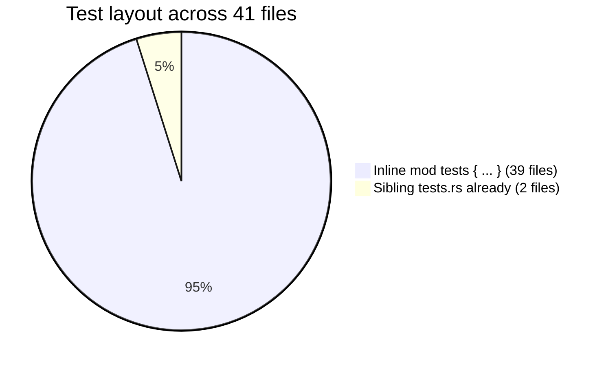
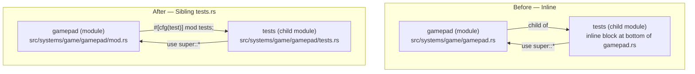

# Test Organization — Architecture Reference

**Date:** 2026-04-08
**Repo:** `adrakestory`
**Purpose:** Document the current inline test module layout and define the target sibling `tests.rs` layout for all source files.

---

## Changelog

| Version | Date | Author | Summary |
|---------|------|--------|---------|
| **v1** | **2026-04-08** | — | **Initial draft — documents current inline pattern, target directory-module pattern, and file transformation mechanics** |

---

## Table of Contents

1. [Current Architecture](#1-current-architecture)
   - [Rust Module File Patterns](#11-rust-module-file-patterns)
   - [Current Test Layout](#12-current-test-layout)
   - [Inline Test Module — How It Works](#13-inline-test-module--how-it-works)
   - [Reference Implementations](#14-reference-implementations)
2. [Target Architecture](#2-target-architecture)
   - [Design Principles](#21-design-principles)
   - [Target Test Layout](#22-target-test-layout)
   - [File Transformation Mechanics](#23-file-transformation-mechanics)
   - [Privacy Model — Before and After](#24-privacy-model--before-and-after)
   - [Delegation Pattern](#25-delegation-pattern)
   - [Phase Boundaries](#26-phase-boundaries)
3. [Appendices](#appendix-a--complete-file-inventory)
   - [Appendix A — Complete File Inventory](#appendix-a--complete-file-inventory)
   - [Appendix B — Open Questions & Decisions](#appendix-b--open-questions--decisions)
   - [Appendix C — Key File Locations](#appendix-c--key-file-locations)

---

## 1. Current Architecture

### 1.1 Rust Module File Patterns

Rust supports two equivalent ways to define a module named `foo` on disk. The parent declares `mod foo;` in both cases and the compiler resolves whichever form exists.

```
Pattern A — Flat file
─────────────────────
parent/
└── foo.rs          ← all of foo's code lives here

Pattern B — Directory module
─────────────────────────────
parent/
└── foo/
    └── mod.rs      ← all of foo's code lives here
    └── bar.rs      ← submodule, declared via `mod bar;` inside mod.rs
```

Both patterns are fully equivalent at the Rust module level. A `mod foo;` in the parent file resolves to either `foo.rs` or `foo/mod.rs` — the compiler checks both locations. Callers reference the module as `crate::parent::foo::SomeType` in either case; the path does not change.

### 1.2 Current Test Layout

The project has 41 source files containing `#[cfg(test)]` test code. The layout breaks down as follows:



| Layout | Count | Description |
|--------|-------|-------------|
| Inline `#[cfg(test)] mod tests { ... }` | 39 | Test code embedded at the bottom of the production source file |
| Sibling `tests.rs` (delegation) | 2 | `geometry/mod.rs` and `occlusion/mod.rs` — already migrated |
| Top-level `tests/` integration directory | 0 | Does not exist |

Total test functions: **485** across all 41 files.

### 1.3 Inline Test Module — How It Works

In the inline pattern, a production file ends with a test module gated by `#[cfg(test)]`:

```rust
// src/systems/game/gamepad.rs  (638 lines — production + tests mixed)

pub struct GamepadSettings { ... }

pub fn gather_gamepad_input(...) { ... }

// --- everything below is test-only, excluded from release builds ---

#[cfg(test)]
mod tests {
    use super::*;     // imports all items from the parent module

    #[test]
    fn default_sensitivity_is_one() { ... }

    #[test]
    fn invert_y_negates_look_direction() { ... }
    // ... 19 more tests
}
```

The `#[cfg(test)]` attribute on the module causes the Rust compiler to exclude the entire block from non-test builds. The `use super::*;` brings all items from the enclosing file — including private ones — into scope.

The problem at scale: when a file contains 20–36 tests, the test block adds 200–400 lines to the file, pushing total file length to 600–1,031 lines and making the production code hard to navigate.

### 1.4 Reference Implementations

Two files already use the target pattern and serve as the template for all migrations.

**`src/systems/game/map/geometry/mod.rs`** — 27 lines of production code, tests in `geometry/tests.rs` (258 lines, 20 tests):

```rust
// src/systems/game/map/geometry/mod.rs

mod rotation;
mod types;
// ... other submodules

#[cfg(test)]
mod tests;           // ← delegation: resolves to geometry/tests.rs
```

```rust
// src/systems/game/map/geometry/tests.rs

use super::*;

#[test]
fn full_pattern_fills_all_bits() { ... }
// ... 19 more tests
```

**`src/systems/game/occlusion/mod.rs`** — 733 lines of production code, tests in `occlusion/tests.rs` (259 lines, 23 tests). Same delegation pattern.

---

## 2. Target Architecture

### 2.1 Design Principles

1. **One convention, no exceptions** — every module with tests uses the sibling `tests.rs` pattern. Consistency eliminates the need to decide the right approach per file and makes navigation predictable.

2. **Co-location preserved** — `tests.rs` lives inside the same directory as the module it tests. Tests remain co-located with their subject, satisfying the Rust community's guideline that unit tests live near the code they test.

3. **Zero behavior change** — the `tests` module is still a child of its parent after conversion. `use super::*;` still imports private items. The compiler sees an identical module graph; only the file path changes.

4. **No parent declaration changes** — converting `foo.rs` to `foo/mod.rs` requires no changes to any `mod foo;` declaration in parent files. This bounds the blast radius of each migration to exactly two files: the renamed production file and the new `tests.rs`.

5. **Independent commits** — each migration group must be a standalone commit that builds and passes tests before the next group begins. This allows bisection if a regression is introduced.

### 2.2 Target Test Layout

After all migrations, every file with tests will follow this structure:

```
Before (flat file with inline tests)        After (directory module with sibling tests)
─────────────────────────────────────       ────────────────────────────────────────────
src/systems/game/
└── gamepad.rs   [638 lines]                src/systems/game/
                                            └── gamepad/
                                                ├── mod.rs    [~400 lines — prod only]
                                                └── tests.rs  [~240 lines — tests only]
```

```
Before (mod.rs with inline tests)           After (mod.rs with sibling tests.rs)
─────────────────────────────────           ──────────────────────────────────────
src/systems/game/map/spawner/               src/systems/game/map/spawner/
└── mod.rs   [638 lines]                    ├── mod.rs    [~400 lines — prod only]
                                            └── tests.rs  [~240 lines — tests only]
```

### 2.3 File Transformation Mechanics

There are two transformation types depending on whether the source file is already a `mod.rs` or a flat file.

#### Type A — Flat file → Directory module

Applies to 38 of the 39 files being migrated.

```
Step 1: Create the new directory
    mkdir src/path/to/foo/

Step 2: Move the file
    mv src/path/to/foo.rs src/path/to/foo/mod.rs

Step 3: Extract the test block from mod.rs into tests.rs
    # Remove the entire `#[cfg(test)] mod tests { ... }` block from mod.rs
    # Add `#[cfg(test)] mod tests;` in its place
    # Create tests.rs with the extracted content (see §2.5 for the exact template)

Step 4: Verify
    cargo test                   # must report 485 passing
```

No changes are needed in any parent file. The `mod foo;` declaration in the parent remains identical.

#### Type B — Existing mod.rs → Add sibling tests.rs

Applies to 1 file: `src/systems/game/map/spawner/mod.rs`.

```
Step 1: Extract the test block from mod.rs into tests.rs
    # Remove the entire `#[cfg(test)] mod tests { ... }` block from mod.rs
    # Add `#[cfg(test)] mod tests;` in its place
    # Create spawner/tests.rs with the extracted content

Step 2: Verify
    cargo test                   # must report 485 passing
```

### 2.4 Privacy Model — Before and After

The privacy model is identical before and after conversion. In both cases, `tests` is a child module of the production module, and `use super::*;` grants access to all items — including private ones.



The `tests` module in both cases has the same parent. `super::*` resolves to the same set of items. There is no difference in what tests can access.

### 2.5 Delegation Pattern

This is the exact pattern applied to every migrated file.

**In `mod.rs` (or the renamed flat file):**

```rust
// Replace the entire inline block:
//   #[cfg(test)]
//   mod tests {
//       use super::*;
//       ... all test functions ...
//   }
//
// With this single delegation line:

#[cfg(test)]
mod tests;
```

**In the new `tests.rs`:**

```rust
use super::*;

// all test functions, helpers, and test-only structs moved here verbatim
#[test]
fn example_test_name() {
    // body unchanged
}
```

Note: the `#[cfg(test)]` attribute is not needed on the `tests.rs` file itself. The attribute on the `mod tests;` declaration in `mod.rs` already gates the entire module from non-test builds. Adding `#![cfg(test)]` at the top of `tests.rs` is harmless but redundant; the reference implementations (`geometry/tests.rs`, `occlusion/tests.rs`) do not include it.

### 2.6 Phase Boundaries

This is a single-phase migration. All 39 files are in scope.

| Capability | Scope | Notes |
|------------|-------|-------|
| Migrate all 39 inline test modules to sibling `tests.rs` | In scope | See Appendix A for the full file list |
| Update `AGENTS.md` | In scope | Fix the contradiction with `coding-style.md` §7 |
| Confirm `coding-style.md` §7 | In scope | Review only; update if stale |
| Create a top-level `tests/` integration test directory | Out of scope | Separate concern; no integration tests currently exist |
| Split large production files for reasons other than test extraction | Out of scope | File size reduction is a side effect, not a goal |
| Modify any test logic, assertions, or test names | Out of scope | Pure layout refactor — content is frozen |

---

## Appendix A — Complete File Inventory

All 39 files requiring migration, ordered by migration group.

### Group 1 — `src/systems/game/map/spawner/` (Type B + Type A)

| File | Lines | Tests | Type |
|------|-------|-------|------|
| `map/spawner/mod.rs` | 638 | 25 | B — add sibling `tests.rs` |
| `map/spawner/chunks.rs` | 603 | 16 | A — convert to directory module |
| `map/spawner/entities.rs` | 616 | 36 | A — convert to directory module |
| `map/spawner/shadow_quality.rs` | 93 | 5 | A — convert to directory module |
| `map/spawner/meshing/palette.rs` | 121 | 6 | A — convert to directory module |
| `map/spawner/meshing/occupancy.rs` | 150 | 10 | A — convert to directory module |

### Group 2 — `src/systems/game/map/format/`

| File | Lines | Tests | Type |
|------|-------|-------|------|
| `map/format/rotation.rs` | 855 | 29 | A |
| `map/format/patterns.rs` | 328 | 18 | A |
| `map/format/camera.rs` | 121 | 6 | A |

### Group 3 — `src/systems/game/map/` top-level

| File | Lines | Tests | Type |
|------|-------|-------|------|
| `map/validation.rs` | 682 | 33 | A |
| `map/loader.rs` | 261 | 3 | A |

### Group 4 — `src/systems/game/` core

| File | Lines | Tests | Type |
|------|-------|-------|------|
| `gamepad.rs` | 638 | 21 | A |
| `physics.rs` | 339 | 2 | A |
| `input.rs` | 390 | 8 | A |
| `collision.rs` | 405 | 6 | A |
| `interior_detection.rs` | 591 | 11 | A |
| `npc_labels.rs` | 506 | 13 | A |
| `player_movement.rs` | 324 | 1 | A |
| `resources.rs` | 197 | 9 | A |

### Group 5 — `src/systems/game/hot_reload/` and `src/systems/settings/`

| File | Lines | Tests | Type |
|------|-------|-------|------|
| `hot_reload/state.rs` | 174 | 2 | A |
| `settings/vsync.rs` | 442 | 22 | A |

### Group 6 — `src/editor/grid/`

| File | Lines | Tests | Type |
|------|-------|-------|------|
| `grid/systems.rs` | 100 | 1 | A |
| `grid/mesh.rs` | 132 | 1 | A |
| `grid/bounds.rs` | 132 | 1 | A |
| `grid/cursor_indicator.rs` | 144 | 1 | A |

### Group 7 — `src/editor/controller/`

| File | Lines | Tests | Type |
|------|-------|-------|------|
| `controller/input.rs` | 585 | 5 | A |
| `controller/camera.rs` | 394 | 17 | A |
| `controller/cursor.rs` | 360 | 4 | A |
| `controller/hotbar.rs` | 390 | 6 | A |
| `controller/palette.rs` | 301 | 3 | A |

### Group 8 — `src/editor/tools/`

| File | Lines | Tests | Type |
|------|-------|-------|------|
| `tools/input/helpers.rs` | 360 | 13 | A |

### Group 9 — `src/editor/ui/`

| File | Lines | Tests | Type |
|------|-------|-------|------|
| `ui/viewport.rs` | 668 | 19 | A |
| `ui/outliner.rs` | 1,031 | 29 | A |

### Group 10 — `src/editor/` top-level

| File | Lines | Tests | Type |
|------|-------|-------|------|
| `camera.rs` | 946 | 18 | A |
| `state.rs` | 494 | 21 | A |
| `file_io.rs` | 566 | 15 | A |
| `history.rs` | 314 | 3 | A |
| `shortcuts.rs` | 320 | 3 | A |

### Group 11 — Developer Guidelines

| File | Change |
|------|--------|
| `AGENTS.md` | Remove inline-test statement; reference `coding-style.md` §7 |
| `coding-style.md` | Review §7; update if stale |

---

## Appendix B — Open Questions & Decisions

### Resolved

| # | Question | Resolution |
|---|----------|------------|
| 1 | Does converting `foo.rs` → `foo/mod.rs` require updating parent `mod foo;` declarations? | No. Rust resolves both forms from the same declaration. Confirmed via Rust Reference §6.3. |
| 2 | Must `tests.rs` include `#![cfg(test)]` at the file level? | No. The `#[cfg(test)]` on the `mod tests;` delegation in `mod.rs` gates the whole module. Reference implementations (`geometry/tests.rs`, `occlusion/tests.rs`) do not include it. |
| 3 | Should small files (< 100 lines, 1 test) also be converted? | Yes. Consistency is the goal; size is not the criterion. |
| 4 | Should a top-level `tests/` directory be created? | Out of scope. That directory is for integration tests only. No integration tests exist in this project. |

### Open

No open questions.

---

## Appendix C — Key File Locations

| Reference | Path |
|-----------|------|
| Reference implementation A | `src/systems/game/map/geometry/mod.rs` + `geometry/tests.rs` |
| Reference implementation B | `src/systems/game/occlusion/mod.rs` + `occlusion/tests.rs` |
| Style guide §7 | `docs/developer-guide/coding-style.md` |
| Agent instructions | `AGENTS.md` (line 76 — to be corrected) |
| Ticket | `docs/features/organize-unit-tests/ticket.md` |
| Requirements | `docs/features/organize-unit-tests/requirements.md` |

---

*Created: 2026-04-08 — See [Changelog](#changelog) for version history.*
*Companion documents: [Requirements](./requirements.md) | [Ticket](./ticket.md)*
