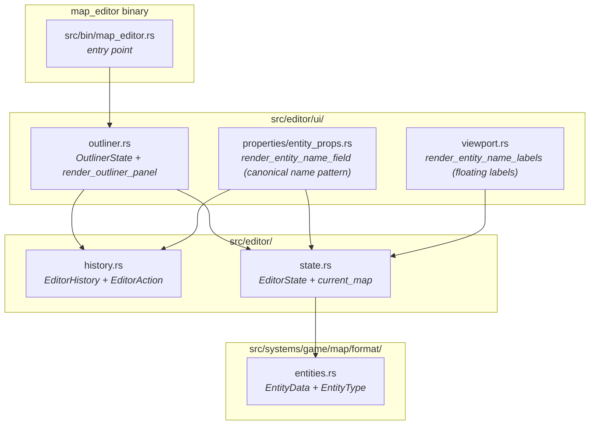
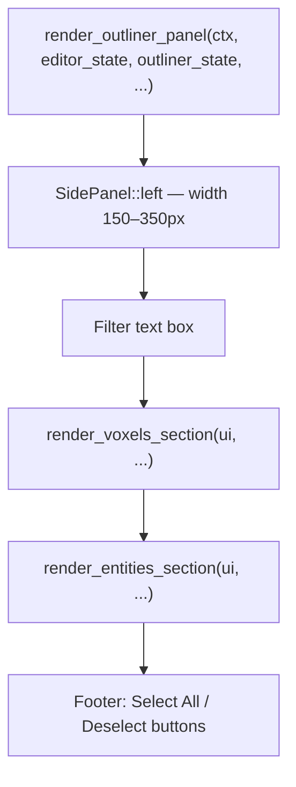
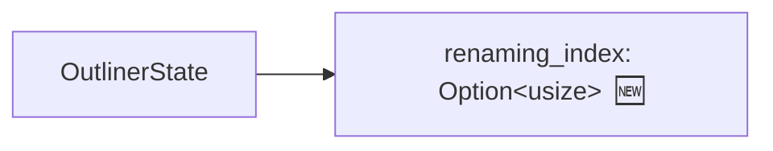
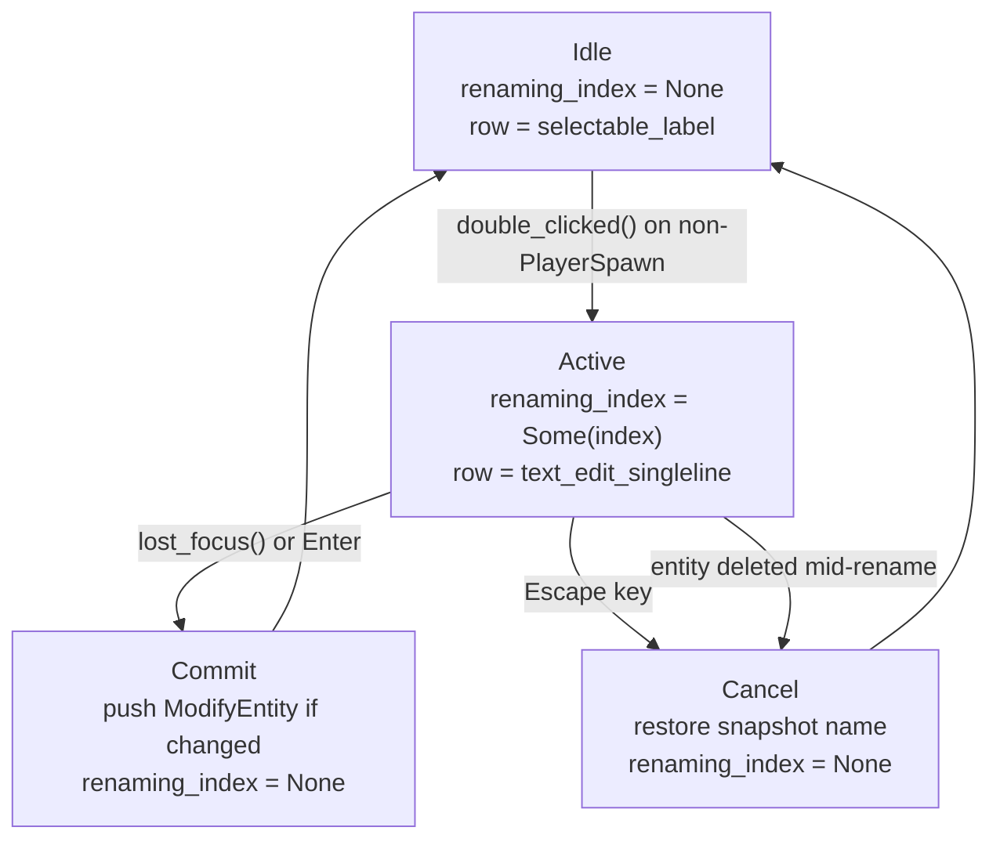
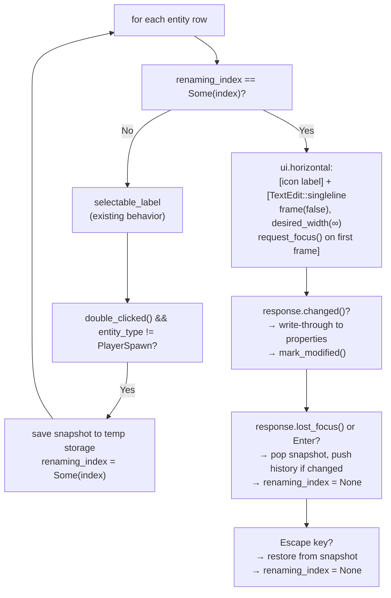
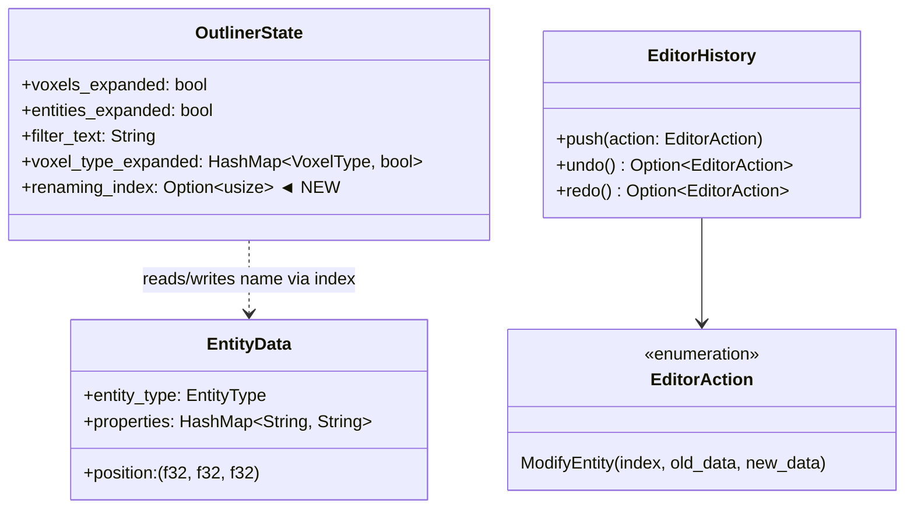
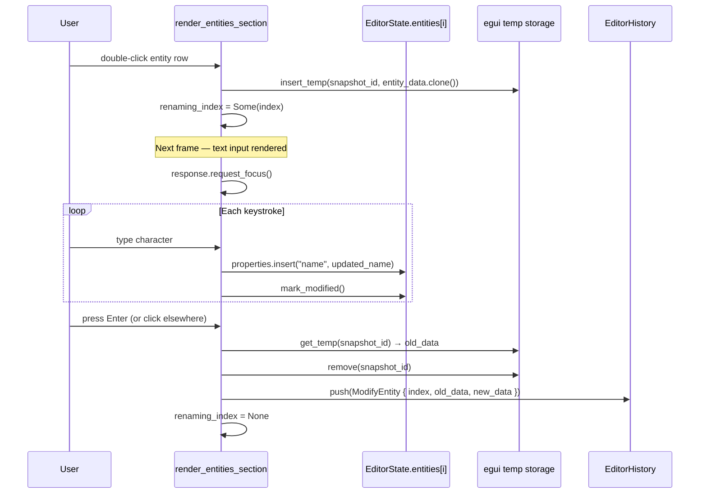
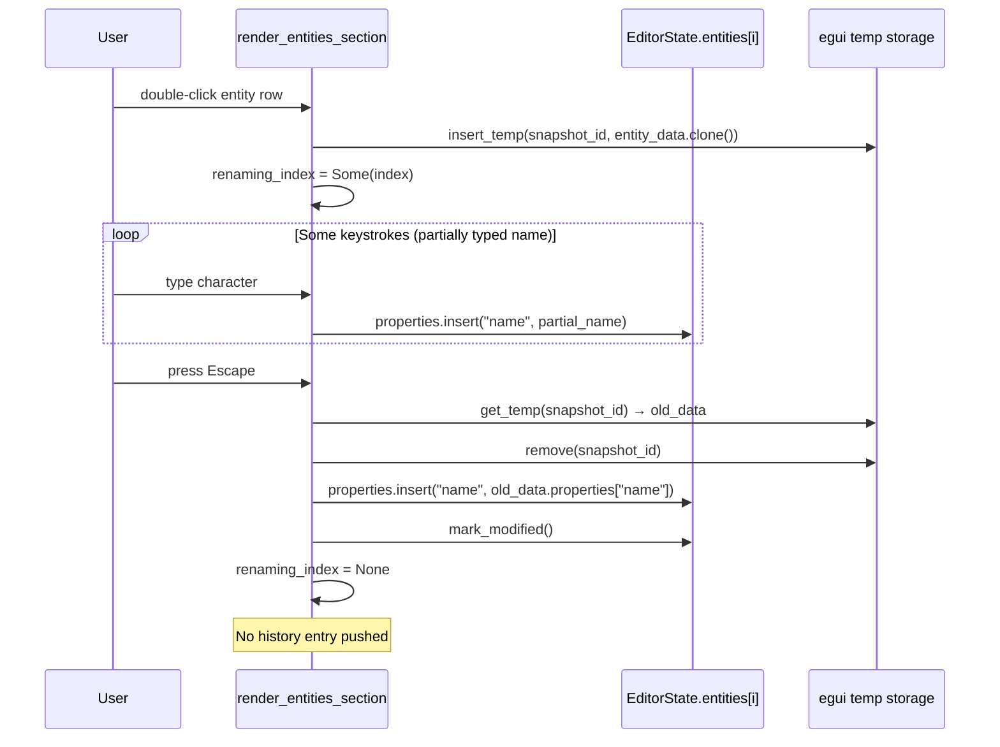

# Outliner Inline Rename — Architecture Reference

**Date:** 2026-04-08
**Repo:** `adrakestory`
**Runtime:** Bevy 0.18 + bevy_egui 0.39.1 (egui 0.33.3)
**Purpose:** Document the current Outliner architecture and define the target architecture for inline entity rename.

---

## Changelog

| Version | Date | Author | Summary |
|---------|------|--------|---------|
| **v1** | **2026-04-08** | **OpenCode** | **Initial draft — single-file change to `outliner.rs`; write-through + snapshot pattern; no new Bevy Resources** |
| **v2** | **2026-04-08** | **OpenCode** | **Added visual style requirement: icon-preserved layout, borderless TextEdit, row height stability; updated §2.1 design principles, §2.5 entity row diagram, Appendix C code template** |

---

## Table of Contents

1. [Current Architecture](#1-current-architecture)
   - [Module Structure](#11-module-structure)
   - [OutlinerState Resource](#12-outlinerstate-resource)
   - [Render Pipeline](#13-render-pipeline)
   - [Entity Row Rendering](#14-entity-row-rendering)
   - [Name Storage and Display](#15-name-storage-and-display)
2. [Target Architecture — Inline Rename](#2-target-architecture--inline-rename)
   - [Design Principles](#21-design-principles)
   - [New Components](#22-new-components)
   - [Modified Components](#23-modified-components)
   - [Rename State Flow](#24-rename-state-flow)
   - [Entity Row — Target Rendering](#25-entity-row--target-rendering)
   - [Class Diagram](#26-class-diagram)
   - [Sequence Diagram — Happy Path (Commit)](#27-sequence-diagram--happy-path-commit)
   - [Sequence Diagram — Cancel Path](#28-sequence-diagram--cancel-path)
   - [Phase Boundaries](#29-phase-boundaries)
3. [Appendices](#appendix-a--key-file-locations)
   - [Appendix A — Key File Locations](#appendix-a--key-file-locations)
   - [Appendix B — Open Questions & Decisions](#appendix-b--open-questions--decisions)
   - [Appendix C — Code Template: Rename Row](#appendix-c--code-template-rename-row)

---

## 1. Current Architecture

### 1.1 Module Structure



### 1.2 OutlinerState Resource

```rust
pub struct OutlinerState {
    pub voxels_expanded: bool,
    pub entities_expanded: bool,
    pub filter_text: String,
    pub voxel_type_expanded: HashMap<VoxelType, bool>,
}
```

`OutlinerState` is a Bevy `Resource`. It is passed by `&mut` reference into `render_outliner_panel`. It holds only UI expansion/filter state — no inline edit state exists today.

### 1.3 Render Pipeline



`render_outliner_panel` saves the panel width in egui `ctx.memory_mut` after rendering so the viewport overlay system can offset floating labels.

### 1.4 Entity Row Rendering

Current entity row logic inside `render_entities_section` (simplified):

```rust
for (index, entity_data) in editor_state.current_map.entities.iter().enumerate() {
    let type_name = format!("{:?}", entity_data.entity_type);
    let display_name = entity_data.properties.get("name")
        .cloned()
        .unwrap_or_else(|| type_name.clone()); // falls back to type name

    // skip if display_name and type_name both fail the filter

    ui.horizontal(|ui| {
        let label = format!("{} {}", icon, display_name);
        let response = ui.selectable_label(is_selected, label);

        if response.clicked() { /* toggle selection */ }
        if response.scroll_to_me_if(outliner_scroll_to == Some(index)) { ... }
        response.context_menu(|ui| { /* Delete option; "// Future: rename" comment */ });
        response.on_hover_text(...);
    });
}
```

The row is entirely read-only: `selectable_label` is not interactive for text input. There is no double-click handling.

### 1.5 Name Storage and Display

| Concern | Detail |
|---------|--------|
| Storage | `EntityData.properties.get("name")` — optional key in `HashMap<String, String>` |
| Absence | An absent key means "no name". The Outliner currently displays the entity type string as a fallback. The viewport label renderer shows nothing for absent names. |
| Write path | `entity_data.properties.insert("name".to_string(), value)` + `editor_state.mark_modified()` |
| Undo entry | `EditorAction::ModifyEntity { index, old_data: EntityData, new_data: EntityData }` — full entity clone on both sides |
| Canonical write pattern | `render_entity_name_field()` in `entity_props.rs` — write-through on `changed()`, snapshot on `gained_focus()`, history push on `lost_focus()`. See Coding Guardrail 12. |

---

## 2. Target Architecture — Inline Rename

### 2.1 Design Principles

1. **Single-file change** — the entire feature is implemented inside `src/editor/ui/outliner.rs`. No other files need modification.
2. **Reuse the canonical name pattern** — the write-through + egui temp-storage snapshot approach from `render_entity_name_field()` is replicated exactly, adapted for the outliner context (different snapshot key; Escape cancel path added).
3. **State lives in `OutlinerState`** — a single `renaming_index: Option<usize>` field is added. No new Bevy `Resource`, no `EditorState` changes.
4. **Zero per-frame cost when idle** — when `renaming_index` is `None`, the only additional work per row is one `Option<usize>` equality check.
5. **Full undo/redo without a new action type** — `EditorAction::ModifyEntity` already captures full before/after `EntityData` snapshots. No new variant is needed.
6. **Seamless visual continuity** — the rename row must look like the normal label row during editing: the entity type icon remains visible to the left (`ui.label(icon)` inside `ui.horizontal`), the `TextEdit` is borderless (`frame(false)`), fills the remaining row width (`desired_width(f32::INFINITY)`), and uses the default font size so the row height does not change.

### 2.2 New Components

No new Rust types or files are created. The only addition is one field on an existing struct.



### 2.3 Modified Components

| Component | File | Change |
|-----------|------|--------|
| `OutlinerState` | `src/editor/ui/outliner.rs` | Add `renaming_index: Option<usize>` field (default `None`). |
| `render_entities_section` | `src/editor/ui/outliner.rs` | Replace unconditional `selectable_label` with a branch: label when not renaming, text input when renaming. Add double-click handler. |

### 2.4 Rename State Flow



**Snapshot lifecycle:**

| Event | Action on egui temp storage |
|-------|-----------------------------|
| Enter rename mode (double-click) | `ui.data_mut(|d| d.insert_temp(snapshot_id, entity_data.clone()))` |
| First frame with text input (before focus) | `response.request_focus()` if snapshot was just inserted |
| `changed()` each keystroke | Write through to map; no temp storage change |
| `lost_focus()` / Enter commit | `get_temp` → compare → push history if changed; `remove` snapshot |
| Escape cancel | `get_temp` → restore name to map; `remove` snapshot |
| Entity deleted | `remove` snapshot (no restore) |

### 2.5 Entity Row — Target Rendering



### 2.6 Class Diagram



### 2.7 Sequence Diagram — Happy Path (Commit)



### 2.8 Sequence Diagram — Cancel Path



### 2.9 Phase Boundaries

| Capability | Phase | Architectural Impact |
|------------|-------|---------------------|
| Double-click inline rename, Enter/Escape/focus-lost | Phase 1 | `outliner.rs` only — add `renaming_index` field, branch entity row |
| "Rename" context menu item | Phase 2 | Extend context menu in `render_entities_section`; reuse the same rename entry path; call `response.scroll_to_me(None)` on the text input row to ensure it is visible |
| F2 shortcut to rename selected entity | Phase 2 | Handle in `outliner.rs` keyboard input block; reuse same rename entry path |
| Empty-name commit removes the `"name"` key | Phase 2 | Add one post-commit cleanup: `if new_name.is_empty() { properties.remove("name"); }` |

**Phase 1 MVP boundary:**

- ✅ `renaming_index: Option<usize>` in `OutlinerState`
- ✅ Double-click activation on non-PlayerSpawn rows
- ✅ Write-through on keystroke
- ✅ Commit on Enter / focus-lost with undo entry
- ✅ Escape cancel with name restoration
- ✅ Auto-focus text input on first frame
- ❌ Context menu "Rename" item (Phase 2)
- ❌ F2 shortcut (Phase 2)
- ❌ Empty-string → key removal (Phase 2)

---

## Appendix A — Key File Locations

| Component | Path |
|-----------|------|
| `OutlinerState` + `render_outliner_panel` | `src/editor/ui/outliner.rs` |
| `render_entity_name_field` (canonical pattern) | `src/editor/ui/properties/entity_props.rs` |
| `EntityData` + `EntityType` | `src/systems/game/map/format/entities.rs` |
| `EditorHistory` + `EditorAction` | `src/editor/history.rs` |
| `EditorState` + `current_map.entities` | `src/editor/state.rs` |
| Floating viewport labels | `src/editor/ui/viewport.rs` |
| Coding Guardrail 12 (write-through pattern) | `docs/developer-guide/coding-guardrails.md` |

---

## Appendix B — Open Questions & Decisions

### Resolved

| # | Question | Resolution |
|---|----------|------------|
| 1 | Should rename state live in `OutlinerState` or `EditorState`? | `OutlinerState` — it is UI-only state with no game-side meaning. |
| 2 | Should a new `EditorAction` variant be created for rename? | No — `ModifyEntity { index, old_data, new_data }` already stores full before/after snapshots and handles undo/redo correctly. |
| 3 | Should the snapshot key reuse `"entity_name_snapshot"` from the Properties panel? | No — use `"outliner_rename_snapshot"` to prevent collision when both panels are open simultaneously. |
| 4 | Should double-click on a `PlayerSpawn` row open rename mode? | No — `PlayerSpawn` has no name concept and no viewport label. Excluded per FR-3.1.2. |
| 5 | Should an empty-name commit store `""` or remove the `"name"` key? | **Remove the key.** Absence means "no name" — no empty string stored. Phase 1 stores `""` for simplicity; Phase 2 adds the cleanup: `if new_name.is_empty() { properties.remove("name"); }`. |
| 6 | Should the context menu "Rename" item (Phase 2) scroll the Outliner to the renaming row? | **Yes — scroll to the row.** The text input must be visible when rename mode is entered via the context menu. Use egui `response.scroll_to_me(None)` on the rename row's response after entering rename mode. |

### Open

*No open questions remain.*

---

## Appendix C — Code Template: Rename Row

The following is the target implementation of the entity row branch inside `render_entities_section`. It follows the write-through + snapshot pattern from `render_entity_name_field()` with two additions: (1) Escape cancel, and (2) double-click entry.

```rust
let snapshot_id = egui::Id::new("outliner_rename_snapshot").with(index);

if outliner_state.renaming_index == Some(index) {
    // --- Rename mode ---
    let current_name = editor_state.current_map.entities[index]
        .properties
        .get("name")
        .cloned()
        .unwrap_or_default();
    let mut name = current_name.clone();

    let response = ui.horizontal(|ui| {
        ui.label(icon);  // icon stays visible during rename
        egui::TextEdit::singleline(&mut name)
            .frame(false)               // no border — seamless with normal row
            .desired_width(f32::INFINITY) // fill remaining row width
            .show(ui)
            .response
    }).inner;

    // First frame: request focus (snapshot was saved at double-click time)
    // response comes from TextEdit::singleline().show(ui).response above
    let is_first_frame = ui.data_mut(|d| d.get_temp::<bool>(snapshot_id)).is_none();
    if is_first_frame {
        ui.data_mut(|d| d.insert_temp(snapshot_id, true)); // mark "focused"
        response.request_focus();
    }

    if response.changed() {
        // Write-through: next frame reads updated value (Guardrail 12)
        editor_state.current_map.entities[index]
            .properties
            .insert("name".to_string(), name.clone());
        editor_state.mark_modified();
    }

    let escape_pressed = ui.input(|i| i.key_pressed(egui::Key::Escape));

    if escape_pressed {
        // Cancel: restore from rename-entry snapshot
        let cancel_id = egui::Id::new("outliner_rename_cancel_snapshot").with(index);
        let old_data: Option<EntityData> = ui.data_mut(|d| d.get_temp(cancel_id));
        ui.data_mut(|d| d.remove::<EntityData>(cancel_id));
        ui.data_mut(|d| d.remove::<bool>(snapshot_id));
        if let Some(old) = old_data {
            let old_name = old.properties.get("name").cloned().unwrap_or_default();
            editor_state.current_map.entities[index]
                .properties
                .insert("name".to_string(), old_name);
            editor_state.mark_modified();
        }
        outliner_state.renaming_index = None;
    } else if response.lost_focus() {
        // Commit: push one undo entry if name changed
        let cancel_id = egui::Id::new("outliner_rename_cancel_snapshot").with(index);
        let old_data: Option<EntityData> = ui.data_mut(|d| d.get_temp(cancel_id));
        ui.data_mut(|d| d.remove::<EntityData>(cancel_id));
        ui.data_mut(|d| d.remove::<bool>(snapshot_id));
        if let Some(old_data) = old_data {
            let old_name = old_data.properties.get("name").map(String::as_str).unwrap_or("");
            let new_name = editor_state.current_map.entities[index]
                .properties.get("name").map(String::as_str).unwrap_or("");
            if old_name != new_name {
                let new_data = editor_state.current_map.entities[index].clone();
                history.push(EditorAction::ModifyEntity { index, old_data, new_data });
            }
        }
        outliner_state.renaming_index = None;
    }

} else {
    // --- Normal mode ---
    let response = ui.selectable_label(is_selected, &label);

    if response.clicked() { /* existing selection logic */ }
    if response.double_clicked()
        && entity_data.entity_type != EntityType::PlayerSpawn
    {
        // Save cancel snapshot at entry time (not at gained_focus)
        let cancel_id = egui::Id::new("outliner_rename_cancel_snapshot").with(index);
        ui.data_mut(|d| d.insert_temp(cancel_id, entity_data.clone()));
        outliner_state.renaming_index = Some(index);
    }
    // ... existing context menu, hover, scroll logic unchanged
}
```

> **Note:** Two separate snapshot IDs are used: `"outliner_rename_snapshot"` tracks whether focus has been requested (first-frame flag), and `"outliner_rename_cancel_snapshot"` stores the `EntityData` for cancel/commit comparison. This mirrors the pattern in `entity_props.rs` but keeps the first-frame detection clean.

---

*Created: 2026-04-08 — See [Changelog](#changelog) for version history.*
*Companion documents: [Ticket](./ticket.md) | [Requirements](./requirements.md)*
