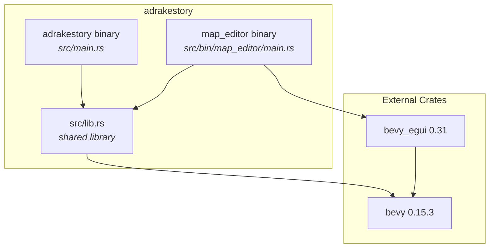
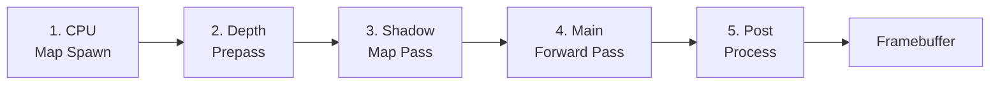
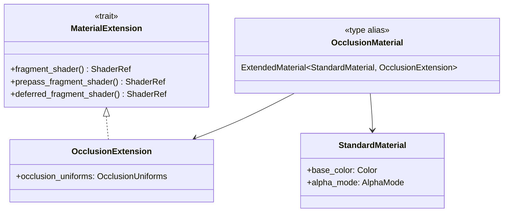
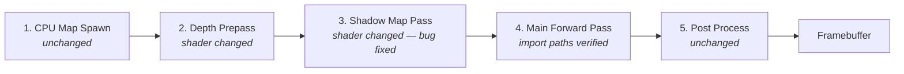
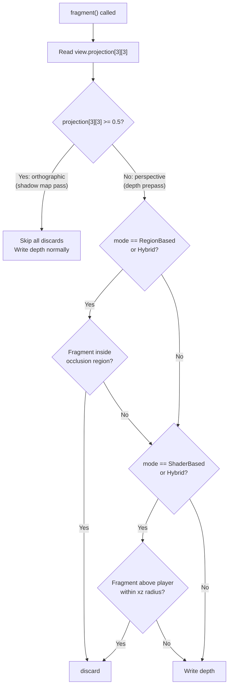
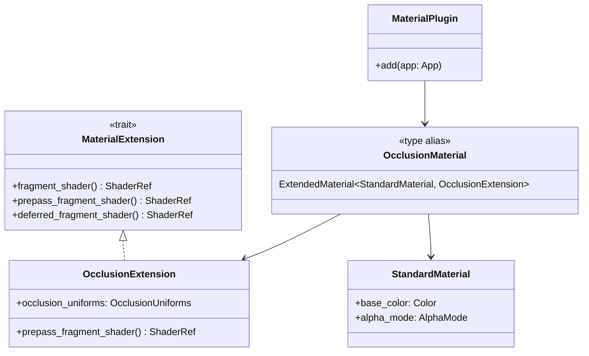
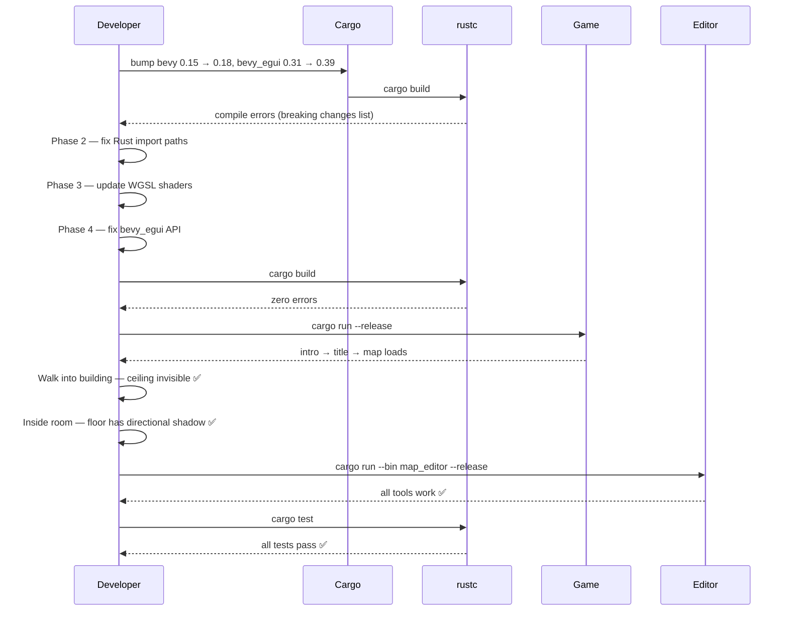

# Bevy 0.15 → 0.18 Migration — Architecture Reference

**Date:** 2026-03-21
**Repo:** `adrakestory` (local/GitHub)
**Runtime:** Bevy 0.15.3 → 0.18.1 (Rust game engine, ECS/WGPU)
**Purpose:** Migrate the A Drake's Story game and map editor from Bevy 0.15.3 to Bevy 0.18.1, including bevy_egui 0.31 → 0.39 and a prepass shader fix that unblocks directional-light shadow casting through occlusion materials.

---

## Changelog

| Version | Date | Author | Summary |
|---------|------|--------|---------|
| **v1** | **2026-03-21** | **Developer** | **Initial draft** |
| v2 | 2026-03-21 | Developer | Codebase validation pass — corrected `RenderTarget` (not used in 0.15 code, no migration needed); corrected `DEPTH_CLAMP_ORTHO` (not present in any shader, no removal needed); confirmed `weak_from_u128()` not used; confirmed `NotShadowCaster` also imported in `occlusion/mod.rs` |

---

## Table of Contents

1. Current Architecture
   - 1.1 Solution Structure
   - 1.2 Pipeline Overview
   - 1.3 Pipeline Steps — Detail
   - 1.4 Extension Architecture
   - 1.5 Rendering Pass Routing
   - 1.6 Data Flow
2. Target Architecture — Bevy 0.18 Migration
   - 2.1 Design Principles
   - 2.2 New Components
   - 2.3 Modified Components
   - 2.4 Pipeline Flow
   - 2.5 Internal Flow — Prepass Shader Change
   - 2.6 Class Diagram
   - 2.7 Sequence Diagram — Happy Path
   - 2.8 Error / Breaking Change Flow
   - 2.9 Configuration
   - 2.10 Phase Boundaries
3. Appendices
   - Appendix A — Data Schema (Dependency Versions)
   - Appendix B — Open Questions & Decisions
   - Appendix C — Key File Locations
   - Appendix D — Code Templates

---

## 1. Current Architecture

The game runs on Bevy 0.15.3 with bevy_egui 0.31. Two binaries share a common library:

- `src/main.rs` — game binary
- `src/bin/map_editor/main.rs` — standalone map editor binary
- `src/lib.rs` — shared code (systems, components, occlusion, map format)

### 1.1 Solution Structure



### 1.2 Pipeline Overview



Key rendering path (Bevy 0.15):

```
DefaultPlugins (Bevy 0.15)
  └─ MaterialPlugin::<OcclusionMaterial>::default()
       └─ ExtendedMaterial<StandardMaterial, OcclusionExtension>
            ├─ fragment: occlusion_material.wgsl
            ├─ prepass: occlusion_material_prepass.wgsl
            └─ deferred: occlusion_material.wgsl (PREPASS_PIPELINE)
```

### 1.3 Pipeline Steps — Detail

| # | Step | File | Purpose |
|---|------|------|---------|
| 1 | CPU Map Spawn | `spawner/mod.rs`, `spawner/chunks.rs` | Load RON map, build chunk meshes, assign `OcclusionMaterial` handles |
| 2 | Depth Prepass | `occlusion_material_prepass.wgsl` | Writes depth buffer; occlusion discards fire here (player camera only — bug in 0.15) |
| 3 | Shadow Map Pass | `occlusion_material_prepass.wgsl` | Directional light shadow map; shares prepass shader — discards incorrectly fire here too (bug) |
| 4 | Main Forward Pass | `occlusion_material.wgsl` | PBR shading + dithered transparency for occluded geometry |
| 5 | Post Process | Bevy built-in | Bloom, tonemapping (not customised) |

### 1.4 Extension Architecture



`OcclusionExtension` is defined in `src/systems/game/occlusion/mod.rs`. The `#[uniform(100)]` binding places `OcclusionUniforms` at `@group(2) @binding(100)` in all shader stages.

### 1.5 Rendering Pass Routing

Bevy 0.15 routes a mesh through render phases based on its material and render pipeline flags:

| Phase | Camera / View | Shader invoked | Notes |
|-------|--------------|----------------|-------|
| Depth prepass | Player `Camera3d` | `occlusion_material_prepass.wgsl` | `perspective` projection |
| Shadow map | `DirectionalLight` shadow view | `occlusion_material_prepass.wgsl` | `orthographic` projection — discards incorrectly fire |
| Main forward | Player `Camera3d` | `occlusion_material.wgsl` | Full PBR + dither |

The shadow-map bug: the prepass shader runs for both the player camera depth pass and the shadow-map pass but has no way to distinguish them. Discards fire in both passes, punching holes in the shadow map.

### 1.6 Data Flow

```
CPU (Rust)
  ├─ OcclusionUniforms written each frame via update_occlusion_material()
  └─ Chunk meshes uploaded once at spawn

GPU Pass 1 — Depth Prepass (player camera, perspective)
  └─ occlusion_material_prepass.wgsl → depth buffer written, occluded pixels discarded

GPU Pass 2 — Shadow Map (directional light, orthographic)
  └─ occlusion_material_prepass.wgsl → [BUG] occluded pixels also discarded here

GPU Pass 3 — Main Forward Pass
  └─ occlusion_material.wgsl → PBR + dither → colour attachment

GPU Pass 4 — Post Process
  └─ Bevy tonemapping / bloom → final framebuffer → display
```

---

## 2. Target Architecture — Bevy 0.18 Migration

### 2.1 Design Principles

1. **Compile-error-driven** — bump versions, let the compiler enumerate every breaking change; fix in order.
2. **Minimal surface area** — prefer re-exported paths (`bevy::prelude`, `bevy::pbr`) over direct sub-crate imports.
3. **Shader-version-agnostic fix** — use `view.projection[3][3]` (ortho vs. perspective math) rather than Bevy-specific shader defines like `DEPTH_CLAMP_ORTHO` that change between versions.
4. **No behavioural regressions** — occlusion transparency, shadow casting, editor undo/redo, hot reload must all work identically after migration.
5. **Phase-by-phase** — each phase leaves the codebase in a compilable state before the next begins.

### 2.2 New Components

| Component / Type | Crate | Purpose | Introduced in |
|-----------------|-------|---------|---------------|
| `bevy::camera` module | `bevy_camera` | Re-export path for `Camera3d`, `Camera2d` | Bevy 0.16 → 0.17 |
| `bevy::light` module | `bevy_light` | Re-export path for `DirectionalLight`, `AmbientLight`, `NotShadowCaster` | Bevy 0.16 → 0.17 |

> **Note (codebase validation):** `RenderTarget` as a standalone required component was listed here in v1. Codebase review confirmed that `src/systems/game/map/spawner/mod.rs` and `src/bin/map_editor/setup.rs` already use `Camera3d::default()` — the pattern that is forward-compatible with 0.18. No camera spawn changes are required.

### 2.3 Modified Components

| Component / API | 0.15 form | 0.18 form | Impact |
|----------------|-----------|-----------|--------|
| `MaterialPlugin` fields | `prepass_enabled`, `shadows_enabled` struct fields | Methods on `Material`/`MaterialExtension` trait | Medium — verify current `.default()` usage compiles |
| `Handle::Weak` | `Handle::Weak(id)` | `Handle::Uuid(id)` | Low — audit only |
| `Camera.target` field | N/A — not used in this codebase | N/A | **None** — code already uses `Camera3d::default()` (verified) |
| `weak_handle!` / `weak_from_u128()` | N/A — not used in this codebase | N/A | **None** — not present in codebase (verified) |
| `DEPTH_CLAMP_ORTHO` | N/A — not present in any `.wgsl` file | N/A | **None** — not in codebase (verified); shadow fix uses `view.projection[3][3]` |
| `NotShadowCaster` import path | `bevy::pbr::NotShadowCaster` | Verify path in 0.18 | Low — used in 3 files: `shadow_quality.rs`, `chunks.rs`, `occlusion/mod.rs` |
| `#[require(A(closure))]` | Closure syntax | `#[require(A = expr)]` | Low — audit derives |

### 2.4 Pipeline Flow



Changed steps:
- **Step 2 & 3** — `occlusion_material_prepass.wgsl` gains `view` uniform import and projection check; no existing define references need removal (verified: `DEPTH_CLAMP_ORTHO` is not present in the current shader).
- **Step 4** — `occlusion_material.wgsl` import paths verified/updated for `bevy_pbr` 0.18 module layout.

### 2.5 Internal Flow — Prepass Shader Change



### 2.6 Class Diagram



`OcclusionExtension` is unchanged in structure; only the shader it references changes.

### 2.7 Sequence Diagram — Happy Path



### 2.8 Error / Breaking Change Flow

Compile errors from the version bump act as the migration checklist:

```
cargo build (after version bump)
  │
  ├─ E[unresolved import] bevy::render::...
  │     └─ Fix: update to bevy::camera / bevy::light / bevy::mesh as appropriate
  │
  ├─ E[no field `target` on `Camera`]
  │     └─ Fix: spawn RenderTarget as separate component (Section 2.3 / Phase 2.2)
  │
  ├─ E[no field `prepass_enabled` on `MaterialPlugin`]
  │     └─ Fix: verify default() still works; if not, implement trait method (Phase 2.3)
  │
  ├─ E[shader import not found: DEPTH_CLAMP_ORTHO]
  │     └─ Fix: replace with projection[3][3] check (Phase 3.2)
  │
  ├─ E[unresolved import bevy_pbr::...]
  │     └─ Fix: search 0.18 source for new path (Phase 3.1)
  │
  └─ E[bevy_egui API changes]
        └─ Fix: consult bevy_egui CHANGELOG 0.31→0.39 (Phase 4)
```

### 2.9 Configuration

**`Cargo.toml` changes (Phase 1):**

```toml
# Before
bevy = { version = "0.15", features = ["bevy_gltf"] }
bevy_egui = "0.31"

# After
bevy = { version = "0.18", features = ["bevy_gltf"] }
bevy_egui = "0.39"
```

**Target prepass shader (`assets/shaders/occlusion_material_prepass.wgsl`):**

```wgsl
#import bevy_pbr::prepass_io::VertexOutput
#import bevy_render::view::View

@group(0) @binding(0) var<uniform> view: View;
@group(2) @binding(100) var<uniform> occlusion: OcclusionUniforms;

@fragment
fn fragment(in: VertexOutput) {
    let world_pos = in.world_position.xyz;

    // projection[3][3] == 1.0 → orthographic (shadow map pass) → skip discards
    // projection[3][3] == 0.0 → perspective (depth prepass)    → apply discards
    let is_shadow_pass = view.projection[3][3] >= 0.5;

    if !is_shadow_pass {
        if occlusion.mode == 2u || occlusion.mode == 3u {
            let rel = world_pos - occlusion.region_min;
            let size = occlusion.region_max - occlusion.region_min;
            if all(rel >= vec3<f32>(0.0)) && all(rel <= size) { discard; }
        }
        if (occlusion.mode == 1u || occlusion.mode == 3u) && occlusion.technique == 0u {
            if world_pos.y > occlusion.player_position.y + occlusion.height_threshold {
                let xz_offset = world_pos.xz - occlusion.player_position.xz;
                let xz_dist_sq = dot(xz_offset, xz_offset);
                let xz_margin = occlusion.occlusion_radius * 1.2;
                if xz_dist_sq <= xz_margin * xz_margin { discard; }
            }
        }
    }
}
```

### 2.10 Phase Boundaries

| Phase | Name | Completion Criteria | Risk |
|-------|------|---------------------|------|
| 1 | Dependency Update | `Cargo.toml` bumped; `cargo build` produces compile errors (not panics) | Low |
| 2 | Rust Code Migration | `cargo build` succeeds; no import errors; camera spawns compile | Medium |
| 3 | WGSL Shader Migration | Shaders compile; no WGPU validation errors at runtime | High |
| 4 | bevy_egui Migration | Map editor starts; all editor tools functional | Medium |
| 5 | Validation | All test cases in validation table pass; no performance regression | Low |

---

## 2. Breaking Changes by Version

### 2.1 Bevy 0.15 → 0.16

| Change | Impact | Files |
|--------|--------|-------|
| `Handle::weak_from_u128()` deprecated → `weak_handle!` macro | Low | Audit codebase |
| `#[require(A(closure))]` syntax changed to `#[require(A = expr)]` | Low | Audit derives |
| Various ECS error type changes | None (not used) | — |

### 2.2 Bevy 0.16 → 0.17 ⚠️ MAJOR

| Change | Impact | Files |
|--------|--------|-------|
| **`bevy_render` reorganization** — types moved to new crates | **High** | All source files |
| Camera types → `bevy_camera` (re-exported via `bevy::camera` and `bevy::prelude`) | Medium | `spawner/mod.rs`, `setup.rs` |
| Light types → `bevy_light` (re-exported via `bevy::pbr` and `bevy::light`) | Medium | `lighting.rs`, `spawner/mod.rs`, `shadow_quality.rs`, `chunks.rs` |
| `NotShadowCaster`, `NotShadowReceiver` → `bevy_light` | Medium | `shadow_quality.rs`, `chunks.rs` |
| Mesh types → `bevy_mesh` (re-exported via `bevy::mesh`) | Low | `mesh_builder.rs` |
| `Handle::Weak` → `Handle::Uuid`; `weak_handle!` → `uuid_handle!` macro | Low | Audit codebase |
| `Event` trait split into `Message` + `Event` | Low (may not affect) | Audit event usage |
| Many system sets renamed to `*Systems` convention | Low (internal Bevy sets) | `main.rs` ordering |
| `bevy_core_pipeline` post-processing moved to `bevy_anti_alias`, `bevy_post_process` | None | Not used |

### 2.3 Bevy 0.17 → 0.18

| Change | Impact | Files |
|--------|--------|-------|
| **`enable_prepass` / `enable_shadows` moved from `MaterialPlugin` fields to `Material` methods** | **Medium** | `occlusion/mod.rs` |
| `RenderTarget` is now a separate required component (not `Camera.target`) | Medium | Camera spawns |
| `DEPTH_CLAMP_ORTHO` shader define renamed/changed | **Critical** | `occlusion_material_prepass.wgsl` |
| `BevyManifest::shared` now scope-based | None | Not used |
| Per-`RenderPhase` draw functions | None | Not using low-level API |

---

## 3. Migration Plan by Phase

### Phase 1 — Dependency Update

**`Cargo.toml` changes:**

```toml
# Before
bevy = { version = "0.15", features = ["bevy_gltf"] }
bevy_egui = "0.31"

# After
bevy = { version = "0.18", features = ["bevy_gltf"] }
bevy_egui = "0.39"
```

Run `cargo build` and collect all compile errors. Use errors as a migration checklist.

---

### Phase 2 — Rust Code Migration

#### 2.1 Import Path Updates (`bevy_render` reorganization, 0.16→0.17)

Most types remain accessible through their original `bevy::prelude` or `bevy::pbr` re-exports. Verify at compile time; only update what breaks.

Expected path changes (if re-exports are removed):

| Type | 0.15 path | 0.18 path |
|------|-----------|-----------|
| `DirectionalLight` | `bevy::pbr` | `bevy::light` or `bevy::pbr` |
| `AmbientLight` | `bevy::pbr` | `bevy::light` or `bevy::pbr` |
| `NotShadowCaster` | `bevy::pbr` | `bevy::light` or `bevy::pbr` |
| `CascadeShadowConfigBuilder` | `bevy::pbr` | `bevy::light` or `bevy::pbr` |
| `Camera3d`, `Camera2d` | `bevy::core_pipeline` | `bevy::camera` or prelude |
| `Mesh`, `Mesh3d` | `bevy::render::mesh` | `bevy::mesh` |

#### 2.2 Camera Spawn — `RenderTarget` Component (0.17→0.18)

The `Camera.target` field was removed. `RenderTarget` is now a required component:

```rust
// Before (0.15)
commands.spawn((
    Camera3d::default(),
    Camera { target: RenderTarget::Image(handle), ..default() },
));

// After (0.18)
commands.spawn((
    Camera3d::default(),
    RenderTarget::Image(handle),
));
```

If the camera uses the default window target, no change is needed (default is implicit).

Affected files: `spawner/mod.rs` (game camera), `map_editor/setup.rs` (editor camera).

#### 2.3 OcclusionMaterial Plugin — Method Migration (0.17→0.18)

`MaterialPlugin` fields `prepass_enabled` and `shadows_enabled` were replaced by trait methods. Check if the current registration sets either:

```rust
// Before (0.15) — if currently using field syntax
MaterialPlugin::<OcclusionMaterial> {
    prepass_enabled: true,
    shadows_enabled: true,
    ..default()
}

// After (0.18) — methods on the Material/MaterialExtension trait
// (default impl returns true for both, so if not overriding, no change needed)
app.add_plugins(MaterialPlugin::<OcclusionMaterial>::default())
```

Current code already uses `MaterialPlugin::<OcclusionMaterial>::default()` (line 564 in `occlusion/mod.rs`), so this may require no change. Verify at compile time.

#### 2.4 DirectionalLight Field Verification

```rust
// Verify these fields still exist in 0.18:
DirectionalLight {
    illuminance: 50000.0,   // may be renamed; check 0.18 docs
    shadows_enabled: true,  // verify field name unchanged
    ..default()
}
```

#### 2.5 `CascadeShadowConfigBuilder` Verification

```rust
CascadeShadowConfigBuilder {
    num_cascades: 4,        // verify field name
    maximum_distance: 100.0, // verify field name
    ..default()
}.build()
```

#### 2.6 `AmbientLight` Verification

```rust
AmbientLight {
    brightness: 0.4,  // verify field name in 0.18
    ..default()
}
```

---

### Phase 3 — WGSL Shader Migration

#### 3.1 Verify `occlusion_material.wgsl` Imports

Test each import path; replace with 0.18 equivalents if any have moved:

```wgsl
// Current imports — verify each still resolves in 0.18
#import bevy_pbr::pbr_fragment::pbr_input_from_standard_material
#import bevy_pbr::pbr_functions::alpha_discard
#import bevy_pbr::prepass_io::{VertexOutput, FragmentOutput}
#import bevy_pbr::pbr_deferred_functions::deferred_output
#import bevy_pbr::forward_io::{VertexOutput, FragmentOutput}
#import bevy_pbr::pbr_functions::{apply_pbr_lighting, main_pass_post_lighting_processing}
```

If any path fails, search Bevy 0.18 source at `crates/bevy_pbr/src/` for the new module path.

#### 3.2 Implement Occlusion Shadow Fix in `occlusion_material_prepass.wgsl`

This is the combined 0.18 compatibility fix + shadow casting bug fix. Replace the current `DEPTH_CLAMP_ORTHO` pattern with the projection matrix check:

**Current prepass shader structure (0.15):**
```wgsl
#import bevy_pbr::prepass_io::VertexOutput

@group(2) @binding(100) var<uniform> occlusion: OcclusionUniforms;

@fragment
fn fragment(in: VertexOutput) {
    let world_pos = in.world_position.xyz;
    // discards run unconditionally for all passes — BUG
    ...discard logic...
}
```

**Target prepass shader structure (0.18):**
```wgsl
#import bevy_pbr::prepass_io::VertexOutput
#import bevy_render::view::View

@group(0) @binding(0) var<uniform> view: View;
@group(2) @binding(100) var<uniform> occlusion: OcclusionUniforms;

@fragment
fn fragment(in: VertexOutput) {
    let world_pos = in.world_position.xyz;

    // projection[3][3]:
    //   1.0 = orthographic  → directional light shadow pass  → skip discards
    //   0.0 = perspective   → player camera depth prepass    → apply discards
    //
    // Directional light shadow maps use orthographic projection; the player camera
    // uses perspective. This check is Bevy-version-agnostic (pure GLSL/WGSL math).
    //
    // NOTE: Point/spot light shadow passes also use perspective, so discards fire
    // for those too. Acceptable — both have shadows_enabled: false in current maps.
    // If enabled in future, use NotShadowCaster per-chunk (Option D) as complement.
    let is_shadow_pass = view.projection[3][3] >= 0.5;

    if !is_shadow_pass {
        // Block 1 — region-based discard (mode 2 = RegionBased, mode 3 = Hybrid)
        if occlusion.mode == 2u || occlusion.mode == 3u {
            let rel = world_pos - occlusion.region_min;
            let size = occlusion.region_max - occlusion.region_min;
            if all(rel >= vec3<f32>(0.0)) && all(rel <= size) { discard; }
        }

        // Block 2 — height-based discard (mode 1 = ShaderBased, mode 3 = Hybrid)
        if (occlusion.mode == 1u || occlusion.mode == 3u) && occlusion.technique == 0u {
            if world_pos.y > occlusion.player_position.y + occlusion.height_threshold {
                let xz_offset = world_pos.xz - occlusion.player_position.xz;
                let xz_dist_sq = dot(xz_offset, xz_offset);
                let xz_margin = occlusion.occlusion_radius * 1.2;
                if xz_dist_sq <= xz_margin * xz_margin { discard; }
            }
        }
    }
}
```

---

### Phase 4 — bevy_egui 0.31 → 0.39 Migration

bevy_egui 0.39 is the version compatible with Bevy 0.18. The API surface used in this project is:

| Usage | Expected change |
|-------|----------------|
| `EguiPlugin` registration | Verify `app.add_plugins(EguiPlugin::default())` |
| `EguiContexts` system param | Verify still `ResMut<EguiContexts>` or similar |
| `egui_context.ctx_mut()` / `ctx()` | Verify method names unchanged |
| `egui::Window::new(...)` etc. | Pure egui — no Bevy changes |

Run the map editor and exercise all tools. Consult `https://github.com/mvlabat/bevy_egui/blob/main/CHANGELOG.md` for changes between 0.31 and 0.39.

---

### Phase 5 — Validation

| Test | Expected Result |
|------|----------------|
| `cargo build` | Zero errors, zero deprecation warnings |
| `cargo test` | All tests pass |
| `cargo run --release` | Game starts, intro → title → map loads |
| `cargo run --bin map_editor --release` | Editor starts, all tools work |
| Walk into building | Ceiling voxels invisible, floor visible |
| Inside occluded room | Floor receives directional shadow from ceiling ✅ |
| FPS counter (`F3`) | Comparable frame time to 0.15 baseline |
| Gamepad + keyboard | Input functions correctly |
| Hot reload (`F5`) | Map reloads, player position preserved |

---

## 4. Risk Assessment

| Risk | Likelihood | Impact | Mitigation |
|------|-----------|--------|------------|
| `bevy_pbr` shader import paths renamed | High | High | Check 0.18 source; update paths |
| `EguiContexts` API changed in bevy_egui 0.39 | Medium | High | Consult CHANGELOG; fix per-file |
| `DirectionalLight`/`AmbientLight` field renames | Medium | Medium | Compile errors will pinpoint |
| `AlphaMode::AlphaToCoverage` removed or renamed | Low | Medium | Check 0.18 source |
| `ExtendedMaterial` / `AsBindGroup` API changed | Low | High | Test with minimal example first |
| Performance regression from 0.18 pipeline changes | Low | Medium | Benchmark before/after |

---

## Appendix A — Data Schema (Dependency Versions)

| Dependency | Version (0.15 baseline) | Version (0.18 target) | Notes |
|------------|------------------------|-----------------------|-------|
| `bevy` | `0.15.3` | `0.18.1` | Core engine |
| `bevy_egui` | `0.31` | `0.39` | Editor UI |
| `bevy_pbr` (transitive) | bundled with bevy 0.15 | bundled with bevy 0.18 | Shader paths may change |
| `bevy_render` (transitive) | bundled with bevy 0.15 | bundled with bevy 0.18 | Crate reorganised in 0.17 |
| Rust toolchain | stable (nightly not required) | stable | Verify MSRV in bevy 0.18 release notes |

---

## Appendix B — Open Questions & Decisions

### Resolved

| # | Question | Decision |
|---|----------|----------|
| B-1 | How to detect shadow pass vs. depth prepass in WGSL without Bevy-version-specific defines? | Use `view.projection[3][3]`: orthographic (≥ 0.5) = shadow pass, perspective (≈ 0.0) = depth prepass. Version-agnostic pure math. |
| B-2 | Should `OcclusionMaterial` registration use field syntax or `default()`? | Current code uses `MaterialPlugin::<OcclusionMaterial>::default()`. Fields were removed in 0.18; default() is correct. |

### Open

| # | Question | Owner | Status |
|---|----------|-------|--------|
| B-3 | Do `DirectionalLight.illuminance` and `DirectionalLight.shadows_enabled` still exist by the same names in 0.18? | Developer | Verify at compile time |
| B-4 | Does `CascadeShadowConfigBuilder` retain `num_cascades` and `maximum_distance` field names in 0.18? | Developer | Verify at compile time |
| B-5 | Does bevy_egui 0.39 change `EguiContexts` system parameter signature? | Developer | Consult CHANGELOG |
| B-6 | Are point/spot light shadow passes a concern if `NotShadowCaster` is not set? | Developer | Low risk — currently disabled in maps; document for future |

---

## Appendix C — Key File Locations

| File | Migration work | Risk |
|------|---------------|------|
| `Cargo.toml` | Version bump | Low |
| `assets/shaders/occlusion_material_prepass.wgsl` | View import + projection check + remove old define | Medium |
| `assets/shaders/occlusion_material.wgsl` | Verify/update import paths | Medium |
| `src/systems/game/occlusion/mod.rs` | Verify MaterialExtension/MaterialPlugin API | Medium |
| `src/systems/game/map/spawner/mod.rs` | Light field names, CascadeShadowConfig, RenderTarget | Medium |
| `src/bin/map_editor/lighting.rs` | Light field names, CascadeShadowConfig | Low |
| `src/bin/map_editor/setup.rs` | Camera spawn, RenderTarget, light fields | Low |
| `src/systems/game/map/spawner/shadow_quality.rs` | NotShadowCaster import path | Low |
| `src/systems/game/map/spawner/chunks.rs` | NotShadowCaster import path | Low |
| All `src/editor/**` (25+ files) | bevy_egui 0.39 API | Medium |
| `src/main.rs` | Verify no deprecated API, system set names | Low |

---

## Appendix D — Code Templates

### D.1 Cargo.toml

```toml
# After migration
bevy = { version = "0.18", features = ["bevy_gltf"] }
bevy_egui = "0.39"
```

### D.2 Prepass Shader (full template)

```wgsl
#import bevy_pbr::prepass_io::VertexOutput
#import bevy_render::view::View

struct OcclusionUniforms {
    player_position: vec3<f32>,
    mode: u32,
    region_min: vec3<f32>,
    technique: u32,
    region_max: vec3<f32>,
    height_threshold: f32,
    occlusion_radius: f32,
    _pad0: f32,
    _pad1: f32,
    _pad2: f32,
}

@group(0) @binding(0) var<uniform> view: View;
@group(2) @binding(100) var<uniform> occlusion: OcclusionUniforms;

@fragment
fn fragment(in: VertexOutput) {
    let world_pos = in.world_position.xyz;
    let is_shadow_pass = view.projection[3][3] >= 0.5;

    if !is_shadow_pass {
        if occlusion.mode == 2u || occlusion.mode == 3u {
            let rel = world_pos - occlusion.region_min;
            let size = occlusion.region_max - occlusion.region_min;
            if all(rel >= vec3<f32>(0.0)) && all(rel <= size) { discard; }
        }
        if (occlusion.mode == 1u || occlusion.mode == 3u) && occlusion.technique == 0u {
            if world_pos.y > occlusion.player_position.y + occlusion.height_threshold {
                let xz_offset = world_pos.xz - occlusion.player_position.xz;
                let xz_dist_sq = dot(xz_offset, xz_offset);
                let xz_margin = occlusion.occlusion_radius * 1.2;
                if xz_dist_sq <= xz_margin * xz_margin { discard; }
            }
        }
    }
}
```

### D.3 Camera Spawn — RenderTarget (0.18)

```rust
// Default window target (no RenderTarget component needed):
commands.spawn((Camera3d::default(), Camera::default()));

// Custom render target (e.g., render to texture):
commands.spawn((
    Camera3d::default(),
    RenderTarget::Image(handle),
));
```

### D.4 Migration Guide References

- Bevy 0.15 → 0.16: `https://bevyengine.org/learn/migration-guides/0-15-to-0-16/`
- Bevy 0.16 → 0.17: `https://bevyengine.org/learn/migration-guides/0-16-to-0-17/`
- Bevy 0.17 → 0.18: `https://bevyengine.org/learn/migration-guides/0-17-to-0-18/`
- bevy_egui CHANGELOG: `https://github.com/mvlabat/bevy_egui/blob/main/CHANGELOG.md`
- Shadow casting fix: `docs/bugs/fix-occlusion-shadow-casting/references/architecture.md`

---

*Created: 2026-03-21*
*Companion documents: `docs/features/upgrade-bevy-0-18/requirements.md` · `docs/bugs/fix-occlusion-shadow-casting/references/architecture.md`*
