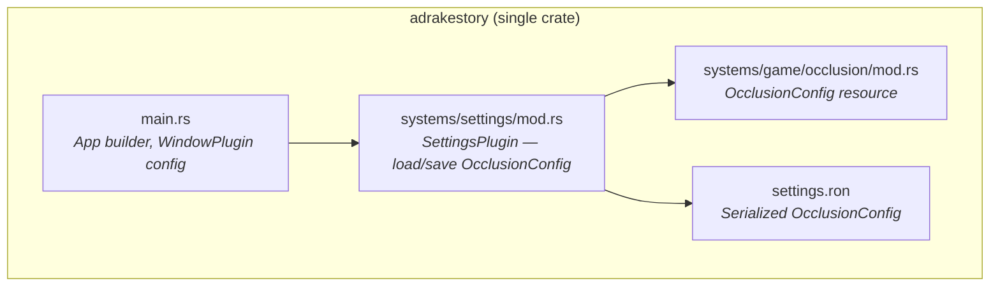
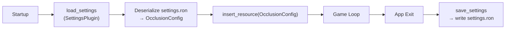
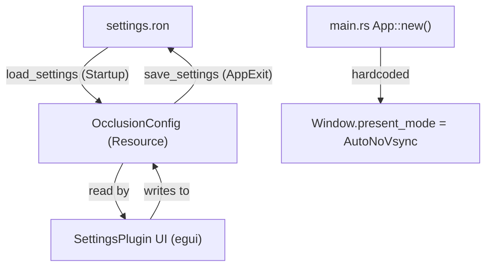
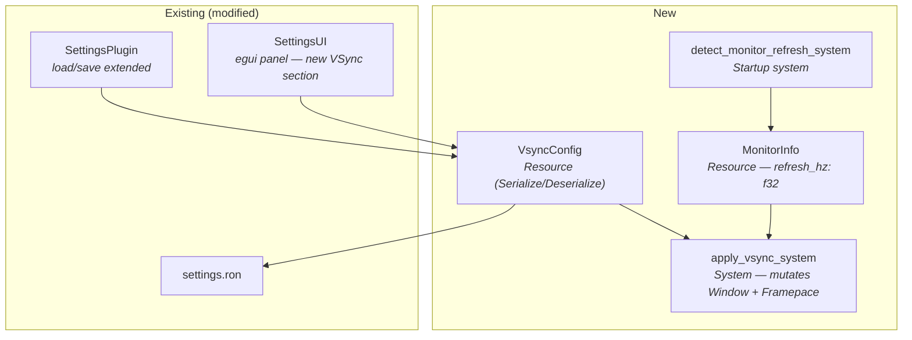
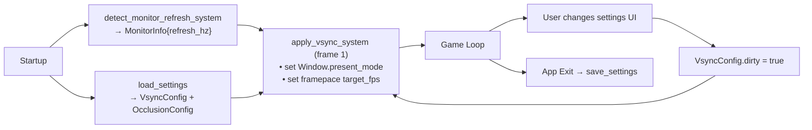
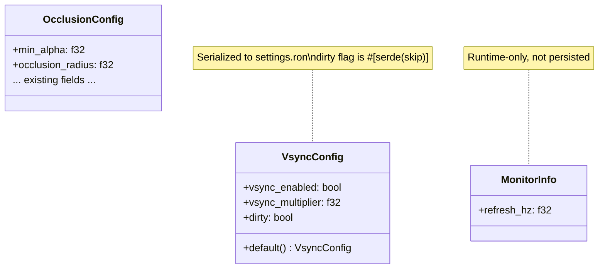
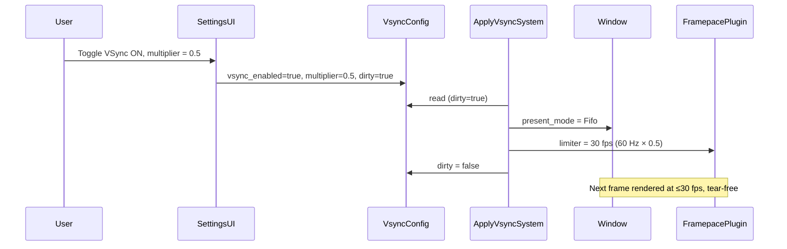

# VSync Configuration — Architecture Reference

**Date:** 2026-03-21
**Repo:** `adrakestory` (local)
**Runtime:** Bevy 0.18 ECS — Rust
**Purpose:** Document the current display/settings architecture and define the target design for the VSync Configuration feature.

---

## Changelog

| Version | Date | Author | Summary |
|---------|------|--------|---------|
| **v1** | **2026-03-21** | **Engineering** | **Initial draft — VSync toggle + multiplier via DisplayConfig + frame limiter** |

---

## Table of Contents

1. [Current Architecture](#1-current-architecture)
   - [Solution Structure](#11-solution-structure)
   - [Settings Pipeline](#12-settings-pipeline)
   - [Window Initialization](#13-window-initialization)
   - [Data Flow](#14-data-flow)
2. [Target Architecture — VSync Configuration](#2-target-architecture--vsync-configuration)
   - [Design Principles](#21-design-principles)
   - [New Components](#22-new-components)
   - [Modified Components](#23-modified-components)
   - [Settings Flow](#24-settings-flow)
   - [Runtime Change Flow](#25-runtime-change-flow)
   - [Class Diagram](#26-class-diagram)
   - [Sequence Diagram — Happy Path](#27-sequence-diagram--happy-path)
   - [Phase Boundaries](#28-phase-boundaries)
3. [Appendices](#appendix-a--data-schema)
   - [Appendix A — Data Schema](#appendix-a--data-schema)
   - [Appendix B — Open Questions & Decisions](#appendix-b--open-questions--decisions)
   - [Appendix C — Key File Locations](#appendix-c--key-file-locations)

---

## 1. Current Architecture

### 1.1 Solution Structure



### 1.2 Settings Pipeline



Settings are a flat `OcclusionConfig` struct serialized/deserialized with `serde` in RON format. There is no separate display or window configuration resource.

### 1.3 Window Initialization

The window is configured once in `main.rs` during `App::new()`. The `PresentMode` is hardcoded to `PresentMode::AutoNoVsync` and is **never changed at runtime**:

```rust
// src/main.rs
App::new()
    .add_plugins(DefaultPlugins.set(WindowPlugin {
        primary_window: Some(Window {
            mode: WindowMode::BorderlessFullscreen(MonitorSelection::Current),
            present_mode: PresentMode::AutoNoVsync,  // ← hardcoded, never mutated
            ..default()
        }),
        ..default()
    }))
```

Bevy 0.18 supports mutating `Window` components at runtime via a `Query<&mut Window>`, so changing `PresentMode` without restart is feasible.

### 1.4 Data Flow



---

## 2. Target Architecture — VSync Configuration

### 2.1 Design Principles

1. **Additive, not intrusive** — VSync config lives in a new `VsyncConfig` struct, avoiding modifications to `OcclusionConfig`, which is already large and focused on rendering concerns.
2. **Runtime-mutable** — `Window.present_mode` is mutated via Bevy's ECS (`Query<&mut Window>`) in a dedicated `apply_vsync_system`, keeping `main.rs` as the initialization point only.
3. **Backward-compatible persistence** — `VsyncConfig` is serialized into the same `settings.ron` file using `#[serde(default)]`, so existing save files load correctly.
4. **Software frame cap via `bevy_framepace`** — The sub-1× multiplier is implemented as a target FPS passed to `bevy_framepace::FramepacePlugin`. This avoids a custom busy-wait loop and leverages a well-tested crate.
5. **Refresh rate read at startup** — The monitor's refresh rate is read once from Bevy's `MonitorSelection` API and stored in a `MonitorInfo` resource for use by the frame cap calculation.

### 2.2 New Components



| Component | Location | Purpose |
|-----------|----------|---------|
| `VsyncConfig` | `src/systems/settings/vsync.rs` | Serializable resource holding `vsync_enabled` and `vsync_multiplier` |
| `MonitorInfo` | `src/systems/settings/vsync.rs` | Caches detected refresh rate; fallback = 60 Hz |
| `apply_vsync_system` | `src/systems/settings/vsync.rs` | Runs each frame; only acts when `VsyncConfig` is marked dirty |
| `detect_monitor_refresh_system` | `src/systems/settings/vsync.rs` | Startup system to read monitor refresh rate |

### 2.3 Modified Components

| Component | Change |
|-----------|--------|
| `SettingsPlugin` (`src/systems/settings/mod.rs`) | Load/save `VsyncConfig` alongside `OcclusionConfig`; register `apply_vsync_system` |
| `settings.ron` | New fields: `vsync_enabled`, `vsync_multiplier` (backward-compatible via `#[serde(default)]`) |
| `main.rs` | Remove hardcoded `PresentMode::AutoNoVsync`; use `PresentMode::AutoNoVsync` as startup default only — runtime value is controlled by `apply_vsync_system` |
| Settings UI (`src/systems/settings/ui.rs` or similar) | Add VSync toggle + multiplier dropdown under a "Display" section |
| `Cargo.toml` | Add `bevy_framepace` dependency |

### 2.4 Settings Flow



### 2.5 Runtime Change Flow

`apply_vsync_system` runs every frame but is gated by a dirty flag to avoid per-frame `Window` mutations:

```
if !vsync_config.dirty { return; }

present_mode = if vsync_config.vsync_enabled { Fifo } else { AutoNoVsync }
window.present_mode = present_mode

if vsync_config.vsync_enabled && vsync_config.vsync_multiplier < 1.0 {
    target_fps = monitor_info.refresh_hz * vsync_config.vsync_multiplier
    framepace_settings.limiter = Limiter::from_framerate(target_fps)
} else {
    framepace_settings.limiter = Limiter::Auto
}

vsync_config.dirty = false
```

### 2.6 Class Diagram



### 2.7 Sequence Diagram — Happy Path



### 2.8 Phase Boundaries

| Capability | Phase | Architectural Impact |
|------------|-------|---------------------|
| VSync toggle + `PresentMode` mutation | Phase 1 | `apply_vsync_system`, `VsyncConfig`, dirty flag |
| Sub-1× multiplier software cap | Phase 1 | `bevy_framepace` dependency, `MonitorInfo` |
| Multiplier UI in settings screen | Phase 1 | Settings UI extension |
| Persistence in `settings.ron` | Phase 1 | `SettingsPlugin` load/save extension |
| Multiplier > 1× (high-refresh monitors) | Phase 2 | Remove `Limiter` when multiplier ≥ 1 |
| `PresentMode::FifoRelaxed` (adaptive VSync) | Future | Add `VsyncMode` enum to `VsyncConfig` |

**MVP boundary:**

- ✅ VSync enable/disable
- ✅ Sub-1× multiplier frame cap
- ✅ Monitor refresh rate detection (60 Hz fallback)
- ✅ UI controls in settings screen
- ✅ `settings.ron` persistence
- ❌ Multiplier > 1× on high-refresh monitors
- ❌ Adaptive VSync (`FifoRelaxed`)
- ❌ Per-monitor refresh rate in multi-monitor setups

---

## Appendix A — Data Schema

### `VsyncConfig` (new resource, serialized to `settings.ron`)

```ron
// New fields appended to existing settings.ron (backward-compatible)
vsync_enabled: false,
vsync_multiplier: 1.0,
```

```rust
#[derive(Resource, Clone, Serialize, Deserialize)]
pub struct VsyncConfig {
    /// Whether vertical synchronization is enabled.
    /// true  → PresentMode::Fifo (tear-free, capped at refresh rate)
    /// false → PresentMode::AutoNoVsync (unlimited, may tear)
    #[serde(default)]
    pub vsync_enabled: bool,

    /// Target frame rate as a multiple of the monitor's refresh rate.
    /// 1.0 = native refresh rate (e.g., 60 fps on 60 Hz)
    /// 0.5 = half rate (e.g., 30 fps on 60 Hz)
    /// Only used when vsync_enabled = true AND value < 1.0.
    /// Clamped to [0.25, 4.0].
    #[serde(default = "default_vsync_multiplier")]
    pub vsync_multiplier: f32,

    /// Dirty flag: set to true when fields change to trigger apply_vsync_system.
    /// Excluded from serialization.
    #[serde(skip)]
    pub dirty: bool,
}

fn default_vsync_multiplier() -> f32 { 1.0 }

impl Default for VsyncConfig {
    fn default() -> Self {
        Self {
            vsync_enabled: false,
            vsync_multiplier: 1.0,
            dirty: true, // apply on first frame
        }
    }
}
```

### `MonitorInfo` (runtime resource, not serialized)

```rust
#[derive(Resource)]
pub struct MonitorInfo {
    /// Refresh rate of the primary monitor in Hz.
    /// Defaults to 60.0 if detection fails.
    pub refresh_hz: f32,
}
```

---

## Appendix B — Open Questions & Decisions

### Resolved

| # | Question | Resolution |
|---|----------|------------|
| 1 | Should VSync live in `OcclusionConfig` or a new struct? | New `VsyncConfig` struct — separation of concerns; occlusion is rendering, VSync is display |
| 2 | How to implement the software frame cap? | `bevy_framepace` — avoids busy-wait, integrates cleanly as a Bevy plugin |
| 3 | Does changing `Window.present_mode` at runtime require a restart in Bevy 0.18? | No — Bevy 0.18 surfaces `Window` as a mutable ECS component |

### Open

| # | Question | Impact | Notes |
|---|----------|--------|-------|
| 1 | What should the default be: `vsync_enabled = false` (current behavior) or `true`? | Default UX | Keeping `false` preserves existing behavior; recommend `false` for first release |
| 2 | Is `bevy_framepace` already a transitive dependency? | Cargo.toml change | Check `cargo tree` before adding |

---

## Appendix C — Key File Locations

| Component | Path |
|-----------|------|
| `VsyncConfig`, `MonitorInfo`, `apply_vsync_system` | `src/systems/settings/vsync.rs` (new file) |
| `SettingsPlugin` (extend load/save) | `src/systems/settings/mod.rs` |
| Settings UI panel (add VSync section) | `src/systems/settings/ui.rs` or equivalent |
| App builder (`main.rs`) | `src/main.rs` |
| Settings file | `settings.ron` |
| Cargo dependencies | `Cargo.toml` |

---

*Created: 2026-03-21 — See [Changelog](#changelog) for version history.*
*Companion documents: [Requirements](./requirements.md)*
